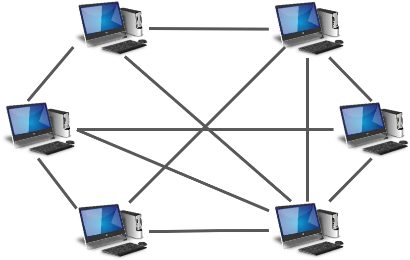
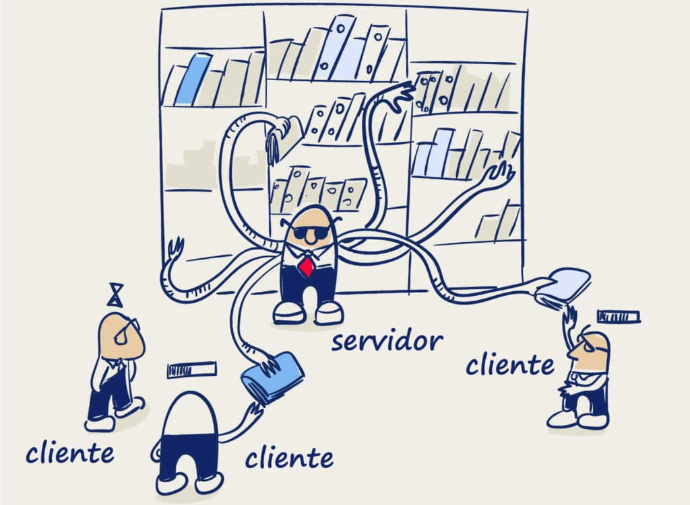

Según cómo se relacionan entre sí los diferentes equipos miembros de una red tenemos 2 tipos de redes:

- Redes que utilizan el modelo **entre iguales** o **“peer to peer”**. En este modelo todos los ordenadores de la red son iguales y no hay ninguno que se encargue de controlar o dirigir el resto. [Arquitectura Peer To Peer (P2P)](https://reactiveprogramming.io/blog/es/estilos-arquitectonicos/p2p)

<figure markdown="span" align="center">
  { width="50%"}
  <figcaption>Esquema red peer to peer</figcaption>
</figure>
 
Redes que utilizan el modelo **cliente/servidor** - **C/S**. En este modelo uno (o más) de los ordenadores de la red es el ordenador principal o servidor que proporciona apoyo al resto de equipos de la red, llamados clientes. En este tipo de redes los clientes realizan peticiones al servidor que los da respuesta.

<figure markdown="span" align="center">
  { width="60%"  }
  <figcaption>Arquitecturas: p2p vs server</figcaption>
</figure>

Los sistemas operativos instalados en los ordenadores de los usuarios de la red (sistemas Windows 7, 8, 10, 11, Linux de escritorio...) tienen la posibilidad de conectarse a un grupo de trabajo (en ese caso trabajamos en una red “peer to peer”) o a un dominio en este caso habrá un servidor principal con un sistema operativo de servidor como Windows Server, Linux, etc.

Cada opción tiene ventajas e inconvenientes que tendremos que valorar a la vez de elegir el tipo de sistema informático a crear. La principal ventaja de una red **"peer to peer"** es su **simplicidad** pero este también es su principal inconveniente porque **dificulta el control** sobre el que sucede en la red y no permite una gestión centralizada de la misma el que la hace inviable en redes grandes.

Los principales parámetros que nos harán elegir un tipo de red u otro son:

- **Nivel de seguridad**: una red “peer to peer” no permite el nivel de seguridad y el control sobre usuarios y recursos que permite un entorno con servidor.
- **Número de usuarios**: si tenemos pocos usuarios es más sencillo y más barato trabajar en una red peer to peer. Cuando crece el número de usuarios una red entre iguales es muy difícil de gestionar adecuadamente y es más práctico utilizar el modelo cliente/servidor.
- **Número de equipos clientes**: es el mismo caso de los usuarios. Si son muy pocos puede ser útil una red “peer to peer”, pero cuando crece su número se tiene que ir a una solución con uno o más servidores.
- **Servicios a prestar**: si los clientes solo necesitan compartir una conexión en Internet no tiene sentido crear una red con servidor. Según aumentan los servicios necesarios (compartición de ficheros, de impresoras, servicios de red, gestión centralizada de usuarios...) se necesitará uno o más servidores para proporcionar esos servicios.
 
## Red cliente/servidor

La red cliente-servidor es una red de comunicaciones en la cual los clientes están conectados a un servidor, en el cual se centralizan los diversos recursos y aplicaciones con las que cuenta sistema, y que los pone a disposición de los clientes cada vez que estos son solicitados.

<figure markdown="span" align="center">
  { width="50%"  }
  { width="50%"  }
  <figcaption>MODELO CLIENTE SERVIDOR - REDES</figcaption>
</figure>

### Componentes de arquitectura cliente/servidor

Los componentes habituales de este tipo de redes son:

- **Servidores**: Son equipos con sistemas operativos en red que proporcionan recursos a los clientes, haciéndolos accesibles a los equipos de la red, sea a otros servidores o, habitualmente, a clientes.
- **Clientes**: Son equipos con un sistema operativo mmonopuesto conectados para empezar a trabajar en red. A diferencia de los servidores, no comparten sus recursos.
- **Dominio**: Es una ***agrupación lógica*** de elementos de la red (equipos, usuarios, recursos compartidos) que permite realizar una gestión centralizada, es decir, desde una ubicación se controla los servicios administrativos del dominio. Los recursos los gestiona el servidor principal.
La separación entre cliente y servidor es una separación de tipo lógico, donde el servidor no se ejecuta necesariamente sobre una sola máquina ni es necesariamente un único programa.

### Tipos de servidores

En este tipo de arquitectura el servidor es el ordenador que controla la red y permite compartir sus recursos con el resto de equipos. Hay muchos tipos de servidores:

- **Servidor de archivos**: permite que los usuarios puedan acceder a sus archivos y controla que un usuario tenga los permisos necesarios para acceder a un fichero
- **Servidor de impresión**: tiene una o más impresoras y permite que los usuarios autorizados podamos imprimir en ellas
- **Servidor de comunicaciones**: permite enlazar diferentes redes (por ejemplo nuestra red local con Internet)
- **Servidor de correo**: proporciona servicios de correo electrónico en la red
- **Servidor web**: proporciona páginas web a los usuarios que acceden por medio de su navegador
- **Servidor DHCP**: proporciona direcciones IP a los equipos cliente para conectarse en la red
- Otras: servidores **DNS**, **proxy**, **FTP**, **HTTP**...

Estos servicios pueden estar todos en un único servidor o repartidos en diferentes servidores de la red. Si el número de usuarios es muy grande es posible que el servidor esté demasiado cargado de trabajo por lo cual es conveniente dividir los servicios que presta entre diferentes servidores de la red.

Un servidor puede ser **dedicado** o **no dedicado**. Un servidor se llama que es dedicado si solo se utiliza como servidor y no como ordenador normal de trabajo. No es recomendable utilizar servidores no dedicados porque cualquier problema en su uso puede hacer que el ordenador dejo de funcionar y con él la red entera.

### Ventajas e inconvenientes de redes Cliente/Servidor

Las redes cliente/servidor tienen **ventajas** sobre una red "peer tono peer" como:

- **Centralización de la gestión**: la gestión de toda la red y sus recursos se puede hacer desde el servidor el que facilita enormemente la tarea del administrador del sistema.
Centralización del control: los accesos a recursos son controlados por el servidor, que hace más sencilla y segura su gestión.
- **Escalabilidad**: se puede aumentar la capacidad de clientes y servidores por separado. Cualquier elemento puede ser aumentado (o mejorado) en cualquier momento, o se pueden añadir nuevos nodos en la red (clientes y/o servidores).
- **Fácil mantenimiento**: en poderse distribuir las funciones y responsabilidades entre varios servidores independientes, es posible reemplazar, reparar, actualizar, o incluso trasladar un servidor, y los clientes no se verán afectados por ese cambio (o solo mínimamente).

Este tipo de arquitectura también tiene **inconvenientes**, como:

- **Cuellos de botella**: cuando una gran cantidad de clientes envían peticiones simultáneas al mismo servidor, pueden llegar a colapsarlo. Esto se puede solucionar dimensionando la red adecuadamente y utilizando los servidores necesarios.
- **Robustez de la red**: cuando un servidor está caído, las peticiones de los clientes no pueden ser satisfechas. En las redes P2P, los recursos están generalmente distribuidos en varios nodos de la red y aunque algunos caigan otros pueden continuar atendiendo las peticiones.
- El **software** y el **hardware** de un servidor tiene que ser **específico**: un hardware normal de un ordenador personal puede no ser suficiente para una determinada cantidad de clientes. El sistema operativo tiene que proporcionar los servicios necesarios el que lo encarece en el caso de sistemas privativos (una licencia de Windows Server es mucho más cara que una de Windows 10).
Disponibilidad: El cliente no podrá acceder a los datos ni a las impresoras ni posiblemente a Internet si el servidor no está disponible.

<figure markdown="span" align="center">
  { width="50%" }

  <figcaption>MODELO CLIENTE SERVIDOR</figcaption>
</figure>

