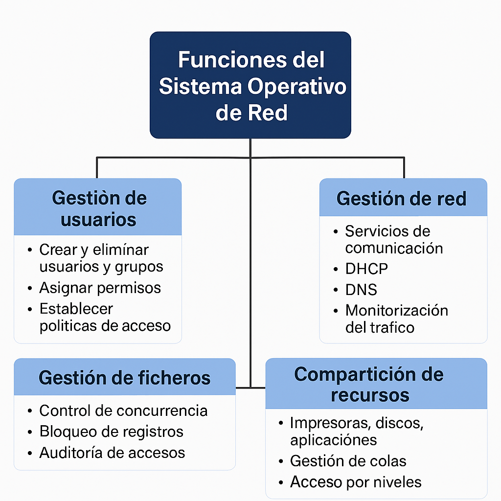

El **sistema operativo de red** es el software encargado de coordinar y gestionar los recursos compartidos entre los equipos conectados a una red. Su propósito principal es garantizar que los dispositivos cliente puedan comunicarse, acceder a servicios comunes y trabajar de forma eficiente y segura. Entre sus funciones más relevantes destacan:

- **Gestión de usuarios**
- **Gestión de la red**
- **Gestión de ficheros**
- **Compartición de recursos**

<figure markdown="span" align="center">
  { width="70%"}
  <figcaption>Esquema de Funciones de un Sistema Operativos Servidor</figcaption>
</figure>

## Gestión de usuarios

El administrador de la red tiene la responsabilidad de definir quién puede acceder a qué recursos, y bajo qué condiciones. Esta gestión es esencial para mantener la seguridad, la organización y el buen funcionamiento del entorno de red.

**Funciones principales:**

- **Crear y eliminar usuarios y grupos**: Permite organizar a los usuarios según departamentos, roles o niveles de acceso.
- **Asignar permisos**: Define qué acciones puede realizar cada usuario (leer, escribir, modificar, eliminar) sobre recursos como carpetas, impresoras o aplicaciones.
- **Establecer políticas de acceso**: Incluye restricciones como horarios de conexión, dispositivos autorizados, ubicación geográfica, etc.
- **Autenticación y autorización**: Verifica la identidad del usuario y determina si tiene permiso para realizar una acción específica.

!!! Ejemplo
    
    Un usuario del departamento de contabilidad puede tener acceso de lectura y escritura a los informes financieros, mientras que uno del departamento de marketing solo puede verlos.

## Gestión de la red

La administración centralizada de la red permite supervisar su rendimiento, detectar fallos y aplicar mejoras. El sistema operativo de red facilita esta tarea mediante herramientas y servicios integrados.

**Incluye:**

- **Servicios de comunicación**: Protocolos como TCP/IP, que permiten la transmisión de datos entre dispositivos.
- **DHCP (Dynamic Host Configuration Protocol)**: Asigna direcciones IP automáticamente a los equipos conectados.
- **DNS (Domain Name System)**: Traduce nombres de dominio en direcciones IP, facilitando la navegación y el acceso a servicios.
- **Monitorización del tráfico**: Detecta congestiones, caídas de servicio o intentos de acceso no autorizado.
- **Actualizaciones y mantenimiento remoto**: Permite aplicar parches de seguridad o configurar dispositivos sin intervención física.

!!!Ejemplo

    Si un servidor presenta una sobrecarga, el administrador puede redistribuir el tráfico o ampliar los recursos desde la consola de gestión.

## Gestión de ficheros

En un entorno de red, múltiples usuarios pueden necesitar acceder a los mismos archivos simultáneamente. El sistema operativo de red se encarga de coordinar este acceso para evitar conflictos o pérdida de datos.

**Funciones clave:**

- **Control de concurrencia**: Impide que dos usuarios modifiquen el mismo archivo al mismo tiempo.
- **Bloqueo de registros**: Permite bloquear partes específicas de un archivo mientras se editan.
- **Versionado de archivos**: Guarda diferentes versiones para evitar sobrescrituras accidentales.
- **Auditoría de accesos**: Registra quién accede, modifica o elimina cada archivo.

!!!Ejemplo

    En una empresa, varios empleados pueden consultar una hoja de cálculo compartida, pero solo uno puede editarla a la vez.

## Compartición de recursos

Una de las funciones más esenciales del sistema operativo de red es permitir que los recursos físicos y digitales se compartan de forma segura y eficiente entre los usuarios autorizados.

**Recursos compartidos típicos:**

- **Impresoras**
- **Unidades de almacenamiento**
- **Aplicaciones empresariales**
- **Conexiones a internet**

**Características importantes:**

- **Gestión de colas de impresión**: Coordina múltiples solicitudes de impresión para evitar conflictos.
- **Asignación de cuotas**: Limita el uso de recursos como espacio en disco o número de impresiones.
- **Acceso por niveles**: Permite definir distintos niveles de privilegio según el usuario o grupo.

!!!Ejemplo
    
    Si tres usuarios envían documentos a la misma impresora, el sistema organiza la cola de impresión según prioridad o orden de llegada.*
