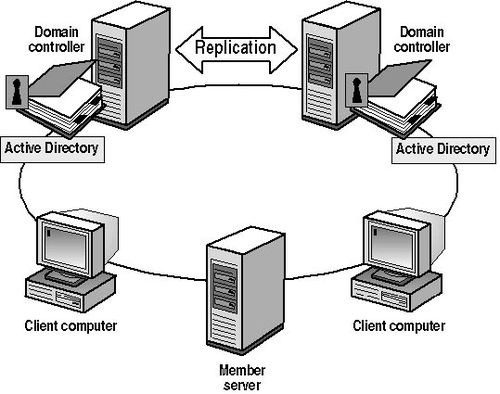
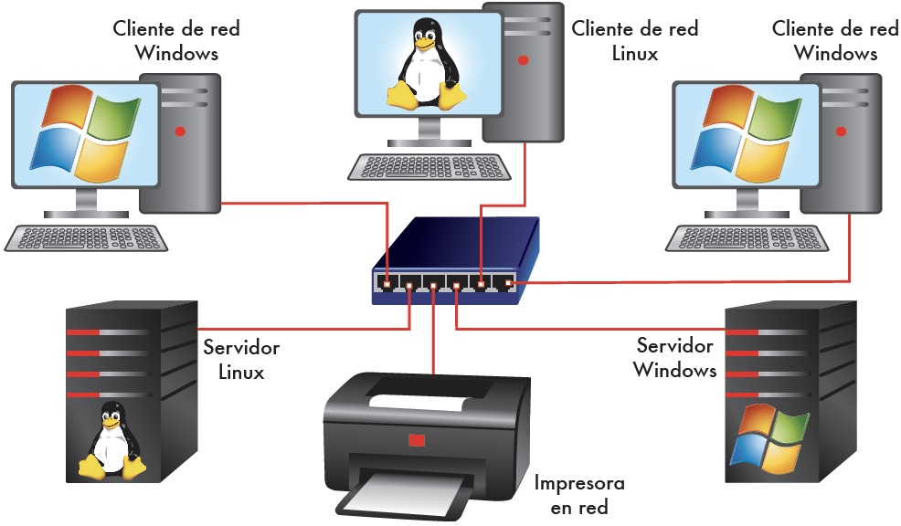

Veamos los sistemas operativos que pueden ser utilizados como servidores. Tenemos dos grupos, los privativos on Microsoft Windows Server y los diferentes servidores derivados de las distribuciones GNU/Linux

## Servidores Windows Server

Microsoft comenzó desarrollando sistemas operativos monousuario como **MS-DOS** y **Windows 95**, pero en los años 90 lanzó su primer sistema operativo de red: **Windows NT**, diseñado para competir con **Unix** y **Novell NetWare**, que dominaban el mercado en ese momento.

<figure markdown="span" align="center">
  { width="30%"}
  <figcaption>Windows Server</figcaption>
</figure>

### Evolución de Windows Server

Desde Windows NT, Microsoft ha lanzado múltiples versiones orientadas a servidores:

| Versión               | Año de lanzamiento | Características destacadas |
|-----------------------|--------------------|-----------------------------|
| Windows Server 2000   | 2000               | Primer con Active Directory |
| Windows Server 2003   | 2003               | Mejoras en seguridad y rendimiento |
| Windows Server 2008 / R2 | 2008 / 2009     | Virtualización con Hyper-V |
| Windows Server 2012   | 2012               | Interfaz Metro, integración con la nube |
| Windows Server 2016   | 2016               | Contenedores, Nano Server |
| Windows Server 2019   | 2018               | Seguridad avanzada, integración híbrida |
| **Windows Server 2022** | 2021             | Rendimiento mejorado, seguridad multicapa |
| **Windows Server 2025** | 2024             | IA, Zero Trust, SMB sobre QUIC, interfaz estilo Windows 11 |

### Novedades recientes

#### Windows Server 2022

- Seguridad multicapa con **Credential Guard** y **cifrado de datos**  
- Mejoras en **virtualización** y compatibilidad con **Azure**  
- Nuevas ediciones: *Standard*, *Datacenter*, *Essentials* y *Azure Edition*

#### Windows Server 2025

- **Integración con inteligencia artificial** y almacenamiento NVMe de alta velocidad  
- **Modelo Zero Trust** para proteger datos y usuarios en entornos complejos  
- **SMB sobre QUIC** para transferencias seguras de archivos por Internet  
- Interfaz renovada con estilo **Windows 11**, soporte para **Bluetooth**, **Wi-Fi** y **WinGet**  
- Herramienta nativa **DTrace** para análisis en tiempo real

> Amplia tu información en internet sobre Window Server: [Windows Server: todo lo que necesitas saber](https://datascientest.com/es/todo-lo-que-debe-saber-sobre-windows-server)
> Amplia tu información sobre las novedades de [Windows Server 2025](https://dinahosting.com/blog/windows-server-2025/)

### Modelo de dominio en Windows Server

Windows Server utiliza un modelo de **dominio**, que agrupa equipos cliente y servidor bajo una política de seguridad común y una base de datos centralizada llamada **Active Directory**.

<figure markdown="span" align="center">
  { width="50%"}
  <figcaption>Modelo de dominio en Windows Server</figcaption>
</figure>

#### Tipos de servidores en el dominio

1. **Controladores de dominio**  
    - Gestionan el Directorio Activo  
    - Controlan usuarios, equipos y políticas de seguridad

2. **Servidores de servicios**  
    - Ofrecen funciones específicas como impresión, almacenamiento o aplicaciones  
    - Pueden coexistir con los controladores de dominio o ser independientes

### Coste de licencias

El uso de Windows Server implica dos tipos de licencias:

- **Licencia del servidor**: según el tipo de procesador y edición (Standard o Datacenter)  
- **Licencias CAL (Client Access License)**: necesarias para cada usuario o dispositivo que acceda al servidor simultáneamente

!!!Note "CAL"

    CAL = Client Access License

## Ediciones de Microsoft Windows (11) para equipos cliente.

Windows 11 está disponible en varias **ediciones** diseñadas para distintos tipos de usuarios y entornos, desde uso doméstico hasta grandes organizaciones. Aquí tienes un resumen actualizado de las principales versiones de Windows 11 y sus características clave:

### Ediciones principales de Windows 11

| Versión                         | Público objetivo           | Características destacadas |
|--------------------------------|----------------------------|-----------------------------|
| **Windows 11 Home**            | Usuarios domésticos        | Interfaz moderna, apps básicas, sin unión a dominio |
| **Windows 11 Pro**             | Profesionales y PYMEs      | Unión a dominio, BitLocker, Hyper-V, políticas de grupo |
| **Windows 11 Enterprise**      | Grandes empresas           | Seguridad avanzada, control granular, AppLocker, DirectAccess |
| **Windows 11 Education**       | Centros educativos         | Similar a Enterprise, adaptado a entornos académicos |
| **Windows 11 SE**              | Educación básica (equipos low-cost) | Simplificado, optimizado para dispositivos con pocos recursos |
| **Windows 11 Pro for Workstations** | Estaciones de trabajo | Soporte para hardware avanzado, sistema de archivos ReFS, memoria persistente |
| **Windows 11 IoT Enterprise**  | Dispositivos industriales  | Personalización profunda, soporte extendido, sin interfaz gráfica por defecto |

!!!info "Versiones por actualización"

    Microsoft publica actualizaciones anuales con mejoras de seguridad y nuevas funciones. Las más recientes son:

    - **Windows 11 24H2** (octubre 2024): versión estable actual, con soporte hasta 2026 para ediciones Home y Pro, y hasta 2027 para Enterprise y Education.
    - **Windows 11 25H2** (prevista para finales de 2025): actualmente en vista previa, incluye mejoras menores, eliminación de herramientas obsoletas como PowerShell 2.0 y WMIC, y más control sobre apps preinstaladas.

### Características principales ediciones principales de Windows 11

**Windows 11** se distribuye en distintas ediciones, cada una diseñada para un tipo de usuario o entorno. En contextos empresariales, especialmente cuando se trabaja con redes gestionadas mediante dominios, no todas las ediciones son válidas. A continuación se explican las principales licencias disponibles y cuáles son aptas para entornos corporativos.

#### Windows 11 Home
- Pensada para uso doméstico.
- Incluye funciones básicas como Microsoft Store, Cortana, y sincronización con OneDrive.
- **Limitaciones importantes**:
    - No permite unirse a un dominio de Active Directory.
    - No incluye herramientas de administración como políticas de grupo (Group Policy).
    - No tiene soporte para Hyper-V ni BitLocker completo.

#### Windows 11 Pro
- Dirigida a profesionales y pequeñas empresas.
- Incluye todas las funciones de la edición Home, además de:
    - **Unión a dominios locales (Active Directory) y en la nube (Azure AD)**
    - BitLocker para cifrado de disco
    - Hyper-V para virtualización
    - Políticas de grupo
    - Escritorio remoto como host
    - Windows Update for Business

#### Windows 11 Enterprise
- Pensada para grandes organizaciones.
- Se distribuye mediante licencias por volumen o suscripciones (Microsoft 365 E3/E5).
- Incluye todo lo de la edición Pro, más:
    - Seguridad avanzada (Credential Guard, AppLocker, Windows Defender Application Control)
    - Control granular de dispositivos y aplicaciones
    - DirectAccess y gestión remota avanzada
    - Integración con herramientas de virtualización y administración centralizada

#### Comparativa rápida

| Edición           | Uso recomendado        | ¿Puede unirse a dominio? | Características clave                    |
|-------------------|------------------------|---------------------------|------------------------------------------|
| Windows 11 Home   | Uso doméstico          | ❌ No                     | Básico, sin gestión centralizada         |
| Windows 11 Pro    | PYMEs y profesionales  | ✅ Sí                     | BitLocker, políticas de grupo, Hyper-V   |
| Windows 11 Enterprise | Empresas grandes   | ✅ Sí                     | Seguridad avanzada, control granular     |

!!!Note "Windows Home no sirve en entornos empresariales"

  Las redes empresariales suelen estar basadas en **dominios**, gestionados por servidores con Active Directory. Esto permite:

  - Autenticación centralizada de usuarios
  - Aplicación de políticas de seguridad
  - Control de acceso a recursos compartidos
  - Administración remota de equipos

  La edición **Home** no incluye el cliente de dominio ni las herramientas necesarias para integrarse en este tipo de redes. Por tanto, **solo las ediciones Pro y Enterprise** permiten que un equipo se una a un dominio y sea gestionado de forma centralizada.

---

## Sistemas Operativos de Red Linux

**GNU/Linux** es un sistema operativo robusto y versátil, diseñado para entornos multiusuario y multiprocesador. Ofrece soporte para tecnologías como **RAID**, **virtualización**, **infraestructura de red**, **servidores web**, y destaca por su **alta seguridad** y **compatibilidad multiplataforma**. Es la principal alternativa a los sistemas operativos de Microsoft, tanto en equipos cliente como en servidores.

### Origen y arquitectura

Linux está basado en **Unix**, el sistema operativo que dominó el mundo de los servidores desde los años 70. De él hereda su **fiabilidad**, **eficiencia** y **estructura modular**. Además, es **multiplataforma**, con versiones disponibles para arquitecturas como:

- Intel / AMD (x86, x86_64)
- ARM (usado en servidores y dispositivos IoT)
- PowerPC
- Alpha
- SPARC (Sun Microsystems)

### Software libre y distribuciones

GNU/Linux se distribuye bajo la **licencia GPL (General Public License)**, lo que permite a cualquier usuario:

- Descargarlo libremente
- Modificar su código fuente
- Redistribuir versiones personalizadas

Esto ha dado lugar a cientos de variantes conocidas como **distribuciones**, que son conjuntos organizados de software (kernel + herramientas + entorno) listos para instalar.

### Cliente y servidor: misma base, distinto propósito

Todas las versiones de Linux comparten el mismo **núcleo (kernel)**, lo que permite que cualquier distribución pueda funcionar como cliente o como servidor. La diferencia radica en los **servicios y aplicaciones instaladas**.

Además, Linux puede funcionar **sin entorno gráfico**, lo que es habitual en servidores por razones de:

- **Eficiencia** (menos consumo de recursos)
- **Seguridad** (menos superficie de ataque)

!!!Example "Ejemplo: Ubuntu"

    Ubuntu ofrece dos versiones:  
    - **Ubuntu Desktop** (cliente, con entorno gráfico)  
    - **Ubuntu Server** (servidor, sin entorno gráfico por defecto)

### Distribuciones más utilizadas en servidores

#### Distribuciones comerciales (de pago)

| Distribución | Empresa | Características |
|--------------|---------|-----------------|
| **Red Hat Enterprise Linux (RHEL)** | Red Hat | Licencia comercial, soporte profesional, estabilidad empresarial |
| **SUSE Linux Enterprise Server (SLES)** | SUSE | Ciclos largos de soporte, mantenimiento garantizado, ideal para entornos críticos |

#### Distribuciones libres (gratuitas)

| Distribución | Mantenida por | Características |
|--------------|---------------|-----------------|
| **Debian** | Comunidad | Estable, sin dependencia empresarial, base de muchas otras distros |
| **Ubuntu Server** | Canonical Ltd. | Fácil de usar, gran comunidad, basada en Debian |
| **CentOS / AlmaLinux / Rocky Linux** | Comunidad | Derivadas de RHEL, ideales para servidores sin coste de licencia |

!!!Nota

    CentOS ha cambiado su enfoque desde 2021. Las alternativas actuales como AlmaLinux y Rocky Linux continúan su legado como forks comunitarios de RHEL.*

#### Guía comparativa de distribuciones GNU/Linux para servidores

| Distribución                  | Tipo de licencia | Mantenida por         | Soporte técnico       | Uso recomendado                  | Comunidad activa |
|------------------------------|------------------|------------------------|------------------------|----------------------------------|------------------|
| **Debian**                   | Libre (GPL)      | Comunidad              | No oficial             | Servidores estables y seguros    | ✅ Muy activa     |
| **Ubuntu Server**            | Libre (GPL)      | Canonical Ltd.         | Opcional (de pago)     | Fácil de usar, entornos mixtos   | ✅ Muy activa     |
| **Red Hat Enterprise Linux** | Comercial        | Red Hat (IBM)          | Oficial (de pago)      | Empresas, entornos críticos      | ✅ Muy activa     |
| **CentOS** *(legacy)*        | Libre (GPL)      | Comunidad (basado en RHEL) | No oficial         | Servidores sin coste de licencia | ⚠️ Discontinuado |
| **AlmaLinux**                | Libre (GPL)      | AlmaLinux Foundation   | Opcional (de pago)     | Sustituto de CentOS              | ✅ Activa         |
| **Rocky Linux**              | Libre (GPL)      | Rocky Enterprise Software Foundation | Opcional (de pago) | Sustituto de CentOS              | ✅ Activa         |
| **SUSE Linux Enterprise Server** | Comercial    | SUSE                   | Oficial (de pago)      | Infraestructura empresarial       | ✅ Activa         |

**Notas clave**

- **Debian** es ideal para quienes buscan estabilidad y control total sin depender de empresas.
- **Ubuntu Server** es muy popular por su facilidad de uso y compatibilidad con servicios modernos.
- **RHEL** y **SUSE** ofrecen soporte profesional, ideal para empresas que requieren mantenimiento garantizado.
- **CentOS** ha sido reemplazado por **AlmaLinux** y **Rocky Linux**, que mantienen su filosofía libre y comunitaria.

## Redes mixtas: interoperabilidad Linux–Windows

En el pasado, era común que las redes empresariales usaran **Windows** tanto en clientes (XP, 7, 10) como en servidores (Windows Server). Sin embargo, muchas organizaciones han adoptado **Linux** en todos sus equipos por razones de coste, seguridad y flexibilidad.

<figure markdown="span" align="center">
  { width="70%"}
  <figcaption>Redes Mixtas</figcaption>
</figure>

Hoy en día, es habitual encontrar **redes mixtas**, donde conviven equipos con Windows y Linux. Esto no representa ningún problema gracias a:

- **Compatibilidad con protocolos estándar** (SMB, NFS, LDAP, etc.)
- **Herramientas de interoperabilidad** como Samba, Kerberos, y OpenSSH
- **Windows Subsystem for Linux (WSL)** en Windows 10/11, que permite ejecutar Linux directamente en Windows

!!!Note

    La interoperabilidad entre sistemas es cada vez más fluida, permitiendo entornos híbridos sin fricciones.

