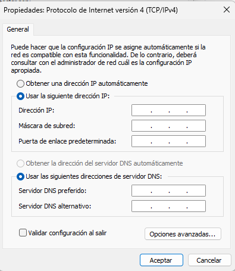

## Concepto red local (LAN)

Una **red local (Local Area Network)** es un conjunto de dispositivos interconectados dentro de un área física limitada, como una oficina, un aula, un laboratorio o un edificio. Su propósito principal es permitir que los equipos compartan recursos (archivos, impresoras, conexión a Internet) y se comuniquen entre sí de forma rápida y segura.

En una LAN, todos los dispositivos (ordenadores, impresoras, servidores, etc.) están conectados mediante cables Ethernet o redes Wi-Fi, y forman parte de un mismo esquema de direccionamiento IP.

Para que esta comunicación sea posible, cada dispositivo debe tener correctamente configurados los siguientes parámetros:

<figure markdown="span" align="center">
  { width="70%"  }
  <figcaption>Configuración IPv4 equipo Windows</figcaption>
</figure>

Recordemos qué es lo que significa cada uno de estos elementos.

### Dirección IP

La **dirección IP (Internet Protocol)** es un identificador único que se asigna a cada dispositivo dentro de la red. Es como el número de matrícula de un coche: permite saber quién es quién en la red.

En redes locales, se suelen usar direcciones IP **privadas**, que no son accesibles desde Internet. Algunos rangos típicos de IP privadas son:

- Para redes de tipo A: `10.0.0.0` a `10.255.255.255`
- Para redes de tipo B: `172.16.0.0` a `172.31.255.255`
- Para redes de tipo C: `192.168.0.0` a `192.168.255.255`

!!!example 

    Un ordenador puede tener la IP `192.168.1.10`, mientras otro tiene `192.168.1.11`.

Más información: [¿Qué es una dirección IP?](https://www.redeszone.net/tutoriales/redes-lan/que-es-direccion-ip-tipos/)

### Máscara de subred

La **máscara de subred** determina qué parte de la dirección IP identifica la red y qué parte identifica al dispositivo dentro de esa red. Sirve para delimitar el tamaño de la red y saber qué dispositivos pueden comunicarse directamente entre sí.

La máscara más común en redes pequeñas es:

- `255.255.255.0` → permite hasta 254 dispositivos en la misma red

!!!example

    Si dos equipos tienen IPs `192.168.1.10` y `192.168.1.20` con máscara `255.255.255.0`, están en la misma red y pueden comunicarse directamente.

Más información: [Máscara de subred: concepto y ejemplos](https://www.redeszone.net/tutoriales/redes-lan/mascara-subred/)

### Puerta de enlace

La **puerta de enlace (gateway)** es el dispositivo que conecta la red local con otras redes, como Internet. Normalmente, es el router.

Todos los equipos de la red deben tener configurada la misma puerta de enlace para poder salir de la red local.

!!!example

    Si el router tiene la IP `192.168.1.1`, esa será la puerta de enlace para todos los dispositivos.

Todo esto quiere decir que **si un equipo no queremos que se conecte a internet o a otras redes** que se encuentren fuera del alcance definido por su máscara, entonces simplemente **dejamos la puerta de enlace en blanco**.

!!!Tip

    Los equipos destinados a producción que no queremos que accedan a internet para evitar cualquier tipo de *malware*, los dejamos sin GW.

Más información: [Puerta de enlace predeterminada](https://www.redeszone.net/tutoriales/redes-lan/puerta-enlace/)

### Servidor DNS

El **DNS (Domain Name System)** es el sistema que traduce nombres de dominio (como `www.google.com`) en direcciones IP que los equipos pueden entender.

Sin DNS, los usuarios tendrían que recordar y escribir direcciones IP para acceder a páginas web, lo cual no es práctico.

En redes locales, se puede usar:

- Un DNS público (como `8.8.8.8` de Google)
- **Un DNS interno** (si hay un servidor de dominio)

!!!importante 

    Debemos tener claro quien es el DNS de nuestro sistemas, ya que no es lo mismo traducir nombres asociados a internet que traducir nombres asociados a un dominio. Si tengo el nombre de un equipo y quiero obtener cual es su dirección IP, entonces el servidor DNS será el servidor de la red, ya que por ejemplo el servidor de google, no sabrá quien es ese equipo.

    De la misma forma, debemos saber que cuando ponemos como DNS nuestro router, este tiene configurado un DNS internamente, normalmente proporcionado por el IPS ( *Internet Service Provider* )

Más información: [Qué es el DNS y cómo funciona](https://www.redeszone.net/tutoriales/redes-lan/que-es-dns/)

## Configuración básica de red local

Vamos a ver ejemplos de cómo se configura un equipo, para ello veremos la diferencia que hay al configurar un equipo dentro de una red local domestica y un equipo que se encuentra dentro de una red local controlada por un dominio.

### Red local domestica (sin dominio)

Cuando no hay un dominio, cada equipo se gestiona de forma independiente. La red puede funcionar con IPs estáticas o dinámicas (DHCP), pero no hay control centralizado de usuarios ni políticas.

**Ejemplo de configuración manual**:

| Parámetro         | Valor ejemplo           | Explicación                                                                 |
|------------------|-------------------------|------------------------------------------------------------------------------|
| IP               | `192.168.1.10`          | Dirección única para cada equipo  |
| Máscara de subred| `255.255.255.0`         | Define qué IPs están en la misma red  |
| Puerta de enlace | `192.168.1.1`           | IP del router que conecta con Internet    |
| DNS              | `8.8.8.8`  | Servidor que traduce nombres de dominio (Google DNS, por ejemplo)  |

!!!note

    En este caso, cada equipo se configura manualmente o por DHCP del router, y los usuarios se gestionan localmente en cada máquina.

### Red local dentro de un dominio

Cuando la red está **dentro de un dominio**, hay un **servidor central** (Controlador de Dominio) que gestiona usuarios, equipos y recursos. Este servidor usa **Active Directory** para organizar todo.

**Ejemplo de configuración en red con dominio**:

| Parámetro         | Valor ejemplo           | Explicación                                                                 |
|------------------|-------------------------|------------------------------------------------------------------------------|
| IP               | `192.168.1.50`          | IP única para cada equipo |
| Máscara de subred| `255.255.255.0`         | Igual que en red sin dominio |
| Puerta de enlace | `192.168.1.x`           | IP del que enruta a otras redes |
| DNS              | `192.168.1.x`           | IP del servidor de dominio (resuelve nombres internos como `equipo01.local`) |

## Creación de un díagrama de red local

Una vez comprendidos los conceptos fundamentales de redes (IP, máscara de subred, puerta de enlace, DNS...), es momento de aplicar ese conocimiento en un caso práctico: el diseño de una red local para unas oficinas.

### Elementos básicos de un diagrama de red

El objetivo es crear un **diagrama de red** que refleje cómo se conectan los distintos dispositivos de una oficina. Este diagrama debe incluir:

- Equipos cliente (ordenadores, impresoras, etc.)
- Switches y routers
- Servidor (si lo hay)
- Conexión a Internet

Cada dispositivo debe estar identificado con:

- Dirección IP
- Máscara de subred
- Puerta de enlace (Gateway)
- Servidor DNS

!!!tip

    Es buena práctica reservar rangos para cada tipo de departamento. Por ejemplo, del `.1` al `.20` para infraestructura, del `.50` al `.60` para PCs de un departamento... , y del `.200` en adelante para periféricos.

### Herramientas y recomendaciones de uso.

Puedes usar herramientas como **draw.io**, **Lucidchart**, o incluso papel y lápiz. Lo importante es que el diagrama sea claro y represente:

- Las conexiones físicas (cables entre router, switch y equipos)
- Todos los datos de direcciones IP asignadas
- El nombre del dispositivo
- Su agrupación lógica

Recomendaciones para el diagrama

- Usa íconos o formas distintas para cada tipo de dispositivo.
- Añade etiquetas con la IP y el nombre del equipo.
- Indica claramente qué dispositivo actúa como puerta de enlace.
- Si hay servidores DNS internos, señálalos.

Mas información: [Qué es un Diagrama de Red y Cómo Hacer uno para Visualizar tu Infraestructura](https://gitmind.com/es/que-es-diagrama-de-red-y-como-hacerlo.html)