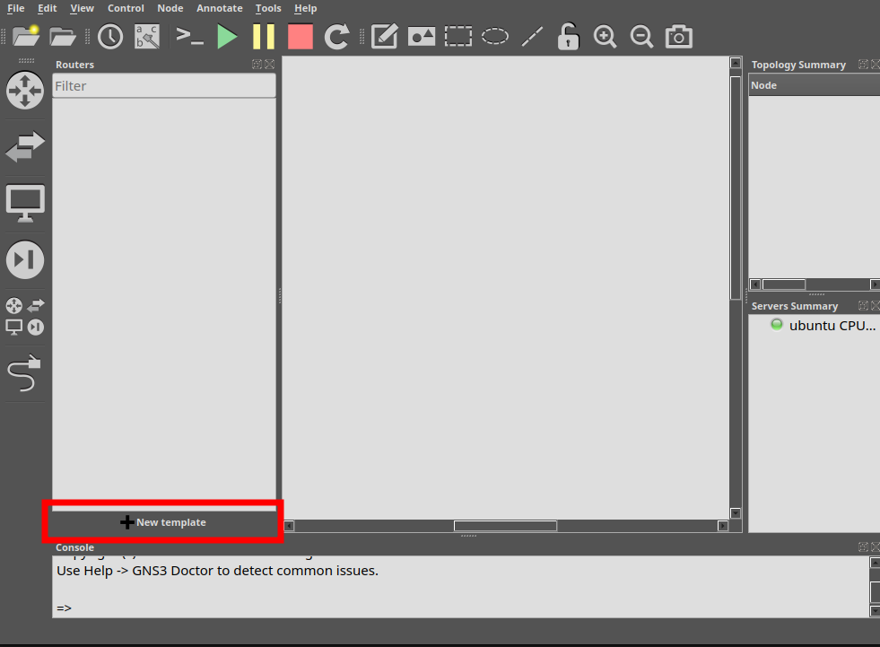
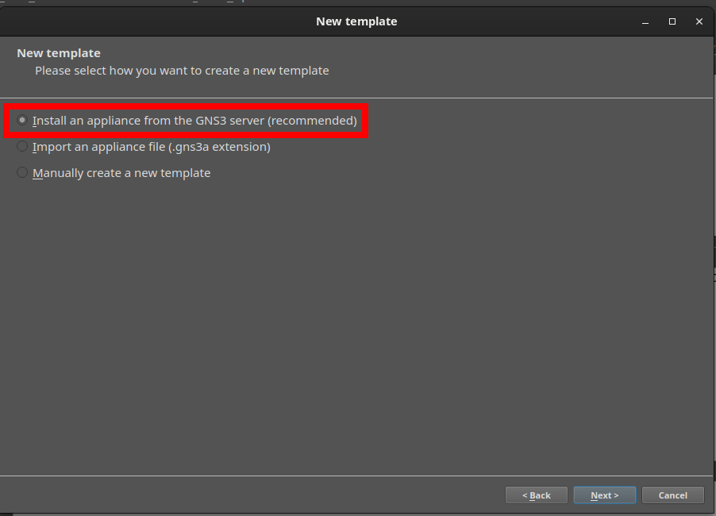
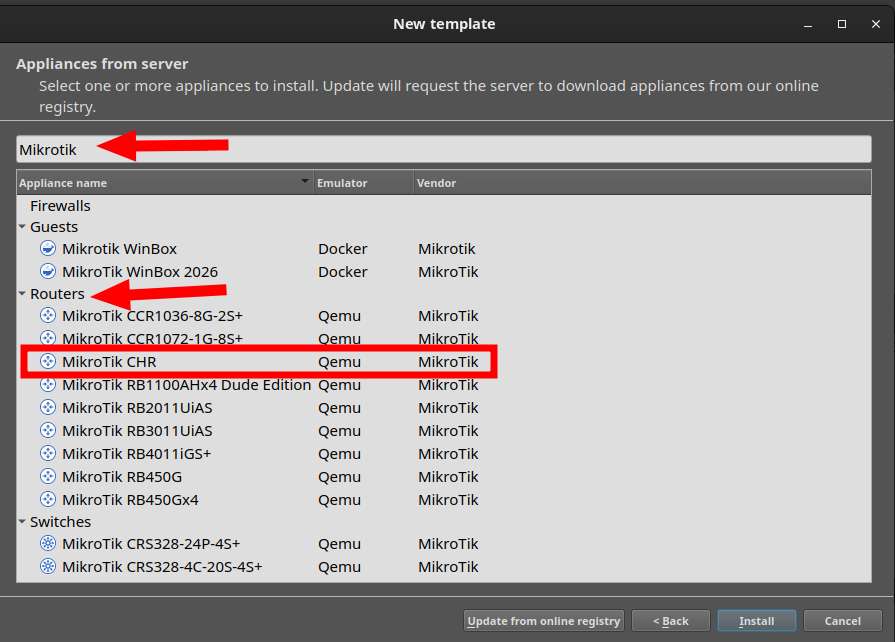
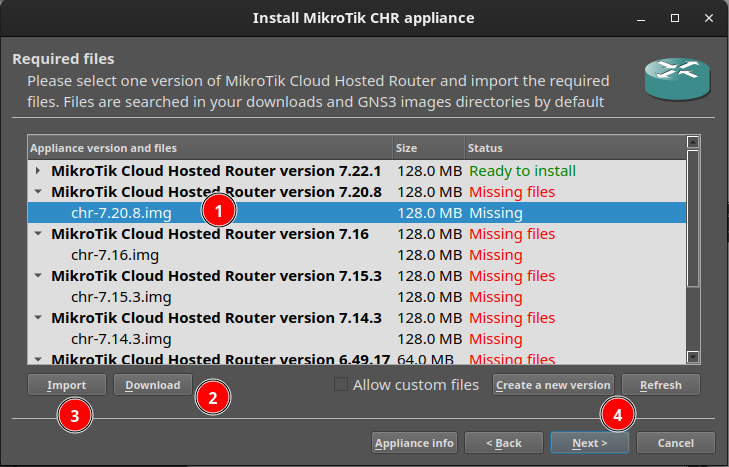
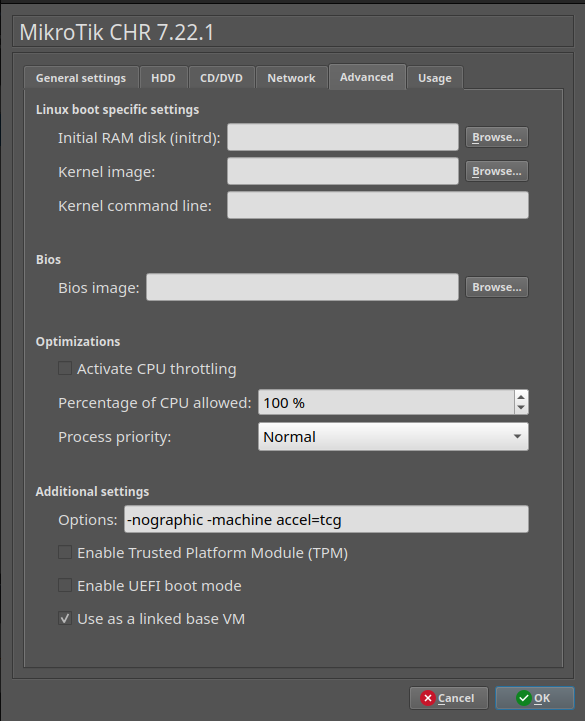

# Montaje del escenario de red en GNS3

Este apartado presenta los aspecto básico para montar el entorno en el que vamos a virtualizar la red de empresa que nos pide la práctica a realizar. 

Esta virtualización se puede realizar de forma simplificada utilizando únicamente **Oracle VM VirtualBox** y una solución de red que se adopte a lo que nos ofrece esta herramienta o en nuestro caso que vamos a utilizar una arquitectura más cercana a la que podemos encontrar en las empresa, necesitamos utilizar software como **GNS3** y routers.

Aquí tenemos un tutorial de cómo configurar este escenario de forma detallada desde el principio.

**GNS3** no es solo virtualiza, sino que permite dibujar también la topología y conexiones de red, donde ubicamos y conectamos y **ejecutamos sistemas operativos virtualizados** (Windows Server, Windows 11) integrados con dispositivos de red virtualizados (MikroTik CHR).

## Aspectos cubiertos en este documento

- Crear un proyecto GNS3 desde cero.
- Importar y configurar una plantilla de dispositivo (MikroTik CHR).
- Montar una topología con dos subredes separadas por un router/firewall.
- Configurar el router asi como las reglas de aislamiento entre subredes.
- Dejar la red lista para poder añadir las VMs Windows Server y Windows 11.


## Iniciar GNS3 y crear el nuevo proyecto

**Por qué:** todo el trabajo en GNS3 se organiza en proyectos, que agrupan la topología, los nodos y su configuración. Crear el proyecto es el primer paso obligatorio antes de poder añadir ningún dispositivo.

**Pasos:**

1. Abre la aplicación GNS3 en el equipo.
2. En la ventana emergente *New project*, asigna un nombre al proyecto y pulsa **OK** para abrir el lienzo de trabajo en blanco.

**Verificación:** el panel *Topology Summary* debe mostrar el servidor GNS3 en verde. Si aparece en rojo o naranja, el backend de GNS3 (servidor local o GNS3 VM) no está arrancado; revisar esto antes de continuar, ya que ningún nodo funcionará sin él.


## Importar o crear la plantilla de MikroTik CHR

**Por qué:** GNS3 no incluye por defecto dispositivos de fabricantes concretos; hay que importar una *appliance* (plantilla) que indique a GNS3 cómo arrancar la imagen de RouterOS. Se usa **CHR (Cloud Hosted Router)**, la versión de RouterOS pensada para entornos virtualizados, en lugar de una imagen de un router MikroTik físico.

Si la plantilla de MikroTik no aparece en el panel de dispositivos de la izquierda:

1. Pulsa el dispositivo de **routers** que hay en la parte superior izquierda y a continuación pulsa sobre el botón de **New Template** que hay en la parte inferior de la zona izquierda de la pantalla.
    <figure markdown="span" align="center">
        { width="75%"}
    </figure>
2. A continuación selecciona la opción de **Install an appliance from the GNS3 server**
    <figure markdown="span" align="center">
        { width="70%"}
    </figure>
3. Y busca un **router** llamado **Mikrotik CHR**. Selecciona y pulsa sobre el botón de ***Install***
    <figure markdown="span" align="center">
        { width="80%"}
    </figure>
4. A continuación saldrá un listado de todas las versiones de Sistema Operativo del Router hasta la fecha, 
    <figure markdown="span" align="center">
        { width="80%"}
    </figure>
    1. selecciona uno, por ejemplo el primero que es el más actual. 
    2. Pulsa sobre el botón **Download** con lo que descargarás un archivo **zip** con la imagen del router. Este archivo lo debes **descomprimir** y obtendrás un fichero **.img**
    3. A continuación, pulsa el botón **Import** para importar el fichero anterior.
    4. Una vez instalado, lo verás de color verde con la leyenda *Ready to Install*, ya puedes instalar seleccionando el router y pulsando el botón **Next**.
5. El proceso estará finalizado y tendrás el router disponible para arrastrarlo y usarlo.

**Verificación:** el icono de MikroTik debe aparecer disponible en la sección de *Routers* del menú izquierdo.

!!! note "Licencia de CHR"
    CHR sin licencia funciona con todas las funciones durante las primeras 24 horas; pasado ese tiempo, la licencia gratuita perpetua limita el rendimiento a 1 Mbps mientras el resto de funciones (NAT, firewall, DNS, etc.) siguen operativas. Para esta práctica de laboratorio no supone un problema, pero conviene explicárselo a los alumnos para que no interpreten una eventual lentitud como un fallo de su configuración.


## Configurar la emulación sin KVM (`-machine accel=tcg`)

**Por qué:** por defecto, GNS3 intenta arrancar los nodos QEMU (como el CHR) usando aceleración por hardware (KVM). En equipos donde KVM no está disponible, o donde convive con la virtualización que ya usa VirtualBox para las otras máquinas, el router puede quedarse colgado al arrancar. Forzar el modo de emulación por software (`tcg`) evita ese conflicto, a costa de un arranque más lento del router.

1. En el menú de la izquierda, haz clic derecho sobre la plantilla de MikroTik y selecciona **Edit template** (o clic derecho sobre el nodo ya colocado en el lienzo y **Configure node**).
2. Ve a la pestaña **Advanced**.
3. En el campo **Additional settings > Options**, añade al final del texto existente:

   ```
   -machine accel=tcg
   ```
4. Haz clic en **Apply** y **OK**.

<figure markdown="span" align="center">
    { width="70%"}
</figure>


**Verificación:** al revisar las propiedades del nodo, el campo de opciones de QEMU debe incluir la directiva `-machine accel=tcg` (también hace el mismo efecto `-no-kvm`).

!!! note "Efecto secundario esperado"
    Con `tcg` el router tardará notablemente más en arrancar que con KVM. Avisar a los alumnos para que no reinicien el nodo pensando que se ha bloqueado.


## Añadir el router y los nodos al lienzo del proyecto

**Por qué:** la topología reproduce una red empresarial típica: una red de "servidores" (donde irá el controlador de dominio) separada de una red de "aula/clientes", con un único punto de salida a Internet y de filtrado entre ambas. Esta segmentación es la que luego se explota en el firewall (apartado 2.7.6) para restringir el acceso del aula al servidor.

1. Arrastra el nodo **MikroTik** desde el panel izquierdo hacia el lienzo principal.
2. Arrastra el nodo **NAT** (salida a Internet, nodo nativo de GNS3) al lienzo.
3. Conecta los cables virtuales (herramienta *Add a link*):

**Verificación:** todos los nodos deben quedar interconectados en el esquema visual del lienzo, sin puertos sueltos.


## Encender el router y abrir la terminal CLI

**Por qué:** antes de poder configurar direccionamiento o firewall, RouterOS exige completar su asistente inicial (licencia y contraseña) desde la consola.

1. Haz clic derecho sobre el nodo MikroTik en el lienzo y pulsa **Start** (o el botón verde *Play* de la barra superior).
2. Haz clic derecho sobre el nodo MikroTik y selecciona **Console**.
3. Cuando la terminal cargue y pida credenciales, ingresa:
   - Login: `admin`
   - Password: (pulsa Enter sin escribir nada).
4. Pulsa `n` cuando pregunte si deseas ver la licencia.
5. Asigna una contraseña nueva cuando la solicite.

**Verificación:** la línea de comandos debe mostrar el indicador `[admin@MikroTik] >`.

---

## Configuración de direccionamiento, NAT, DNS y firewall

**Por qué:** en este bloque se le da al router sus tres funciones dentro del escenario: puerta de enlace de cada subred, traductor de direcciones para salir a Internet, y firewall que aísla el aula del servidor salvo por el tráfico estrictamente necesario.

Copia y pega cada bloque en la terminal de MikroTik **cambiando las IPs que sean necesarias**:

- **Direccionamiento IP en las tres interfaces**

```
/ip address add address=192.168.100.1/24 interface=ether2
/ip address add address=192.168.0.1/24 interface=ether3
/ip dhcp-client add interface=ether1 disabled=no
```

Donde: 

  - ***ether2*** (192.168.100.0/24) será la red del servidor
  - ***ether3*** (192.168.0.0/24), la red del aula. 
  - ***ether1*** obtiene IP por DHCP del nodo NAT de GNS3, que hace de salida a Internet.

Con estos comandos configuramos las IPs del Router. **Se debe cambiar según la configuración de cada uno**


- **NAT para salida a Internet**
  
```
/ip firewall nat add chain=srcnat out-interface=ether1 action=masquerade
```
El *masquerade* traduce el tráfico saliente de ambas subredes internas a la IP pública que el nodo NAT asigne a ether1, igual que haría un router doméstico.

- **DNS Relay**
 
```
/ip dns set allow-remote-requests=yes servers=8.8.8.8,1.1.1.1
```

Permite que los clientes usen el propio router como servidor DNS, reenviando las consultas a DNS públicos. Esto es provisional: cuando se instale el controlador de dominio, lo normal será que los clientes apunten a él como DNS y este reenvíe a Internet.

- **Aislamiento de subredes: el Aula solo accede al Servidor**

```
/ip firewall filter add chain=forward src-address=192.168.0.0/24 dst-address=192.168.100.2 action=accept
/ip firewall filter add chain=forward src-address=192.168.0.0/24 dst-address=192.168.100.0/24 action=drop
```

Primero se acepta explícitamente el tráfico del aula hacia la IP del servidor; después se bloquea cualquier otro tráfico del aula hacia el resto de esa subred. Es la aplicación práctica del objetivo "bloquear accesos no autorizados" citado en la introducción de la unidad.

!!!tip "Verificación:"
    ejecuta 

    - `/ip address print` 
    - `/ip firewall filter print` 
    
    para confirmar que las direcciones IP y las dos reglas de filtrado están registradas, **en ese orden**.

!!! danger "Puntos que hay que resolver antes de que el firewall funcione"
    - **La regla de `accept` depende de que el Windows Server tenga la IP `192.168.100.2`.** Esto no se ha configurado en ningún paso anterior. Hay que añadir un paso explícito (antes o al empezar 2.7.6) indicando a los alumnos que asignen esa IP estática a la tarjeta de red del servidor; si no, la regla de excepción no coincide con nada y el aula queda sin acceso al servidor.
    - **El orden de las reglas es crítico.** RouterOS procesa las reglas de `forward` de arriba a abajo y aplica la primera que coincide. Si algún alumno las teclea o las reordena al revés, el `drop` bloquearía también el tráfico hacia el servidor. Merece la pena que los alumnos verifiquen el orden con `/ip firewall filter print`, no solo su presencia.
    - **No hay reglas en la chain `input`.** Tal como está, la gestión del propio router (Winbox, API, etc.) queda accesible desde ambas subredes sin restricción. Para esta práctica de laboratorio es aceptable, pero si se quiere ser coherente con el objetivo "bloquear accesos no autorizados", es un buen punto para plantear como ampliación o pregunta de examen: "¿qué reglas de `input` añadirías y por qué?".

---

## Continuando con la práctica: siguientes pasos

Con el router configurado y verificado, el escenario de red queda listo. A partir de aquí, ya puedes añadir las máquinas VirtualBox que ***previamente debes haber creado y configurado*** en VirtualBox, pero siempre con la tarjeta de red **No conectada**

Para añadir tus máquinas VirtualBox:

1. Pulsa sobre el botón de *End Devices*, que parece como un monitor y de nuevo sobre el botón **New Template**
2. Selecciona la 3ª opción **Manually create a new template** y pasarás a una pantalla que contiene la configuración de todas las plantillas de equipos disponibles en **gns3**
3. Selecciona **VirtualBox VMs** y pulsa el botón **new**, verás que aparece un desplegable con todas las máquinas que tienes en **VirtualBox**, selecciona la máquina adecuada y acepta, verás como aparece tu máquina disponible para usar. También puedes configurar las características de la máquina mediante el botón **Edit**
4. Finaliza la pantalla de preferencia y ya tendrás disponible la máquina para usarla tantas veces como quieras en tus escenarios gns3.
