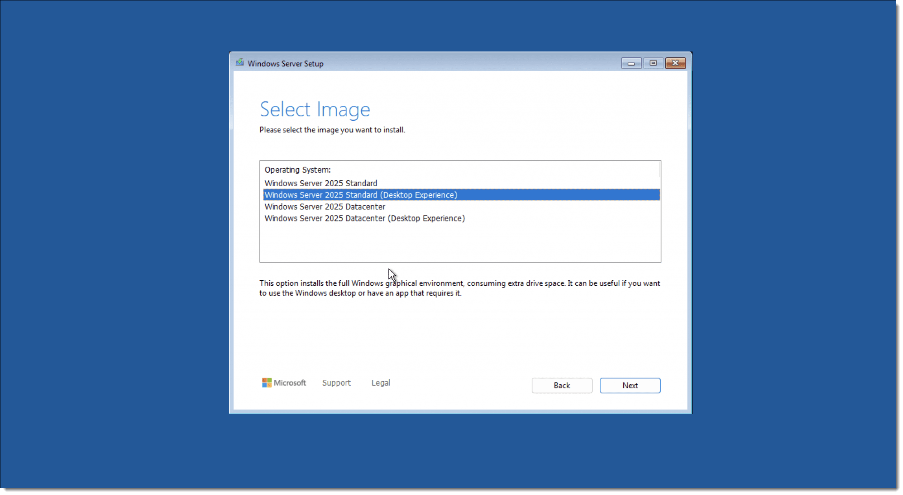
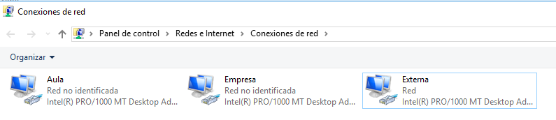
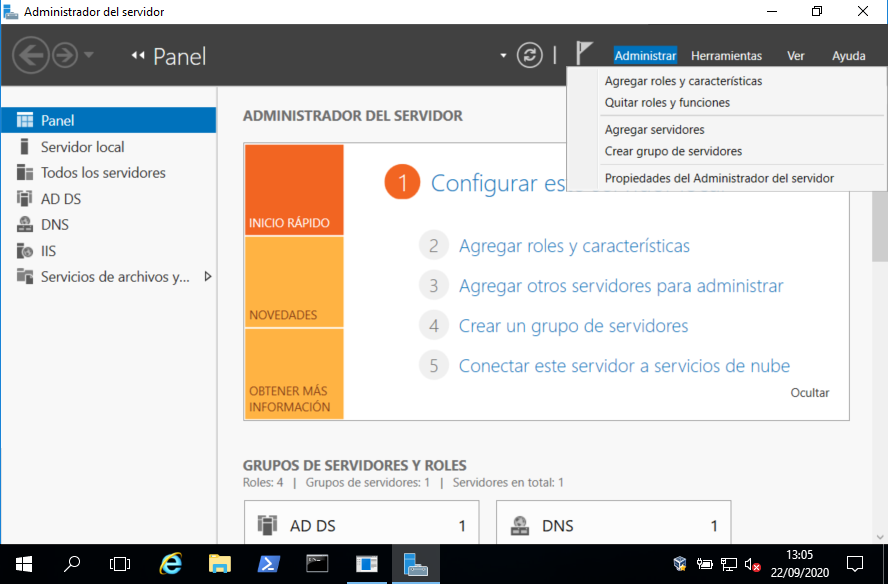
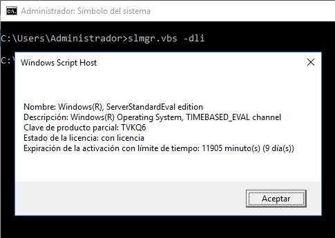
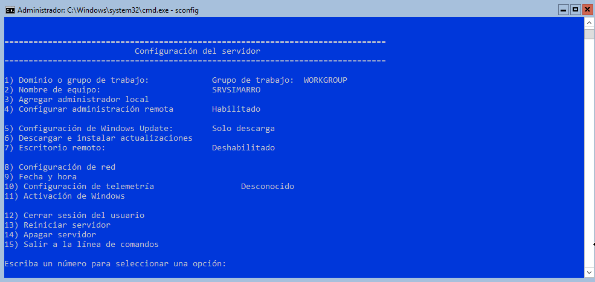

El **sistema operativo (SO)** es el componente esencial que permite que el hardware de un equipo funcione correctamente y que el usuario pueda interactuar con él. La elección del sistema operativo influye directamente en:

- La **compatibilidad con el software** disponible  
- El **rendimiento y aprovechamiento del hardware**  
- La **experiencia de usuario** y las funcionalidades accesibles  
- La **seguridad** y la **estabilidad** del sistema

!!!Example 
    
    Ejemplo: Un sistema operativo ligero como Linux puede aprovechar mejor recursos limitados, mientras que Windows ofrece mayor compatibilidad con software comercial.


## Elección del sistema operativo

Cambiar de sistema operativo no es una tarea trivial. Implica:

- Instalar el nuevo sistema  
- Configurar el entorno y los servicios  
- Instalar y adaptar el software necesario  
- Migrar datos y perfiles de usuario  
- Verificar compatibilidad con periféricos y redes

Por ello, es crucial **elegir el sistema operativo que mejor se adapte a las necesidades del usuario o del entorno**, ya sea en un equipo personal, empresarial o servidor.

### Requisitos del hardware

Antes de instalar un sistema operativo, hay que evaluar cuidadosamente el equipo:

- ¿Cumple los **requisitos mínimos** del sistema?  
- ¿Tiene recursos suficientes para un funcionamiento **fluido y estable**?  
- ¿Es compatible con los **controladores (drivers)** necesarios?

!!!Note

    Instalar un sistema en un equipo con recursos limitados puede provocar lentitud, errores o incluso fallos de instalación.


### Planificación de la instalación

Una vez elegido el sistema operativo, especialmente en entornos de servidor, es fundamental **planificar la instalación**:

- Definir el **tipo de instalación** (limpia, dual boot, virtualizada)  
- Preparar el **disco duro** (particiones, formato de archivos)  
- Establecer políticas de **seguridad y usuarios**  
- Documentar cada paso para facilitar el mantenimiento posterior  
- Realizar pruebas de funcionamiento y rendimiento

!!!Note
    
    Una instalación bien planificada evita problemas futuros y garantiza una base sólida para el sistema.

Detallamos a continuación los aspectos a tener en cuenta en la planificación. 

### Elección de la versión y edición del sistema operativo

El primer paso en cualquier instalación es decidir qué sistema operativo vamos a utilizar, teniendo en cuenta las necesidades reales de la empresa. Si optamos por un entorno Windows, es fundamental conocer las versiones disponibles y asegurarnos de que el hardware cumple sobradamente con los requisitos técnicos.

Las versiones más comunes de Windows Server son:

- Windows Server 2019  
- Windows Server 2022  
- Windows Server 2025  

Lo habitual es instalar la versión más reciente disponible, siempre que sea compatible con el hardware y el software que vamos a utilizar. Sin embargo, también es importante elegir la **edición adecuada** dentro de cada versión (Standard, Datacenter, Essentials, etc.), ya que cada una ofrece características distintas y precios diferentes.

<figure markdown="span" align="center">
  { width="70%"}
  <figcaption>Windows Server 2025 selección de versión</figcaption>
</figure>

No tiene sentido pagar por una edición como Datacenter si no vamos a aprovechar sus ventajas, como la virtualización ilimitada o el almacenamiento definido por software. La elección debe responder tanto a las necesidades actuales como a las previsiones de crecimiento a medio plazo.

### Pasos previos a la instalación

Instalar un sistema operativo en un servidor no es una tarea que se deba hacer a la ligera. El servidor será el núcleo de la red, por lo que hay que tener muy claro qué uso se le va a dar y qué cambios podrían surgir en el futuro. Tanto si se trata de una instalación nueva como de una actualización, es imprescindible planificar bien el proceso.

Planificar significa:

- Definir las tareas a realizar  
- Estimar el tiempo necesario  
- Asignar los recursos humanos y técnicos adecuados  

Los pasos previos más habituales incluyen:

1. **Copia de seguridad**: Si el equipo ya contiene datos importantes, hay que hacer una copia antes de comenzar. En nuestro caso, al tratarse de una instalación nueva, este paso no será necesario.

2. **Verificación del hardware**: Comprobar que el equipo cumple con los requisitos del sistema operativo. Esto incluye procesador, memoria RAM, espacio en disco y compatibilidad con periféricos.

3. **Diseño de particiones**: Decidir cómo se dividirá el disco. Esto implica elegir entre MBR o GPT, definir el sistema de archivos (NTFS, ReFS, etc.) y decidir si se usarán discos básicos o dinámicos. Herramientas como *GParted* pueden ayudar en esta tarea, aunque el propio asistente de instalación también permite crear particiones.

4. **Descarga del software y drivers**: Tener preparada la imagen ISO del sistema operativo y los controladores necesarios, especialmente si se usan dispositivos RAID o SCSI que no están incluidos por defecto.

5. **Preparación del medio de instalación**: Crear un USB, DVD o configurar una instalación por red (PXE) según el entorno.

6. **Configuración de la BIOS/UEFI**: Ajustar la secuencia de arranque para que el equipo inicie desde el medio de instalación.

7. **Instalación del sistema operativo**: El proceso varía según el sistema elegido, pero suele ser guiado por un asistente.

8. **Configuración post-instalación**: Ajustar el sistema a las necesidades del usuario o de la empresa, incluyendo la red, usuarios, servicios y políticas de seguridad.

9. **Verificación del funcionamiento**: Comprobar que todo funciona correctamente y que el sistema responde como se espera.

10. **Documentación**: Registrar todo el proceso, incluyendo configuraciones realizadas, incidencias detectadas y soluciones aplicadas. Esta documentación será clave para futuras intervenciones o auditorías.


### Consideraciones adicionales

En instalaciones de servidor, es habitual plantearse el uso de **RAID** para mejorar el rendimiento o la seguridad de los datos. También hay que decidir si se utilizarán **discos básicos o dinámicos**, según las necesidades de flexibilidad y gestión.

Si se utilizan controladoras RAID o dispositivos SCSI que no están en la lista de compatibilidad del sistema, será necesario **localizar y preparar los drivers** antes de iniciar la instalación, ya que el asistente puede solicitarlos en el proceso.


Aquí tienes el contenido revisado, mejorado y adaptado a un estilo técnico más fluido, sin excesiva estructura artificial, y formateado en **Markdown** para que puedas integrarlo fácilmente en tus apuntes o documentación:

---

¡Vamos allá, Sergio! Aquí tienes una guía clara y completa para realizar la **instalación gráfica de Windows Server 2025**, ideal si estás montando un servidor desde cero o en entorno virtual.

---

## Pasos para la instalación gráfica de Windows Server 2025

1. **Descargar la imagen ISO oficial**

      - Visita el [Centro de evaluación de Microsoft](https://www.microsoft.com/es-es/evalcenter/download-windows-server-2025) y descarga la ISO de Windows Server 2025.
      - Puedes elegir entre versiones como **Standard**, **Datacenter** o **Datacenter Azure Edition**, según tus necesidades.

2. **Crear una máquina virtual (si aplica)**
    - Usa VirtualBox, VMware o Hyper-V.
    - Asigna al menos:
        - 2 núcleos de CPU
        - 4 GB de RAM (mínimo recomendado)
        - 60 GB de disco duro
    - Monta la ISO como unidad de arranque.

3. **Iniciar la instalación**
    - Al arrancar desde la ISO, verás el asistente gráfico.
    - Selecciona:
        - Idioma
        - Formato de hora y moneda
        - Teclado


4. **Instalar ahora**
    - Haz clic en “Instalar ahora”.
    - Elige la edición que deseas instalar (con o sin interfaz gráfica).
    - Acepta los términos de licencia.

5. **Tipo de instalación**
    - Selecciona “Instalación personalizada” para una instalación limpia.
    - Elige el disco donde se instalará el sistema. Puedes crear particiones si lo deseas.

6. **Proceso de instalación**
    - El sistema copiará archivos, instalará características y reiniciará automáticamente.
    - Este proceso puede tardar entre 10 y 30 minutos según el hardware.

7. **Configurar contraseña de administrador**
    - Al finalizar, se te pedirá establecer la contraseña del usuario **Administrador**.

8. **Primer inicio de sesión**
    - Inicia sesión con la contraseña que acabas de crear.
    - Se abrirá el **Administrador del servidor**, desde donde podrás:
        - Cambiar el nombre del equipo
        - Unirte a un dominio
        - Configurar la red
        - Instalar roles y características


!!!tip "Procesos detallados paso a paso en internet"

    Puedes ver capturas de pantalla detalladas en esta [guía paso a paso de SomeBooks.es](https://somebooks.es/instalar-windows-server-2025-con-interfaz-grafica-paso-a-paso/).

    y aquí tienes enlaces con imágenes reales del proceso de otras guías:

    - [Instalación paso a paso con capturas](https://somebooks.es/instalar-windows-server-2025-con-interfaz-grafica-paso-a-paso/)
    - [Guía visual desde RDR-IT](https://rdr-it.com/es/instalacion-de-windows-server-2025/)
    - [Tutorial en vídeo (YouTube)](https://www.youtube.com/watch?v=0OI8i9K0ZbE)

---

## Finalizar la instalación

Una vez completada la instalación del sistema operativo, es recomendable realizar una serie de comprobaciones antes de comenzar con la configuración:

- **Estado de los dispositivos**: Desde el Administrador de dispositivos, verificamos que todo el hardware esté correctamente detectado y que no haya problemas con los controladores.
- **Configuración de red**: Es fundamental que la red esté bien configurada. Podemos comprobar la conectividad con comandos como `ping` o `tracert`, y también desde el Centro de redes y recursos compartidos.
- **Registros de sucesos**: El Visor de eventos nos permite detectar errores o advertencias que podrían indicar fallos en el sistema.
- **Particiones**: Conviene asegurarse de que el sistema reconoce correctamente todos los discos y particiones.

Una vez revisado todo, se recomienda reiniciar el equipo para confirmar que el arranque se realiza sin problemas.

## Configuración básica inicial

Desde el panel **Administrador del servidor → Servidor local**, realizamos las siguientes tareas:

### Información del equipo

- **Nombre del equipo**: Debe ser único dentro del dominio, no superar los 15 caracteres y utilizar únicamente letras, números o guiones.
- **Dominio o grupo de trabajo**: Si el servidor se integrará en un dominio existente, indicamos su nombre. Si será el controlador de dominio o no se usará dominio, lo dejamos como grupo de trabajo (más adelante se podrá crear el dominio).
- **Firewall de Windows**: Debe estar activado y correctamente configurado.
- **Escritorio remoto**: Podemos habilitarlo si los usuarios van a conectarse al servidor mediante Terminal Server.
- **Zona horaria**: Es recomendable verificarla y ajustarla si es necesario.

### Configuración de red

En servidores, lo habitual es utilizar **direcciones IP estáticas**, ya que suelen actuar como servidores DHCP para los clientes. Si no se ha hecho durante la instalación, ahora es el momento de asignar las IPs correspondientes a cada tarjeta de red.

<figure markdown="span" align="center">
  { width="80%"}
  <figcaption>Panel de control. Conexiones de Red</figcaption>
</figure>

**Como caso particular**, si el servidor va a actuar como **servidor de comunicaciones** y puerta de enlace hacia Internet, debe contar con al menos **dos tarjetas de red**:

- **Tarjeta externa**: Conectada al router o dispositivo que proporciona acceso a Internet. Se configura con una IP estática en la misma subred que el gateway, y se especifica la puerta de enlace correspondiente. En entornos virtuales (como VirtualBox), la IP dependerá del tipo de adaptador (puente o NAT).
  
- **Tarjeta interna**: Conectada al switch que enlaza con los clientes. No se configura gateway en esta tarjeta, ya que la salida será la tarjeta externa. Se asigna una IP estática en la misma subred que los clientes (por ejemplo, 192.168.224.1).

Para que los clientes puedan acceder a Internet a través del servidor, es necesario **encaminar el tráfico entre ambas tarjetas**. Esto se logra instalando el **Servicio de enrutamiento**, disponible dentro de “Acceso y directivas de red”.

!!!Tip

    Si no se va a utilizar IPv6 en la red, es recomendable desactivarlo para evitar conflictos o configuraciones innecesarias.


### Actualización del servidor

Mantener el servidor actualizado es esencial para garantizar la seguridad y estabilidad del sistema. A diferencia de los equipos cliente, un servidor expuesto a vulnerabilidades puede comprometer toda la red.

Sin embargo, hay que tener precaución:

- Algunas actualizaciones requieren reiniciar el sistema, lo que puede afectar la disponibilidad del servicio.
- En casos poco frecuentes, una actualización puede generar incompatibilidades con hardware o software instalado.

Por ello, muchos administradores prefieren que las actualizaciones se **descarguen automáticamente pero no se instalen**, permitiendo aplicar los cambios manualmente en momentos de baja actividad. Esta es la configuración por defecto en Windows Server.

!!!warning "Cuidado"

    En nuestro caso, desactivaremos las actualizaciones automáticas para evitar saturar la red del instituto.


### Roles y características

Desde el Administrador del servidor (en modo gráfico) o mediante PowerShell, podemos **agregar o quitar roles y características**:

<figure markdown="span" align="center">
  { width="70%"}
  <figcaption>Agregar roles y características</figcaption>
</figure>

- **Roles**: Servicios principales del servidor (DNS, DHCP, Active Directory, etc.)
- **Características**: Funcionalidades adicionales como copias de seguridad, cifrado, balanceo de carga, etc.

### Versión de evaluación

Windows nos ofrece un tiempo de cortesía antes de activar la licencia para poder probar este sistema.

Si hemos instalado una versión de evaluación de Windows Server, podemos consultar el tiempo restante con:

```cmd
slmgr.vbs -dli
```
<figure markdown="span" align="center">
  { width="70%"}
  <figcaption>Agregar roles y características</figcaption>
</figure>


Y ampliar el periodo de prueba con:

```cmd
slmgr.vbs -rearm
```

!!!tìp

    Ejecuta esta orden solo cuando se acerque la fecha de expiración. Requiere reiniciar el sistema tras su ejecución.


## Configuración inicial del servidor desde la terminal

Cuando instalamos **Windows Server sin entorno gráfico (Server Core)**, la configuración debe realizarse desde la terminal. Al iniciar el sistema, se abre automáticamente la herramienta **`sconfig`**, que permite configurar de forma sencilla aspectos básicos como el nombre del equipo, la red, el dominio, actualizaciones, etc.

<figure markdown="span" align="center">
  { width="80%"}
  <figcaption>Server Core. Configuración con sconfig</figcaption>
</figure>

Además, podemos utilizar directamente **PowerShell**, que ofrece un control más avanzado y flexible.

---

### Comandos útiles en PowerShell

- Cambiar el nombre del servidor

```powershell
Rename-Computer -NewName "MISERVIDOR"
Restart-Computer -Force
```

- Configurar la red

```powershell
Get-NetAdapter –Name "Ethernet" | Remove-NetIPAddress -Confirm:$false
Get-NetAdapter –Name "Ethernet" | New-NetIPAddress –AddressFamily IPv4 –IpAddress 192.168.1.25 -PrefixLength 24 -DefaultGateway 192.168.1.1
```

- Habilitar DHCP

```powershell
Set-NetIPInterface -InterfaceAlias "Ethernet" -Dhcp Enabled
```

- Ver tabla de enrutamiento

```powershell
Get-NetRoute
```

- Establecer servidores DNS

```powershell
Set-DNSClientServerAddress -InterfaceAlias "Ethernet" -ServerAddresses ("192.168.1.1", "8.8.8.8")
```

- Deshabilitar IPv6

```powershell
Disable-NetAdapterBinding –Name "Ethernet" -ComponentID ms_tcpip6
```

- Para ver los componentes disponibles:

```powershell
Get-NetAdapterBinding
```

- Para ver las interfaces de red:

```powershell
Get-NetIPInterface
```

- Configuración del Firewall

En **Windows Server 2022**, el firewall bloquea por defecto el tráfico ICMP (ping) desde equipos fuera del dominio. Para comprobar la red, podemos desactivarlo temporalmente:

```powershell
Set-NetFirewallProfile -Profile Domain,Public,Private -Enabled False
```

Y volver a activarlo:

```powershell
Set-NetFirewallProfile -Profile Domain,Public,Private -Enabled True
```

- Crear regla para permitir pings (ICMPv4)

```powershell
New-NetFirewallRule -DisplayName "Allow inbound ICMPv4" -Direction Inbound -Protocol ICMPv4 -IcmpType 8 -RemoteAddress "192.168.200.0/24" -Action Allow
```

Para múltiples rangos de IP:

```powershell
$ips = @("192.168.0.11-192.168.0.40", "192.168.100.10-192.168.100.200", "192.168.200.0/24")
New-NetFirewallRule -DisplayName "Allow inbound ICMPv4" -Direction Inbound -Protocol ICMPv4 -IcmpType 8 -RemoteAddress $ips -Action Allow
```

- Deshabilitar una regla:

```powershell
Disable-NetFirewallRule –DisplayName "Allow inbound ICMPv4"
```

- Eliminar una regla (⚠️ nunca sin `DisplayName`):

```powershell
Remove-NetFirewallRule –DisplayName "Allow inbound ICMPv4"
```

- Ver todas las reglas:

```powershell
Get-NetFirewallRule
```

- Ver IPs y puertos de una regla:

```powershell
Get-NetFirewallRule -DisplayName "Allow inbound ICMPv4" | Get-NetFirewallAddressFilter
Get-NetFirewallRule -DisplayName "Allow inbound ICMPv4" | Get-NetFirewallPortFilter
```

- Mostrar reglas activas en formato tabla:

```powershell
Get-NetFirewallRule -Action Allow -Enabled True -Direction Inbound |
Format-Table -Property Name,
@{Name="Protocol";Expression={($_ | Get-NetFirewallPortFilter).Protocol}},
@{Name="LocalPort";Expression={($_ | Get-NetFirewallPortFilter).LocalPort}},
@{Name="RemotePort";Expression={($_ | Get-NetFirewallPortFilter).RemotePort}},
@{Name="RemoteAddress";Expression={($_ | Get-NetFirewallAddressFilter).RemoteAddress}},
Enabled, Profile, Direction, Action
```

- **Alternativa con `netsh` para configurar el firewall**

- Añadir regla:

```cmd
netsh advfirewall firewall add rule name="Allow inbound ICMPv4" protocol=icmpv4:8,any dir=in action=allow
```

- Bloquear regla:

```cmd
netsh advfirewall firewall add rule name="Allow inbound ICMPv4" protocol=icmpv4:8,any dir=in action=block
```


