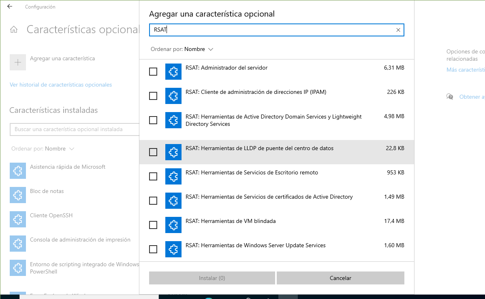

Ya tenemos Windows Server correctamente instalado en nuestra máquina, pero todavía no se comporta como un servidor. Ahora falta instalar los servicios necesarios para convertir a este equipo en el servidor del nuestra red.

## Instalación de Roles y Características en Windows Server

Una vez instalado Windows Server, el sistema operativo se comporta como cualquier versión de Windows hasta que se le asignan funciones específicas de servidor. Estas funciones se activan mediante la instalación de **roles** y **características**, que son componentes que permiten al sistema ofrecer servicios a otros equipos de la red.

### ¿Qué son los roles?

Los **roles** son conjuntos de servicios que definen el propósito principal del servidor. Al instalar un rol, el servidor adquiere capacidades específicas como gestionar usuarios, ofrecer servicios de red, alojar aplicaciones web, etc.

#### Principales roles disponibles en Windows Server:

- **Servicios de dominio de Active Directory (AD DS)**  
  Permite crear y administrar un dominio. Gestiona usuarios, equipos, políticas y autenticación centralizada.

- **Servidor DHCP**  
  Asigna automáticamente direcciones IP a los equipos cliente de la red.

- **Servidor DNS**  
  Traduce nombres de dominio en direcciones IP, facilitando la navegación y la resolución de nombres en la red.

- **Servicios de archivo**  
  Ofrece almacenamiento compartido, replicación de archivos, cuotas de disco y acceso remoto a carpetas.

- **Servicios de impresión**  
  Administra impresoras en red y servidores de impresión, permitiendo compartir dispositivos entre usuarios.

- **Servicios de acceso y directivas de red**  
  Incluye herramientas como el servicio de enrutamiento, acceso remoto (VPN), y control de acceso a la red.

- **Terminal Services / Servicios de Escritorio remoto**  
  Permite a los usuarios conectarse al servidor de forma remota, ya sea al escritorio completo o a aplicaciones específicas.

- **Servidor web (IIS)**  
  Integra el servidor web **Internet Information Services**, compatible con ASP.NET, PHP y otros entornos web.

### ¿Qué son las características?

Las **características** son componentes adicionales que complementan los roles o añaden funcionalidades específicas al servidor. No definen su función principal, pero pueden ser esenciales según el entorno.

Ejemplos de características:

- **Copia de seguridad de Windows Server**
- **Cifrado de unidad BitLocker**
- **Balanceo de carga de red**
- **Windows Defender**
- **Hyper-V** (para virtualización)


### Cómo instalar roles y características

La instalación se realiza desde el **Administrador del servidor**, una consola gráfica que se abre automáticamente al iniciar sesión en el servidor.

<figure markdown="span" align="center">
  { width="70%"}
  <figcaption>Asistente para la instalación de roles y características</figcaption>
</figure>

- **Pasos**:

1. Abre el **Administrador del servidor**.
2. Ve a **Administrar** → **Agregar roles y características**.
3. Selecciona el tipo de instalación: **basada en roles o características**.
4. Elige el servidor destino (puede ser local o remoto).
5. Marca los roles que deseas instalar.
6. Añade las características necesarias si el asistente lo solicita.
7. Confirma y comienza la instalación.
8. Reinicia el servidor si es necesario.

Aquí tienes un video demostrativo de cómo realizar esta instalación: 

<div style="position: relative; width: 70%; padding-bottom: 39.375%; margin: 0 auto;">
  <iframe src="https://www.youtube-nocookie.com/embed/YPCHY7a77hc"
          style="position: absolute; top: 0; left: 0; width: 100%; height: 100%;"
          frameborder="0"
          allow="accelerometer; autoplay; clipboard-write; encrypted-media; gyroscope; picture-in-picture"
          allowfullscreen
          title="WIndows Server. Instalación de Rol y Características">
  </iframe>
</div>

### Instalación y gestión de roles en Windows Server con **PowerShell**

***PowerShell*** permite instalar, consultar y eliminar roles de servidor de forma rápida y automatizada. A diferencia del entorno gráfico, no incluye las herramientas de administración del rol a menos que se especifique explícitamente con el parámetro `-IncludeManagementTools`.

- Instalar un rol

```powershell
Install-WindowsFeature -Name <feature_name> -ComputerName <computer_name> -IncludeManagementTools -Restart
```

- `-Name`: nombre del rol o característica a instalar (por ejemplo, `AD-Domain-Services`)
- `-ComputerName`: nombre del equipo remoto (si se omite, se instala en el equipo local)
- `-IncludeManagementTools`: instala también las herramientas de administración del rol
- `-Restart`: reinicia el equipo automáticamente si es necesario

Ejemplo: instalar Active Directory en el equipo local con herramientas de administración

```powershell
Install-WindowsFeature -Name AD-Domain-Services -IncludeManagementTools -Restart
```

- Consultar roles disponibles

Para ver la lista de roles y características que se pueden instalar:

```powershell
Get-WindowsFeature
```

Para consultar los roles disponibles en otro equipo:

```powershell
Get-WindowsFeature -ComputerName <computer_name>
```

- Desinstalar un rol

Para eliminar un rol del servidor:

```powershell
Uninstall-WindowsFeature -Name <feature_name> -ComputerName <computer_name> -IncludeManagementTools -Restart
```

Recuerda que al desinstalar también puedes eliminar las herramientas de administración si lo indicas con `-IncludeManagementTools`.

#### Ejemplos comunes de nombres de roles

| Rol                         | Nombre en PowerShell         |
|-----------------------------|------------------------------|
| Active Directory Domain Services | AD-Domain-Services       |
| DHCP Server                 | DHCP                         |
| DNS Server                  | DNS                          |
| File Server                 | FS-FileServer                |
| Web Server (IIS)           | Web-Server                   |
| Remote Desktop Services     | RDS-RD-Server                |

Puedes obtener el nombre exacto de cada rol con `Get-WindowsFeature`.

---

## Servicio de enrutamiento en Windows Server

El servicio de enrutamiento permite que los clientes de una red interna puedan acceder a redes externas, como Internet. Para ello, el servidor debe disponer de **dos tarjetas de red**:

- Una tarjeta conectada a la **red interna** (clientes)
- Otra tarjeta conectada a la **red externa** (salida a Internet)

Una vez configuradas ambas interfaces, el servidor puede actuar como **puerta de enlace**, pero por defecto las dos redes no están comunicadas. Para que los clientes puedan salir al exterior, es necesario **enrutar el tráfico** desde la tarjeta interna hacia la externa.

### Instalación del servicio

Este servicio se encuentra dentro del rol **Acceso remoto**. Una vez instalado, debe configurarse mediante el asistente de configuración.

Durante la configuración:

1. Se solicita el tipo de servicio. En este caso, se selecciona **NAT (Network Address Translation)** para permitir que los clientes accedan a Internet.
2. Se indica cuál es la **tarjeta externa** que proporciona acceso a Internet.
3. El asistente informa que no hay servidores DNS ni DHCP configurados. Como se instalarán más adelante, se elige no configurar estos servicios en este momento.

El asistente solo permite enrutar **una tarjeta interna**. Si el servidor tiene más de una red interna, las demás interfaces deben configurarse manualmente desde: **Enrutamiento y acceso remoto → [nombre del servidor] → IPv4 → NAT**

Desde ahí se pueden añadir las interfaces internas adicionales.

<figure markdown="span" align="center">
  { width="70%"}
  <figcaption>Enrutamiento y acceso remoto</figcaption>
</figure>

### Verificación del funcionamiento

Una vez configurado el enrutamiento, se puede comprobar su funcionamiento desde un cliente de la red interna utilizando los comandos:

```bash
ping [dirección externa]
tracert [dirección externa]
```

En el servidor, el comando `ipconfig` muestra la configuración de red actual. Para información más detallada, se puede usar:

```bash
ipconfig /all
```

### Enrutamiento desde la terminal mediante **PowerShell**

También es posible realizar el enrutamiento mediante PowerShell, sin necesidad de instalar el servicio completo de enrutamiento. Para ello se utiliza el cmdlet `New-NetNat`.

Ejemplo para enrutar la red interna `192.168.100.0/24`:

```powershell
New-NetNat -Name "Enruta red 100" -InternalIPInterfaceAddressPrefix 192.168.100.0/24
```

Este comando crea una regla NAT que permite que los paquetes provenientes de esa red se enruten hacia la red externa.

Para enrutar múltiples redes internas, se pueden crear varias reglas NAT.

Para consultar las reglas existentes:

```powershell
Get-NetNat
```

---

## Configuración del Firewall en Windows

En este apartado aprenderemos cómo abrir el Firewall de Windows para permitir el tráfico ICMP, necesario para realizar pruebas de conectividad mediante el comando `ping`. Esta configuración debe aplicarse en cada equipo Windows, tanto cliente como servidor.

<figure markdown="span" align="center">
  { width="40%"}
  <figcaption>Firewall</figcaption>
</figure>

Puedes consultar una imagen representativa del Firewall en [Softwareg.com.au](https://softwareg.com.au/es-es/blogs/seguridad-de-windows/que-es-windows-firewall-con-seguridad-avanzada?srsltid=AfmBOop5m9fNJ2MPydVgOyy4YZcmIW9sq9Hdq3ppCWdajYQeAXP9n7Zm).

### Configuración desde la interfaz gráfica

Pasos para crear una regla de entrada que permita tráfico ICMPv4:

1. Acceder a **Firewall de Windows con seguridad avanzada**.
2. En el panel izquierdo, hacer clic derecho sobre **Reglas de entrada** y seleccionar **Nueva regla**.
3. Elegir la opción **Personalizada**.
4. Permitir el acceso a **todos los programas**.
5. Seleccionar el protocolo **ICMPv4**.
6. Permitir el tráfico desde **cualquier dirección IP**.
7. Asignar un nombre a la regla (por ejemplo, "Permitir ICMPv4") y finalizar.

Esta regla permitirá que el equipo responda a solicitudes de `ping` desde otras máquinas.


<figure markdown="span" align="center">
  { width="70%"}
  <figcaption>Firewall de Windows Defender con seguridad avanzada</figcaption>
</figure>


### Configuración desde **PowerShell**

En Windows Server 2022, el Firewall bloquea por defecto el tráfico ICMP desde equipos que no pertenecen al dominio. Para comprobar la red, se puede desactivar temporalmente el Firewall:

```powershell
Set-NetFirewallProfile -Profile Domain,Public,Private -Enabled false
```

Y volver a activarlo:

```powershell
Set-NetFirewallProfile -Profile Domain,Public,Private -Enabled true
```

- Crear una regla para permitir ICMPv4

```powershell
New-NetFirewallRule -DisplayName "Allow inbound ICMPv4" -Direction Inbound -Protocol ICMPv4 -IcmpType 8 -RemoteAddress 192.168.200.0/24 -Action Allow
```

- Permitir tráfico ICMP desde múltiples redes

```powershell
$ips = @("192.168.0.11-192.168.0.40", "192.168.100.10-192.168.100.200", "192.168.200.0/24")
New-NetFirewallRule -DisplayName "Allow inbound ICMPv4" -Direction Inbound -Protocol ICMPv4 -IcmpType 8 -RemoteAddress $ips -Action Allow
```

- Habilitar o deshabilitar una regla

```powershell
Enable-NetFirewallRule -DisplayName "Allow inbound ICMPv4"
Disable-NetFirewallRule -DisplayName "Allow inbound ICMPv4"
```

- Eliminar una regla (siempre especificando el nombre)

```powershell
Remove-NetFirewallRule -DisplayName "Allow inbound ICMPv4"
```

- Consultar reglas existentes

```powershell
Get-NetFirewallRule
```

- Ver detalles de una regla específica

```powershell
Get-NetFirewallRule -DisplayName "Allow inbound ICMPv4" | Get-NetFirewallAddressFilter
Get-NetFirewallRule -DisplayName "Allow inbound ICMPv4" | Get-NetFirewallPortFilter
```

- Mostrar reglas activas en formato tabla

```powershell
Get-NetFirewallRule -Action Allow -Enabled True -Direction Inbound |
Format-Table -Property Name,
@{Name="Protocol";Expression={($_ | Get-NetFirewallPortFilter).Protocol}},
@{Name="LocalPort";Expression={($_ | Get-NetFirewallPortFilter).LocalPort}},
@{Name="RemotePort";Expression={($_ | Get-NetFirewallPortFilter).RemotePort}},
@{Name="RemoteAddress";Expression={($_ | Get-NetFirewallAddressFilter).RemoteAddress}},
Enabled, Profile, Direction, Action
```

### Configuración con netsh

También se puede configurar el Firewall mediante `netsh`:

- Añadir regla

```cmd
netsh advfirewall firewall add rule name="Allow inbound ICMPv4" protocol=icmpv4:8,any dir=in action=allow
```

- Eliminar regla

```cmd
netsh advfirewall firewall add rule name="Allow inbound ICMPv4" protocol=icmpv4:8,any dir=in action=block
```

Aquí tienes el contenido revisado, ampliado y estructurado en formato Markdown, con una redacción clara y técnica, ideal para documentación profesional o académica:

---

## Administración remota: RSAT y Windows Admin Center

Existen herramientas básicas para la administración de servidores y Active Directory remotamente desde equipos cliente. 

Lo habitual para el administrador del sistema es trabajar desde su equipo, que nunca debe ser el propio servidor. Estas herramientas le van a permitir gestionar aspectos del dominio y el servidor desde su equipo.

### RSAT (Remote Server Administration Tools)

Las herramientas de administración remota del servidor (RSAT) permiten gestionar servidores Windows desde equipos cliente, sin necesidad de acceder físicamente al servidor ni instalar entorno gráfico en él. Esto es especialmente útil en entornos donde se recomienda instalar **Windows Server en modo Core**.

#### Activación en Windows 10 (versión 1809 o superior)

Las herramientas RSAT se instalan como **características opcionales** desde: **Configuración → Aplicaciones y características → Características opcionales → Agregar una característica**

<figure markdown="span" align="center">
  { width="70%"}
  <figcaption>Agregar característica RSAT</figcaption>
</figure>

Para comprobar la versión del sistema, se puede ejecutar el comando:

```powershell
winver
```

#### Herramientas recomendadas

Al menos se deben instalar las siguientes:

- **RSAT: Administrador del servidor**  
  Permite acceder al panel de administración del servidor.

- **RSAT: Herramientas de Active Directory Domain Services y Lightweight Directory Services**  
  Incluye herramientas como Usuarios y Equipos de Active Directory.

- **RSAT: Herramientas de Administración de directivas de grupo**  
  Para crear y gestionar GPOs.

Otras herramientas útiles según los roles instalados:

- **RSAT: Herramientas de servidor DNS**
- **RSAT: Herramientas de servidor DHCP**
- **RSAT: Herramientas de servicios de archivo**

!!!Note

    Es necesario tener acceso a Internet y tener activo el servicio Windows Update para instalar estas características.

#### Agregar servidores al Administrador del servidor

Una vez instaladas las herramientas, se puede abrir el **Administrador del servidor** y agregar servidores desde: **Administrar → Agregar servidores → Buscar ahora**

<figure markdown="span" align="center">
  { width="70%"}
  <figcaption>Agregar servidor a RSAT</figcaption>
</figure>

No es necesario escribir el nombre ni la dirección IP del servidor.

#### Instalación por consola

También se pueden instalar herramientas RSAT desde PowerShell o CMD:

```cmd
dism /online /add-capability /CapabilityName:Rsat.GroupPolicy.Management.Tools~~~~0.0.1.0 /CapabilityName:Rsat.Dns.Tools~~~~0.0.1.0 /CapabilityName:Rsat.ActiveDirectory.DS-LDS.Tools~~~~0.0.1.0
```

En versiones anteriores a Windows 10 1809, RSAT se descarga como paquete desde el sitio oficial de Microsoft.

Puedes consultar una guía visual en [SomeBooks.es](http://somebooks.es/instalar-configurar-herramientas-administracion-remota-rsat-windows-10/).

---

### Windows Admin Center (WAC)

**Windows Admin Center** es una herramienta moderna para administrar servidores y equipos Windows desde un navegador web. Microsoft la recomienda como alternativa al Administrador del servidor tradicional.

<figure markdown="span" align="center">
  { width="70%"}
  <figcaption>WAC: Windows Admin Center</figcaption>
</figure>

#### Instalación

Debe instalarse en el equipo desde el que se administrarán los servidores. Las instrucciones están disponibles en la [documentación oficial de Microsoft](https://learn.microsoft.com/es-es/windows-server/manage/windows-admin-center/overview).

- Por defecto usa el puerto **6516**, aunque se puede cambiar.
- Al abrirlo por primera vez, solicita seleccionar un certificado. Se recomienda usar el certificado **Windows Admin Cliente**.
- Luego se agregan los servidores que se desean administrar.

#### Interfaz y funcionalidades

Al acceder a un servidor, se muestra información similar a la del Administrador del servidor. En el menú lateral se encuentran opciones como:

- **Almacenamiento**: discos y volúmenes
- **Archivos y uso compartido**: explorador de archivos y configuración de recursos compartidos
- **Dispositivos**: equivalente al Administrador de dispositivos
- **Eventos**: visor de sucesos
- **Roles y características**: instalación y eliminación de roles
- **Firewall, PowerShell, Redes, Servicios, Tareas programadas**, entre otros

#### Extensiones adicionales

Desde el menú de configuración se pueden instalar extensiones para:

- Active Directory
- DHCP
- DNS

Algunas extensiones requieren herramientas RSAT adicionales, que se instalan automáticamente si el sistema lo permite.

Puedes ampliar esta información en el [sitio oficial de Windows Admin Center](https://learn.microsoft.com/es-es/windows-server/manage/windows-admin-center/overview) o consultar el documento [Managing Windows Server - with Windows Admin Center (PDF)](https://learn.microsoft.com/en-us/windows-server/manage/windows-admin-center/manage-windows-server-wac-overview).

