# Administración de discos en Windows Server

## Tipos de discos

En Windows Server existen dos tipos principales de discos:

### Discos básicos

- Utilizan particiones tradicionales.
- Pueden tener dos tipos de tablas de particiones:
  - **MBR (Master Boot Record)**: permite hasta 4 particiones primarias, una de las cuales puede ser extendida para contener particiones lógicas.
  - **GPT (GUID Partition Table)**: más moderna, permite hasta 128 particiones primarias sin necesidad de particiones extendidas.

### Discos dinámicos

- No se organizan en particiones, sino en **volúmenes**.
- No son accesibles desde sistemas que no sean Windows Server.
- Permiten mayor flexibilidad: los volúmenes pueden abarcar varios discos, redimensionarse sin reiniciar y ofrecer tolerancia a fallos.

## Tipos de volúmenes dinámicos

Al igual que en un disco básico creamos particiones (que aquí se llaman "**volúmenes simples**") en un disco dinámico se crean **volúmenes dinámicos**. No hay límite en el número de volúmenes que se pueden crear. Un volumen puede estar formado por una o más partes de un solo disco o puede extenderse por más de un disco. Otra ventaja importante de los volúmenes es que se pueden redimensionar sin tener que reiniciar el sistema.

- **Volumen distribuido**: se extiende por varios discos. Útil para ampliar espacio.
- **Volumen seccionado (RAID-0)**: divide los datos entre discos para mejorar la velocidad.
- **Volumen reflejado (RAID-1)**: duplica los datos en dos o tres discos para ofrecer redundancia.
- **RAID-5 (con paridad)**: requiere al menos tres discos. Ofrece tolerancia a fallos con mejor aprovechamiento del espacio que RAID-1.

Tanto los discos básicos como los dinámicos se gestionan desde el Administrador de discos.

Aquí tienes enlace para refrescar información sobre los [Tipos de Volumenes de Disco](https://pc-solucion.es/tipos-volumenes-discos-duros/)

## Herramientas de administración

Para la administración de discos en Windows Server tenemos 3 posibles herramientas o formas: 

- Mediante el **Administrador de discos**: disponible en el Administrador de equipos.
- Usando el comando **`Diskpart`**: herramienta de línea de comandos.
- Usando comando de **PowerShell**: permite automatizar tareas de administración.

Puedes ver ejemplos visuales en [Microsoft Learn](https://learn.microsoft.com/es-es/windows-server/storage/disk-management/overview-of-disk-management) o en [SomeBooks.es](https://somebooks.es/agregar-un-nuevo-disco-en-windows-server-2019/).

---

## Creación de volúmenes

Windows Server no utiliza la palabra partición sino que la denomina volumen simple. Antes de poder trabajar con un disco desde la Administración de discos el disco debe haberse inicializado (como disco MBR o GPT). Si no aparece la siguiente pantalla desde la que se crea la tabla de particiones del disco:

<figure markdown="span" align="center">
  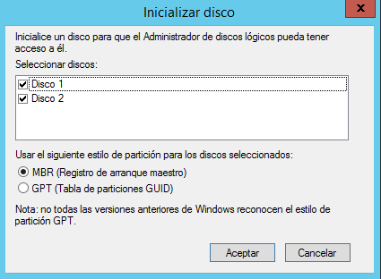{ width="50%"}
  <figcaption>Inicializar disco</figcaption>
</figure>

### Volumen simple (desde GUI)

Para crear una nueva partición en un espacio sin particionar desde el menú contextual seleccionamos Nuevo volumen simple y en la siguiente pantalla indicamos el tamaño de la partición a crear. A continuación le asignamos una letra a la nueva unidad o una carpeta donde se montará (Windows Server nos da la posibilidad de acceder a una unidad mediante una letra de unidad como el resto de sistemas Windows o montando la unidad en una carpeta como los sistemas UNIX y Linux):


A continuación elegimos el sistema de archivos. Podemos seleccionar el tamaño de clúster


Finalmente el asistente nos muestra un resumen de las opciones elegidas y cuando pulsamos Finalizar se crea la nueva partición.

Pasos:

1. Inicializar el disco como MBR o GPT.
2. Seleccionar espacio sin particionar → Nuevo volumen simple.
    <figure markdown="span" align="center">
      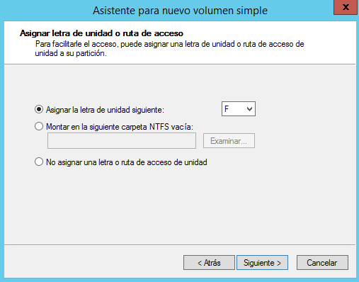{ width="50%"}
      <figcaption>Asistente para nuevo volumen simple</figcaption>
    </figure>
3. Indicar tamaño, letra de unidad o carpeta de montaje.
    <figure markdown="span" align="center">
      { width="50%"}
      <figcaption>Asistente para nuevo volumen simple</figcaption>
    </figure>
4. Elegir sistema de archivos (NTFS, ReFS) y tamaño de clúster.
5. Finalizar el asistente.

Desde el menú contextual de un volumen ya creado se puede:

- Cambiar letra o ruta de acceso.
- Extender o reducir volumen.
- Eliminar volumen.
- Agregar reflejo (RAID-1).

### Volumen simple (PowerShell)

```powershell
Get-Disk
Initialize-Disk -Number 1 -PartitionStyle GPT
New-Partition -DiskNumber 1 -Size 200GB -AssignDriveLetter
Format-Volume -DriveLetter E -FileSystem NTFS
```

---

## Conversión de discos

Convertir un disco en dinámico nos da nuevas posibilidades (como utilizar RAID) pero también tiene limitaciones, sobre todo de compatibilidad, como hemos visto antes. Si queremos convertir un disco en dinámico desde su menú contextual (el del disco, a la izquierda, no el de las particiones) seleccionamos Convertir en disco dinámico. Aparece una pantalla donde elegir qué discos queremos convertir en dinámicos.

Para convertir un disco dinámico en básico debemos eliminar previamente todos los volúmenes del disco (es decir, vamos a perder todos los datos) y luego desde su menú contextual seleccionamos Convertir en disco básico.

- **De básico a dinámico**: desde el menú contextual del disco → Convertir en disco dinámico.
- **De dinámico a básico**: eliminar todos los volúmenes → Convertir en disco básico.

<figure markdown="span" align="center">
  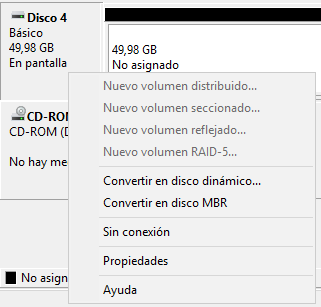{ width="50%"}
  <figcaption>Asistente para nuevo volumen simple</figcaption>
</figure>

---

## Volúmenes avanzados

En un disco básico podemos crear un volumen básico como hemos visto antes o un volumen distribuido que incluye partes de más de un disco. Se hace desde su menú contextual seleccionando Nuevo volumen distribuido:

<figure markdown="span" align="center">
  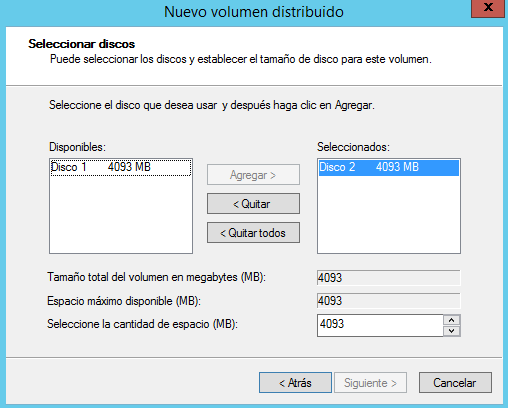{ width="50%"}
  <figcaption>Asistente para nuevo volumen distribuido</figcaption>
</figure>

En esta pantalla añadimos todos los discos por los que se extenderá el volumen y indicamos el espacio a coger de cada disco. El resto del proceso es igual que para un volumen básico: asignamos letra o ruta de acceso y luego el sistema de archivos crear.

Resumen:

- Se crea desde el menú contextual → Nuevo volumen distribuido.
- Se seleccionan los discos y el espacio a usar en cada uno.

Después desde el administrador de discos, podemos ver el resultado:

<figure markdown="span" align="center">
  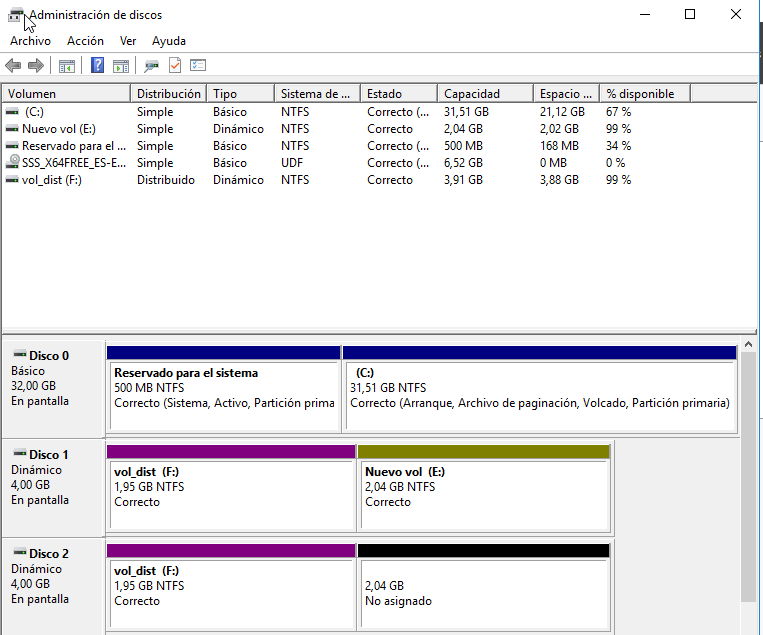{ width="50%"}
  <figcaption>Administrador de discos</figcaption>
</figure>

### Volumen seccionado (RAID-0)

<figure markdown="span" align="center">
  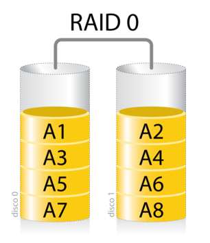{ width="50%"}
  <figcaption>RAID 0</figcaption>
</figure>

El volumen seccionado, también conocido como **RAID-0**, es una configuración que distribuye los datos entre dos o más discos. Para implementarlo, se requiere al menos **dos discos con espacio libre**, y es importante que el **tamaño asignado sea igual en cada uno**. Esta técnica divide los archivos en bloques y los escribe simultáneamente en los discos participantes, lo que permite **aumentar significativamente la velocidad de lectura y escritura**.

<figure markdown="span" align="center">
  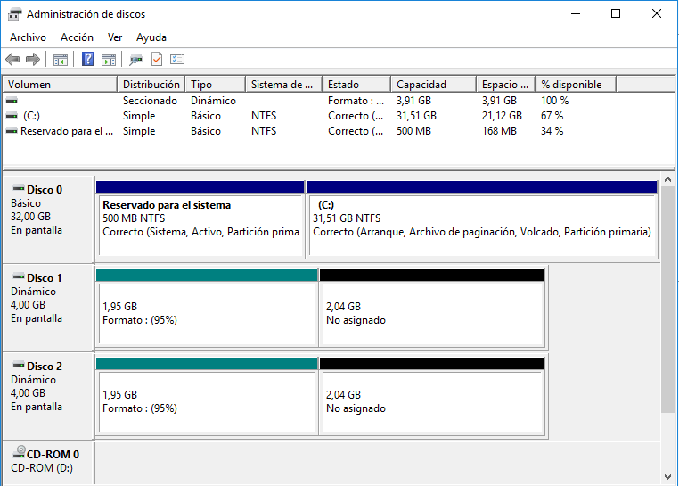{ width="80%"}
  <figcaption>Administrador de discos. Discos Seccionados</figcaption>
</figure>

Sin embargo, RAID-0 **no ofrece tolerancia a fallos**. Si uno de los discos falla, se pierde toda la información del volumen, ya que los datos están fragmentados entre los discos sin ningún tipo de redundancia. Por esta razón, se utiliza principalmente en entornos donde el rendimiento es prioritario y la pérdida de datos no es crítica, como en estaciones de trabajo para edición de vídeo o entornos de pruebas.

### Volumen reflejado (RAID-1)

<figure markdown="span" align="center">
  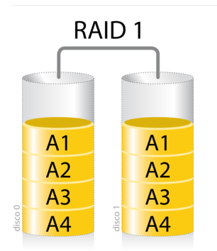{ width="50%"}
  <figcaption>RAID 1</figcaption>
</figure>

El volumen reflejado, o **RAID-1**, consiste en duplicar los datos en dos discos. Se crea fácilmente desde el menú contextual del Administrador de discos seleccionando la opción **Agregar reflejo**. Para ello, se necesita un segundo disco con **espacio libre igual o superior** al volumen que se desea reflejar.

<figure markdown="span" align="center">
  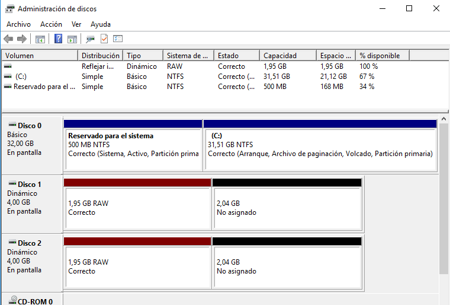{ width="80%"}
  <figcaption>Administrador de discos. Discos Reflejados</figcaption>
</figure>

Esta configuración proporciona **alta disponibilidad y tolerancia a fallos**, ya que si uno de los discos falla, el sistema puede seguir funcionando con el otro sin pérdida de datos. Es ideal para servidores que manejan información crítica, como bases de datos o sistemas de autenticación, donde la integridad de los datos es más importante que el rendimiento.

Además, en Windows Server, al agregar un reflejo a un volumen básico, el sistema convierte automáticamente ambos discos en **dinámicos**, lo que permite gestionar el volumen reflejado como una unidad lógica.

### Volumen RAID-5

<figure markdown="span" align="center">
  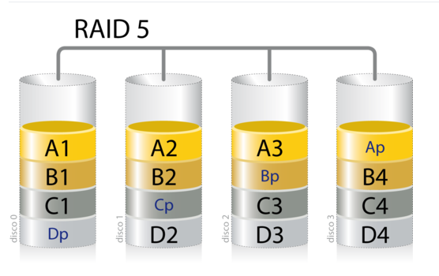{ width="50%"}
  <figcaption>RAID 5</figcaption>
</figure>

RAID-5 es una configuración más avanzada que combina **rendimiento, capacidad y tolerancia a fallos**. Para crear un volumen RAID-5 en Windows Server, se necesitan al menos **tres discos dinámicos**. La creación se realiza desde el menú contextual del Administrador de discos, seleccionando **Nuevo volumen RAID-5**.

<figure markdown="span" align="center">
  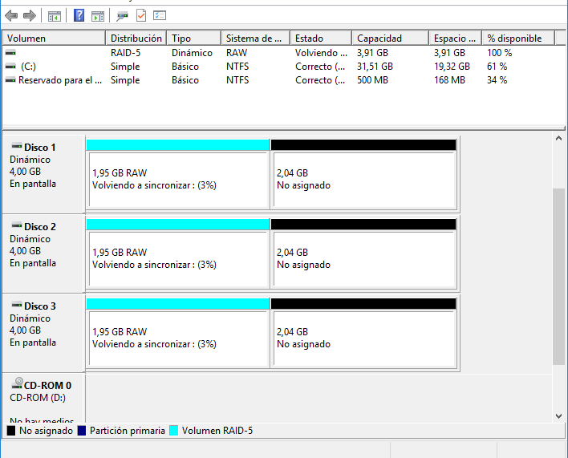{ width="80%"}
  <figcaption>Administrador de discos. Discos distribuidos</figcaption>
</figure>

En esta configuración, los datos y la información de paridad se distribuyen entre todos los discos. Si uno de ellos falla, el sistema puede **reconstruir los datos perdidos** utilizando la paridad almacenada en los discos restantes. Esto permite mantener el servicio activo sin pérdida de información.

En caso de fallo de un disco, el procedimiento habitual es:

- **Quitar el volumen** del disco dañado.
- **Reparar el volumen** utilizando otro disco con espacio libre que no forme parte del RAID.

Aunque RAID-5 ofrece una buena relación entre seguridad y aprovechamiento del espacio, tiene como desventaja una **escritura más lenta**, ya que debe calcular y almacenar la paridad. Por eso, en entornos de alta carga, se suele implementar mediante **controladoras RAID por hardware**, que descargan ese trabajo de la CPU.

## Volúmenes dinámicos vs RAID por BIOS

La elección entre volúmenes dinámicos y RAID por BIOS (hardware) depende del entorno, del presupuesto y de los requisitos técnicos del sistema.

### RAID por BIOS (hardware)

Este tipo de RAID se configura **antes de iniciar el sistema operativo**, generalmente desde el firmware del equipo. El sistema operativo no ve los discos físicos individuales, sino un **único disco virtual** que representa el conjunto RAID.

Las ventajas principales son:

- **Mayor rendimiento**, ya que el procesamiento lo realiza la controladora RAID.
- **Menor carga para la CPU**, lo que libera recursos para otras tareas.
- **Mayor fiabilidad**, especialmente en configuraciones avanzadas como RAID 6 o RAID 10.
- **Compatibilidad con más tipos de RAID**, incluyendo combinaciones como RAID 01, 10, 50, etc.

Este tipo de configuración es ideal para servidores de producción, sistemas críticos y entornos empresariales donde la disponibilidad y el rendimiento son esenciales.

### RAID por software (volúmenes dinámicos)

Los volúmenes dinámicos se configuran directamente desde el sistema operativo, sin necesidad de hardware adicional. Son más **fáciles de implementar**, y permiten utilizar discos de diferentes capacidades, tipos o velocidades.

Sus ventajas son:

- **Flexibilidad** en la configuración.
- **Menor coste**, ya que no requiere controladoras RAID dedicadas.
- **Gestión directa desde Windows Server**, con herramientas como el Administrador de discos o PowerShell.

Sin embargo, presentan algunas limitaciones:

- **Menor rendimiento**, especialmente en RAID-0 o RAID-5, ya que la CPU debe gestionar la distribución de datos y la paridad.
- **Menor fiabilidad**, ya que dependen del sistema operativo para funcionar correctamente.
- **Compatibilidad limitada**, ya que otros sistemas operativos no siempre reconocen volúmenes dinámicos.

En resumen, si el presupuesto lo permite y se busca rendimiento y fiabilidad, es recomendable optar por **RAID por hardware**. Si se necesita flexibilidad y se trabaja en entornos menos exigentes, los **volúmenes dinámicos** pueden ser una solución válida.

Más información sobre tipos de RAID en [RedesZone.net](https://www.redeszone.net/tutoriales/servidores/tipos-raid-servidores-nas/) y [Wikipedia RAID](https://es.wikipedia.org/wiki/RAID).

---

## PowerShell

Puedes consultar cómo crear volúmenes con PowerShell en la [documentación oficial de Microsoft](https://learn.microsoft.com/en-us/powershell/module/storage/new-virtualdisk).

