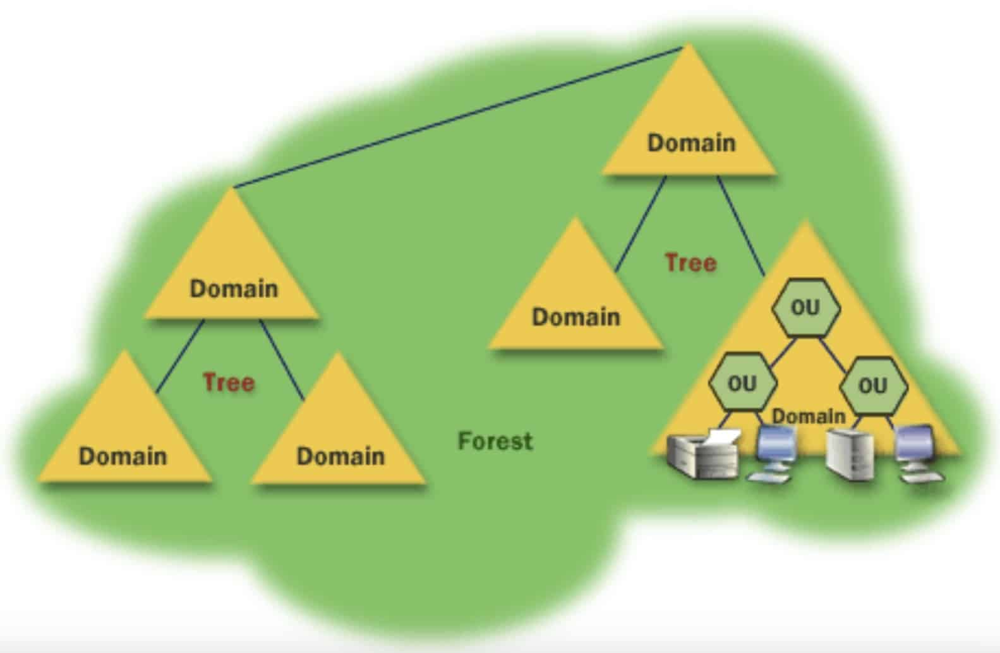
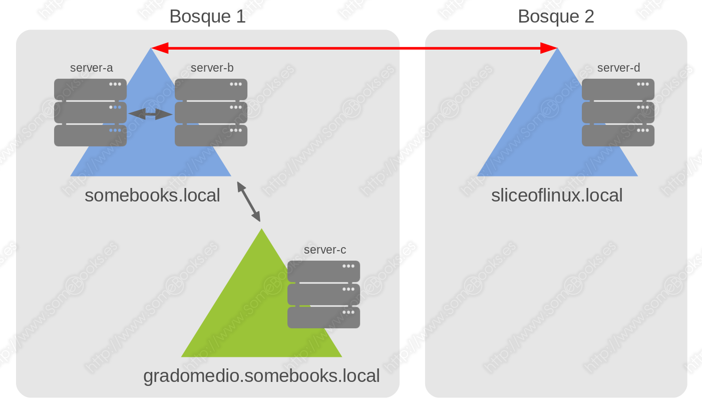
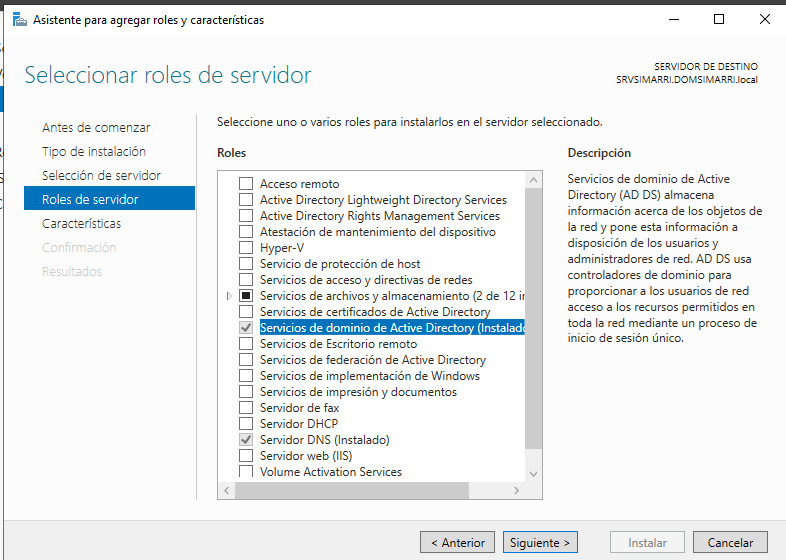

# Administración centralizada de redes con Active Directory

En la actualidad, los ordenadores de cualquier organización suelen estar conectados en red, lo que permite compartir información, recursos y servicios de forma eficiente. Esta conectividad, sin embargo, requiere una administración adecuada para garantizar la seguridad, el rendimiento y la disponibilidad de los sistemas.

Una forma de simplificar la gestión de la red es **centralizar la administración** mediante un servidor que almacene y controle toda la información sobre los elementos conectados: usuarios, equipos, impresoras, carpetas compartidas, etc.

## El servidor en redes Windows

En entornos Windows, el servidor que gestiona la red ejecuta una versión del sistema operativo **Windows Server**, como:

- Windows Server 2012  
- Windows Server 2016  
- Windows Server 2019  
- **Windows Server 2022**  
- **Windows Server 2025** (versión más reciente, con mejoras en seguridad, virtualización y administración remota)

Este servidor no solo proporciona servicios básicos, sino que también se encarga de la autenticación de usuarios, la aplicación de políticas de grupo, la gestión de recursos compartidos y la seguridad de la red.

### El directorio: núcleo de la administración

La información de la red se organiza en una estructura jerárquica llamada **directorio** o **Active Directory**, que almacena objetos como:

- Equipos y servidores  
- Usuarios y grupos  
- Impresoras  
- Carpetas compartidas  
- Políticas de seguridad  

<figure markdown="span" align="center">
  { width="50%"}
  <figcaption>Active Directory (AD)</figcaption>
</figure>

Microsoft denomina a su servicio de directorio **Active Directory (AD)**. Este sistema sigue el estándar **LDAP (Lightweight Directory Access Protocol)**, lo que permite interoperabilidad con otros sistemas que también lo utilizan, como OpenLDAP en GNU/Linux.

### Dominio y controlador de dominio

La estructura lógica que representa la red administrada se llama **dominio**. Al instalar el rol de **Servicios de dominio de Active Directory** en un servidor Windows, este se convierte en un **controlador de dominio (DC)**.

En una red con arquitectura cliente-servidor, debe existir al menos un **controlador de dominio principal**, aunque es habitual contar con **controladores secundarios** que replican la información del directorio para mejorar la disponibilidad y la tolerancia a fallos.

Cada dominio tiene un **nombre único** que sigue la notación de DNS, como por ejemplo `iesconsueloaranda.es`. Por ello, es imprescindible contar con un **servidor DNS** que resuelva los nombres de los equipos y servicios del dominio. Si no se dispone de uno, Windows Server instala y configura automáticamente el servicio DNS al activar Active Directory.

### Árboles y bosques de dominios

Un dominio puede tener **subdominios**, como `www.iesconsueloaranda.es` o `moodle.iesconsueloaranda.es`. El conjunto formado por el dominio principal y sus subdominios se denomina **árbol de dominios**, siendo el dominio principal el **dominio raíz**.

En organizaciones más complejas, puede haber **varios dominios independientes**, como `departamentos.lan`, con subdominios como `departamento1.departamentos.lan`, `departamento2.departamentos.lan`, etc. El conjunto de varios árboles de dominios se llama **bosque**.

<figure markdown="span" align="center">
  { width="80%"}
  <figcaption>Active Directory Tree and Forest</figcaption>
</figure>

### Relaciones de confianza entre dominios

Active Directory permite establecer **relaciones de confianza** entre dominios, incluso si pertenecen a árboles o bosques distintos. Estas relaciones permiten que los usuarios de un dominio puedan acceder a recursos de otro, siempre que se haya configurado la confianza correspondiente.

Cuando en una empresa hay más de un dominio en ocasiones un usuario de un dominio puede necesitar acceder a un recurso de otro dominio. Para evitar que el usuario tenga que tener una cuenta en cada dominio y autenticarse en cada uno cuando necesita un recurso de ese dominio se establecen relaciones de confianza entre los diferentes dominios. 

Tipos de relaciones de confianza:

- **Confianzas transitivas**: automáticas entre dominios del mismo bosque.
- **Confianzas externas**: entre dominios de bosques distintos.
- **Confianzas de bosque**: permiten la autenticación entre bosques completos.
- **Confianzas de reino**: para conectar con dominios no basados en Active Directory (por ejemplo, Kerberos en sistemas UNIX).

<figure markdown="span" align="center">
  { width="80%"}
  <figcaption>Active Directory relaciones de confianza</figcaption>
</figure>

Estas relaciones se basan en protocolos como **Kerberos v5**, aunque también se admite **NTLM** y autenticación mediante **SSL/TLS**.

Puedes ampliar esta información en la [entrada de Active Directory en Wikipedia](https://es.wikipedia.org/wiki/Active_Directory#Intercambio_entre_dominios.5B2.5D).

---

## La función del dominio en una red Windows

En una red con arquitectura cliente-servidor, el **dominio** es la estructura lógica que permite centralizar la administración de todos los recursos conectados. Esta centralización se logra mediante el uso de un **directorio**, que actúa como una base de datos jerárquica y estructurada, gestionada por el servidor a través de **Active Directory**.

El **directorio** tiene como función principal **almacenar información sobre los objetos de la red**. Estos objetos pueden clasificarse en tres grandes grupos:

- **Recursos**: dispositivos físicos o virtuales que ofrecen servicios a los usuarios, como impresoras, carpetas compartidas, unidades de red, etc.
- **Servicios**: funcionalidades que se ejecutan en la red, como correo electrónico, acceso remoto, autenticación, DNS, DHCP, entre otros.
- **Usuarios**: cuentas individuales, grupos de usuarios, roles administrativos, etc., que representan a las personas o entidades que interactúan con la red.

Cada objeto en el directorio posee una serie de **atributos** que lo identifican y definen. Por ejemplo:

- Un usuario puede tener atributos como nombre completo, nombre de inicio de sesión, dirección de correo electrónico, departamento, etc.
- Una impresora puede tener atributos como marca, modelo, ubicación física, tipo de conexión, etc.

Además, los objetos pueden **contener otros objetos**. Por ejemplo, un grupo de seguridad puede incluir múltiples cuentas de usuario, y una unidad organizativa puede agrupar equipos, usuarios y políticas.

La centralización de la información en el dominio ofrece** múltiples beneficios**:

- **Inicio de sesión único (Single Sign-On)**: el usuario se autentica una sola vez y, si tiene los permisos adecuados, puede acceder a todos los recursos del dominio sin necesidad de volver a identificarse.
- **Aplicación de políticas comunes**: mediante las **Directivas de Grupo (GPO)**, el administrador puede definir configuraciones estándar para todos los equipos o usuarios, como restricciones de acceso, configuración del escritorio, instalación de software, etc.
- **Despliegue de actualizaciones y software**: es posible instalar programas o aplicar parches de seguridad de forma remota y simultánea en múltiples equipos.
- **Control de acceso y seguridad**: se pueden establecer permisos precisos sobre cada recurso, definir contraseñas seguras, auditar accesos y aplicar medidas de protección a nivel de red.
- **Escalabilidad**: el dominio puede crecer fácilmente, añadiendo nuevos usuarios, equipos o servicios sin perder el control ni la coherencia en la administración.

---


## Instalación y configuración de dominios en Windows Server

Para que un servidor Windows actúe como **controlador de dominio (DC)**, es necesario instalar el rol de **Servicios de dominio de Active Directory (AD DS)**. Este proceso consta de dos fases: la instalación del rol y su posterior configuración.

### Instalación del rol

Se realiza desde el **Administrador del servidor**, en la sección: **Administrar → Agregar roles y características → Servicios de dominio de Active Directory**

<figure markdown="span" align="center">
  { width="80%"}
  <figcaption>Agregar rol de Active Directory</figcaption>
</figure>


Una vez finalizada la instalación, se puede iniciar la configuración desde el asistente que aparece automáticamente o ejecutando el comando:

```cmd
dcpromo.exe
```

!!!note

    En versiones modernas como **Windows Server 2022** y **Windows Server 2025**, el comando `dcpromo.exe` ha sido reemplazado por el asistente gráfico y por cmdlets de PowerShell como `Install-ADDSForest`.

### Configuración del dominio

Durante la configuración, se deben tomar decisiones clave:

- **Agregar un nuevo bosque**: Esta opción se selecciona cuando no existe ningún dominio previo en la red. Se crea el dominio raíz del bosque.
- **Nombre del dominio**: Debe tener al menos dos niveles, por ejemplo `iesconsueloaranda.lan`, siguiendo la notación DNS.
- **Nivel funcional del bosque y del dominio**: Se recomienda seleccionar el nivel más alto compatible con todos los controladores de dominio. En entornos nuevos, se puede establecer **Windows Server 2025** para aprovechar todas sus funcionalidades.
- **Instalación del servicio DNS**: Si no hay un servidor DNS en la red, el asistente instalará y configurará uno automáticamente.
- **Ubicación de los componentes del dominio**: Si el servidor tiene varios discos, se recomienda distribuir los archivos de base de datos, registros y SYSVOL para mejorar el rendimiento. En instalaciones básicas, se puede dejar todo en `C:\`.

Una vez completada la configuración, el servidor se reinicia y pasa a ser un **controlador de dominio**.

### Degradar un controlador de dominio

Si es necesario **eliminar el rol de controlador de dominio**, el proceso se realiza desde el mismo asistente o mediante PowerShell.

- Si el servidor es el **último controlador del dominio**, se debe marcar la opción correspondiente para **eliminar el dominio completo**, lo que implica la pérdida de toda la información del directorio.
- Si existen otros controladores, el servidor simplemente se degrada a **servidor miembro**, conservando su pertenencia al dominio pero sin funciones de control.

En versiones modernas, el proceso se realiza con el cmdlet:

```powershell
Uninstall-ADDSDomainController
```

### Creación de otros dominios

Aunque lo habitual es trabajar con un único dominio, en algunas organizaciones se requiere crear **subdominios** o **dominios adicionales** dentro del mismo bosque. Esto puede deberse a razones geográficas, organizativas o de seguridad.

Para crear un nuevo dominio en un bosque existente:

- Se selecciona la opción **Agregar un nuevo dominio en un bosque existente**.
- Se indica el nombre del **dominio raíz** del bosque.
- Se configura el nuevo dominio como **hijo** del dominio principal o como **dominio paralelo**.

Cada dominio debe tener al menos **un controlador de dominio propio**, que puede estar ubicado en la sede correspondiente.

Aquí tienes la explicación completa y detallada del proceso de instalación de un dominio en Windows Server desde PowerShell, utilizando el ejemplo del dominio **ACME.LAN**. He corregido y ampliado el script para que sea más claro y funcional, además de explicar cada paso con precisión.

---

## Instalación de un dominio desde PowerShell

En entornos donde se busca automatizar la configuración del servidor o trabajar sin entorno gráfico (Server Core), PowerShell permite instalar y configurar un dominio de forma rápida y eficiente.

**Ejemplo**: creación del dominio **ACME.LAN**"

```powershell
# Definimos las variables
$dominioFQDN = "ACME.LAN"                      # Nombre completo del dominio (FQDN)
$dominioNETBIOS = "ACME"                       # Nombre NetBIOS del dominio
$adminPass = "abc@1234."                       # Contraseña para el modo seguro de recuperación

# Instalamos los roles necesarios: Active Directory y DNS
Install-WindowsFeature AD-Domain-Services, DNS -IncludeAllSubFeature

# Importamos el módulo de despliegue de Active Directory
Import-Module ADDSDeployment

# Ejecutamos la instalación del bosque y del dominio
Install-ADDSForest `
    -DomainName $dominioFQDN `
    -DomainNetBiosName $dominioNETBIOS `
    -SafeModeAdministratorPassword (ConvertTo-SecureString -String $adminPass -AsPlainText -Force) `
    -DomainMode WinThreshold `
    -ForestMode WinThreshold `
    -InstallDNS `
    -Confirm:$false
```

**Explicación de cada parámetro**

- `-DomainName`: nombre completo del dominio (por ejemplo, `empresa.local` o `acme.lan`)
- `-DomainNetBiosName`: nombre corto del dominio, usado en redes antiguas y para compatibilidad
- `-SafeModeAdministratorPassword`: contraseña para el modo de recuperación de servicios de directorio (DSRM)
- `-DomainMode` y `-ForestMode`: nivel funcional del dominio y del bosque. `WinThreshold` es el identificador para Windows Server 2025
- `-InstallDNS`: instala y configura el servidor DNS si no existe uno en la red
- `-Confirm:$false`: evita que se solicite confirmación manual durante la ejecución

!!!Nota

    El servidor se reiniciará automáticamente al finalizar la instalación. Al volver a arrancar, ya será un **controlador de dominio (DC)**.

---

## Añadir un cliente al dominio en Windows Server

Para que un equipo cliente pueda formar parte de un dominio gestionado por Active Directory, es necesario cumplir una serie de requisitos previos y seguir un proceso de unión al dominio. Este procedimiento permite que el cliente sea administrado centralizadamente, acceda a recursos compartidos y se autentique mediante las políticas del dominio.

### Requisitos previos

Antes de iniciar el proceso de unión, debemos asegurarnos de que el cliente y el servidor están correctamente conectados y configurados:

1. Conectividad de red

      - **Direcciones IP compatibles**: Ambos equipos deben tener direcciones IP dentro de la misma subred o en redes que puedan comunicarse entre sí mediante enrutamiento.
      - **Conexión física**: Los cables de red deben estar conectados al mismo switch o a switches interconectados. En entornos virtuales, deben estar en la misma red virtual o puente.

2. Configuración del DNS

      - El **servidor DNS del cliente** debe ser la **IP del controlador de dominio**, ya que es el único capaz de resolver correctamente el nombre del dominio.
      - Esta configuración se realiza desde las propiedades de la tarjeta de red del cliente, en el apartado de IPv4.

3. Verificación de conectividad

    Desde la terminal del cliente, se puede comprobar la conexión con el servidor mediante:

    ```cmd
    ping nombre_del_servidor
    nslookup nombre_del_dominio
    ```

    Si ambos comandos responden correctamente, el cliente está listo para unirse al dominio.

### Proceso de unión al dominio

Una vez verificada la conectividad, seguimos estos pasos desde el equipo cliente (Windows 10, 11 o equivalente):

1. **Abrir Configuración del sistema**  
   Ir a:  
   `Panel de control → Sistema → Cambiar configuración (nombre del equipo)`

2. **Cambiar nombre del equipo y dominio**  
   En la ventana de propiedades del sistema:  
   - Hacer clic en “Cambiar…”  
   - Introducir el **nombre del dominio** (por ejemplo, `iesconsueloaranda.lan`)  
   - Confirmar

3. **Autenticación**  
   Se solicitarán credenciales de un usuario con permisos para unir equipos al dominio (normalmente un administrador del dominio).

4. **Reinicio del equipo**  
   Tras la unión, el sistema pedirá reiniciar el equipo para aplicar los cambios.

5. **Inicio de sesión en el dominio**  
   Al reiniciar, en la pantalla de inicio de sesión aparecerá la opción de iniciar sesión con una cuenta del dominio. Se debe usar el formato:  
   `DOMINIO\nombre_usuario`

Veamos el proceso en el siguiente video:

<div style="position: relative; width: 70%; padding-bottom: 39.375%; margin: 0 auto;">
  <iframe src="https://www.youtube-nocookie.com/embed/LxbwB-8b-wg"
          style="position: absolute; top: 0; left: 0; width: 100%; height: 100%;"
          frameborder="0"
          allow="accelerometer; autoplay; clipboard-write; encrypted-media; gyroscope; picture-in-picture"
          allowfullscreen
          title="YouTube video player">
  </iframe>
</div>


### Verificación

Una vez unido al dominio, se puede comprobar desde:

- `Sistema → Información del equipo`: debe aparecer el nombre del dominio.
- `Usuarios y grupos locales`: los usuarios del dominio ya pueden iniciar sesión.
- `Active Directory`: el nuevo equipo aparecerá como objeto en la unidad organizativa correspondiente.


