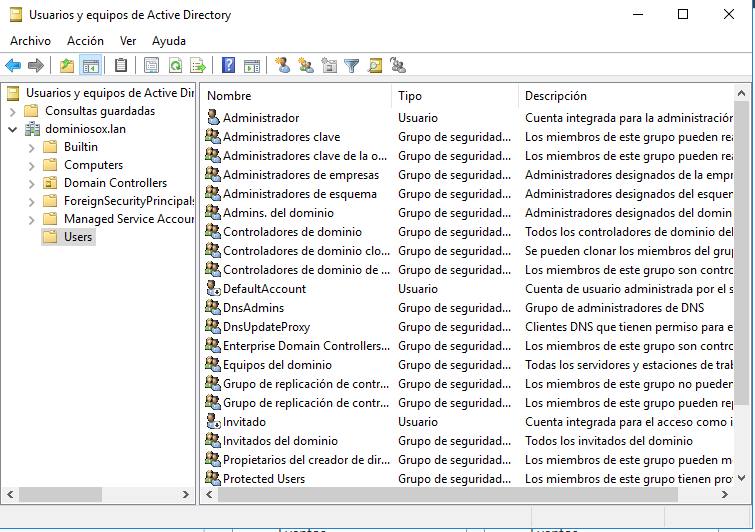
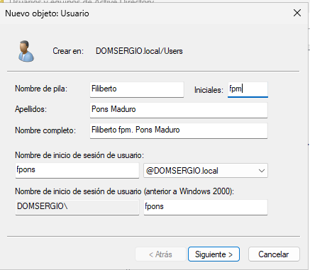
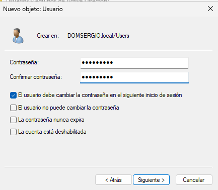

En un entorno informático, cada persona que utiliza un ordenador debe disponer de una **cuenta de usuario**, la cual cumple dos funciones esenciales:

- Identificación y autenticación del usuario para acceder al sistema.  
- Gestión de permisos y derechos sobre los recursos disponibles en el sistema.

## Tipos de cuentas de usuarios 

No debemos confundir entre **cuentas locales** de usuario y **cuentas de dominio**: 

### Cuentas locales de usuario

Cuando se crea un usuario en un sistema Windows que **no actúa como controlador de dominio (DC)** —por ejemplo, un equipo cliente— se genera una **cuenta local de usuario**. Esta cuenta permite al usuario iniciar sesión únicamente en el equipo donde fue creada.

**Ejemplo práctico**: si se crea una cuenta local en el equipo `PC-SMR01`, el usuario solo podrá iniciar sesión en ese equipo, y no en otros equipos de la red.

### Cuentas de usuario en dominio

En redes corporativas o educativas, es habitual que los usuarios necesiten acceder a distintos equipos. Para ello, se podrían crear cuentas locales en cada equipo, pero esta solución es ineficiente y difícil de administrar.

La alternativa óptima es utilizar **cuentas de usuario de dominio**, que se crean dentro del **Active Directory (AD)**. Estas cuentas permiten al usuario iniciar sesión desde cualquier equipo miembro del dominio, sin necesidad de replicar la cuenta en cada dispositivo.

**Concepto clave**: la cuenta de dominio es única y está centralizada en el Directorio Activo, lo que facilita la administración y la seguridad.


### Diferencias entre cuentas locales y cuentas de dominio

| Característica                         | Cuenta Local                          | Cuenta de Dominio                          |
|---------------------------------------|----------------------------------------|--------------------------------------------|
| Ubicación                             | Base de datos local del equipo         | Directorio Activo (centralizado)           |
| Acceso                                | Solo en el equipo donde se creó        | En cualquier equipo del dominio            |
| Gestión de permisos                   | Solo sobre recursos locales            | Sobre recursos de toda la red              |
| Visibilidad                           | Solo en el equipo local                | Visible en todos los equipos del dominio   |
| Administración                        | Manual en cada equipo                  | Centralizada desde el DC                   |

Importante:  
- A una cuenta local no se le pueden asignar permisos sobre recursos del dominio.  
- A una cuenta de dominio se le pueden conceder permisos sobre cualquier recurso compartido en la red (archivos, carpetas, impresoras, etc.).


## Creación y validación de cuentas de dominio

En un dominio Windows, cualquier servidor que actúe como **Controlador de Dominio (DC)** puede crear cuentas de usuario de dominio. Los datos de estas cuentas se almacenan en el **Directorio Activo**, lo que permite que todos los equipos del dominio las reconozcan.

Cuando un usuario intenta iniciar sesión en un equipo del dominio utilizando su cuenta de dominio, el equipo realiza una consulta al Directorio Activo para validar sus credenciales.

Proceso de autenticación:  
1. El usuario introduce sus credenciales.  
2. El equipo consulta al DC.  
3. El DC verifica la identidad y autoriza el acceso.

## Herramienta de Usuarios y Equipos de Active Directory

La herramienta **Usuarios y Equipos de Active Directory** es una consola administrativa fundamental para la gestión de objetos dentro de un dominio Windows. Permite crear, modificar, eliminar y organizar usuarios, grupos, equipos y unidades organizativas (OU) de forma centralizada.

<figure markdown="span" align="center">
  { width="80%"}
  <figcaption> Herramienta de Usuarios y Equipos de Active Directory</figcaption>
</figure>

Se puede acceder a esta herramienta desde dos ubicaciones principales:

- A través del **Administrador del servidor**, desplegando el menú **Herramientas** situado en la parte superior derecha.
- Desde el botón **Inicio**, accediendo a **Herramientas administrativas**.

Es necesario que el equipo tenga instalados los componentes de **Active Directory Domain Services (AD DS)** y que esté unido a un dominio para que la consola esté disponible.

### Estructura del dominio en la consola

Una vez abierta la herramienta, se muestra el árbol jerárquico del dominio, donde se pueden observar varias **Unidades Organizativas (OU)** que han sido creadas automáticamente durante la instalación del dominio. Algunas de las más relevantes son:

- **Built-in**: contiene usuarios y grupos integrados que se crean automáticamente al establecer el dominio. Estos objetos tienen funciones específicas relacionadas con la seguridad y la administración. Se estudiarán en detalle más adelante.
- **Computers**: almacena las cuentas de los equipos cliente que han sido añadidos al dominio. Cada equipo aparece como un objeto dentro de esta OU.
- **Domain Controllers**: contiene las cuentas de los servidores que actúan como **Controladores de Dominio (DC)**. En una instalación inicial, esta OU suele contener únicamente el servidor principal.
- **Users**: es el contenedor por defecto donde se crean los usuarios y grupos si no se especifica otra ubicación. Aunque funcional, se recomienda crear OU personalizadas para organizar los objetos de forma lógica y facilitar su administración.

> Nota: Las OU permiten aplicar políticas de grupo (GPO) de forma segmentada, lo que mejora la seguridad y la eficiencia en la gestión de recursos.

### Funcionalidades de la barra de herramientas

La barra de herramientas de la consola incluye accesos directos para realizar las siguientes acciones:

- Crear un nuevo **usuario**.
- Crear un nuevo **grupo**.
- Crear una nueva **unidad organizativa (OU)**.
- Buscar objetos dentro del dominio.
- Aplicar filtros para visualizar subconjuntos específicos de objetos.

Estas funciones permiten una administración ágil y estructurada del entorno de red, especialmente en organizaciones con múltiples departamentos o sedes.


## Operaciones con cuentas de usuario en Active Directory

La gestión de cuentas de usuario en un dominio Windows se realiza principalmente desde la herramienta **Usuarios y Equipos de Active Directory**, aunque también es posible utilizar comandos desde la línea de comandos. A continuación se detallan las operaciones más habituales.

### Creación de una cuenta de usuario de dominio

La creación de usuarios se realiza desde el contenedor deseado (por defecto, la OU `Users`, aunque se recomienda crear OU personalizadas). Desde el menú contextual del contenedor, se selecciona:

```plaintext
Nuevo → Usuario
```

<figure markdown="span" align="center">
  { width="70%"}
  <figcaption> Creación de usuario</figcaption>
</figure>

El asistente solicita los siguientes datos:

- Nombre, iniciales y apellidos del usuario.
- Nombre de inicio de sesión (login), sin espacios.
- Dominio en el que se crea la cuenta.

En la siguiente pantalla se establece la contraseña, que debe cumplir los requisitos de complejidad definidos por la política de seguridad del sistema. Además, se pueden configurar opciones adicionales:

- **El usuario debe cambiar la contraseña en el próximo inicio de sesión.**
- **El usuario no puede cambiar la contraseña.**
- **La contraseña nunca caduca.**
- **La cuenta está deshabilitada.**

<figure markdown="span" align="center">
  { width="70%"}
  <figcaption> Creación de usuario</figcaption>
</figure>

Tras confirmar los datos, se pulsa **Finalizar** para crear la cuenta.

### Modificar una cuenta de usuario

Se accede mediante doble clic sobre la cuenta o desde su menú contextual → **Propiedades**. 

Las pestañas más relevantes son:

- **General**: nombre, teléfono, correo electrónico.
- **Dirección**: domicilio del usuario.
- **Cuenta**:
    - Nombre de inicio de sesión.
    - Nombre anterior a Windows 2000.
    - Horas de inicio de sesión permitidas.
    - Equipos desde los que puede iniciar sesión.
    - Desbloqueo de cuenta tras intentos fallidos.
    - Opciones de caducidad y deshabilitación.
- **Perfil**: se trata en otro apartado.
- **Organización**: información empresarial, cuentas administradas.
- **Miembro de**: grupos a los que pertenece.

### Modificar la contraseña de un usuario

Desde el menú contextual → **Restablecer contraseña**. Se puede marcar la opción para que el usuario la cambie en el próximo inicio.


### Copiar una cuenta de usuario

Para crear un usuario similar a otro existente, se puede utilizar la opción **Copiar** desde el menú contextual. Es habitual crear **plantillas** de usuario con configuraciones predefinidas (grupos, horarios, políticas de contraseña, etc.). Estas cuentas deben estar deshabilitadas y se copian cuando se necesita un nuevo usuario del mismo perfil.

### Mover una cuenta de usuario

Las cuentas pueden organizarse en distintas OU. Para mover una cuenta:

```plaintext
Menú contextual → Mover
```

Se selecciona el nuevo contenedor dentro del mismo dominio.

### Eliminar una cuenta de usuario

Desde el menú contextual → **Eliminar**.

Cada cuenta tiene un identificador único (**SID**). Si se elimina y se vuelve a crear, el SID será distinto y no se recuperarán los permisos anteriores. Por ello, se recomienda **deshabilitar** la cuenta en lugar de eliminarla.


### Operaciones masivas con cuentas

Para realizar acciones sobre varias cuentas:

1. Seleccionarlas con Ctrl o Mayús.
2. Menú contextual → **Todas las tareas**.

Opciones disponibles:

- Añadir a un grupo.
- Deshabilitar o habilitar cuentas.
- Mover a otra OU.
- Abrir página principal.
- Enviar correo electrónico.
