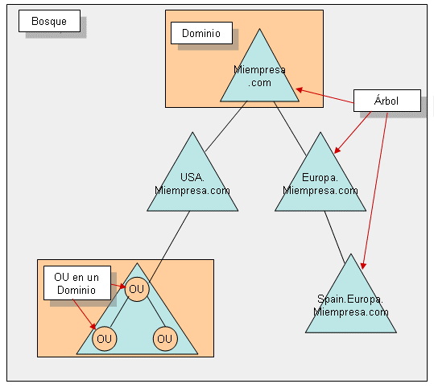
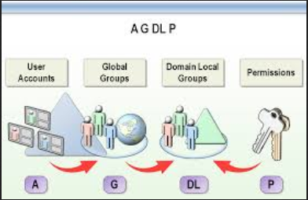
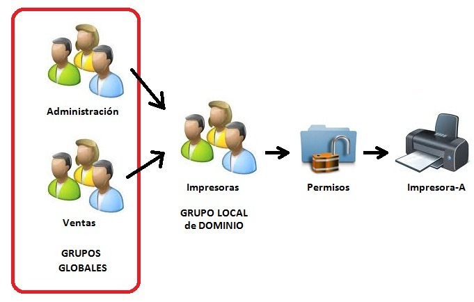
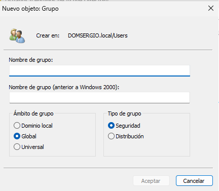
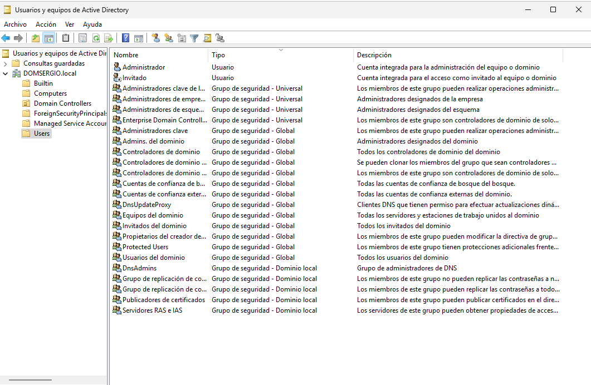
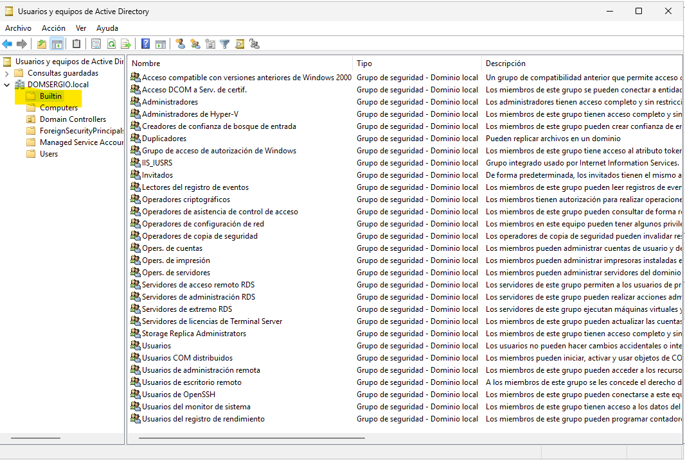

Al igual que existen cuentas de usuario del dominio, también se pueden crear **grupos** que se almacenan en el **Active Directory (AD)** y son visibles desde todos los equipos del dominio. Los grupos permiten simplificar la administración del sistema, ya que facilitan la asignación de permisos y derechos de forma colectiva.

## Tipos de grupos en Active Directory

En el directorio pueden definirse dos tipos de grupos:

- **Grupos de distribución**: utilizados para funciones de comunicación, como listas de correo electrónico. No se emplean para asignar permisos.
- **Grupos de seguridad**: utilizados para conceder permisos y derechos sobre recursos. Son los que se utilizan con fines administrativos.

A partir de este punto, nos referiremos exclusivamente a los **grupos de seguridad**.

## Ámbitos de los grupos de seguridad

En entornos Windows Server, los grupos de seguridad pueden tener tres ámbitos distintos:

### Grupos locales del dominio

- Se crean dentro de un dominio y son visibles únicamente en ese dominio.
- Se utilizan para asignar permisos sobre recursos del dominio.
- Pueden incluir:
  - Usuarios del mismo o de otros dominios.
  - Grupos globales de cualquier dominio del bosque.
  - Grupos locales del mismo dominio.
- Son los grupos más utilizados en la administración de recursos.

### Grupos globales

- Son visibles en cualquier dominio del bosque.
- Permiten asignar permisos sobre recursos de cualquier dominio.
- Sus miembros deben pertenecer al dominio en el que se crea el grupo.
- Se utilizan para clasificar usuarios según sus funciones (por ejemplo, `Informáticos`, `Contabilidad`, etc.).

### Grupos universales

- Son visibles en todo el bosque.
- Pueden incluir usuarios y grupos de cualquier dominio.
- Permiten asignar permisos sobre recursos de cualquier dominio.
- Se recomienda limitar su uso por razones de eficiencia, ya que su replicación puede afectar al rendimiento.

### Grupos locales en equipos miembro

En los equipos que forman parte de un dominio también pueden definirse **grupos locales**. Estos grupos pueden incluir:

- Cuentas de usuario locales.
- Usuarios y grupos globales de cualquier dominio del bosque.
- Grupos universales.

Un grupo local no puede ser miembro de otro grupo local. Estos grupos se utilizan para conceder permisos sobre recursos locales del equipo en el que se crean.

<figure markdown="span" align="center">
  { width="70%"}
  <figcaption>Estructura de un Bosque de Active Directory</figcaption>
</figure>

## Integración automática de grupos

Cuando un equipo se une a un dominio:

- El grupo global **Administradores del dominio** se incluye automáticamente en el grupo local **Administradores** del equipo.
- El grupo global **Usuarios del dominio** se incluye en el grupo local **Usuarios**.

Esto garantiza que los administradores y usuarios del dominio tengan los mismos derechos que los definidos localmente en cada equipo.

## Estrategia recomendada de organización: AGDLP

Microsoft recomienda la estrategia **AGDLP**, especialmente en entornos con un único dominio. Esta sigla representa:

- **A**ccounts (cuentas de usuario)
- **G**lobal groups (grupos globales)
- **D**omain **L**ocal groups (grupos locales de dominio)
- **P**ermissions (permisos)

<figure markdown="span" align="center">
  { width="70%"}
  <figcaption>AGDLP</figcaption>
</figure>


### Pasos para aplicar AGDLP

1. Identificar los tipos de usuarios (por ejemplo, empleados del departamento de informática).
2. Crear un grupo global para agruparlos (por ejemplo, `Informáticos`).
3. Determinar si se puede usar un grupo integrado o si es necesario crear un grupo local de dominio (por ejemplo, `Usuarios de impresora`).
4. Añadir el grupo global `Informáticos` al grupo local de dominio `Usuarios de impresora`.
5. Asignar permisos sobre el recurso (por ejemplo, una impresora) al grupo `Usuarios de impresora`.


<figure markdown="span" align="center">
  { width="70%"}
  <figcaption>AGDLP Ejemplo</figcaption>
</figure>

### Reglas de inclusión entre grupos

- En un **grupo global** solo se pueden incluir **grupos globales del mismo dominio**. No se pueden incluir **grupos local**es.
- En un **grupo local de dominio** se pueden incluir:
    - Grupos globales de cualquier dominio.
    - Grupos locales del mismo dominio.

El anidamiento de grupos mejora la administración, pero si se utilizan muchos niveles, puede dificultar la comprensión de los permisos efectivos. Se recomienda mantener un único nivel de anidamiento.

---

## Operaciones con grupos

### Creación de grupos

Los grupos pueden crearse en cualquier contenedor del dominio. Por defecto, se crean en la OU `Users`, aunque es recomendable utilizar OU específicas.

Desde la consola:

```plaintext
Menú contextual del contenedor → Nuevo → Grupo
```

<figure markdown="span" align="center">
  { width="70%"}
  <figcaption>Creación de nuevo grupo</figcaption>
</figure>

Se debe especificar:

- Nombre del grupo.
- Ámbito (local, global o universal).
- Tipo (seguridad o distribución).

### Modificación de grupos

Desde el menú contextual del grupo → **Propiedades**, se pueden realizar las siguientes acciones:

- Cambiar el nombre o tipo del grupo.
- Añadir o quitar miembros (pestaña **Miembros**).
- Incluir el grupo en otros grupos (pestaña **Miembro de**).
- Asignar un administrador del grupo (pestaña **Administrado por**).

### Añadir miembros a un grupo

Existen dos métodos:

1. Desde las propiedades del grupo, en la pestaña **Miembros**.
2. Desde el menú contextual del objeto (usuario, equipo, grupo) → **Añadir a un grupo**.

### Otras operaciones

Las operaciones habituales con grupos incluyen:

- **Mover** un grupo a otro contenedor.
- **Eliminar** un grupo.
- **Copiar** un grupo para replicar su configuración.

Estas acciones se realizan de forma similar a las operaciones con cuentas de usuario.

---

## Usuarios y grupos predeterminados en Active Directory

Al instalar **Active Directory (AD)** en un entorno Windows Server, se crean automáticamente una serie de **usuarios y grupos predeterminados** dentro del contenedor `Users`. Estos objetos tienen funciones específicas dentro del dominio y están clasificados por tipo y ámbito: **grupos universales**, **grupos globales** y **grupos locales del dominio**.

### Usuarios predeterminados

Entre los usuarios creados por defecto destacan:

- **Administrador**:  
  Cuenta principal de administración del dominio. Tiene control total sobre todos los objetos y configuraciones. Es miembro de los grupos `Administradores`, `Administradores del dominio`, entre otros. Esta cuenta no puede eliminarse, aunque puede renombrarse o deshabilitarse.

- **Invitado**:  
  Cuenta destinada a usuarios sin cuenta en el dominio. Equivale a la cuenta de invitado en sistemas operativos cliente de Microsoft. Está deshabilitada por defecto por razones de seguridad.

<figure markdown="span" align="center">
  { width="80%"}
  <figcaption>Usuarios predeterminados en un dominio</figcaption>
</figure>


### Grupos globales y universales

- **Usuarios del dominio** (global):  
  Incluye todas las cuentas de usuario creadas en el dominio. Se utiliza para asignar permisos generales a todos los usuarios.

- **Administradores del dominio** (global):  
  Sus miembros tienen privilegios administrativos sobre el dominio, incluyendo la gestión de usuarios, grupos, políticas y recursos.

- **Administradores de empresa** (universal):  
  Grupo con privilegios para administrar cualquier dominio dentro del bosque. Su uso debe restringirse a tareas de administración global.

### Grupos integrados (carpeta Built-in)

<figure markdown="span" align="center">
  { width="80%"}
  <figcaption>Usuarios predeterminados en un dominio</figcaption>
</figure>

Además de los grupos en `Users`, se crean **grupos locales del dominio** en la carpeta `Built-in`, conocidos como **grupos integrados**. Estos grupos están diseñados para tareas administrativas específicas:

- **Administradores**:  
  Administran el controlador de dominio.

- **Operadores de copias de seguridad**:  
  Pueden realizar copias de seguridad y restaurar archivos, incluso si no tienen permisos explícitos sobre los archivos.

- **Operadores de cuenta**:  
  Gestionan cuentas de usuario, grupos y equipos, pero no pueden modificar miembros de grupos administrativos.

- **Operadores de impresión**:  
  Configuran y administran impresoras en el dominio.

- **Operadores de servidor**:  
  Pueden crear carpetas compartidas y realizar tareas de mantenimiento en el servidor.

- **Usuarios**:  
  Grupo con permisos limitados para evitar cambios accidentales en el sistema. Permite ejecutar la mayoría de aplicaciones. Incluye al grupo global `Usuarios del dominio`.


### Identidades especiales (grupos del sistema)

Además de los usuarios y grupos, el sistema crea **identidades especiales** que pueden utilizarse para asignar permisos. Estas no son cuentas reales, pero representan conjuntos de usuarios en determinadas condiciones:

- **Todos**:  
  Incluye todos los usuarios, incluso los no autenticados. Su uso debe evitarse por motivos de seguridad.

- **Usuarios autenticados**:  
  Incluye únicamente a los usuarios que han iniciado sesión con credenciales válidas. Es más seguro que el grupo `Todos`.

- **Usuarios de Terminal Server**:  
  Representa a los usuarios que han iniciado sesión mediante servicios de Terminal Server.

- **Propietario (Creator Owner)**:  
  Usuario que creó o posee el objeto. Se utiliza para asignar permisos dinámicos.

- **Grupo creador (Creator Group)**:  
  Grupo que creó o posee el objeto. Útil en entornos donde los permisos se heredan por grupo.

### Asignación de permisos

Al asignar permisos sobre un objeto (archivo, carpeta, impresora, etc.), se puede hacer:

- A usuarios específicos.
- A grupos de seguridad.
- A identidades especiales del sistema.

Esta flexibilidad permite una administración granular y segura de los recursos del dominio.

