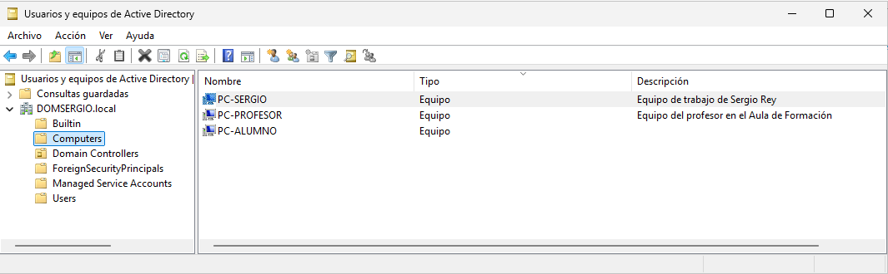
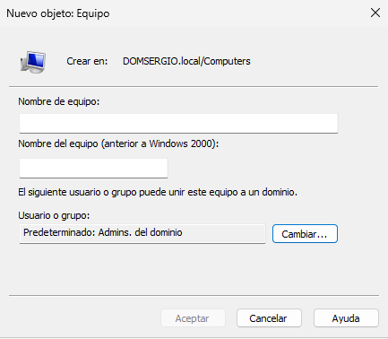

Además de almacenar información sobre usuarios y grupos, **Active Directory (AD)** también gestiona cuentas de equipo. Estas cuentas representan dispositivos físicos o virtuales que forman parte del dominio y desde los cuales los usuarios pueden iniciar sesión.

Cada objeto en AD —usuarios, grupos y equipos— posee un **identificador único (SID)** que se utiliza para asignar permisos y derechos sobre recursos.

<figure markdown="span" align="center">
  { width="70%"}
  <figcaption>Equipos dados de alta en un dominio</figcaption>
</figure>


## Cuentas de equipo en el dominio

Las cuentas de equipo permiten:

- Autenticar el equipo dentro del dominio.
- Asignar permisos y derechos específicos al equipo.
- Controlar el acceso a recursos compartidos.

Por defecto, las cuentas de equipo se almacenan en dos contenedores:

- **Domain Controllers**: contiene las cuentas de los controladores de dominio (DC), tanto principales como secundarios.
- **Computers**: almacena las cuentas de los equipos cliente y servidores miembro del dominio.

No obstante, estas cuentas pueden moverse a otras **Unidades Organizativas (OU)** para facilitar su administración.

## Creación de una cuenta de equipo

Normalmente, las cuentas de equipo se crean automáticamente al unir un equipo al dominio. Sin embargo, también pueden crearse manualmente desde la consola **Usuarios y Equipos de Active Directory**:

```plaintext
Menú contextual del contenedor → Nuevo → Equipo
```

<figure markdown="span" align="center">
  { width="50%"}
  <figcaption>Equipos dados de alta en un dominio</figcaption>
</figure>

## Modificación de una cuenta de equipo

Desde el menú contextual del equipo → **Propiedades**, se puede acceder a diversas pestañas con información editable:

- **General**: nombre del equipo, tipo (DC o no), ubicación y descripción.
- **Sistema operativo**: versión, edición y último Service Pack instalado.
- **Miembro de**: grupos a los que pertenece el equipo (por defecto, `Equipos del dominio`).
- **Delegación**: configuración de servicios delegados.
- **Ubicación**: ubicación física o lógica del equipo.
- **Administrado por**: usuario o grupo responsable de su gestión.
- **Marcado**: configuración de acceso telefónico si está habilitado.

Si se activa la opción **Características avanzadas** en el menú Ver, se muestran pestañas adicionales con información técnica más detallada.

## Otras operaciones con cuentas de equipo

### Mover una cuenta de equipo

Para reorganizar los equipos dentro del dominio, se puede mover una cuenta a otra OU:

```plaintext
Menú contextual del equipo → Mover
```

### Deshabilitar una cuenta de equipo

Deshabilitar una cuenta impide que los usuarios puedan iniciar sesión en el dominio desde ese equipo. Se utiliza en casos de mantenimiento, infección por malware o fallos críticos.

```plaintext
Menú contextual del equipo → Deshabilitar equipo
```

Para volver a habilitarlo:

```plaintext
Menú contextual del equipo → Habilitar equipo
```

### Restablecer una cuenta de equipo

Si un equipo pierde la sincronización de su contraseña interna con el controlador de dominio, no podrá iniciar sesión. Para solucionarlo:

```plaintext
Menú contextual del equipo → Restablecer cuenta
```

En el caso de servidores, se recomienda utilizar la línea de comandos:

```plaintext
netdom resetpwd /s:NombreEquipo /ud:DOMINIO\Usuario /p:Contraseña
```

Más información en [este artículo técnico sobre restablecimiento de cuentas de equipo](https://1gbdeinformacion.blogspot.com/2014/01/restablecer-cuenta-de-equipo-error-en.html).

### Eliminar una cuenta de equipo

La eliminación de una cuenta es irreversible y supone que el equipo deja de pertenecer al dominio:

```plaintext
Menú contextual del equipo → Eliminar
```

Sin embargo, lo más adecuado es **reconfigurar el equipo** para que se una a otro dominio o grupo de trabajo. En ese caso, su cuenta en el dominio se elimina automáticamente.

## Administración remota de equipos

Desde Active Directory es posible administrar equipos de forma remota. Para ello, el usuario debe pertenecer a uno de los siguientes grupos:

- Administradores del dominio
- Operadores de cuentas
- Administradores de empresa

Además, se debe habilitar la administración remota en el **Firewall de Windows** del equipo a gestionar. En la pestaña **Excepciones**, se debe activar la opción **Administración remota**.

