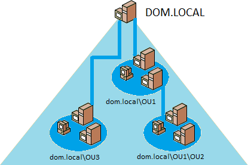
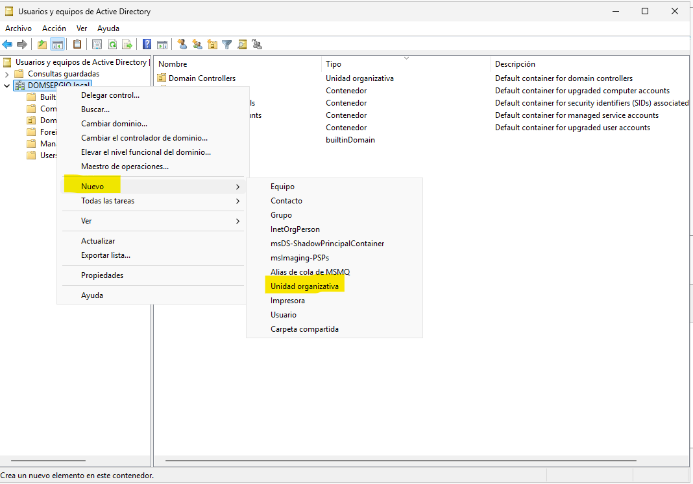
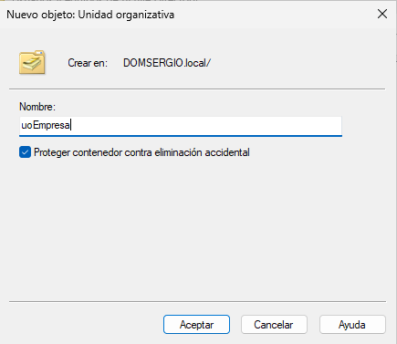
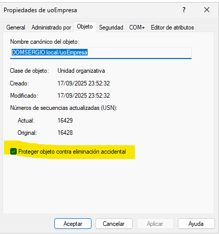

Una **Unidad Organizativa (OU)** —también denominada departamento— es un objeto del **Directorio Activo (Active Directory)** que actúa como contenedor lógico. Puede albergar otros objetos del directorio, como:

- Cuentas de usuario  
- Grupos de seguridad  
- Equipos del dominio  
- Recursos compartidos  
- Impresoras compartidas  
- Otras unidades organizativas

Este diseño permite establecer una jerarquía estructurada de objetos, similar a la organización de carpetas en un sistema de archivos. Los objetos contenidos en una OU pueden moverse posteriormente a otra sin pérdida de funcionalidad.

## Finalidad de las Unidades Organizativas

El objetivo principal de las OU es **organizar los objetos del directorio de forma coherente**, facilitando su administración. Lo más habitual es reflejar la estructura organizativa de la entidad (departamentos, sedes, áreas funcionales, etc.).

<figure markdown="span" align="center">
  { width="80%"}
  <figcaption>Unidades Organizativas</figcaption>
</figure>

Las OU permiten:

- **Delegar la administración**: Cada OU puede gestionarse de forma independiente. Es posible asignar privilegios administrativos sobre una OU a usuarios o grupos específicos.
- **Aplicar políticas de grupo (GPO)**: Las OU permiten vincular directivas que configuran el comportamiento de los usuarios y equipos que contienen. Por ejemplo, se puede impedir el acceso al Panel de control a los usuarios de la OU `Alumnos`.

!!!Nota

    También es posible aplicar *GPO* directamente a grupos, sin necesidad de crear OU específicas para cada caso.

## Modelo de dominio único

En organizaciones pequeñas o medianas, se suele implementar un **modelo de dominio único** con múltiples OU. La creación de varios dominios solo se justifica si:

- La organización está descentralizada y requiere administradores distintos para cada área.
- Existen segmentos de red con **conexiones lentas**, lo que dificulta la replicación entre controladores de dominio.


## Operaciones con Unidades Organizativas

### Crear una Unidad Organizativa
Desde la consola **Usuarios y Equipos de Active Directory**:


<figure markdown="span" align="center">
  { width="80%"}
  <figcaption>Menú para crear Unidades Organizativas</figcaption>
</figure>

1. Ubicarse en el contenedor deseado (dominio o OU existente).
2. Menú contextual → **Nuevo → Unidad Organizativa**.
3. Introducir el nombre de la OU.
4. Opcional: marcar la casilla **Proteger contenedor contra eliminación accidental**. Cuidado porque si esta opción se marca no se podrá eliminar la Unidad Organizativa, a no ser que se acceda a un menú extendido y se habilite su eliminación. Por otra parte, se debe tener cuidado ya que si se elimina una Unidad Organizativa se borrarán todos los elementos que contenga.

<figure markdown="span" align="center">
  { width="70%"}
  <figcaption>Crear Unidades Organizativas</figcaption>
</figure>

## Mover una Unidad Organizativa

Para trasladar una OU a otro contenedor dentro del mismo dominio:

```plaintext
Menú contextual de la OU → Mover
```

Seleccionar el nuevo contenedor (normalmente otra OU).

## Eliminar una Unidad Organizativa

Por defecto, las OU se crean con protección contra eliminación accidental. Para eliminar una OU:

1. Activar **Características avanzadas** en el menú Ver.
2. Menú contextual de la OU → **Propiedades**.
3. Pestaña **Objeto** → desmarcar la opción *Proteger objeto contra eliminación accidental*.
4. Menú contextual → **Eliminar**.

<figure markdown="span" align="center">
  { width="70%"}
  <figcaption>Eliminar Unidades Organizativas</figcaption>
</figure>


## Delegar la administración de una OU

Active Directory permite delegar el control de una OU a usuarios o grupos no administradores del dominio:

1. Menú contextual de la OU → **Delegar control**.
2. Asistente de delegación:
   - Seleccionar usuarios o grupos (preferiblemente grupos por facilidad de mantenimiento).
   - Elegir las tareas a delegar (crear usuarios, modificar contraseñas, administrar grupos, etc.).
3. Confirmar el resumen y finalizar el asistente.

Más información en :   
- [Crear una OU en Windows Server 2019 – SomeBooks](https://somebooks.es/crear-una-unidad-organizativa-en-la-interfaz-grafica-de-windows-server-2019-y-asignarle-contenido/)
