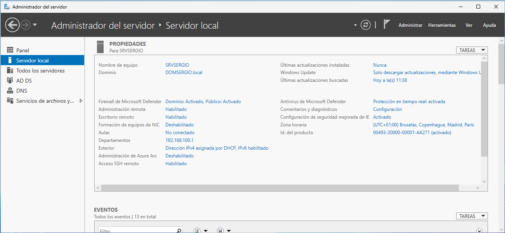
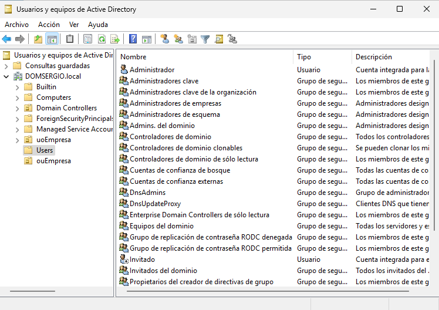
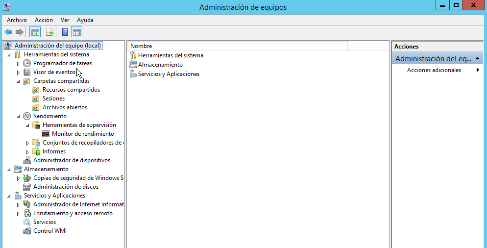
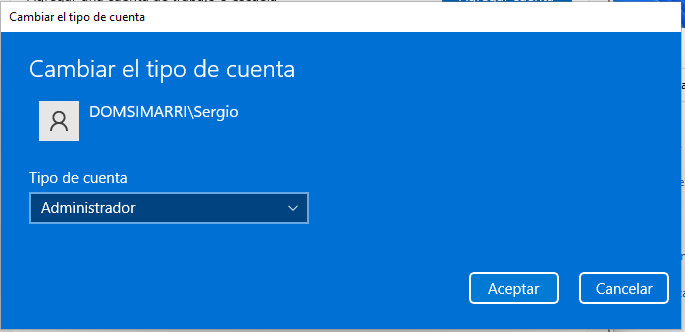
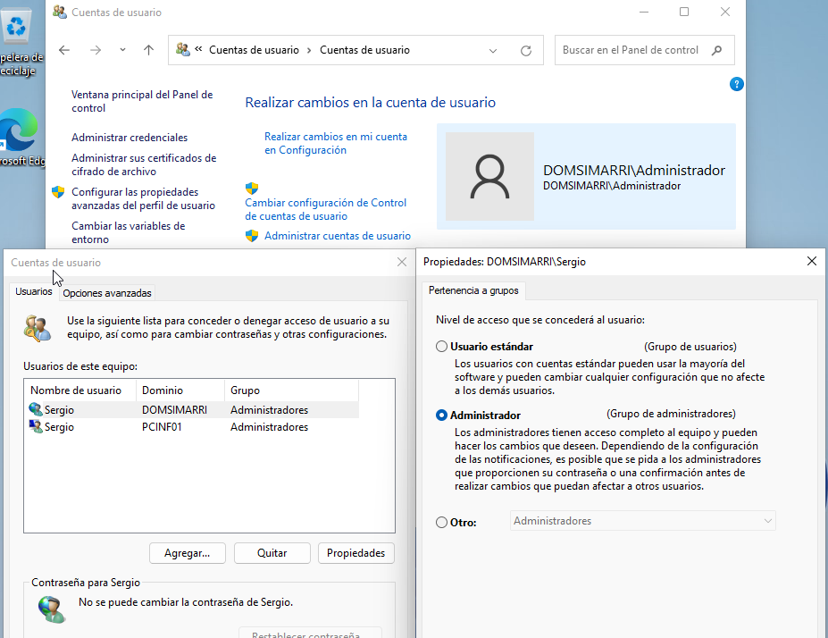
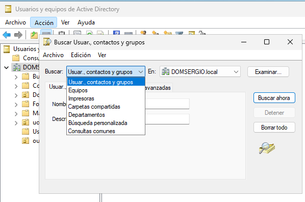
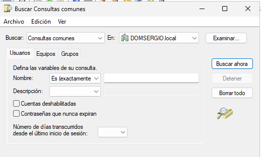
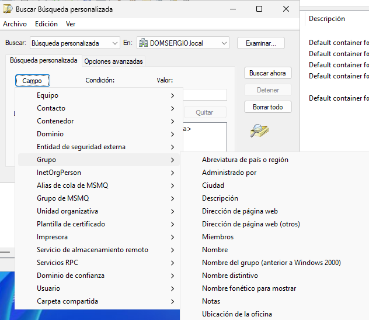

En esta sección se describen brevemente las herramientas más utilizadas para la administración de un dominio y sus servidores en entornos Windows Server. Estas herramientas permiten gestionar usuarios, equipos, roles, servicios y recursos del sistema de forma centralizada.


## Administrador del servidor

El **Administrador del servidor** es la consola principal de administración en Windows Server. Se abre automáticamente al iniciar sesión y proporciona acceso a la mayoría de herramientas del sistema.

<figure markdown="span" align="center">
  { width="90%"}
  <figcaption>Administrador del Servidor</figcaption>
</figure>

Funciones destacadas;

- **Servidor local**: vista general del estado del servidor, incluyendo:
    - Configuración básica (nombre, IP, dominio, etc.)
    - Eventos recientes registrados
    - Servicios en ejecución
    - Rendimiento del sistema
    - Roles y características instaladas

- **Menú lateral**: permite administrar:
    - Otros servidores del dominio (si existen)
    - Roles instalados (AD DS, DNS, IIS, etc.)
    - Grupos de servidores

!!!tip "Administrador del servidor"

    Esta herramienta es esencial para supervisar el estado del servidor y realizar tareas administrativas de forma centralizada.


## Usuarios y equipos de Active Directory

Ya hemos visto anteriormente esta herramienta:

<figure markdown="span" align="center">
  { width="70%"}
  <figcaption>Usuarios y Equipos de Active Directory</figcaption>
</figure>

La herramienta **Usuarios y equipos de Active Directory (ADUC)** es la más utilizada para administrar los objetos del dominio:

- Cuentas de usuario
- Grupos de seguridad
- Equipos del dominio
- Unidades organizativas (OU)

Las **funciones clave** que podemos realizar son: 

- Crear, modificar y eliminar objetos del dominio
- Delegar administración sobre OU
- Establecer membresías de grupo
- Aplicar políticas de grupo (GPO) por contenedor

**ADUC** es fundamental para la gestión de identidades y la organización lógica del dominio.


## Administración de equipos

Disponible en todas las versiones de Windows (cliente y servidor), la herramienta **Administración de equipos** permite gestionar múltiples aspectos del sistema local.

<figure markdown="span" align="center">
  { width="80%"}
  <figcaption>Administración de equipos</figcaption>
</figure>

Las herramientas incluidas dentro de este administrador son:

- **Programador de tareas**: automatiza la ejecución de tareas en horarios definidos.
- **Visor de eventos**: registra eventos del sistema, seguridad y aplicaciones.
- **Carpetas compartidas**: muestra recursos compartidos y usuarios conectados.
- **Monitor de rendimiento**: analiza el uso de CPU, RAM, disco y red.
- **Administrador de dispositivos**: gestiona el hardware instalado.
- **Administrador de discos**: permite crear, formatear y gestionar particiones.
- **Herramientas de roles**: acceso a consolas específicas como IIS, Enrutamiento y acceso remoto, etc.

Esta herramienta es útil tanto para la administración local como para el diagnóstico y mantenimiento del sistema.


Gracias, Sergio. Aquí tienes el contenido revisado y estructurado en formato Markdown para documentación técnica, ideal para tus clases de administración de sistemas en 2º SMR. He mejorado la redacción, añadido contexto técnico y mantenido la claridad pedagógica.


## Cambiar el nivel de acceso de un usuario en un equipo local

Aunque esta herramienta o truco se refiere más bien a equipos cliente, en determinados casos, un usuario del dominio sin privilegios administrativos puede necesitar permisos elevados en un equipo concreto. Esto puede deberse a tareas como:

- Administración del equipo local  
- **Instalación de software**  
- Acceso a configuraciones avanzadas del sistema  
- Modificación del registro (***regedit***) por parte del usuario o algún programa que utilice.


### Procedimiento para otorgar permisos de administrador local

El proceso es similar al de convertir un usuario local en administrador, con la diferencia de que se debe especificar que el usuario pertenece al **dominio**.

### Pasos desde la interfaz gráfica

Hay muchos tutoriales en internet que te permiten realiza esta acción, como puedes ver en [Solvetic](https://www.solvetic.com/tutoriales/article/3376-crear-activar-administrador-super-windows-10/).

No obstante aquí tienes los pasos a realizar:

1. Abrir el **Panel de control** → Cuentas de usuario → Administrar cuentas de usuario.
2. Seleccionar el usuario que se desea modificar.
3. Pulsar en **Cambiar tipo de cuenta**.
4. Elegir **Administrador** como nuevo nivel de acceso.
5. Confirmar los cambios.

<figure markdown="span" align="center">
  { width="60%"}
  <figcaption>Selección de rol de Administrador para equipo locql</figcaption>
</figure>

Lo único que nos quedaría sería revisar que se han aplicado los cambios:

<figure markdown="span" align="center">
  { width="80%"}
  <figcaption>Cuenta de dominio como Administrador para equipo locql</figcaption>
</figure>


!!!nota "Usuarios de dominio en equipo local"
    Para usuarios del dominio, se debe indicar el nombre completo de inicio de sesión en formato:
    ```
    DOMINIO\nombre_usuario
    ```

### Alternativa desde la consola

También se puede añadir el usuario al grupo de administradores locales mediante línea de comandos:

```powershell
net localgroup Administradores DOMINIO\nombre_usuario /add
```

- `Administradores`: nombre del grupo local (puede variar según idioma del sistema).
- `DOMINIO\nombre_usuario`: nombre de usuario con prefijo de dominio.

### Consideraciones de seguridad

- Este cambio **no afecta al nivel de acceso en el dominio**, solo en el equipo local.
- Se recomienda aplicar esta modificación solo cuando sea estrictamente necesario.
- Para entornos educativos o corporativos, conviene documentar cada cambio y justificarlo.


- **Resultado esperado**

- En `PerfMovil`:
    - `profe1` → carpeta con **Control total** para `profe1`
    - `profe2` → carpeta con **Control total** para `profe2`

- En `CarpPart`:
  
    - Cada usuario (`profe1`, `profe2`, `alum1`, `alum2`) tiene su carpeta con:

        - **Control total** para el usuario propietario
        - **Control total** para los administradores


## Buscador en Active Directory

No es una herramienta administrativa como tal, pero el buscador es un elemento esencial en cualquier sistema, sobre todo a medida que el número de objetos en Active Directory (usuarios, equipos, grupos, etc.) crece, localizar elementos específicos se vuelve más complejo. Para facilitar esta tarea, la consola de **Usuarios y Equipos de Active Directory** incluye una herramienta de búsqueda avanzada que permite filtrar y localizar objetos de forma eficiente.

El buscador se puede abrir desde:

- El menú **Acción** de la consola.
- El menú contextual de cualquier contenedor (unidad organizativa o raíz del dominio).


<figure markdown="span" align="center">
  { width="70%"}
  <figcaption>Opciones de búsqueda</figcaption>
</figure>

Al abrir el buscador, se presenta un desplegable llamado **Buscar**, donde se puede especificar el tipo de objeto que se desea localizar:

- Usuarios (incluye grupos y contactos)
- Equipos
- Impresoras
- Carpetas compartidas
- Departamentos
- Búsqueda personalizada
- Consultas comunes

Cada tipo de búsqueda activa criterios específicos adaptados al tipo de objeto seleccionado.

Por ejemploe en **Consultas comunes** tenemos:

<figure markdown="span" align="center">
  { width="70%"}
  <figcaption>Busquedas. Consultas comunes</figcaption>
</figure>

Esta opción muestra una interfaz simplificada con los criterios más habituales para buscar:

  - Usuarios por nombre, descripción o grupo
  - Equipos por nombre o sistema operativo
  - Grupos por tipo o membresía

Es útil para búsquedas rápidas y frecuentes.

O las **Búsqueda personalizada** que permiten realizar búsquedas más detalladas utilizando cualquier atributo del objeto. Por ejemplo:

- Buscar usuarios por dirección de correo electrónico
- Filtrar equipos por versión de sistema operativo
- Localizar grupos por descripción o tipo de seguridad

<figure markdown="span" align="center">
  { width="80%"}
  <figcaption>Busquedas. Consultas personalizadas</figcaption>
</figure>

Esta opción es especialmente útil en entornos grandes o cuando se necesita precisión.

Todas estas opciones tienen su **Ámbito de búsqueda** mediante el desplegable **En**, se puede definir el contenedor donde se realizará la búsqueda:

- Todo el dominio
- Una unidad organizativa específica
- Un contenedor concreto

> Limitar el ámbito de búsqueda puede mejorar el rendimiento y la relevancia de los resultados.

