En el entorno Windows, un **perfil de usuario** es el conjunto de configuraciones, archivos y preferencias que definen el entorno de trabajo personalizado de cada usuario cuando inicia sesión en el sistema. Este perfil incluye elementos como el fondo de escritorio, la configuración de la barra de tareas, los accesos directos del menú Inicio, las opciones de accesibilidad, las preferencias de las aplicaciones y los documentos personales.

## Perfiles de usuario en entornos de dominio

En un entorno de dominio, cada usuario tiene un perfil que define su entorno de trabajo: configuración del escritorio, barra de tareas, menú Inicio, documentos personales, preferencias de aplicaciones, entre otros. Este perfil se crea y almacena en el equipo donde el usuario inicia sesión, pero puede gestionarse de forma más avanzada si se configura como perfil de red.

### Perfil local

El perfil local se genera automáticamente la primera vez que un usuario inicia sesión en un equipo. Se guarda en el disco local, concretamente en la ruta `C:\Usuarios\nombre_usuario`, y contiene todos los datos y configuraciones personales del usuario en ese equipo.

<figure markdown="span" align="center">
  { width="70%"}
  <figcaption>Perfiles de usuarios</figcaption>
</figure>

Este tipo de perfil tiene las siguientes características:

- Es exclusivo del equipo donde se ha creado.
- Los cambios realizados por el usuario (como fondo de escritorio o accesos directos) se conservan solo en ese equipo.
- Si el mismo usuario inicia sesión en otro equipo del dominio, se generará un nuevo perfil local independiente, sin sincronización entre ellos.

Esto puede generar inconsistencias en el entorno de trabajo del usuario, especialmente si utiliza varios equipos.

### Perfil de red

Para solucionar este problema, se puede configurar un perfil de red. En este caso, el perfil del usuario se almacena en un servidor del dominio (normalmente el controlador de dominio) y se sincroniza automáticamente con cualquier equipo desde el que el usuario inicie sesión.

Las ventajas del perfil de red son:

- El entorno de trabajo del usuario se mantiene coherente en todos los equipos del dominio.
- Los cambios realizados se guardan en el servidor y se aplican en futuras sesiones, independientemente del equipo utilizado.
- Se mejora la experiencia del usuario móvil, que puede trabajar desde distintos equipos sin perder personalización ni documentos.

Además de los perfiles locales y de red, existe un tercer tipo: el perfil temporal. Este se crea cuando, por alguna razón, no se puede cargar el perfil de red. El perfil temporal se elimina al cerrar la sesión, por lo que cualquier cambio realizado durante esa sesión se pierde.

En entornos Windows con Active Directory, los perfiles de red permiten que los usuarios mantengan su entorno personalizado al iniciar sesión desde cualquier equipo del dominio. Existen tres variantes principales:

| Tipo de perfil        | Descripción                                                                 |
|-----------------------|------------------------------------------------------------------------------|
| **Móvil**             | El usuario puede modificar su perfil. Los cambios se guardan en el servidor. |
| **Obligatorio**       | El usuario no puede guardar cambios. Siempre se carga el perfil original.    |
| **Superobligatorio**  | Igual que el obligatorio, pero si no se puede cargar el perfil, no se permite iniciar sesión. |

Estas variantes permiten adaptar el comportamiento del perfil según el nivel de control que se desee aplicar sobre la experiencia del usuario.

!!!note "perfil móvil"

    Aunque se distinguen tres tipos, en la práctica se suele usar el término “perfil móvil” para referirse a cualquiera de ellos.

El funcionamiento de los perfiles móviles se puede desglosar en comportamiento dependiendo de estado del usuario: 

1. **Inicio de sesión**:  
   Cuando el usuario inicia sesión en un equipo del dominio, el sistema copia su perfil desde el servidor (normalmente el controlador de dominio) al equipo local. Esto incluye configuraciones personales, documentos, accesos directos, fondo de escritorio, etc.

2. **Durante la sesión**:  
   El usuario puede modificar libremente su entorno: cambiar el fondo, reorganizar iconos, guardar archivos en sus carpetas personales, etc. Todos estos cambios se realizan sobre la copia local del perfil.

3. **Cierre de sesión**:  
   Al cerrar sesión, el sistema sincroniza los cambios realizados en el perfil local de vuelta al servidor. De este modo, el perfil actualizado queda almacenado centralmente.

4. **Sesiones futuras**:  
   En el siguiente inicio de sesión, ya sea en el mismo equipo o en otro distinto del dominio, el perfil se descargará desde el servidor con todos los cambios aplicados previamente.


!!!Warming "perfil temporal"
  
    Si el perfil no puede cargarse, porque esta mal configurad, problemas de permisos o de red, se genera un **perfil temporal**, que se elimina al cerrar sesión.


## Creación de perfiles móviles en Active Directory

A continuación se describe el procedimiento para configurar perfiles móviles en un entorno Windows Server con Active Directory.


**Paso 1:** Crear la carpeta de perfiles en el servidor

Primero se debe crear una carpeta donde vamos a guardar los perfiles de forma que se pueda acceder desde cualquier equipo perteneciente al dominio, por lo que debe ser una **carpeta compartida** de forma que el servidor que actuará como contenedor de todos los perfiles móviles. A esta carpeta le debemos aplicar unos permisos (que se explicarán en la siguiente sección) que permita acceder a esta carpeta.

- **Ruta sugerida**: `C:\AdminRed\Perfiles` compartida como `\\SRVSERGIO\Perfiles`
- **Permisos de compartición (SMB)**: acceso de **modificación** para todos los usuarios que vayan a tener perfil móvil.
- **Permisos NTFS (seguridad)**: también deben permitir **modificar** para los mismos usuarios.

Esta carpeta será el destino donde se almacenarán los datos de perfil de cada usuario.

<figure markdown="span" align="center">
  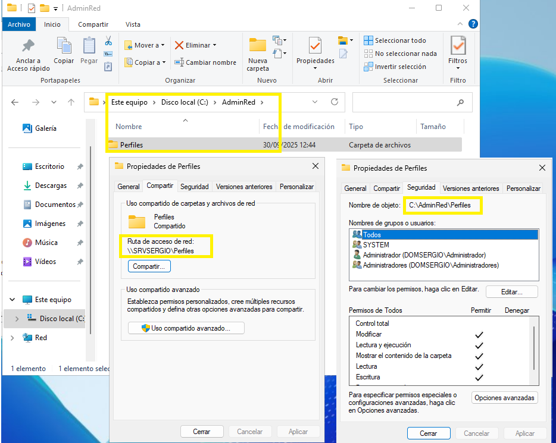{ width="70%"}
  <figcaption>Carpeta para compartir los perfiles</figcaption>
</figure>

**Paso 2:** Configurar la ruta del perfil en la cuenta de usuario

Desde la consola **Usuarios y Equipos de Active Directory**, se debe editar cada cuenta de usuario que vaya a tener perfil móvil:

1. Abrir las propiedades del usuario.
2. Ir a la pestaña **Perfil**.
3. En el campo *Ruta del perfil*, indicar la ruta UNC de la carpeta de perfiles seguida del nombre del usuario.

Ejemplo:

```plaintext
\\SRVSERGIO\Perfiles\alumno
```

O bien, usar la variable `%USERNAME%` para que se adapte automáticamente al nombre del usuario:

```plaintext
\\SRVSERGIO\Perfiles\%USERNAME%
```

<figure markdown="span" align="center">
  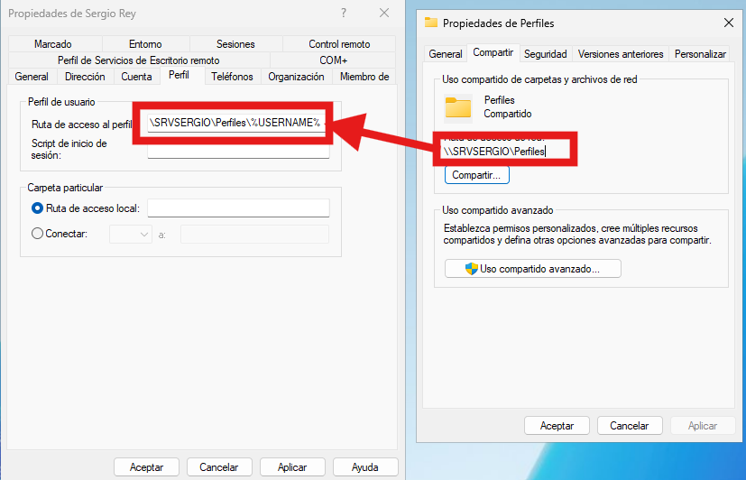{ width="70%"}
  <figcaption>Asignando la ruta del perfil</figcaption>
</figure>

Esta ruta será utilizada por el sistema para copiar el perfil al iniciar y cerrar sesión. Esta opción es muy útil cuando asignamos a varios usuarios su ruta de perfil, de forma que seleccionamos varios usuarios, indicamos la ruta usando la variabla `%USERNAME%` y a cada usuario se asignará su propio perfil con su nombre de usuario.


***Paso 3:*** Creación automática de carpetas según el sistema operativo

Cuando el usuario inicia sesión por primera vez en un equipo del dominio, el sistema crea una carpeta específica dentro de la carpeta de perfiles. 

<figure markdown="span" align="center">
  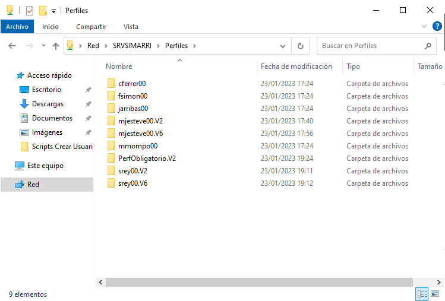{ width="80%"}
  <figcaption>Carpetas con diferentes perfiles</figcaption>
</figure>

El nombre de esta carpeta varía según el sistema operativo del equipo cliente:

| Sistema operativo cliente | Carpeta creada en el servidor                  |
|---------------------------|------------------------------------------------|
| Windows XP                | `\\SRVSERGIO\Perfiles\alumno`                 |
| Windows Vista / 7         | `\\SRVSERGIO\Perfiles\alumno.V2`              |
| Windows 8 / 10 / 11       | `\\SRVSERGIO\Perfiles\alumno.V6`              |

!!!danger "Importante:" 

    En la configuración del perfil en Active Directory **nunca se debe incluir la extensión `.V2`, `.V6`, etc.**. El sistema la añade automáticamente según el sistema operativo del cliente.

!!!nota "Creación de la carpeta del perfil en el servidor"

    La carpeta del perfil en el servidor se creará la **primera vez** que el usuario entre en el sistema en cualquier equipo. Hasta ese momento no se creará su perfil.

Consideraciones finales

- El perfil se copia del servidor al equipo al iniciar sesión, y se sincroniza de vuelta al servidor al cerrar sesión.
- Si el usuario utiliza equipos con diferentes versiones de Windows, se crearán carpetas de perfil separadas para cada versión.
- Esta configuración mejora la movilidad del usuario y facilita la administración centralizada de entornos de trabajo.


!!!example "Ejemplo práctico"

    El usuario del dominio `srey` tiene configurado su perfil como:

    ```plaintext
    \\SRVSERGIO\Perfiles\srey
    ```

    Al iniciar sesión en equipos con Windows 7 y Windows 10/11, se crean:

    - `\\SRVSERGIO\Perfiles\srey.V2` → perfil para Windows 7
    - `\\SRVSERGIO\Perfiles\srey.V6` → perfil para Windows 10/11

    Cada carpeta contiene configuraciones específicas del entorno según el sistema operativo.

## Creación de perfiles obligatorios en Active Directory

Los perfiles obligatorios permiten controlar el entorno de trabajo de los usuarios impidiendo que se guarden cambios entre sesiones. Son útiles en entornos donde se requiere una configuración fija, como aulas, laboratorios o puestos de atención al público.

Un **perfil obligatorio** es una variante del perfil móvil en la que los cambios realizados por el usuario no se guardan al cerrar sesión. Cada vez que el usuario inicia sesión, se carga el perfil original desde el servidor, garantizando un entorno limpio y controlado.

### Perfil obligatorio para un solo usuario

Configurar un perfil de red para un usuario del dominio de forma que su entorno no se modifique entre sesiones.

**Pasos a seguir**

1. **Iniciar sesión con el usuario**  
   El perfil se crea automáticamente en el servidor si el usuario tiene configurada una ruta de perfil móvil en su cuenta de Active Directory.

2. **Cerrar la sesión del usuario**  
   Es imprescindible que el usuario no esté conectado para modificar su perfil.

3. **Tomar control de la carpeta de perfil**  
   Por defecto, solo el usuario tiene acceso a su carpeta de perfil. Para modificarla:

    <figure markdown="span" align="center">
      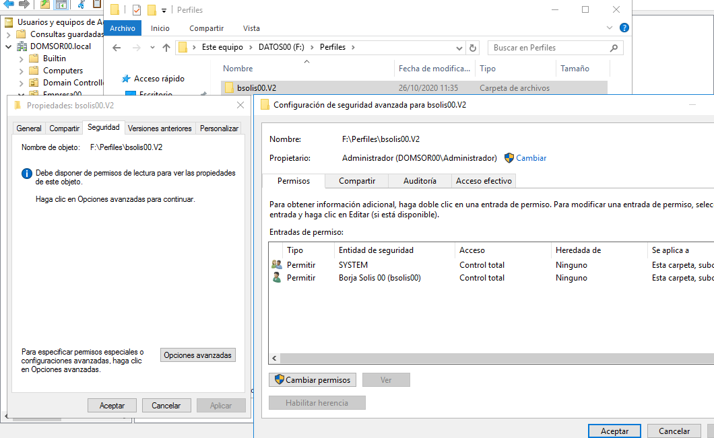{ width="80%"}
      <figcaption>Permisos de carpeta perfil</figcaption>
    </figure>

      - Ir a la carpeta del perfil en el servidor.
      - Menú contextual → Propiedades → Seguridad → Opciones avanzadas → Propietario → Editar.
      - Establecer como propietario el grupo **Administradores**.
      - Marcar la casilla **Reemplazar propietario en subcontenedores y objetos**.  
    <figure markdown="span" align="center">
      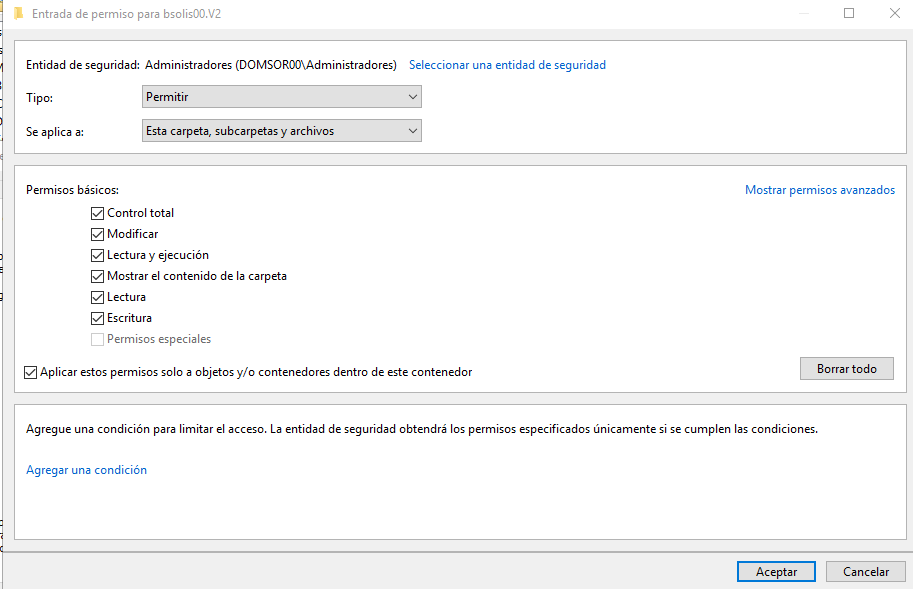{ width="80%"}
      <figcaption>Permisos de carpeta perfil</figcaption>
    </figure>


4. **Cambiar el nombre del archivo NTUSER.DAT**  
   Dentro de la carpeta del perfil, localizar el archivo oculto `NTUSER.DAT` y renombrarlo a `NTUSER.MAN`. Este cambio convierte el perfil en obligatorio. Los cambios del usuario ya no se guardarán.


!!!tip "Ver archivos ocultos y protegidos"

    Por defecto, WIndows oculta los archivos de sistema y los protegidos del sistema operativo, por lo que deberemos entrar en `Archivo -> Cambiar en opciones de carpeta y búsqueda` y dejar de ocultar estas opciones. 
    
    <figure markdown="span" align="center">
      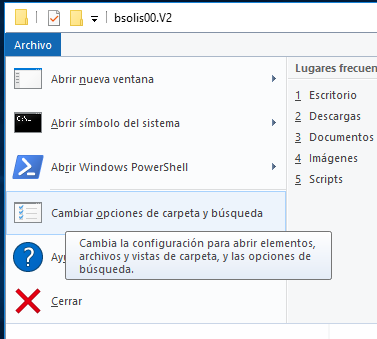{ width="30%"}  
      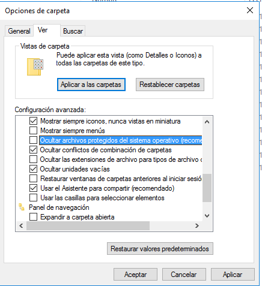{ width="40%"}
    </figure>

    También es interesante, mostrar las extensiones de los archivos.

Asegurarse de que el usuario y el grupo Administradores tienen **control total** sobre la carpeta y el archivo `NTUSER.MAN`.

<figure markdown="span" align="center">
  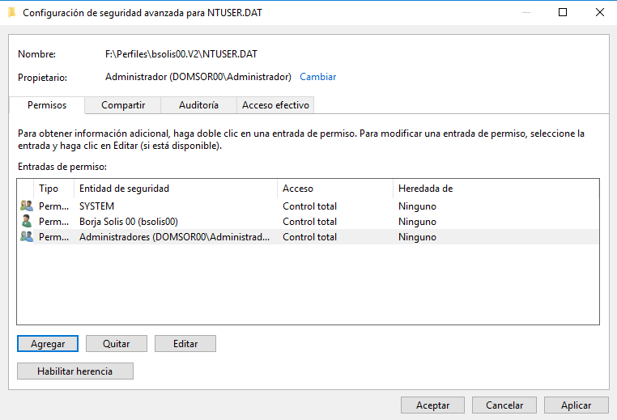{ width="80%"}
  <figcaption>Permisos de carpeta perfil</figcaption>
</figure>

**Comprobación en el cliente**: Al iniciar sesión, el usuario debe cargar su perfil obligatorio. Podemos comprobar se se han aplicado viendo las cuentas de perfil loca

<figure markdown="span" align="center">
  { width="60%"}
  <figcaption>Permisos perfiles locales</figcaption>
</figure>

Si hay errores, aparecerá un mensaje indicando que el perfil no se ha podido cargar correctamente.
<figure markdown="span" align="center">
  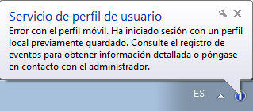{ width="80%"}
  <figcaption>Error al aplicar perfil obligatorio</figcaption>
</figure>


### Perfil obligatorio compartido para varios usuarios

Configurar un único perfil obligatorio que será utilizado por varios usuarios del dominio, ideal para entornos homogéneos.

Pasos a seguir:

1. **Iniciar sesión con la cuenta Administrador en un cliente**  para copiar el Perfil predeterminado en la carpeta del servidor donde queremos que esté el perfil obligatorio. Se usará el perfil predeterminado como base.

2. **Copiar el perfil predeterminado al servidor**
   
    - Abrir la ventana de perfiles de usuario (`Sistema → Configuración avanzada → Perfiles de usuario`).
    - Seleccionar el perfil predeterminado.
    - Pulsar **Copiar a…**.
    - Indicar la ruta de destino en el servidor, por ejemplo:

     ```
     \\SRVSERGIO\Perfiles\perfObligatorio.V6
     ```

    !!!nota "Recuerda qué son las extensiones `.v6`"

          La extensión `.V6` depende del sistema operativo del cliente:
          
          - Sin extensión en XP
          - `.V2` en Windows Vista / 7
          - `.V6` en Windows 8 / 10 / 11

   - En '`Está permitido usar`' tenemos que añadir el grupo al que pertenecen los usuarios que tendrán perfil obligatorio para que puedan acceder al perfil. Sólo se puede poner 1 grupo (si queremos que el perfil sea para más de un grupo crearemos un nuevo grupo que los englobe). Para añadir el grupo en la ventana de 'Seleccionar usuario o grupo' pondremos su nombre pero antes tenemos que pulsar el botón de Avanzados y en la ventana que se abre vamos a "Tipo de objetos" y marcamos la casilla de Grupos que por defecto está desmarcada. Ahora ya encontrará el grupo que queremos y lo seleccionaremos para permitir a sus miembros acceder en la carpeta en que se copiará el perfil.

      <figure markdown="span" align="center">
        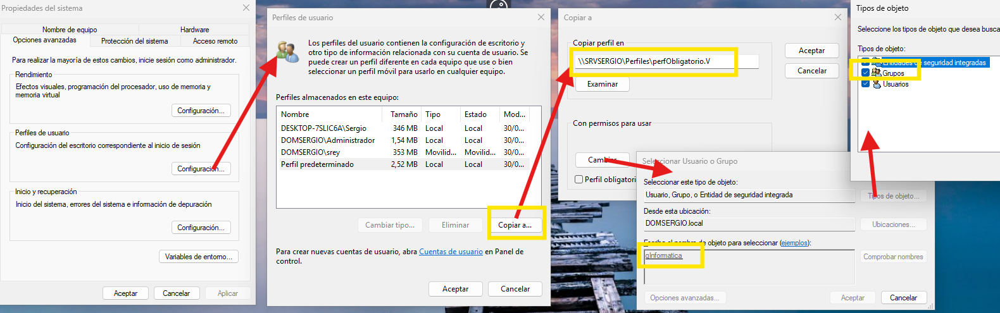{ width="100%"}
        <figcaption>Pasos de copia del perfil predeterminado</figcaption>
      </figure>

3. **Convertir el perfil en obligatorio**  
      - Ir a la carpeta del perfil en el servidor.
      - Cambiar el nombre del archivo `NTUSER.DAT` a `NTUSER.MAN`.

4. **Asignar el perfil a los usuarios**  
      - En Active Directory, editar las cuentas de usuario.
      - En la pestaña **Perfil**, indicar la ruta del perfil compartido:

      ```
      \\SRVSERGIO\Perfiles\perfObligatorio
      ```

    !!!warning "Recuerda no incluir `.V2` o `.V6`" 

        No incluir `.V2` o `.V6` en la ruta de perfil en AD. El sistema lo añade automáticamente según el cliente.

!!!nota "Compatibilidad con varios sistemas operativos"  

    Si queremos crear perfil obligatorio para más de un sistema operativo tendremos que repetir este proceso desde cada máquina con sistema diferente (por ejemplo lo hacemos desde un Windows 7 para crear el perfil obligatorio V2 y luego desde un Windows 10 para crear el V6 y así el usuario tendrá su perfil obligatorio tanto en máquinas Windows 7/Vista como en Windows 8/10/11.


### Script de inicio de sesión

En perfiles de red (móviles, obligatorios o superobligatorios), se puede configurar un script que se ejecute automáticamente al iniciar sesión.

- Crear un archivo `.BAT` con las instrucciones deseadas.
- Guardarlo en la carpeta compartida **NETLOGON**:

  ```
  C:\Windows\SYSVOL\SYSVOL\nombre_del_dominio\scripts
  ```

- El acceso debe ser desde el cliente, por lo que debe tener la forma `\\SRVSERGIO\NETLOGON\inicio`
- En la ficha de perfil del usuario, indicar el nombre del script (sin extensión `.BAT`).

<figure markdown="span" align="center">
  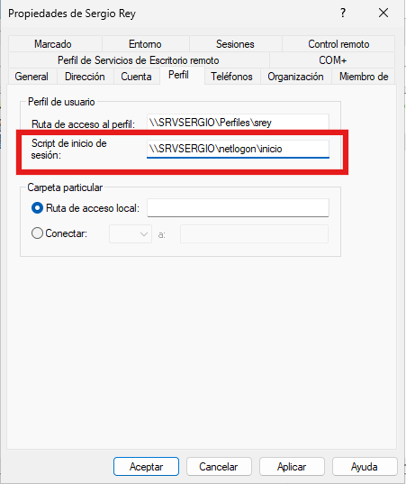{ width="70%"}
  <figcaption>Script inicio de sesión</figcaption>
</figure>

## Configuración de carpeta personal para usuarios móviles

En entornos de dominio, los usuarios móviles necesitan un espacio centralizado donde guardar sus archivos personales. Este espacio debe estar disponible desde cualquier equipo del dominio en el que inicien sesión, garantizando continuidad y accesibilidad.

La solución consiste en asignar a cada usuario una carpeta personal en el servidor, que se conecta automáticamente como una unidad de red al iniciar sesión. Esta carpeta aparece en el explorador de archivos como una unidad adicional, junto al disco duro y otras unidades locales.

Este lugar será una carpeta vacía en el servidor para que el usuario pueda guardar sus documentos. Además se puede conectar automáticamente a una unidad y, por tanto, al usuario le aparecerá como una unidad más en la ventana Equipo (junto al disco duro y el resto de unidades del equipo).

Al igual que para los perfiles primeramente tendremos que crear y compartir una carpeta en el servidor dentro de la cual Windows creará automáticamente las carpetas personales de los usuarios.

Esto se configura igual que los perfiles móviles en la pestaña Perfil de la cuenta del usuario, en la sección de Carpeta particular:

<figure markdown="span" align="center">
  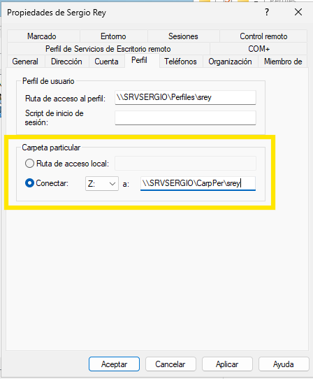{ width="60%"}
  <figcaption>Permisos perfiles locales</figcaption>
</figure>

Para la creación de carpetas personales tenemos opciones:

- **Conectar**: ​​es la opción que elegiremos normalmente. Elegimos la letra a la que se conectará automáticamente la unidad de red que contiene la carpeta personal del usuario y la ruta de esta carpeta (que como el caso de los perfiles acabará por %USERNAME% para que cada usuario tenga su propia carpeta).
- **Ruta de acceso local**: en vez de conectar la carpeta personal en una unidad de red se monta en una carpeta (como hace Linux).

La diferencia respecto a la carpeta de los perfiles es:

- La carpeta personal de cada usuario se crea en el momento en que se configura (por lo tanto la está creando el Administrador del dominio) mientras que la carpeta del perfil se crea la primera vez que el usuario inicia sesión (por tanto la crea el propio usuario). Esto es importante a la hora de asignar los permisos necesarios a las carpetas donde se crearán.
- Windows da a las 2 carpetas permiso de Control total al usuario propietario pero en la del perfil quita el resto de permisos mientras que en la carpeta personal hereda los permisos que haya establecidos en la carpeta

Una buena opción es compartir la carpeta donde se crearán las carpetas personales (y también la de los perfiles) de modo que esté oculta en examinar la red, lo que se hace compartiéndola con un nombre terminado en `$` (por ejemplo `Perfiles$`). Esto lo veremos más adelante.


## Permisos en carpetas de perfil de red y carpetas particulares

En entornos de dominio, es fundamental asignar correctamente los permisos NTFS y de compartición (SMB) a las carpetas que alojan perfiles y documentos de usuario. Los permisos varían según el tipo de carpeta y el comportamiento esperado.

Aunque **el tema siguiente de dedica a explicar y aplicar detalladamente los permisos** dentro en los recursos de un domino, adelantamos información que después debería ser recuperada, comprendida y aplicada de forma correcta.

Los tipos de carpetas y permisos recomendados son 

### Carpeta de perfil móvil

- **Función**: almacena el perfil de usuario que se sincroniza con el servidor al iniciar y cerrar sesión.
- **Creación**: la carpeta se crea automáticamente la primera vez que el usuario inicia sesión.
- **Permisos NTFS**:
  - Grupo de usuarios (ej. `gProfes`) → **Modificar** (para que puedan crear su carpeta).
  - Usuario propietario → **Control total** sobre su propia carpeta.
  - Administradores → sin acceso por defecto a las carpetas individuales.

### Carpeta de perfil obligatorio

- **Función**: contiene un perfil fijo que se carga en cada sesión sin guardar cambios.
- **Creación**: la carpeta se copia manualmente desde un cliente por el administrador.
- **Permisos NTFS**:
  - Grupo de usuarios (ej. `gAlumnos`) → **Lectura y ejecución**.
  - No se requiere modificar ni crear contenido.

### Carpeta particular

- **Función**: almacena documentos personales del usuario, accesibles desde cualquier equipo.
- **Creación**: la carpeta se crea al configurar la cuenta del usuario en Active Directory.
- **Permisos NTFS**:
  - Grupo de usuarios → **Lectura y ejecución**, pero **solo sobre la carpeta raíz**.
  - Para evitar que los usuarios vean las carpetas de otros, se debe aplicar el permiso con el alcance:  
    **"Sólo esta carpeta"** (no subcarpetas ni archivos).
  - Cada carpeta individual → **Control total** para el usuario propietario y los administradores.

!!!example "Ejemplo práctico"

    Supongamos los siguientes usuarios y grupos:

    - `profe1`, `profe2` → grupo `gProfes` → perfil móvil + carpeta particular
    - `alum1`, `alum2` → grupo `gAlumnos` → perfil obligatorio + carpeta particular

    Se crea una carpeta compartida en el servidor llamada `ManageMobileUsers`, con tres subcarpetas:

    ```
    \\SRVSERGIO\ManageMobileUsers
    ├── PerfMovil
    ├── PerfOblig
    └── CarpPart
    ```

### Permisos recomendados: 

- **Permisos NTFS**

| Carpeta               | Administradores         | gProfes                      | gAlumnos                     |
|-----------------------|-------------------------|------------------------------|------------------------------|
| ManageMobileUsers     | Control total           | Lectura y ejecución          | Lectura y ejecución          |
| PerfMovil             | Control total           | Modificar                    | —                            |
| PerfOblig             | Control total           | —                            | Lectura y ejecución          |
| CarpPart              | Control total           | Lectura y ejecución (solo raíz) | Lectura y ejecución (solo raíz) |

- **Permisos SMB** (compartición)

    - `ManageMobileUsers` →  Administradores → **Control total**  
    - `gProfes` y `gAlumnos` → **Control total** (o al menos **Cambiar**)

---