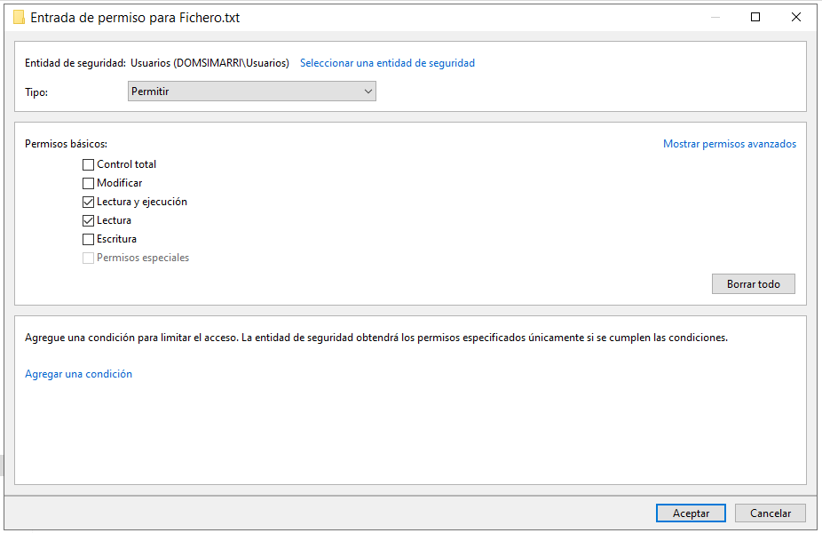
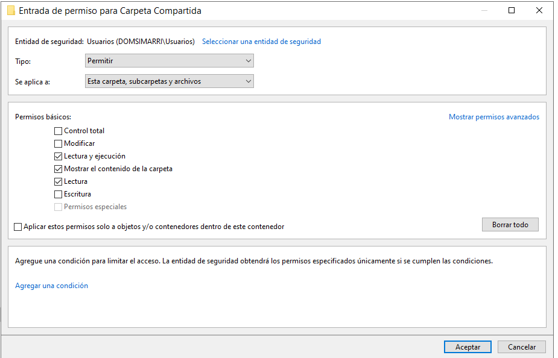
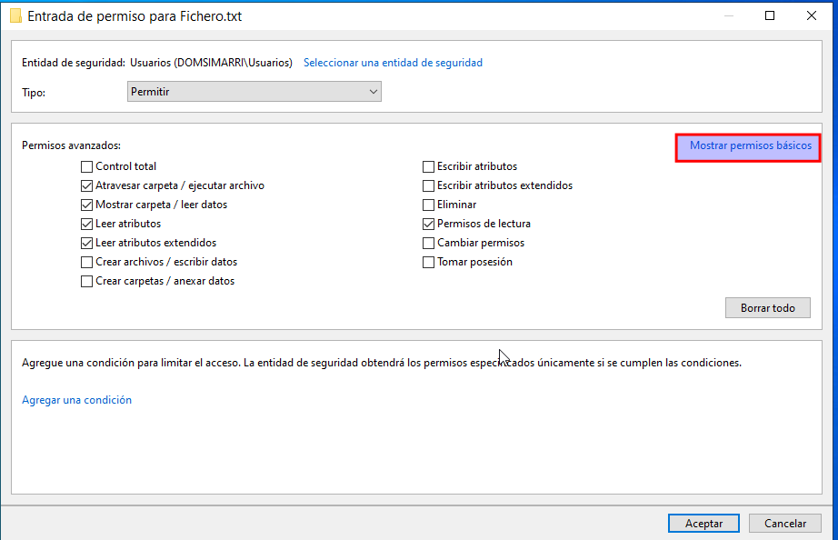
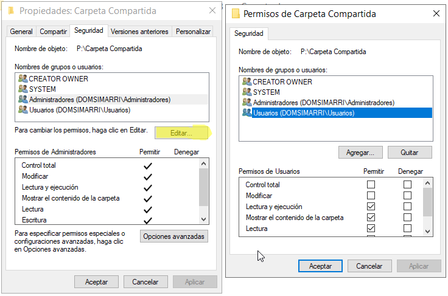
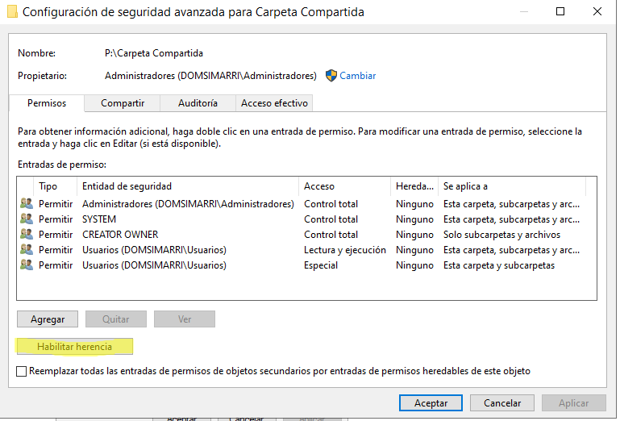
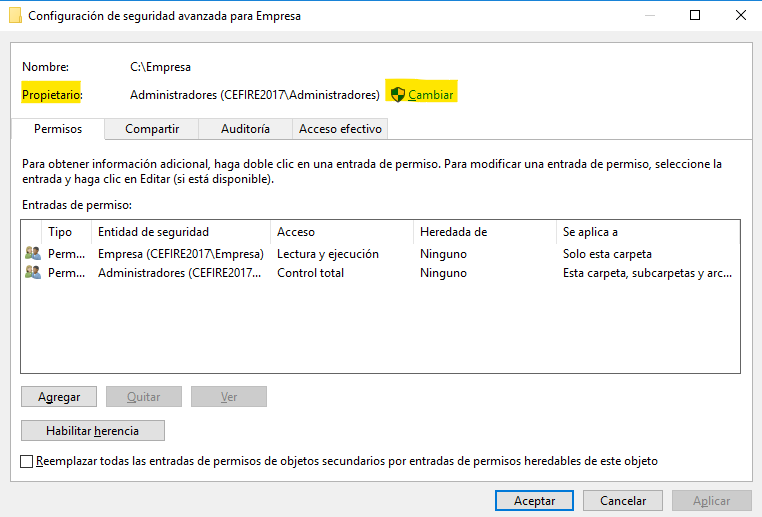
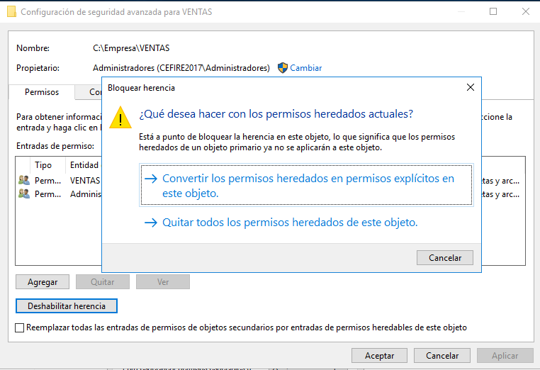
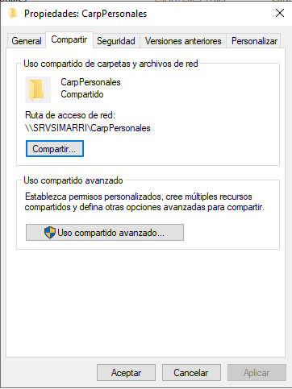
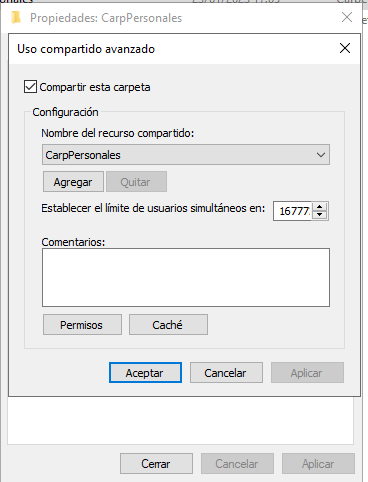

Esta unidad de trabajo se centra en la administración de usuarios y recursos dentro de un entorno de dominio Windows. Se aprenderá a centralizar la información personal de los usuarios mediante perfiles móviles y carpetas particulares, garantizando que cada usuario disponga de un entorno coherente y accesible desde cualquier equipo del dominio. Para ello, se utilizarán máquinas virtuales que simulan una infraestructura corporativa, permitiendo configurar, probar y verificar el funcionamiento de los servicios implicados.

También se aprenderá a incorporar equipos al dominio, aplicar restricciones de acceso, y administrar recursos locales y compartidos como carpetas e impresoras. Se abordarán los mecanismos de seguridad que permiten proteger la información y garantizar que cada usuario acceda únicamente a lo que le corresponde. Esta unidad combina la gestión técnica con la aplicación de políticas de seguridad, ofreciendo una visión completa del control de acceso en redes Windows.

## Permisos y derechos en sistemas Windows

Para controlar qué acciones puede realizar un usuario o grupo en un sistema Windows, se utilizan dos mecanismos complementarios: los **derechos** y los **permisos**. Aunque ambos regulan el acceso y las capacidades dentro del sistema, operan en niveles distintos y tienen implicaciones diferentes.

Un **derecho** permite ejecutar acciones que afectan al sistema en su conjunto, como iniciar sesión, apagar el equipo o realizar copias de seguridad. Estos derechos están definidos por el sistema y no se aplican sobre objetos concretos, sino sobre funciones globales. Cada derecho tiene una lista de usuarios o grupos que lo poseen. Por ejemplo, los miembros del grupo *Operadores de copia de seguridad* pueden hacer copias de todos los archivos, incluso de aquellos sobre los que no tienen permisos, y el usuario *Administrador* puede tomar posesión de cualquier archivo del sistema.

Un **permiso**, en cambio, se aplica sobre recursos específicos como archivos, carpetas, impresoras o claves del registro. Determina qué tipo de acceso tiene cada usuario: lectura, escritura, modificación, eliminación, etc. Cada recurso mantiene su propia lista de control de acceso (ACL), donde se define quién puede hacer qué.

En caso de conflicto entre un permiso y un derecho, prevalece el derecho. Esto garantiza que ciertos roles del sistema puedan ejercer funciones críticas incluso si los permisos locales lo impiden.

### Tipos de permisos en Windows

En sistemas Windows, especialmente en entornos de red, se trabaja con dos tipos de permisos que se aplican en contextos distintos:

- **Permisos NTFS**: se aplican sobre archivos y carpetas en volúmenes formateados con el sistema de archivos NTFS. Se verifican siempre, tanto si el acceso es local como si se realiza a través de la red. Permiten una configuración detallada y precisa del acceso.

- **Permisos SMB (también conocidos como CIFS)**: se aplican únicamente a carpetas compartidas en red. Solo se evalúan cuando el acceso se realiza desde otro equipo, no localmente. Se configuran en la pestaña de “Compartir” de las propiedades de una carpeta.

Los permisos SMB solo se aplican a carpetas compartidas, mientras que los NTFS pueden aplicarse tanto a carpetas como a archivos individuales.

### Evaluación combinada de permisos

Cuando un recurso tiene definidos ambos tipos de permisos (SMB y NTFS), el sistema aplica el más restrictivo. Es decir, para que un usuario pueda acceder a un recurso compartido, debe tener permisos suficientes tanto en la configuración de compartición como en la configuración NTFS. Si uno de los dos lo bloquea, el acceso será denegado.

- **Acceso local**: solo se evalúan los permisos NTFS.
- **Acceso remoto**: se evalúan tanto los permisos SMB como los NTFS, y se aplica la restricción más estricta.

<figure markdown="span" align="center">
  { width="80%"}
  <figcaption>Acceso local o remoto a un recurso.</figcaption>
</figure>

Este comportamiento garantiza una protección eficaz de los recursos, tanto en el plano local como en el plano de red, y permite a los administradores definir políticas de acceso coherentes y seguras.

## Permisos NTFS

El sistema de archivos **NTFS** permite definir con gran precisión qué puede hacer cada usuario o grupo sobre archivos y carpetas. Estos permisos se aplican tanto en acceso local como remoto, y son fundamentales para garantizar la seguridad y el control de los recursos.

### Permisos sobre archivos

Cada archivo puede tener asignados distintos niveles de acceso. Los principales son:

| Permiso              | Habilita al usuario a…                                                                 |
|----------------------|----------------------------------------------------------------------------------------|
| Control total        | Cambiar permisos, tomar la propiedad y realizar todas las acciones permitidas por los demás permisos. |
| Modificar            | Modificar y borrar el archivo, además de escribir y ejecutar.                         |
| Lectura y ejecución  | Ejecutar aplicaciones y leer el contenido del archivo.                                |
| Escribir             | Sobrescribir el archivo, cambiar atributos y ver propietario y permisos.              |
| Leer                 | Leer el archivo y consultar sus atributos, propietario y permisos.                    |

<figure markdown="span" align="center">
  { width="80%"}
  <figcaption>Permisos NTFS en Archivos.</figcaption>
</figure>

### Permisos sobre carpetas

Las carpetas permiten un conjunto similar de permisos, con algunas diferencias específicas:

| Permiso                   | Habilita al usuario a…                                                                 |
|---------------------------|----------------------------------------------------------------------------------------|
| Control total             | Cambiar permisos, tomar la propiedad, borrar subcarpetas y archivos, y realizar todas las acciones permitidas por los demás permisos. |
| Modificar                 | Borrar la carpeta y realizar acciones de escritura y lectura.                         |
| Lectura y ejecución       | Navegar entre carpetas, leer contenido y listar elementos.                            |
| Escribir                  | Crear nuevos archivos y subcarpetas, cambiar atributos y ver propietario y permisos.  |
| Leer                      | Ver archivos y subcarpetas, atributos, propietario y permisos.                        |
| Listar contenido carpeta  | Ver los nombres de los archivos y subcarpetas.                                        |

<figure markdown="span" align="center">
  { width="80%"}
  <figcaption>Permisos NTFS en Carpetas.</figcaption>
</figure>

### Permisos estándar más utilizados

Aunque NTFS permite una gran granularidad, en la mayoría de situaciones se utilizan tres niveles estándar:

- **Control total**: acceso completo, incluyendo la gestión de permisos y propiedad.
- **Modificar**: permite cambiar contenido y eliminar el recurso, pero no modificar permisos ni tomar posesión.
- **Leer y ejecutar**: acceso de solo lectura, con posibilidad de ejecutar si se trata de un archivo ejecutable.

Además, existen otros permisos más específicos como:

- **Mostrar contenido de la carpeta**: solo permite ver los nombres de los elementos.
- **Lectura**: acceso a contenido y atributos.
- **Escritura**: permite crear o modificar contenido, pero no necesariamente visualizarlo si no se tiene permiso de lectura.

<figure markdown="span" align="center">
  { width="80%"}
  <figcaption>Edición de permisos NTFS en archivos.</figcaption>
</figure>


### Tabla resumen NTFS

La siguiente tabla muestra cómo se componen los distintos niveles de permisos estándar en Windows a partir de los permisos especiales. Esta estructura permite entender qué acciones están incluidas en cada tipo de permiso (Control total, Modificar, Leer y ejecutar, etc.).

| Permiso especial                                      | Control total | Modificar | Leer y ejecutar | Mostrar contenido de carpeta (solo carpetas) | Lectura | Escritura |
|-------------------------------------------------------|:-------------:|:---------:|:---------------:|:--------------------------------------------:|:-------:|:---------:|
| Recorrer carpeta / Ejecutar archivo                   |      x        |           |        x        |                      x                       |         |           |
| Listar carpeta / Leer datos                           |      x        |     x     |        x        |                      x                       |    x    |           |
| Atributos de lectura                                  |      x        |     x     |        x        |                      x                       |    x    |           |
| Atributos extendidos de lectura                       |      x        |     x     |        x        |                      x                       |    x    |           |
| Crear archivos / Escribir datos                       |      x        |     x     |                 |                                                |         |     x     |
| Crear carpetas / Anexar datos                         |      x        |     x     |                 |                                                |         |     x     |
| Atributos de escritura                                |      x        |     x     |                 |                                                |         |     x     |
| Atributos extendidos de escritura                     |      x        |     x     |                 |                                                |         |     x     |
| Eliminar subcarpetas y archivos                       |      x        |           |                 |                                                |         |           |
| Eliminar                                              |      x        |     x     |                 |                                                |         |           |
| Permisos de lectura                                   |      x        |     x     |        x        |                      x                       |    x    |           |
| Cambiar permisos                                      |      x        |           |                 |                                                |         |           |
| Tomar posesión                                        |      x        |           |                 |                                                |         |           |
| Sincronizar                                           |      x        |     x     |        x        |                      x                       |    x    |     x     |

!!!note "**Notas:**"

    - Los permisos **Control total** incluyen todos los permisos especiales.
    - El permiso **Modificar** permite cambiar contenido pero no cambiar permisos ni tomar posesión.
    - El permiso **Leer y ejecutar** incluye lectura básica y ejecución de archivos.
    - El permiso **Mostrar contenido de carpeta** solo aplica a carpetas, no a archivos.
    - Los permisos **Lectura** y **Escritura** agrupan subconjuntos específicos de permisos especiales.

Esta tabla es útil para comprender cómo se estructuran los permisos NTFS en Windows y cómo se pueden personalizar para controlar el acceso a archivos y carpetas de forma granular.


### Establecer permisos NTFS

#### Desde el entorno gráfico

1. Clic derecho sobre el archivo o carpeta → Propiedades → pestaña **Seguridad**.
2. Pulsar **Editar** para modificar los permisos estándar.
3. Acceder a **Opciones avanzadas** para:
   - Deshabilitar la herencia.
   - Ver permisos heredados y explícitos.
   - Cambiar el propietario del recurso.

<figure markdown="span" align="center">
  { width="90%"}
  <figcaption>Edición de permisos NTFS en entorno gráfico.</figcaption>
</figure>

<figure markdown="span" align="center">
  { width="90%"}
  <figcaption>Opciones avanzadas de seguridad NTFS.</figcaption>
</figure>

#### Desde la terminal

Windows incluye el comando `icacls` para gestionar permisos NTFS desde línea de comandos. Algunos ejemplos:

```bash
icacls D:\Pruebas /grant INFO2\Ventas:(F)
icacls D:\Pruebas /inheritance:d
icacls D:\Pruebas /remove:gUsuarios
```

Los permisos se indican con letras:
- `F` para Control total
- `W` para Escritura
- `R` para Lectura
- `(R,W)` para Modificar


### Propiedad de archivos y carpetas

El propietario de un archivo o carpeta es el usuario que lo crea. Tanto el propietario como el administrador pueden transferir la propiedad a otro usuario o grupo:

1. Propiedades → pestaña Seguridad → Opciones avanzadas.
2. En la parte superior, aparece el propietario actual.
3. Pulsar **Cambiar** para asignar otro propietario.

<figure markdown="span" align="center">
  { width="80%"}
  <figcaption>Cambio de propietario en configuración avanzada.</figcaption>
</figure>

---

### Herencia de permisos

Cuando se asigna un permiso a una carpeta, por defecto se hereda a todos los archivos y subcarpetas que contiene. Esta herencia puede modificarse desde las opciones avanzadas, eligiendo entre:

- Aplicar a “Esta carpeta, subcarpetas y archivos” (opción predeterminada).
- Aplicar solo a “Esta carpeta”.
- Aplicar solo a “Subcarpetas y archivos”.

Esto permite controlar con precisión cómo se propagan los permisos dentro de una estructura de directorios.

#### Permisos heredados y explícitos

Al crear un archivo o carpeta, hereda los permisos del contenedor en el que se encuentra. Estos permisos heredados se propagan automáticamente, lo que facilita la administración.

Desde las opciones avanzadas se puede ver si un permiso es heredado o explícito. Los heredados aparecen deshabilitados en la pestaña Seguridad y no pueden modificarse directamente, a menos que se deshabilite la herencia.

<figure markdown="span" align="center">
  { width="80%"}
  <figcaption>Visualización de permisos heredados y explícitos.</figcaption>
</figure>

<figure markdown="span" align="center">
  { width="60%"}
  <figcaption>Permisos heredados deshabilitados en la pestaña Seguridad.</figcaption>
</figure>

#### Deshabilitar la herencia

Si queremos modificar los permisos heredados de una carpeta debemos deshabilitar la herencia desde la ventana de Opciones avanzadas:

1. Ir a Opciones avanzadas → pulsar **Deshabilitar herencia**.
2. Elegir entre:
   - **Convertir en permisos explícitos**: conserva los permisos actuales pero permite editarlos.
   - **Quitar todos los permisos heredados**: elimina los permisos heredados por completo.

<figure markdown="span" align="center">
  { width="80%"}
  <figcaption>Deshabilitar la herencia en una carpeta.</figcaption>
</figure>

También cuando asignamos un nuevo permiso a una carpeta podemos hacer que no se herede a las carpetas y archivos que contiene si lo hacemos desde opciones avanzadas. Además de la opción predeterminada que es que el permiso se aplique a “Esta carpeta, subcarpetas y archivos”, podemos elegir otras opciones como que solo se aplique a “Esta carpeta” y así evitar que lo hereden las subcarpetas y archivos que contiene.

---

### Comportamiento al copiar o mover archivos

El comportamiento de los permisos al copiar o mover archivos depende del destino y del volumen:

- **Copiar**: el archivo o carpeta pierde sus permisos originales y hereda los del destino.
- **Mover dentro del mismo volumen**: conserva los permisos originales.
- **Mover a otro volumen**: se comporta como una copia, heredando los permisos del nuevo destino.

---

### Reglas de aplicación de permisos

Por último, revisemos algunas reglas que se producen al aplicar permisos sobre archivos y carpetas:

- Los permisos son **acumulativos**: se suman los permisos individuales y los de los grupos a los que pertenece el usuario.
- No tener un permiso equivale a tenerlo **denegado**.
- En caso de conflicto:
  - Los permisos **explícitos** tienen prioridad sobre los heredados.
  - Los permisos de **denegación** prevalecen sobre los de concesión.

Por ejemplo, si un usuario tiene permiso de lectura por pertenecer a un grupo, pero se le deniega explícitamente ese permiso, no podrá acceder. La denegación siempre tiene prioridad.


## Permisos SMB

Cuando se comparte un recurso en red dentro de un entorno Windows, es necesario definir qué usuarios o grupos pueden acceder a él y qué tipo de acciones pueden realizar. Estos permisos dependen del protocolo utilizado para la compartición. En el caso de Windows, el protocolo predeterminado es **CIFS/SMB**, y es sobre este donde se aplican los permisos de compartición que veremos a continuación.

Antes de configurar cualquier permiso, es imprescindible asegurarse de que está activado el servicio de **Uso compartido de archivos e impresoras** en el equipo. Sin este servicio, los recursos no estarán disponibles en la red, independientemente de los permisos asignados.

### Configuración de permisos de compartición

Para establecer los permisos SMB sobre una carpeta, se accede a sus propiedades y se utiliza la pestaña **Compartir**. Desde ahí, el botón **Uso compartido avanzado** permite configurar el recurso de forma más precisa, definiendo qué grupos o usuarios pueden acceder y con qué nivel de control.

<figure markdown="span" align="center">
  { width="70%"}
  <figcaption>Compartir una carpeta. Siempre con Uso Compartido Avanzado.</figcaption>
</figure>

Los niveles de permiso disponibles son:

- **Leer** (o *Lector*, si se usa el asistente): permite abrir la carpeta, ver su contenido y leer los archivos.
- **Cambiar** (o *Colaborador*): permite modificar archivos, crear nuevos y eliminar contenido.
- **Control total** (o *Copropietario*): incluye todos los permisos anteriores y además permite cambiar los permisos de la carpeta compartida.

Cada nivel incluye al anterior, por lo que *Control total* implica también *Cambiar* y *Leer*. Estos permisos son equivalentes a los permisos NTFS de **Control total**, **Modificar** y **Lectura y ejecución**, respectivamente.

<figure markdown="span" align="center">
  { width="70%"}
  <figcaption>Compartir una carpeta. Siempre con Uso Compartido Avanzado.</figcaption>
</figure>

Al configurar los permisos, se puede elegir entre **Permitir** o **Denegar**. La opción de denegación debe utilizarse con precaución, ya que tiene prioridad sobre cualquier permiso concedido.

### Gestión de permisos SMB

Los permisos de compartición pueden modificarse desde distintas ubicaciones:

- Desde la **Administración de almacenamiento y recursos compartidos**, seleccionando la carpeta y accediendo a sus propiedades.
- Desde el menú contextual de la carpeta, eligiendo **Compartir** (aunque el asistente no es recomendable si ya se han configurado permisos NTFS).
- Desde **Propiedades → Compartir → Uso compartido avanzado**, que es la opción más adecuada para una configuración precisa.

Es importante recordar que los permisos SMB **solo se aplican cuando el acceso se realiza desde otro equipo a través de la red**. Si el usuario accede localmente, estos permisos no se evalúan; en ese caso, se aplican únicamente los permisos NTFS.

### Compartir simple vs uso compartido avanzado

Windows ofrece dos formas de compartir una carpeta: el **uso compartido simple** y el **uso compartido avanzado**. Aunque ambos permiten publicar la carpeta en la red, su comportamiento es distinto:

- El **uso compartido avanzado** permite configurar exclusivamente los permisos SMB, sin alterar los permisos NTFS ya definidos. Es la opción recomendada cuando se quiere mantener un control preciso sobre el acceso local y remoto.
- El **uso compartido simple**, en cambio, modifica tanto los permisos SMB como los NTFS. Esto puede ser útil en configuraciones iniciales o para usuarios principiantes, pero no debe utilizarse una vez que se han establecido permisos NTFS manualmente, ya que puede sobrescribirlos y provocar pérdida de configuraciones específicas.

### Consideraciones importantes al asignar permisos

La asignación de permisos debe hacerse con criterio para evitar errores de seguridad o dificultades de administración. Algunas recomendaciones clave:

- Siempre que sea posible, asignar permisos a **grupos** en lugar de a usuarios individuales. Esto facilita la gestión y permite aplicar cambios de forma más eficiente.
- Evitar conceder permisos al grupo **Todos**, ya que incluye a todos los usuarios del sistema, incluso la cuenta de **Invitado**.
- Una estrategia común consiste en conceder **Control total** en los permisos de compartición y gestionar los permisos NTFS de forma más detallada. Esto simplifica la configuración sin perder precisión.
- Usar la opción **Denegar** con precaución. Si se deniega un permiso a un grupo genérico como *Usuarios*, puede afectar a cuentas que también pertenecen a ese grupo, como el *Administrador*. En caso de conflicto, la denegación tiene prioridad sobre la concesión.
- Si no se marca ninguna opción (ni permitir ni denegar), el usuario o grupo no tendrá ningún permiso efectivo. En ese caso, es preferible **eliminar** el grupo o usuario de la lista para evitar confusiones.