## El servidor de archivos

Un servidor de archivos proporciona espacio donde los usuarios pueden almacenar sus archivos de manera que sea más fácil su gestión, así como compartirlos con otros usuarios. Es una pieza clave en cualquier infraestructura corporativa, ya que permite centralizar la información y aplicar políticas de acceso y seguridad de forma eficiente.

Podemos compartir carpetas directamente como se hace en las versiones cliente de Windows (desde el menú contextual de la carpeta, accediendo a la pestaña **Compartir**) o hacerlo desde el servicio **Servicios de archivo y almacenamiento**, que se instala por defecto en Windows Server y se gestiona desde el **Administrador del servidor**.

Este servicio ofrece varias opciones organizadas por categorías:

### Volúmenes

Aquí aparecen todos los volúmenes que hay creados en el servidor. Podemos filtrarlos por **Discos** o por **Grupos de almacenamiento**. Para el volumen seleccionado se muestra información detallada sobre su disco, los recursos compartidos y los discos virtuales iSCSI creados en él.

<figure markdown="span" align="center">
  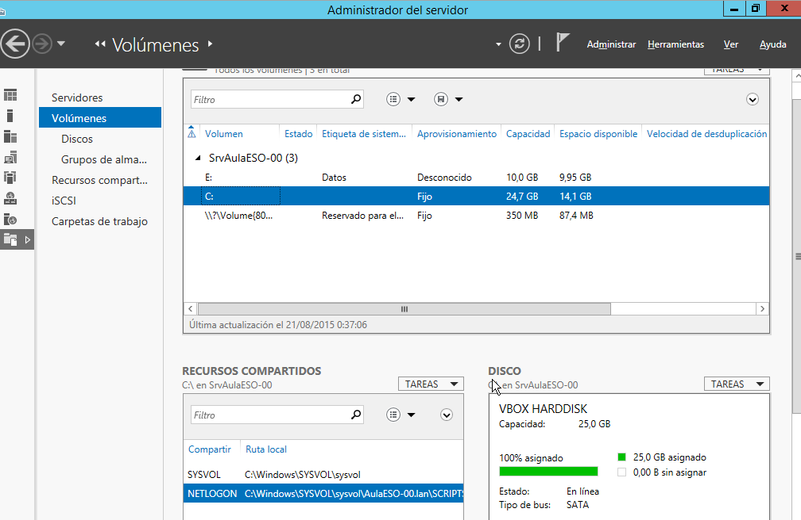{ width="80%" }
  <figcaption>Administrador del servidor: gestión de volúmenes y unidades disponibles.</figcaption>
</figure>

### Recursos compartidos

Desde esta sección se pueden visualizar todos los recursos compartidos en cualquier volumen, junto con información detallada sobre cada uno. En cualquier servidor de dominio encontraremos al menos dos recursos compartidos esenciales:

- **NETLOGON**: se crea automáticamente en los controladores de dominio (DC) y se utiliza durante el inicio de sesión de los usuarios. Aquí se almacenan los scripts de inicio de sesión.
- **SYSVOL**: contiene las secuencias de comandos de inicio de sesión y otros elementos de directivas de grupo.

<figure markdown="span" align="center">
  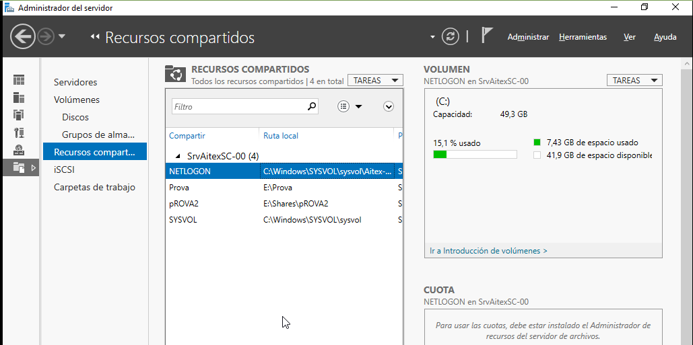{ width="80%" }
  <figcaption>Vista de recursos compartidos en el servidor, con NETLOGON seleccionado.</figcaption>
</figure>

### iSCSI

Esta sección muestra los discos virtuales iSCSI configurados en el servidor. Son útiles para entornos donde se requiere almacenamiento en red de alto rendimiento o para escenarios de virtualización avanzada.

### Carpetas de trabajo

Las carpetas de trabajo permiten que los usuarios mantengan sincronizados sus datos entre el servidor y dispositivos que no siempre están conectados a la red corporativa. Es una solución ideal para usuarios móviles o con acceso intermitente.


## Crear carpetas compartidas

En Windows Server, podemos crear carpetas compartidas de varias formas, dependiendo de si queremos hacerlo desde el entorno gráfico, desde el servidor de archivos o mediante línea de comandos. Cada método ofrece distintos niveles de control sobre los permisos y la visibilidad del recurso.

Podemos crear una nueva carpeta compartida desde el **Servidor de archivos y almacenamiento**, como vimos anteriormente, o directamente desde el menú contextual de la carpeta (como se hace en versiones cliente de Windows).

Veamos cómo hacerlo en cada caso.

### Desde el servidor de archivos y almacenamiento

Ya hemos visto cómo crear una carpeta compartida con el asistente rápido. Vamos ahora a utilizar la opción **Avanzado**, que permite configurar más detalles, como cuotas de almacenamiento para los usuarios.


<div style="position: relative; width: 70%; padding-bottom: 39.375%; margin: 0 auto;">
  <iframe src="https://www.youtube.com/embed/auglyXTNL7M?si=o9tTEa9ALjn75BsQ"
          style="position: absolute; top: 0; left: 0; width: 100%; height: 100%;"
          frameborder="0"
          allow="accelerometer; autoplay; clipboard-write; encrypted-media; gyroscope; picture-in-picture"
          allowfullscreen
          title="Video explicativo">
  </iframe>
</div>


La principal diferencia es que este asistente avanzado nos permite establecer **cuotas** sobre la carpeta compartida, que luego pueden visualizarse y modificarse desde el **Administrador de recursos del servidor de archivos**.

Por defecto, los permisos asignados son:

- **NTFS**: Lectura y ejecución para todos los usuarios.
- **SMB**: Control total para todos los usuarios.

Estos permisos deben ajustarse manualmente para adaptarlos a las necesidades reales del entorno.

!!!note "Nota:"

    Si el nombre del recurso compartido termina en `$`, la carpeta estará **oculta** para los clientes. No aparecerá en el explorador de red, aunque los usuarios podrán acceder escribiendo su ruta UNC directamente:  
    `\\Nombre_del_servidor\Nombre_de_la_carpeta$`

<figure markdown="span" align="center">
  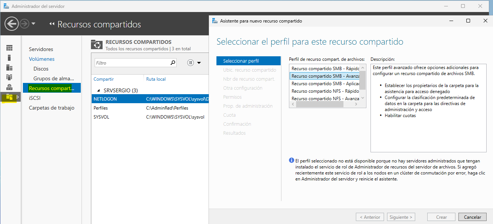{ width="80%" }
  <figcaption>Creación de carpeta compartida desde el asistente avanzado del servidor de archivos.</figcaption>
</figure>

---

### Desde las propiedades de la carpeta

Otra opción es compartir la carpeta directamente desde su menú contextual. Al abrir las propiedades, accedemos a la pestaña **Compartir**, donde encontramos dos botones:

- **Compartir**: usa el asistente simple, que modifica tanto permisos SMB como NTFS.
- **Compartir avanzado**: permite configurar exclusivamente los permisos SMB sin alterar los NTFS.

<div style="position: relative; width: 70%; padding-bottom: 39.375%; margin: 0 auto;">
  <iframe src="https://www.youtube.com/embed/1808vr-DwlA?si=VRw5nQJ3BJsyRvG3"
          style="position: absolute; top: 0; left: 0; width: 100%; height: 100%;"
          frameborder="0"
          allow="accelerometer; autoplay; clipboard-write; encrypted-media; gyroscope; picture-in-picture"
          allowfullscreen
          title="Video explicativo compartir desde propiedades de la carpeta">
  </iframe>
</div>

Esta opción es más adecuada cuando queremos mantener el control sobre los permisos NTFS y evitar que el asistente los sobrescriba.

<figure markdown="span" align="center">
  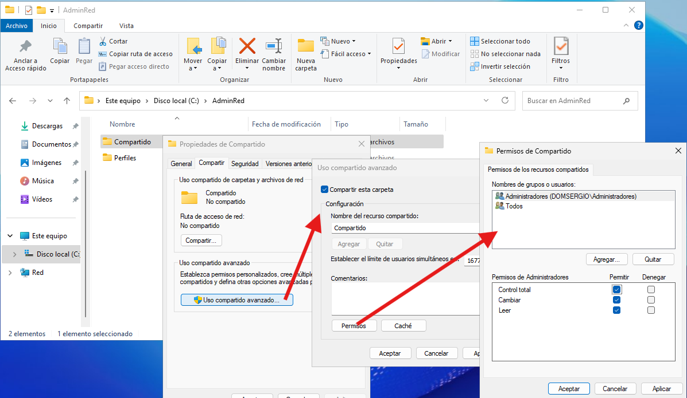{ width="80%" }
  <figcaption>Compartir carpeta desde sus propiedades, con acceso al uso compartido avanzado.</figcaption>
</figure>

---

### Desde la terminal

También podemos compartir carpetas desde la línea de comandos utilizando el comando `net share`. Este método es útil para automatizar tareas o incluirlas en scripts de configuración.

**Ejemplo:**

```bash
net share InformesServidor=C:\Datos\Informes /grant:ACME\Ventas,change
```

Este comando comparte la carpeta `C:\Datos\Informes` con el nombre `InformesServidor` y otorga al grupo `Ventas` del dominio `ACME` el permiso SMB de **Cambiar**.

Los permisos disponibles son:

- `read` → Leer
- `change` → Cambiar
- `full` → Control total

Para dejar de compartir la carpeta:

```bash
net share InformesServidor /delete
```

### Publicar una carpeta compartida en Active Directory

Además de compartir la carpeta, podemos **publicarla en Active Directory** para que los usuarios la encuentren fácilmente mediante la herramienta de búsqueda.

Este proceso no crea la carpeta ni la comparte: simplemente la registra en el directorio para facilitar su localización.

Pasos:

1. Abrir **Usuarios y equipos de Active Directory**.
2. Ir a la **OU** donde queremos publicar la carpeta.
3. Clic derecho → **Nuevo → Carpeta compartida**.
4. Indicar el nombre del recurso compartido y su ruta UNC.
5. (Opcional) Añadir palabras clave para facilitar la búsqueda.

<figure markdown="span" align="center">
  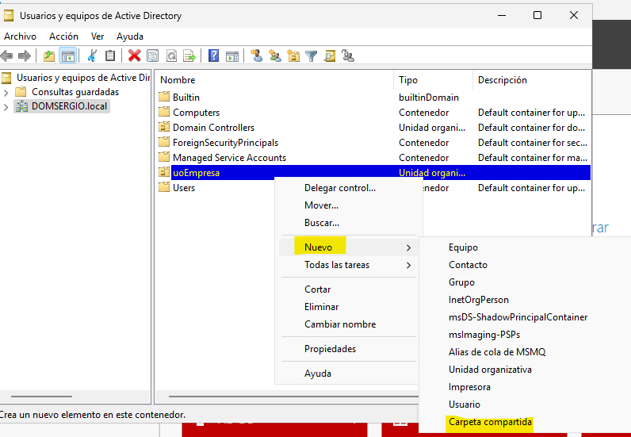{ width="80%" }
  <figcaption>Publicación de carpeta compartida en Active Directory para facilitar su búsqueda.</figcaption>
</figure>

## Carpetas compartidas ocultas

En Windows Server, es posible compartir una carpeta sin que aparezca listada en el explorador de red de los clientes. Esto se consigue añadiendo el símbolo **$** al final del nombre del recurso compartido. Aunque la carpeta no será visible, los usuarios podrán acceder si conocen su ruta UNC completa.

### Configuración desde el uso compartido avanzado

Desde las propiedades de la carpeta, en la pestaña **Compartir**, accedemos al botón **Uso compartido avanzado**. Allí podemos definir el nombre del recurso compartido incluyendo el símbolo `$` al final.

<figure markdown="span" align="center">
  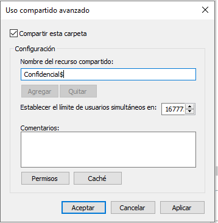{ width="80%" }
  <figcaption>Configuración del recurso compartido oculto “Confidencial$” desde el uso compartido avanzado.</figcaption>
</figure>

### Acceso al recurso oculto

Aunque la carpeta no se muestra en el explorador de red, los usuarios pueden acceder escribiendo directamente su ruta UNC, incluyendo el símbolo `$`.

<figure markdown="span" align="center">
  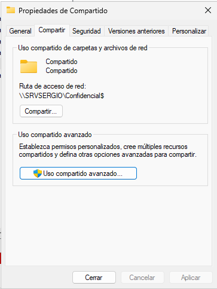{ width="80%" }
  <figcaption>Acceso al recurso oculto mediante la ruta UNC: \\SRVSERGIO\Confidencial$.</figcaption>
</figure>

También es posible acceder desde el explorador de archivos, escribiendo la ruta completa en la barra de direcciones:

<figure markdown="span" align="center">
  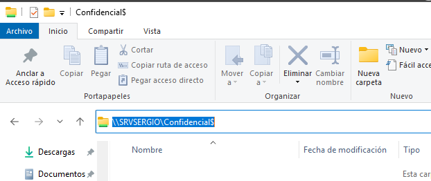{ width="80%" }
  <figcaption>Acceso directo desde el explorador de archivos a \\SRVSERGIO\Confidencial$.</figcaption>
</figure>

---

!!!tip "Truco: acceso a unidades compartidas ocultas"

    Por defecto, las unidades de disco están compartidas para los administradores del sistema utilizando nombres ocultos como `C$`, `D$`, etc. Esto permite acceder remotamente a cualquier equipo del dominio (o incluso fuera de él si se conoce el usuario local) especificando el nombre del equipo y la unidad deseada:

    `\\NombreDelEquipo\C$`  
    o  
    `\\192.168.0.5\C$`


## Espacios de almacenamiento en Windows Server

Los **Espacios de almacenamiento** (Storage Spaces) son una tecnología de Windows Server que permite agrupar discos físicos en una estructura lógica llamada **grupo de almacenamiento**. A partir de ese grupo, se pueden crear **discos virtuales** que se comportan como si fueran discos físicos, pero con ventajas adicionales: resiliencia ante fallos, aprovisionamiento flexible y gestión centralizada.

Esta funcionalidad está disponible en servidores independientes (sin necesidad de clústeres) y es compatible con Windows Server 2016, 2019, 2022 y 2025.

<figure markdown="span" align="center">
  { width="70%" }
  <figcaption>Flujo de trabajo de los Espacios de almacenamiento.</figcaption>
</figure>

### Usos principales

- **Agrupación de discos**: permite combinar varios discos físicos (SATA, SAS, iSCSI, etc.) en un único grupo lógico.
- **Creación de discos virtuales**: sobre el grupo se crean discos con opciones de tolerancia a fallos (Simple, Mirror, Parity).
- **Gestión dinámica**: se pueden añadir o quitar discos en caliente, redimensionar volúmenes y crear discos por capas (SSD + HDD).
- **Optimización del espacio**: mediante aprovisionamiento fino (Thin), el sistema asigna espacio según el uso real.
- **Automatización**: se puede administrar todo el proceso desde PowerShell, con cmdlets específicos para cada paso.

### Tipos de resiliencia

- **Simple**: sin redundancia, máximo rendimiento y capacidad.
- **Mirror**: duplicación de datos, mayor fiabilidad.
- **Parity**: distribución de datos y paridad, ideal para copias de seguridad y archivos.

### Flujo de trabajo básico

1. **Crear grupo de almacenamiento**: se seleccionan discos físicos y se agrupan.
2. **Crear disco virtual**: se define tipo de resiliencia, aprovisionamiento y tamaño.
3. **Crear volumen**: se formatea el disco virtual y se asigna letra de unidad o carpeta.

!!!nota "Importante" 
    Los espacios de almacenamiento no se pueden usar para alojar el sistema operativo.


Para ver los pasos detallados, capturas de pantalla y ejemplos con PowerShell, puedes consultar directamente la documentación oficial en este enlace:  
🔗 [learn.microsoft.com/es-es/windows-server/storage/storage-spaces/deploy-standalone-storage-spaces](https://learn.microsoft.com/es-es/windows-server/storage/storage-spaces/deploy-standalone-storage-spaces)


## Almacenamiento **iSCSI** en Windows Server

El protocolo **iSCSI** (Internet Small Computer System Interface) permite transportar comandos SCSI a través de redes TCP/IP. Esta tecnología, definida en las especificaciones SCSI-3, ha ganado popularidad en entornos corporativos gracias al crecimiento de las redes Gigabit Ethernet, que ofrecen una alternativa más económica y flexible frente a las soluciones SAN basadas en canal de fibra.

Windows Server incorpora soporte completo para iSCSI, tanto para consumir almacenamiento remoto como para ofrecerlo a otros equipos de la red. Esto permite que un servidor actúe como cliente de una cabina SAN o incluso como proveedor de discos virtuales accesibles por otros sistemas.

### Uso de discos iSCSI como almacenamiento

Cuando se dispone de un dispositivo que proporciona discos iSCSI —ya sea una cabina de discos o un equipo con software específico— es posible conectarse a él desde cualquier equipo con Windows Server. Para ello, el primer paso consiste en activar el servicio **Iniciador iSCSI**, que puede configurarse desde PowerShell con el siguiente comando:

```powershell
Set-Service -Name MSiSCSI -StartupType Automatic
```

Una vez iniciado el servicio, se ejecuta el programa gráfico del iniciador iSCSI (`iscsicpl.exe`). En la pestaña **Descubrir**, se introduce la dirección del servidor de almacenamiento disponible en la red. Tras localizar el destino, se establece la conexión y se configura la interfaz de red que se utilizará para el tráfico iSCSI.

Al completar este proceso, el disco remoto aparecerá como un nuevo dispositivo de almacenamiento en el sistema local. Desde el **Administrador de discos**, se puede inicializar, particionar y formatear como cualquier otro disco físico. Es importante tener en cuenta que, para garantizar un buen rendimiento, la red utilizada para iSCSI debe estar separada de la LAN principal de la empresa, evitando interferencias y saturación.

### Provisión de discos iSCSI desde Windows Server

Además de consumir almacenamiento iSCSI, Windows Server puede actuar como servidor de destino, ofreciendo discos virtuales a otros equipos de la red. Para ello, se instala el rol de **Servidor de destino iSCSI**, disponible dentro de los **Servicios de almacenamiento**.

Una vez instalado el rol, se accede al panel de administración desde el **Administrador del servidor**, en la sección **Servicios de archivo y almacenamiento → iSCSI**. Desde allí se pueden crear uno o varios discos virtuales, que serán expuestos como destinos iSCSI. También se configuran los iniciadores autorizados, es decir, los equipos que podrán conectarse a esos discos.

Esta funcionalidad convierte a Windows Server en una solución versátil para entornos de laboratorio, virtualización o almacenamiento distribuido, sin necesidad de invertir en hardware especializado.

Para ampliar información o consultar el proceso paso a paso, se recomienda revisar documentación técnica y tutoriales como los siguientes:

🔗 [Microsoft: Cómo configurar y conectar un disco iSCSI en Windows Server](https://learn.microsoft.com/es-es/windows-server/storage/storage-spaces/deploy-standalone-storage-spaces)  
🔗 [Informática Madrid Mayor: ¿Cómo configurar y conectar un disco iSCSI en Windows Server?](https://informaticamadridmayor.es/tips/como-configurar-y-conectar-un-disco-iscsi-en-windows-server/)

## Carpetas de trabajo

Permiten tener sincronizados los archivos de un usuario entre sus distintos dispositivos. Sería una especie de OneDrive pero gestionado por nosotros.

Podemos encontrar información de cómo implementarlas en la [web de Microsoft](https://learn.microsoft.com/es-es/windows-server/storage/work-folders/deploy-work-folders).

## Administrador de recursos del servidor de archivos (FSRM)

El Administrador de recursos del servidor de archivos (FSRM) es un rol de Windows Server que permite aplicar políticas avanzadas sobre el almacenamiento, como cuotas de disco, filtrado de archivos y generación de informes. Este rol se encuentra dentro de **Servicios de archivo y almacenamiento → Servicios de iSCSI y archivo**, y puede instalarse desde el Administrador del servidor.

<figure markdown="span" align="center">
  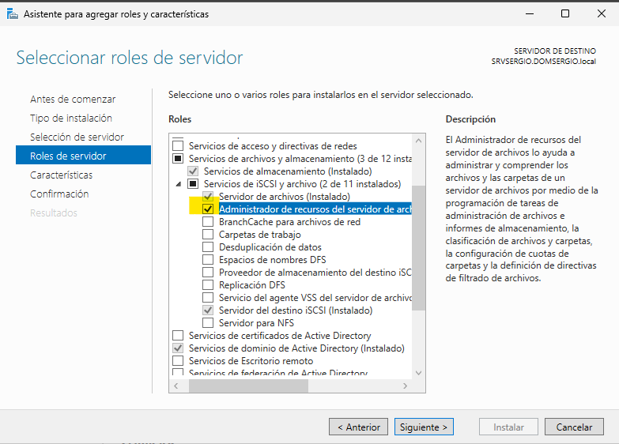{ width="70%" }
  <figcaption>Rol de Administrador de recursos del servidor de archivos.</figcaption>
</figure>

Una vez instalado, se accede a la herramienta desde el menú **Herramientas** del Administrador del servidor.

### Funcionalidades principales

Desde FSRM se pueden gestionar los siguientes aspectos:

- Cuotas de disco
- Filtrado de archivos
- Informes de almacenamiento
- Clasificaciones
- Tareas de administración de archivos

#### Cuotas de carpeta

Las cuotas permiten limitar el espacio que un usuario puede utilizar en una carpeta compartida. El espacio disponible que verá el usuario no será el real, sino el que se le haya asignado según su cuota.

FSRM incluye varias plantillas de cuota que pueden utilizarse directamente o servir como base para crear nuevas. Para crear una plantilla personalizada, se accede a **Plantillas de cuota** y se selecciona **Acción → Crear plantilla de cuota**.

<figure markdown="span" align="center">
  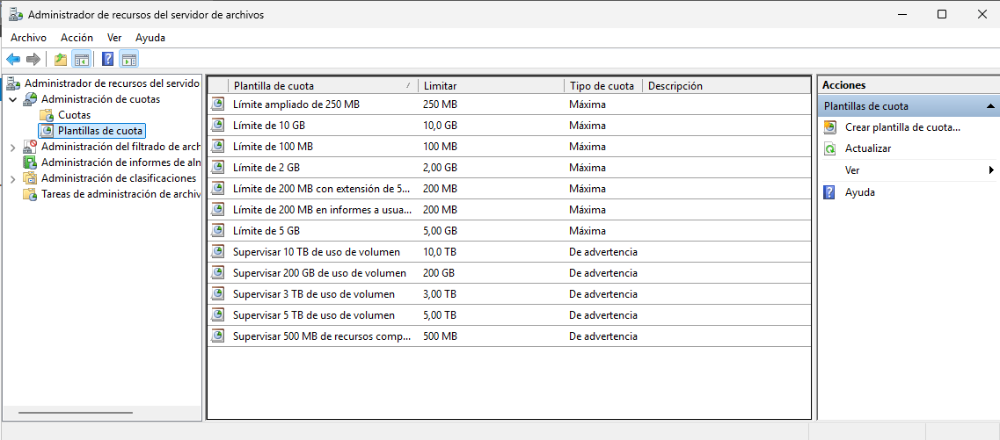{ width="90%" }
  <figcaption>Administrador de recursos del servidor de archivos. Plantillas</figcaption>
</figure>

En la plantilla se define:

- El espacio máximo disponible
- Si la cuota es estricta (no se puede superar) o de advertencia (se puede superar pero se notifica)
- Umbrales que activan acciones cuando se alcanza cierto porcentaje de uso

Cada umbral puede activar:

- Envío de correo a administradores
- Envío de correo al usuario
- Registro de eventos
- Ejecución de comandos o scripts
- Generación de informes

Es recomendable copiar las propiedades de una plantilla existente para ahorrar tiempo, aunque también se puede partir de una plantilla en blanco.

Para aplicar una cuota a una carpeta, se accede a **Cuotas** y se selecciona **Acción → Crear cuota**. En el asistente se indica:

- La ruta de la carpeta o volumen
- Si se aplica solo a la carpeta o también a sus subcarpetas
- Si se deriva de una plantilla o se definen propiedades manualmente
- Un resumen de las propiedades de la cuota

<figure markdown="span" align="center">
  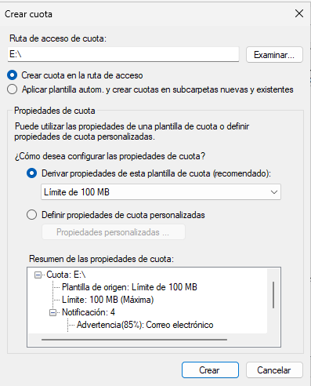{ width="80%" }
  <figcaption>Administrador de recursos del servidor de archivos. Crear Cuota</figcaption>
</figure>

#### Cuotas de volumen

Además de cuotas por carpeta, Windows Server permite establecer cuotas sobre volúmenes completos. Esta funcionalidad no requiere FSRM y se configura desde el menú contextual del volumen, en la pestaña **Cuota**.

<figure markdown="span" align="center">
  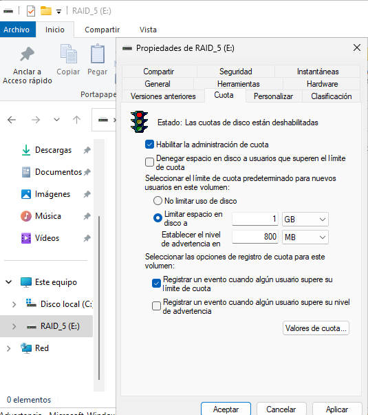{ width="80%" }
  <figcaption>Crear Cuotade un volumen</figcaption>
</figure>

Al activar la opción **Habilitar la administración de cuotas**, se pueden definir:

- Denegar espacio en disco a usuarios que excedan el límite
- No limitar el uso de disco (modo pasivo)
- Limitar espacio en disco por usuario, con advertencias configurables
- Registrar eventos cuando se superan los límites

Para establecer cuotas específicas por usuario, se accede al botón **Valores de cuota**, se selecciona **Cuota → Nueva entrada de cuota...**, y se asigna la cuota deseada al usuario correspondiente.

#### Filtrado de archivos

FSRM permite bloquear el almacenamiento de ciertos tipos de archivos en carpetas compartidas. Al igual que con las cuotas, existen plantillas predefinidas que pueden usarse o modificarse.

En cada plantilla se configura:

- Tipos de archivo a filtrar (por extensión o patrón)
- Modo de filtrado: activo (bloquea) o pasivo (permite pero registra)
- Envío de correos a administradores y usuarios
- Registro de eventos
- Ejecución de comandos o scripts
- Generación de informes

### Administración con PowerShell

Una vez instalado FSRM, se habilitan varios cmdlets en PowerShell con el prefijo `fsrm`. Algunos de los más útiles son:

- Get-fsrmSetting → muestra la configuración actual del servidor
- New-fsrmQuotaTemplate → crea una nueva plantilla de cuota
- New-fsrmAction → define una acción ante un umbral superado
- New-fsrmQuotaThreshold → establece el porcentaje que activa una acción
- New-FsrmFileGroup → define un grupo de archivos para filtrar
- New-FsrmFileScreenTemplate → crea una plantilla de filtrado

Es habitual definir variables para reutilizarlas en los distintos comandos.

#### Ejemplo: creación de cuota con evento de advertencia

Queremos aplicar una cuota al recurso compartido `E:\Shares\Diseny` que registre un evento cuando se supere el 85 % del espacio asignado.

1. Definimos la acción:

```powershell
$Action = New-FsrmAction -Type Event -EventType Warning -Body "El usuario [Source Io Owner] ha superado el 85% de la cuota de 10MB"
```

2. Definimos el umbral:

```powershell
$Limite = New-FsrmQuotaThreshold -Percentage 85 -Action $Action
```

3. Creamos la plantilla:

```powershell
New-FsrmQuotaTemplate -Name "Limite para Diseny" -Size 50GB -Threshold $Limite
```

4. Asignamos la plantilla:

```powershell
New-FsrmQuota -Path E:\Shares\Diseny -Template "Limite para Diseny"
```

#### Ejemplo: creación de filtro de archivos

Queremos bloquear archivos ejecutables y también archivos PDF en una carpeta compartida.

1. Creamos el grupo de archivos:

```powershell
New-FsrmFileGroup -Name "Grupo de archivos pdf" -IncludePattern "*.pdf"
```

2. Creamos la plantilla de filtrado:

```powershell
New-FsrmFileScreenTemplate -Name "Bloquear ejecutables y PDF" -IncludeGroup @("Grupo de archivos pdf", "Bloquear archivos ejecutables")
```

3. Asignamos la plantilla al recurso compartido deseado.

Para más información sobre los cmdlets disponibles, se puede consultar la documentación oficial de Microsoft sobre FSRM.