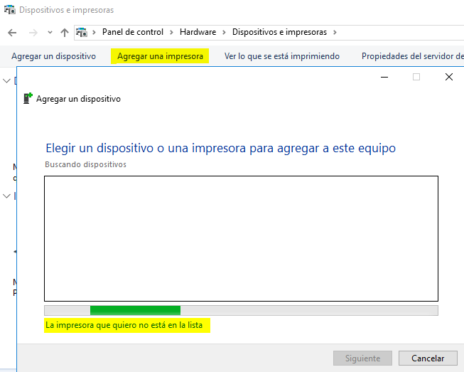
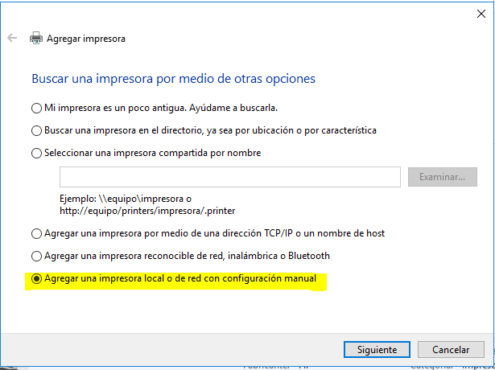
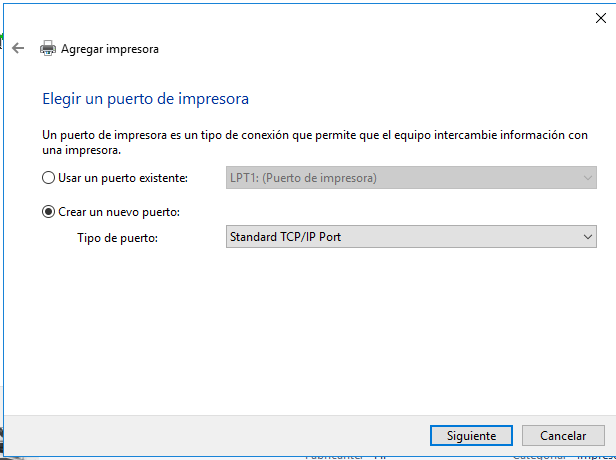
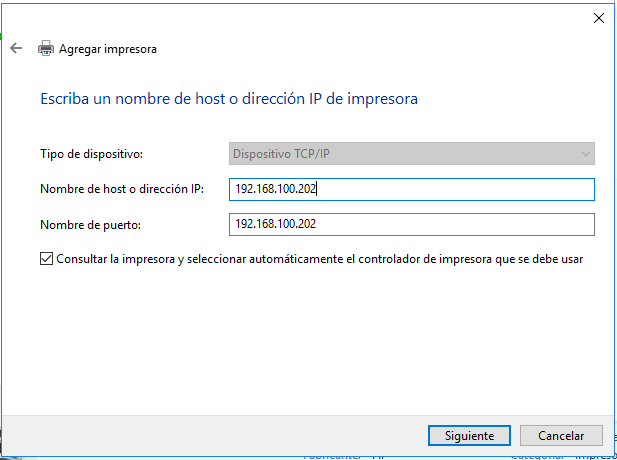
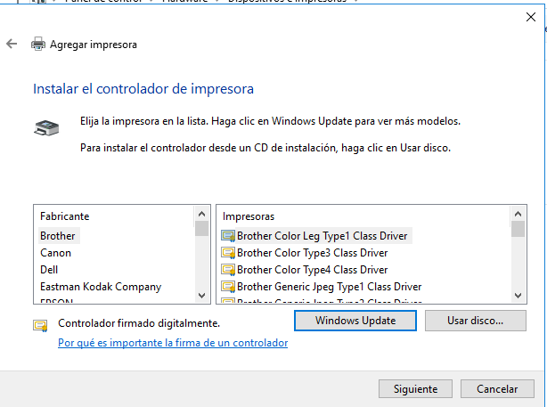
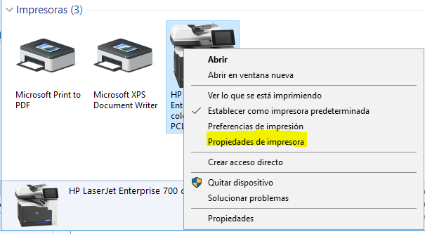
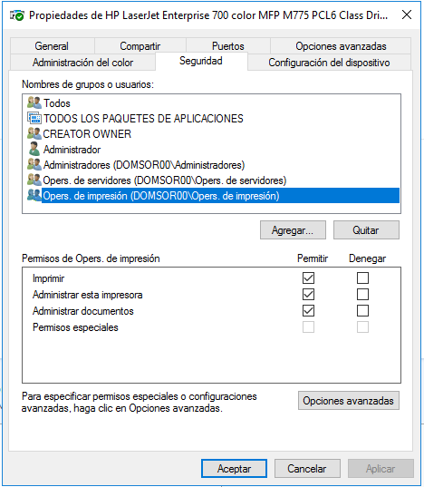
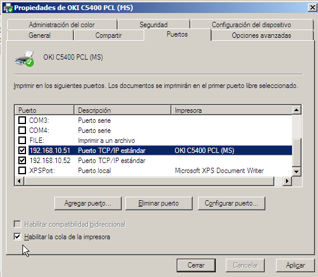

## Compartir impresoras en red
En los sistemas de impresión en red intervienen tres elementos esenciales que permiten organizar y gestionar los trabajos de impresión de forma eficiente:

- **Impresora**: es el dispositivo físico donde se ejecutan los trabajos. Puede estar conectada localmente a un equipo o directamente a la red. Una misma impresora puede atender a una o varias colas de impresión.
- **Cola de impresión**: es la estructura lógica que almacena los trabajos enviados por los usuarios, a la espera de ser procesados por la impresora. En Windows, esta cola aparece como una impresora instalada, aunque no esté físicamente conectada al equipo.
- **Servidor de impresión**: es el equipo que gestiona la cola de impresión y se encarga de enviar los trabajos a la impresora física. Un servidor puede administrar múltiples impresoras y colas, centralizando la gestión.

### Impresión directa sin servidor

Es posible utilizar una impresora conectada directamente a la red sin pasar por un servidor de impresión. En este caso, cada cliente la añade manualmente desde su carpeta de impresoras. Aunque esta configuración puede parecer sencilla, presenta varios inconvenientes:

- Cada equipo mantiene su propia cola de impresión, por lo que los trabajos no se gestionan de forma centralizada.
- Los usuarios solo ven el estado de sus propios trabajos, sin saber cómo están los trabajos del resto.
- Los errores de impresión solo se muestran en el equipo que ha enviado el trabajo.
- Todo el procesamiento se realiza localmente, lo que puede afectar al rendimiento del equipo.
- No hay visibilidad sobre el orden de impresión ni sobre la carga de trabajo de la impresora.

### Ventajas de utilizar un servidor de impresión

Centralizar la gestión mediante un servidor de impresión aporta múltiples beneficios:

- El servidor administra la configuración del controlador de la impresora, garantizando uniformidad en todos los equipos cliente.
- Todos los usuarios comparten una única cola de impresión, lo que permite conocer el estado de sus trabajos y el orden de impresión.
- Los errores y el estado de la impresora se notifican a todos los equipos conectados.
- Parte del procesamiento de los trabajos se realiza en el servidor, reduciendo la carga en los equipos cliente.

Cuando el volumen de impresión es elevado, se recomienda dedicar un servidor exclusivamente a esta tarea. Este servidor debe contar con suficiente memoria RAM y espacio en disco para almacenar y procesar los trabajos de todos los usuarios.

### Recomendaciones para la cola de impresión

Independientemente del volumen de trabajo, es aconsejable que la cola de impresión se almacene en un volumen de disco distinto al del sistema operativo. Esto se debe a que la gestión de la cola implica la creación y eliminación constante de archivos temporales, lo que puede provocar fragmentación si se encuentra en la misma partición que el sistema.

Por tanto, se recomienda:

- Dedicar un volumen específico para la cola de impresión.
- Evitar que esté en la partición del sistema.
- Supervisar el espacio libre en ese volumen, especialmente si se procesan trabajos grandes o simultáneos.

### Configuración típica en Windows Server

En entornos Windows Server, el rol de **Servidor de impresión** se instala desde el Administrador del servidor. Una vez instalado, se pueden compartir impresoras locales o de red, definir colas de impresión, establecer permisos y configurar opciones avanzadas como:

- Prioridad de impresión por usuario o grupo.
- Horarios de disponibilidad de la impresora.
- Registro de eventos relacionados con la impresión.
- Redirección de trabajos a otra impresora si la principal está fuera de servicio.

Esta arquitectura permite una gestión más robusta, escalable y controlada del entorno de impresión, especialmente en redes corporativas o educativas donde el volumen de trabajos es considerable.

## Instalar y configurar una impresora en Windows Server

### Instalación de una impresora

Podemos instalar una nueva impresora en el servidor de la misma forma que se haría en un cliente. Para ello, desde el **Panel de control**, accedemos a la sección **Impresoras** y pulsamos en **Añadir impresora**.

<figure markdown="span" align="center">
  { width="70%" }
  <figcaption>Añadir impresora desde el Panel de control.</figcaption>
</figure>

Lo habitual es que el sistema detecte automáticamente la impresora en la primera pantalla. Sin embargo, si estamos instalando una impresora que no existe aún en el sistema, no la detectará, ni siquiera cuando le indiquemos su dirección IP.

En este caso, la impresora está conectada al switch y tiene su propia IP, aunque también podría estar conectada directamente al servidor.

Si el sistema no detecta la impresora, lo más recomendable es seleccionar la opción **La impresora que quiero no está en la lista**.

<figure markdown="span" align="center">
  { width="90%" }
  <figcaption>Selección de impresora no detectada.</figcaption>
</figure>

A continuación, seleccionamos la opción **Agregar una impresora local o de red con configuración manual**.

<figure markdown="span" align="center">
  { width="90%" }
  <figcaption>Selección de impresora local.</figcaption>
</figure>

Creamos un **nuevo puerto de tipo TCP/IP**.

<figure markdown="span" align="center">
  { width="90%" }
  <figcaption>Crear puerto TCP/IP.</figcaption>
</figure>

Asignamos la **dirección IP** de la impresora al puerto.

<figure markdown="span" align="center">
  { width="90%" }
  <figcaption>Asignar IP al puerto.</figcaption>
</figure>

Por último, seleccionamos el **controlador de la impresora** desde la lista disponible o lo buscamos manualmente desde una ubicación específica.

<figure markdown="span" align="center">
  { width="90%" }
  <figcaption>Selección de controlador.</figcaption>
</figure>

Una vez completado este proceso, la impresora quedará instalada en el servidor y lista para su configuración.

### Configuración de la impresora

Desde el menú contextual de la impresora instalada, seleccionamos **Propiedades de impresora**. En esta ventana encontramos varias pestañas que permiten ajustar su comportamiento:

<figure markdown="span" align="center">
  { width="70%" }
  <figcaption>Propiedades de la impresora.</figcaption>
</figure>

- **General**: permite cambiar el nombre de la impresora y definir preferencias como orientación del papel, impresión en color o blanco y negro, número de páginas por hoja, etc.
- **Compartir**: si queremos compartir la impresora, podemos indicar si los trabajos se procesan en el cliente o en el servidor. También podemos publicar la impresora en Active Directory para facilitar su búsqueda. El botón **Controladores adicionales** permite instalar los drivers necesarios para distintos sistemas cliente.
- **Puertos**: muestra y permite configurar los puertos asignados a la impresora.
- **Opciones avanzadas**: incluye el tipo de controlador, la gestión de la cola de impresión y opciones como el horario de disponibilidad. Es importante no marcar la opción **Imprimir directamente en la impresora**, ya que esto puede bloquear la aplicación que envía el trabajo hasta que finalice la impresión.
- **Administración del color**: permite ajustar la gestión del color.
- **Configuración del dispositivo**: ofrece opciones adicionales según el modelo de impresora.
- **Seguridad**: se configura desde esta pestaña y se detalla en el siguiente apartado.

### Permisos de las impresoras

Los permisos sobre impresoras se gestionan desde la pestaña **Seguridad** en las propiedades de la impresora. Los permisos estándar que se pueden asignar son:

- **Imprimir**: permite conectarse a la impresora y enviar documentos. También permite pausar, reanudar o cancelar los propios trabajos.
- **Administrar documentos**: permite gestionar la cola completa, incluyendo trabajos de otros usuarios.
- **Administrar impresoras**: otorga control total sobre la impresora, incluyendo configuración, permisos y controladores.

<figure markdown="span" align="center">
  { width="70%" }
  <figcaption>Permisos Impresora.</figcaption>
</figure>

Por defecto, al instalar una impresora:

- El grupo **Todos** tiene permiso para **Imprimir**.
- El grupo **Creator/Owner** tiene permiso para **Administrar documentos**.
- Los grupos **Operadores de impresión**, **Usuarios avanzados**, **Administradores** y **Operadores del servidor** tienen permiso para **Administrar impresoras**.

Esta configuración puede ajustarse según las necesidades del entorno, permitiendo un control granular sobre quién puede imprimir, gestionar trabajos o modificar la configuración de la impresora.

## Grupos de impresión y gestión avanzada de colas

Un grupo de impresión, también llamado reserva de impresoras, consiste en una **impresora lógica** (una cola de impresión) que está conectada a varias **impresoras físicas** iguales o similares. Todas las impresoras del grupo deben utilizar el mismo controlador y pueden estar conectadas localmente o por red.

### Creación de un grupo o reserva de impresoras

<figure markdown="span" align="center">
  { width="70%" }
  <figcaption>Grupos de impresión.</figcaption>
</figure>

El procedimiento para crear un grupo es el siguiente:

1. Se instala la primera impresora como se ha explicado anteriormente.
2. Se accede a las **Propiedades de la impresora** y se abre la pestaña **Puertos**.
3. Se marcan todos los puertos a los que estén conectadas las impresoras físicas que forman parte de la reserva.
4. Para poder seleccionar varios puertos, es necesario marcar la casilla **Habilitar la cola de la impresora** o utilizar el botón derecho del ratón sobre la lista de puertos.
5. Si se trata de impresoras de red, se puede utilizar el botón **Agregar puerto** para añadir más direcciones IP.

De este modo, la cola de impresión enviará los trabajos a cualquiera de las impresoras disponibles, lo que permite repartir la carga y mejorar el rendimiento en entornos con alta demanda.

### Prioridad de impresión

Windows permite asignar prioridad a los trabajos de impresión para que algunos se procesen antes que otros. Esto puede hacerse de dos formas:

**1. Modificar la prioridad de un trabajo concreto**

Una vez enviado el trabajo, se abre la impresora correspondiente y se visualiza la cola de trabajos pendientes. Desde el menú contextual del trabajo, se selecciona **Propiedades**, y en la pestaña **General** se puede ajustar la prioridad del trabajo. También es posible programar un intervalo horario en el que debe imprimirse.

**2. Crear impresoras lógicas con distinta prioridad**

Una opción más cómoda y estructurada consiste en crear varias **impresoras lógicas** que apunten a la misma impresora física, pero con distinta prioridad por defecto. El procedimiento es:

- Instalar una nueva impresora en el **mismo puerto** que la impresora ya instalada.
- Acceder a sus **Propiedades → Opciones avanzadas** y establecer una prioridad diferente.
- Configurar los **permisos de impresión** para cada impresora lógica según los grupos de usuarios. Por ejemplo:
  - Un grupo de usuarios puede tener acceso solo a la impresora de baja prioridad.
  - Otro grupo puede acceder a la de alta prioridad.
  - También se puede permitir que todos los usuarios tengan acceso a ambas y decidan a cuál enviar sus trabajos según la urgencia.

Esta configuración permite gestionar la cola de impresión de forma más eficiente, especialmente en entornos donde conviven trabajos urgentes y trabajos rutinarios.

### Gestión de trabajos muy largos

En ocasiones, se envían trabajos de impresión muy largos que no son urgentes pero que pueden **bloquear la impresora** durante un tiempo considerable. Aunque se les asigne una prioridad baja, una vez que comienzan a imprimirse no pueden interrumpirse si llega otro trabajo más urgente.

La solución consiste en crear una **impresora lógica adicional** que esté disponible solo en determinados horarios, por ejemplo durante la noche. Así, se configura:

- Una impresora lógica activa las 24 horas para trabajos normales.
- Otra impresora lógica activa solo en horario nocturno, destinada a trabajos largos y poco urgentes.

Los usuarios pueden enviar sus trabajos según el tipo y la urgencia, y el sistema se encargará de procesarlos en el momento adecuado sin interferir con el resto de la actividad.

Esta técnica permite optimizar el uso de recursos y evitar cuellos de botella en la cola de impresión, especialmente en entornos con alta carga de trabajo.
