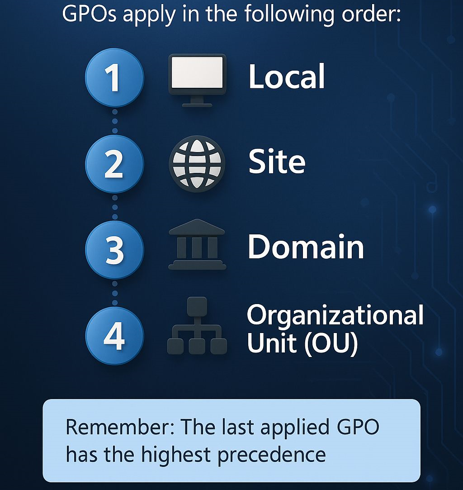

# Directivas de Grupo en Sistemas Operativos en Red

## Introducción

### Objetivos de la unidad

Los objetivos a alcanzar en esta unidad de trabajo son los siguientes:

* Utilizar máquinas virtuales para administrar dominios y verificar su funcionamiento.
* Bloquear accesos no autorizados al dominio.
* Hacer cumplir los requerimientos de seguridad.
* Implementar, verificar y asignar directivas de grupo.

### Conceptos clave

Los conceptos más importantes de esta unidad son:

* **Directivas de grupo (GPO)**: Conjunto de reglas y configuraciones que permiten controlar el entorno de trabajo de usuarios y equipos en un dominio de Active Directory.
* **Ámbito de aplicación**: Determinación de a qué usuarios, grupos u ordenadores afecta una directiva.
* **Herencia y precedencia**: Orden en que se aplican las directivas cuando existen múltiples políticas.
* **Seguridad y auditoría**: Implementación de medidas de protección mediante directivas.

### Conocimiento previo

Antes de comenzar esta unidad de trabajo, el alumno debería saber:

* Cómo utilizar software de virtualización para crear máquinas virtuales.
* Cómo gestionar los usuarios, grupos y recursos del dominio.
* Cómo utilizar la terminal para realizar tareas básicas en una máquina.
* Conceptos básicos de Active Directory y controladores de dominio.

---

## Directivas de Grupo

Las **Directivas de Grupo** (*Group Policy Objects* o ***GPO***) son una característica fundamental de Active Directory que permite a los administradores gestionar y configurar de forma centralizada los sistemas operativos, aplicaciones y configuraciones de usuario en un entorno de red Windows.

### Características principales

* **Centralización**: Permite aplicar configuraciones desde un único punto a múltiples equipos y usuarios.
* **Automatización**: Las políticas se aplican automáticamente sin intervención manual.
* **Seguridad**: Facilita la implementación de políticas de seguridad homogéneas en toda la organización.
* **Eficiencia**: Reduce el tiempo de administración y minimiza errores de configuración.

### Tipos de configuraciones

Las directivas de grupo se dividen en dos categorías principales:

1. **Configuración del equipo**: Afecta a los ordenadores independientemente del usuario que inicie sesión. Se aplica durante el arranque del sistema.

2. **Configuración de usuario**: Afecta a usuarios específicos independientemente del equipo donde inicien sesión. Se aplica durante el inicio de sesión.

## Estructura y jerarquía de las GPO

### Niveles de aplicación de las directivas

Las directivas de grupo se aplican siguiendo una jerarquía específica conocida como **LSDOU** (Local, Site, Domain, Organizational Unit). Este orden determina la secuencia en que se procesan las políticas:

1. **Local (L)**: Directivas locales del equipo. Se aplican primero y son las menos prioritarias.
2. **Site (S)**: Directivas asociadas al sitio de Active Directory.
3. **Domain (D)**: Directivas aplicadas a nivel de dominio.
4. **Organizational Unit (OU)**: Directivas vinculadas a Unidades Organizativas. Son las más prioritarias.

!!! note "Orden de prioridad"
    Las directivas aplicadas más tarde en la jerarquía tienen prioridad sobre las anteriores. Una GPO vinculada a una OU sobrescribirá configuraciones conflictivas de las GPO de dominio o sitio.

<figure markdown="span" align="center">
  { width="70%" }
  <figcaption>Esquema jerarquía LSDOU indicada el orden de aplicación y prioridad.</figcaption>
</figure>

!!! example "Ejemplo práctico"
    Si existe una directiva de dominio que establece el fondo de escritorio en azul, pero una directiva de OU lo establece en rojo, el usuario de esa OU verá el fondo rojo.

### Componentes de una GPO

Cada directiva de grupo está compuesta por varios elementos:

#### Contenedor de GPO

Almacenado en Active Directory, contiene:

* **Nombre y propiedades** de la directiva
* **GUID** (Identificador único global)
* **Información de versión**
* **Enlaces** a ubicaciones del dominio

#### Plantilla de GPO (GPC y GPT)

* **GPC (Group Policy Container)**: Información almacenada en Active Directory con propiedades y configuración de la GPO.
* **GPT (Group Policy Template)**: Archivos almacenados en `SYSVOL` que contienen la configuración detallada de las políticas.

!!! info "Ubicación en SYSVOL"
    Los archivos GPT se encuentran en: `\\dominio\SYSVOL\dominio\Policies\{GUID}`

    <figure markdown="span" align="center">
    { width="80%" }
    <figcaption>Explorador de Windows mostrando la carpeta SYSVOL y la estructura de carpetas de las GPO.</figcaption>
    </figure>

