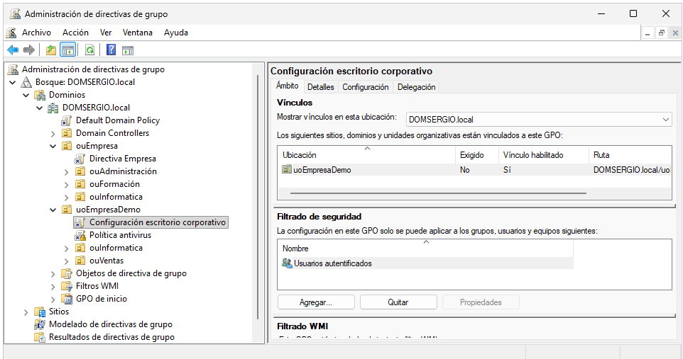
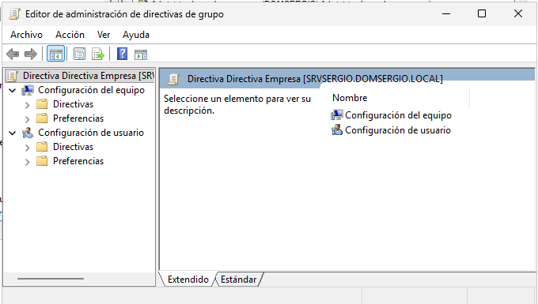
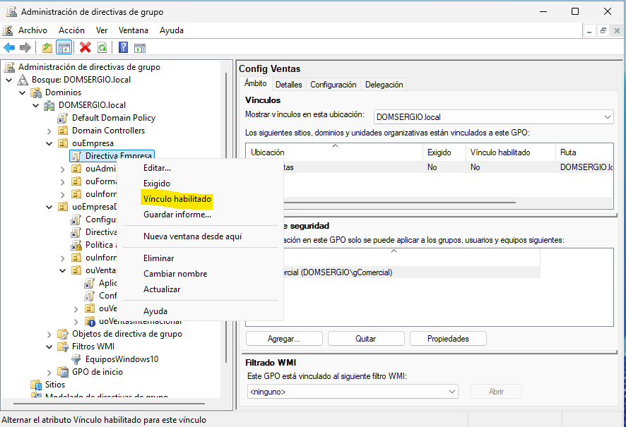

## Herramientas de administración

### Group Policy Management Console (GPMC)

La **Consola de administración de directivas de grupo** (GPMC) es la herramienta principal para gestionar GPO en entornos Windows Server. Proporciona una interfaz gráfica centralizada para:

* Crear y editar directivas de grupo
* Vincular GPO a contenedores de Active Directory
* Analizar la aplicación de directivas
* Generar informes y realizar copias de seguridad

**Acceso a GPMC:**

* Desde el menú Inicio: `Herramientas administrativas → Administración de directivas de grupo`
* Ejecutar: `gpmc.msc`
* Desde el Administrador del servidor: `Herramientas → Administración de directivas de grupo`

<figure markdown="span" align="center">
    { width="90%" }
    <figcaption>Ventana principal de GPMC mostrando el árbol de navegación con el dominio, las OU y las GPO existentes.</figcaption>
</figure>

### Group Policy Editor

El **Editor de directivas de grupo** permite configurar los parámetros específicos dentro de una GPO. Se accede desde GPMC al hacer clic derecho sobre una GPO y seleccionar "Editar".

**Estructura del Editor:**

* **Configuración del equipo**: Políticas que afectan a los ordenadores
* **Configuración de usuario**: Políticas que afectan a los usuarios

Cada sección contiene:

* **Directivas**: Configuraciones administrativas permanentes
* **Preferencias**: Configuraciones que el usuario puede modificar

<figure markdown="span" align="center">
    { width="70%" }
    <figcaption>Editor de directivas de grupo.</figcaption>
</figure>

## Creación de una nueva GPO

### Método 1: Crear GPO desde GPMC

**Pasos para crear una GPO:**

1. Abrir la **Consola de administración de directivas de grupo** (GPMC)
2. Navegar hasta el dominio o la OU donde se desea crear la GPO
3. Hacer clic derecho sobre **"Group Policy Objects"** en el panel izquierdo
4. Seleccionar **"New"** (Nuevo)
5. Introducir un **nombre descriptivo** para la GPO
6. (Opcional) Seleccionar una GPO de origen como plantilla
7. Hacer clic en **"OK"**

!!! tip "Convenciones de nomenclatura"
    Utiliza nombres que describan claramente el propósito de la GPO:
    
    * `SEC-Restricciones-Usuarios-Invitados`
    * `SOFT-Instalacion-Office-Contabilidad`
    * `CONFIG-Escritorio-Departamento-IT`
    
    Puedes usar prefijos como SEC (seguridad), SOFT (software), CONFIG (configuración), etc.

<figure markdown="span" align="center">
    { width="70%" }
    <figcaption>Nueva directiva de grupo.</figcaption>
</figure>

### Método 2: Crear y vincular directamente

También es posible crear una GPO y vincularla simultáneamente a una ubicación:

1. Hacer clic derecho sobre el **dominio o OU** deseada
2. Seleccionar **"Create a GPO in this domain, and Link it here..."**
3. Introducir el nombre de la GPO
4. La GPO se crea y vincula automáticamente a esa ubicación

<figure markdown="span" align="center">
    { width="70%" }
    <figcaption>Nueva directiva de grupo en Unidad Organizativa y vincularla.</figcaption>
</figure>


!!! warning "Diferencia importante"
    Con el primer método, la GPO se crea pero **no se vincula** automáticamente. Con el segundo método, se crea **y vincula** al mismo tiempo.


## Vinculación de GPO

Una vez creada una GPO, debe **vincularse** a un contenedor (sitio, dominio u OU) para que tenga efecto. Una misma GPO puede estar vinculada a múltiples ubicaciones.

### Vincular una GPO existente

**Pasos:**

1. En GPMC, navegar hasta la **ubicación** deseada (dominio o OU)
2. Hacer clic derecho sobre ella
3. Seleccionar **"Link an Existing GPO..."**
4. Elegir la GPO de la lista
5. Hacer clic en **"OK"**

<figure markdown="span" align="center">
    { width="70%" }
    <figcaption>Vincular directiva exitente a UO.</figcaption>
</figure>

### Desvincular una GPO

Para eliminar el vínculo sin borrar la GPO:

1. Navegar hasta la ubicación vinculada
2. Hacer clic derecho sobre el **vínculo de la GPO**
3. Seleccionar **"Delete"** → **"Remove link"**

!!! danger "Atención: Eliminar vs Desvincular"
    * **Remove link**: Solo elimina el vínculo, la GPO sigue existiendo
    * **Delete GPO**: Elimina completamente la GPO de Active Directory


### Habilitar y deshabilitar vínculos de GPO

Los vínculos de GPO pueden habilitarse o deshabilitarse temporalmente sin eliminarlos:

**Deshabilitar un vínculo:**

1. Navegar hasta la ubicación donde está vinculada la GPO
2. Hacer clic derecho sobre el **vínculo**
3. Seleccionar **"Link Enabled"** (quitar marca)

El vínculo aparecerá en **gris** indicando que está deshabilitado.

!!! tip "Uso práctico"
    Esto es útil para probar el impacto de una GPO o deshabilitarla temporalmente sin perder la configuración.


<figure markdown="span" align="center">
    { width="80%" }
    <figcaption>Vinculo Habilitado o Deshabilitado.</figcaption>
</figure>


## Editar y configurar una GPO

Una vez creada la GPO, es necesario **editarla** para añadir las configuraciones deseadas.

Las directivas de grupo son, en esencia, **un conjunto de opciones y características del sistema operativo** que se pueden activar, desactivar o configurar de forma centralizada. Cada directiva representa una configuración específica (como "longitud mínima de contraseña", "ocultar panel de control" o "instalar software automáticamente") que normalmente se configuraría manualmente en cada equipo. Mediante GPO, el administrador simplemente **habilita, deshabilita o ajusta** estos parámetros en el servidor, y se aplican automáticamente a todos los equipos y usuarios del dominio según corresponda.

El trabajo del administrador consiste en **navegar por el árbol de directivas disponibles**, localizar las configuraciones relevantes para su organización, y establecer su estado y valores. Windows proporciona **miles de directivas predefinidas** organizadas en categorías lógicas, listas para ser configuradas según las necesidades de seguridad, productividad y estandarización del entorno.

#### Acceder al Editor de directivas

1. En GPMC, hacer clic derecho sobre la GPO en **"Objetos de directiva de grupo"**
2. Seleccionar **"Editar"**
3. Se abre el **Editor de administración de directivas de grupo**

[...continúa el resto como estaba...]


Una vez creada la GPO, es necesario **editarla** para añadir las configuraciones deseadas.

### Acceder al Editor de directivas

1. En GPMC, hacer clic derecho sobre la GPO en **"Objetos de directiva de grupo"**
2. Seleccionar **"Editar"**
3. Se abre el **Editor de administración de directivas de grupo**

<figure markdown="span" align="center">
    { width="80%" }
    <figcaption>Menú contextual de una GPO mostrando las opciones, con "Editar" resaltada..</figcaption>
</figure>

### Configurar una directiva

**Ejemplo: Bloquear la barra de tareas**

1. Navegar por el árbol hasta la directiva deseada:
   ```
   Configuración de usuario
   └── Directivas
       └── Plantillas administrativas
           └── Menú Inicio y barra de tareas
   ```

2. En el panel derecho, parecen las posibles opciones que podemos modificar sobre estos elementos y debemos hacer **doble clic** sobre la configuración que deseemos habilitar (o deshabilitar en caso de tenerla previamente habilitada)
   
    <figure markdown="span" align="center">
        { width="70%" }
        <figcaption>Ventana de propiedades de una directiva.</figcaption>
    </figure>

3. Seleccionar el estado deseado:
    * **No configurada**: La GPO no modifica esta configuración (por defecto)
    * **Habilitada**: Activa la directiva
    * **Deshabilitada**: Desactiva explícitamente la directiva
   
    <figure markdown="span" align="center">
        { width="70%" }
        <figcaption>Ventana de propiedades de una directiva.</figcaption>
    </figure>

4. (Opcional) Configurar opciones adicionales si las hay

5. (Opcional) Añadir un **comentario** para documentar el propósito

6. Hacer clic en **"Aceptar"**


!!! info "Estados de una directiva"
    * **No configurada**: La GPO no toca esa configuración
    * **Habilitada**: Activa la función o restricción
    * **Deshabilitada**: Desactiva explícitamente (diferente a "no configurada")

### Ver la configuración de una GPO

Para consultar qué configuraciones tiene una GPO sin editarla:

1. En GPMC, seleccionar la GPO (un solo clic)
2. En el panel derecho, ir a la pestaña **"Configuración"**
3. Se muestra un informe jerárquico de todas las configuraciones aplicadas

**Qué muestra:**
* Lista de directivas **habilitadas** y **deshabilitadas**
* Valores configurados
* Organización por categorías (Seguridad, Software, Plantillas administrativas, etc.)

**Navegación:**
* **"Mostrar todo"**: Expande todas las secciones
* **"Ocultar todo"**: Contrae todas las secciones
* Solo aparecen directivas que están **configuradas** (no las que están en "No configurada")

<figure markdown="span" align="center">
    { width="80%" }
    <figcaption>Ventana de propiedades de una directiva.</figcaption>
</figure>


## Ámbito de aplicación

El ámbito de una GPO determina **a quién afecta** y puede configurarse mediante varios mecanismos:

### Ubicación del vínculo

La ubicación donde se vincula la GPO determina el ámbito básico:

| Ubicación | Afecta a |
|-----------|----------|
| **Sitio** | Todos los usuarios y equipos del sitio AD |
| **Dominio** | Todos los usuarios y equipos del dominio |
| **OU** | Solo usuarios y equipos de esa OU (y sub-OU si hereda) |

<figure markdown="span" align="center">
    { width="80%" }
    <figcaption>Ámbito de aplicación de una directiva.</figcaption>
</figure>

### Filtrado de seguridad (Security Filtering)

Permite **restringir** la aplicación de la GPO a usuarios, grupos o equipos específicos dentro del ámbito de vinculación.

**Configurar filtrado de seguridad:**

1. Seleccionar la GPO en GPMC
2. En el panel derecho, ir a la pestaña **"Scope"**
3. En la sección **"Security Filtering"**:
   * Añadir entidades: clic en **"Add"**
   * Eliminar entidades: seleccionar y clic en **"Remove"**

!!! info "Permisos necesarios"
    Para que una GPO se aplique, la entidad debe tener los permisos:
    
    * **Lectura** (Read)
    * **Aplicar directiva de grupo** (Apply Group Policy)

!!!example "**Ejemplo práctico:**"

    Crear una GPO vinculada al dominio pero que solo afecte al grupo "Ventas":

    1. Crear GPO `Config Ventas`
    2. Vincular al dominio
    3. En Security Filtering, **eliminar** "Authenticated Users"
    4. **Añadir** el grupo "gComercial"

    <figure markdown="span" align="center">
        { width="80%" }
        <figcaption>Filtrado de seguridad.</figcaption>
    </figure>

!!!note "Filtrado vs ubicación"

    Es siempre aconsejable ubicar correctamente las directivas en las **Unidades Organizativas** adecuadas que ubicarlas en el dominio directamente y filtrar por **grupos**. Es mejor dejar en este filtrado "**Usuarios autentificados**" o "**Equipos del dominio**"

### Filtros WMI (Windows Management Instrumentation)

Los **filtros WMI** permiten aplicar GPO basándose en características del sistema, como:

* Versión del sistema operativo
* Espacio libre en disco
* Tipo de hardware
* Configuración de red

**Crear un filtro WMI:**

1. En GPMC, expandir el dominio
2. Hacer clic derecho en **"Filtros WMI"**
3. Seleccionar **"Nuevo"**
4. Introducir nombre y descripción
5. Añadir **consultas WMI**
6. Guardar el filtro

**Aplicar filtro WMI a una GPO:**

1. Seleccionar la GPO en GPMC
2. En la pestaña **"Scope"**, sección **"WMI Filtering"**
3. Seleccionar el filtro del desplegable

**Ejemplo de consulta WMI:**

```sql
-- Aplicar solo a Windows 10/11
SELECT * FROM Win32_OperatingSystem WHERE Version LIKE "10.%"

-- Aplicar solo a equipos con más de 100GB libres
SELECT * FROM Win32_LogicalDisk WHERE FreeSpace > 107374182400 AND DriveType = 3
```

<figure markdown="span" align="center">
    { width="80%" }
    <figcaption>Creación de filtros WMI.</figcaption>
</figure>

!!! warning "Rendimiento"
    Los filtros WMI requieren procesamiento adicional y pueden ralentizar la aplicación de GPO. Úsalos solo cuando el filtrado de seguridad no sea suficiente.

## Deshabilitar secciones de una GPO

Si una GPO solo necesita configurar equipos o usuarios (no ambos), se puede **deshabilitar la sección no utilizada** para mejorar el rendimiento:

1. Hacer clic derecho sobre la GPO
2. Seleccionar **"GPO Status"**
3. Elegir una opción:
   * **User configuration settings disabled**: Solo se aplica configuración de equipo
   * **Computer configuration settings disabled**: Solo se aplica configuración de usuario
   * **All settings disabled**: La GPO está deshabilitada completamente

<figure markdown="span" align="center">
    { width="80%" }
    <figcaption>Opciones de estado de una directiva.</figcaption>
</figure>

## Copiar y guardar copias de seguridad de GPO

### Realizar copia de seguridad

Es fundamental realizar copias de seguridad de las GPO antes de modificaciones importantes:

1. Hacer clic derecho sobre la GPO en GPMC
2. Seleccionar **"Back Up..."**
3. Elegir ubicación de destino
4. Introducir descripción (opcional)
5. Hacer clic en **"Back Up"**

#### Restaurar desde copia de seguridad

1. Hacer clic derecho sobre la GPO
2. Seleccionar **"Restore from Backup..."**
3. Elegir la ubicación de las copias
4. Seleccionar la copia a restaurar
5. Confirmar la restauración

<figure markdown="span" align="center">
    { width="80%" }
    <figcaption>Menú guardar copia de seguridad de GPO y restaurar.</figcaption>
</figure>

#### Copiar una GPO

Para duplicar una GPO existente:

1. Hacer clic derecho sobre la GPO de origen
2. Seleccionar **"Copy"**
3. Hacer clic derecho sobre "Group Policy Objects"
4. Seleccionar **"Paste"**
5. Elegir permisos a copiar:
   * **Preserve existing permissions**: Mantiene los permisos actuales
   * **Use default permissions**: Aplica permisos por defecto
   * **Copy from source**: Copia los permisos de la GPO original

!!! tip "Uso de copias"
    Las copias son útiles para crear variantes de GPO similares o para probar cambios sin afectar la GPO original.

Perfecto, aquí tienes una versión equilibrada:


## Delegación de permisos en GPO

La **delegación** es el proceso de otorgar permisos específicos a usuarios o grupos para que puedan realizar tareas administrativas sobre las GPO sin necesidad de ser administradores del dominio.

Siguiendo el **principio de mínimo privilegio**, la delegación permite:

* **Reducir riesgos de seguridad**: Menos cuentas con privilegios totales
* **Distribuir responsabilidades**: Cada departamento gestiona sus propias directivas
* **Mejorar eficiencia**: No todo depende del equipo de IT central

!!! example "Ejemplo práctico"
    El responsable IT del departamento de Marketing puede editar la GPO "CONFIG-Marketing" y vincularla a su OU, pero **no puede** modificar GPO de otros departamentos ni configuraciones críticas del dominio.

### Tipos de permisos en GPO

Los permisos más comunes que se pueden delegar son:

| Permiso | Qué permite hacer |
|---------|-------------------|
| **Lectura** | Ver la configuración de la GPO y generar informes |
| **Editar configuración** | Modificar los parámetros de la GPO |
| **Editar configuración, eliminar, modificar seguridad** | Control total: editar, eliminar y cambiar permisos |
| **Vincular GPO** | Vincular/desvincular GPO a una OU específica |
| **Crear objetos GPO** | Crear nuevas GPO en el dominio |

!!! info "Permisos para aplicación de GPO"
    Para que una GPO se aplique a un usuario/equipo, debe tener:
    
    * ✅ Lectura (Read)
    * ✅ Aplicar directiva de grupo (Apply Group Policy)

### Ver permisos actuales de una GPO

1. En GPMC, seleccionar la GPO en "Objetos de directiva de grupo"
2. En el panel derecho, ir a la pestaña **"Delegación"**
3. Ver la lista de usuarios/grupos con permisos

**Permisos por defecto al crear una GPO:**

* Administradores del dominio: Control total
* Administradores de organización: Control total
* SISTEMA y Usuarios autenticados: Lectura y aplicar

<figure markdown="span" align="center">
    { width="80%" }
    <figcaption>Pestaña "Delegación" mostrando la tabla con nombres de usuarios/grupos y sus permisos.</figcaption>
</figure>

### Delegar permisos sobre una GPO

**Pasos:**

1. Seleccionar la GPO en "Objetos de directiva de grupo"
2. Ir a la pestaña **"Delegación"**
3. Hacer clic en **"Agregar..."**
4. Escribir el nombre del usuario o grupo → **"Comprobar nombres"** → **"Aceptar"**
5. Seleccionar el nivel de permiso:
   * Lectura
   * Editar configuración
   * Editar configuración, eliminar, modificar seguridad
6. Hacer clic en **"Aceptar"**

**Para permisos más específicos:**

1. Hacer clic derecho sobre la GPO → **"Propiedades"**
2. Pestaña **"Seguridad"**
3. Agregar usuarios/grupos y configurar permisos detallados
4. Aplicar cambios

### Delegar la creación de GPO

Para permitir que un usuario pueda crear nuevas GPO:

1. En GPMC, hacer clic derecho sobre **"Objetos de directiva de grupo"**
2. Seleccionar **"Delegar control..."**
3. **"Agregar..."** → Seleccionar usuario/grupo → **"Siguiente"**
4. Marcar **"Crear objetos de directiva de grupo"**
5. **"Siguiente"** → **"Finalizar"**

### Delegar la vinculación de GPO a una OU

Para permitir vincular GPO a una OU específica:

1. Hacer clic derecho sobre la **OU**
2. Seleccionar **"Delegar control..."**
3. **"Agregar..."** → Seleccionar usuario/grupo → **"Siguiente"**
4. Marcar **"Vincular GPO"**
5. **"Siguiente"** → **"Finalizar"**

**Qué puede hacer el usuario:**

* ✅ Vincular/desvincular GPO de esa OU
* ✅ Cambiar orden de vínculos y marcar como Forzado
* ❌ NO puede editar el contenido de las GPO

### Quitar permisos delegados

1. Seleccionar la GPO → Pestaña **"Delegación"**
2. Seleccionar el usuario/grupo
3. Hacer clic en **"Quitar"**
4. Confirmar

!!!tip "Buenas prácticas"

    * **Delega a grupos, no a usuarios individuales**: Más fácil de gestionar
    * **Mínimo privilegio**: Solo los permisos necesarios para la tarea
    * **Documenta**: Registra quién tiene permisos y por qué
    * **Revisa periódicamente**: Audita y revoca permisos innecesarios
    * **Separa responsabilidades**: Quien crea ≠ quien vincula ≠ quien aprueba

!!! warning "Seguridad"
    Ten especial cuidado al delegar permisos sobre GPO de seguridad críticas. Una mala configuración puede comprometer todo el dominio.

