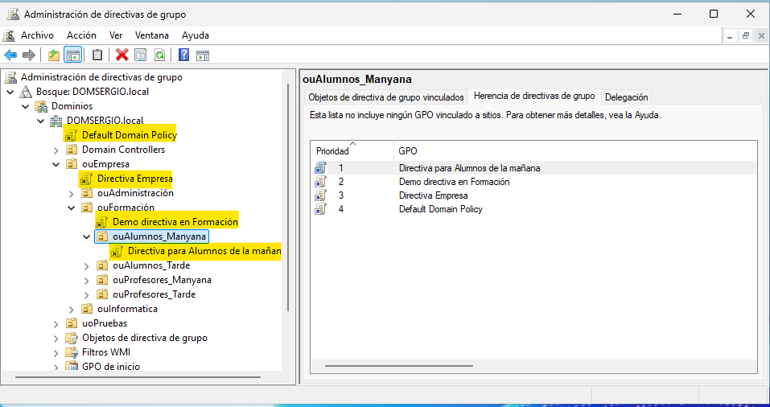

Las directivas de grupo siguen un modelo de **herencia jerárquica**, donde las configuraciones se propagan desde los niveles superiores hacia los inferiores.

### Funcionamiento de la herencia

* Las **OU hijas** heredan las GPO de las **OU padres**
* Un usuario u ordenador puede recibir configuraciones de **múltiples GPO**
* Las configuraciones **no conflictivas** se acumulan
* Las configuraciones **conflictivas** se resuelven según la prioridad

<figure markdown="span" align="center">
  { width="80%" }
  <figcaption>Herencia de directivas. Ejemplo.</figcaption>
</figure>


## Modificadores de herencia

Existen mecanismos para alterar el comportamiento por defecto:

### 1. Exiigido (Enforced) - "Esta GPO no se puede sobrescribir"

Cuando se marca una GPO como **"Exigido"**, sus configuraciones **no pueden ser sobrescritas** por GPO de niveles inferiores, independientemente de la jerarquía.

**Uso de Exigido**

* La GPO marcada como `Exiigido` se aplica con **prioridad absoluta**
* Se **reaplica al final** del procesamiento, sobrescribiendo cualquier configuración conflictiva
* **Ignora** el Bloquear Herencia de OUs inferiores

!!!example "**Ejemplo práctico:**"

    ```
    Dominio: empresa.local
    ├── GPO-Dominio: "Fondo corporativo azul" ⚠️ EXIGIDO
    │
    └── OU: Marketing
        └── GPO-Marketing: "Fondo corporativo rojo"
    ```

    **Resultado para usuarios en OU Marketing:**

    - Aunque GPO-Marketing está más abajo en la jerarquía, el fondo será **AZUL** porque GPO-Dominio tiene Exigido
    - Las configuraciones de GPO-Dominio con Exigido siempre prevalecen

**¿Cuándo usar Enforced/Exigido?**

* **Políticas de seguridad corporativas** obligatorias para toda la organización
* **Requisitos legales o normativos** que no pueden ser modificados
* **Configuraciones críticas** que deben aplicarse sin excepciones

!!! example "Casos de uso reales"
    * Política de contraseñas mínima de 12 caracteres
    * Instalación obligatoria de software antivirus
    * Restricciones de instalación de software no autorizado
    * Configuraciones de auditoría de seguridad

**Cómo activar `Exiigido`:**

1. En GPMC, navegar hasta la **ubicación donde está vinculada la GPO**
2. Hacer clic derecho sobre el **vínculo de la GPO** (no sobre la GPO en Group Policy Objects)
3. Seleccionar **"Exigido"** (aparecerá una marca ✓)
4. El vínculo mostrará un **icono de candado** 🔒


<figure markdown="span" align="center">
  { width="70%" }
  <figcaption>Menú contextual de un vínculo de GPO mostrando la opción "Exigido" marcada, y el árbol de GPMC con el icono de candado junto al nombre de la GPO vinculada.</figcaption>
</figure>


### 2. Bloqueo de herencia (Block Inheritance) 

Se puede aplicar **Bloquear Herencia** a una OU para **impedir** que reciba GPO vinculadas a niveles superiores (dominio, sitio, OUs padres), es como dedir **"No quiero heredar GPO superiores"**. Sin embargo, las GPO marcadas como "Enforced" **ignoran** este bloqueo.

**¿Qué hace Bloquear Herencia?**

* Bloquea **todas** las GPO vinculadas a niveles superiores
* Solo se aplican las GPO vinculadas directamente a esa OU (y a sus sub-OU)
* Las GPO con **Exigido** ignoran este bloqueo y se aplican igualmente

!!! example "**Ejemplo práctico:**"

    ```
    Dominio: empresa.local
    ├── GPO-Dominio-A: "Configuración general"
    ├── GPO-Dominio-B: "Restricciones básicas"
    │
    └── OU: Desarrollo 🛡️ BLOCK INHERITANCE
        └── GPO-Dev: "Herramientas desarrollo"
    ```

    **Resultado para usuarios en OU Desarrollo:**

    - GPO-Dominio-A: ❌ **Bloqueada**
    - GPO-Dominio-B: ❌ **Bloqueada**
    - GPO-Dev: ✅ **Se aplica** (está vinculada directamente a la OU)

**¿Cuándo usar Bloquear Herencia?**

* **Departamentos con total autonomía** administrativa
* **Entornos de desarrollo o pruebas** que requieren configuraciones específicas
* **OUs con requisitos completamente diferentes** al resto de la organización

!!! warning "Usar con precaución"
    Bloquear Herencia puede provocar que políticas de seguridad importantes no se apliquen. Solo debe usarse cuando sea estrictamente necesario y con plena comprensión de las consecuencias. **Documenta siempre** por qué se activó el bloqueo.

**Cómo activar Bloquear Herencia:**

1. En GPMC, hacer clic derecho sobre la **OU**
2. Seleccionar **"Bloquear Herencia"** (aparecerá una marca ✓)
3. La OU mostrará un **icono de escudo azul** 🛡️

<figure markdown="span" align="center">
  { width="70%" }
  <figcaption>Menú contextual de una OU mostrando la opción "Bloquear Herencia" y el árbol de GPMC con el icono de escudo azul junto al nombre de la OU.</figcaption>
</figure>


## `Exigido` vs `Bloquear Herencia`

Debemos tener claro qué es lo que pasa cuando existe conflicto entre estas dos opciones y saber cual de las dos tiene más prioridad a la hora de aplicarse. 

La solución es sencilla: **`EXIGIDO` SIEMPRE GANA**. Una GPO con `Exigido` se aplica **incluso si hay `Bloquear Herencia`** en el camino.

!!!example "**Ejemplo del conflicto:**"

    ```
    Dominio: empresa.local
    ├── GPO-Seguridad: "Antivirus corporativo" ⚠️ EXIGIDO
    │
    └── OU: Laboratorio 🛡️ BLOCK INHERITANCE
        └── GPO-Lab: "Configuración laboratorio"
    ```

    **Resultado para usuarios en OU Laboratorio:**

    - GPO-Seguridad: ✅ **Se aplica** (Exigido ignora Bloquear Herencia)
    - GPO-Lab: ✅ **Se aplica**

**Regla de oro:**

```
EXIGIDO > Bloquear Herencia
```

!!! info "Jerarquía de prioridad completa"
    1. **GPO con Exigido** (máxima prioridad, aplicación obligatoria)
    2. **GPO de OU más específica** (más cercana al objeto)
    3. **GPO de OU padre**
    4. **GPO de dominio**
    5. **GPO de sitio**
    6. **GPO local** (menor prioridad)
    
    El Bloquear Herencia bloquea del punto 2 al 6, pero **NO** bloquea GPO con Exigido.


## Visualización de la herencia: Group Policy Inheritance

Para verificar exactamente qué GPO se aplican a una OU y en qué orden:

1. En GPMC, seleccionar la **OU** deseada
2. En el panel derecho, ir a la pestaña **"Group Policy Inheritance"**
3. Ver la lista ordenada que muestra:
   - **Precedence**: Número de prioridad (1 = máxima prioridad)
   - **GPO**: Nombre de la directiva
   - **Location**: Dónde está vinculada (dominio, OU padre, OU actual)
   - **Exigido**: Si la GPO tiene EXIGIDO activado
   - **Link Enabled**: Si el vínculo está activo
   - **Path**: Ruta completa donde está vinculada

**Interpretación:**

* **Precedence 1** = se aplica al final, tiene máxima prioridad
* Las GPO con **"Yes"** en Exigido aparecen primero en la lista
* Si hay Bloquear Herencia, solo aparecen GPO Exigido y locales de la OU

<figure markdown="span" align="center">
  { width="80%" }
  <figcaption>Pestaña "Group Policy Inheritance" completa mostrando una tabla con varias GPO, sus números de precedencia (1, 2, 3...), ubicaciones, y columnas indicando Exigido y Link Enabled.</figcaption>
</figure>


## Ejemplos completos de herencia

A continuación tenemos dos ejemplos de aplicación de directivas con herencias:

!!!example "**Escenario 1 de ejemplo:**"

    ```
    Dominio: empresa.local
    │
    ├── GPO-A: "Política antivirus" ⚠️ EXIGIDO
    ├── GPO-B: "Configuración escritorio corporativo"
    │
    ├── OU: Ventas
    │   ├── GPO-C: "Aplicaciones ventas"
    │   │
    │   └── OU: Ventas-Internacional 🛡️ BLOCK INHERITANCE
    │       └── GPO-D: "Config internacional" ⚠️ EXIGIDO en este nivel
    │
    └── OU: IT
        └── GPO-E: "Herramientas IT"
    ```

    **Usuario en "Ventas-Internacional" recibe:**

    1. ✅ **GPO-A** (Exigido desde dominio) → Ignora Bloquear Herencia
    2. ❌ **GPO-B** → Bloqueada por Bloquear Herencia
    3. ❌ **GPO-C** (de OU padre "Ventas") → Bloqueada por Bloquear Herencia
    4. ✅ **GPO-D** (de su propia OU)

    **Orden de aplicación (prioridad):**

    | Precedence | GPO | Motivo |
    |------------|-----|--------|
    | 1 | GPO-A | EXIGIDO desde dominio (máxima prioridad) |
    | 2 | GPO-D | Vinculada a su OU (siguiente prioridad) |


    <figure markdown="span" align="center">
        { width="70%" }
        <figcaption>Ventana de GPMC mostrando el resultado de "Group Policy Inheritance" para esta OU específica, con las dos GPO listadas y sus respectivas precedencias.</figcaption>
    </figure>


!!!example "Escenario 2 de ejemplo"

    ```
    Dominio: empresa.local
    │
    ├── GPO-A: "Política antivirus" ⚠️ EXIGIDO
    ├── GPO-B: "Fondo corporativo"
    │
    ├── OU: Administración
    │   └── GPO-C: "Restricciones admin"
    │
    └── OU: Desarrollo 🛡️ BLOCK INHERITANCE
        ├── GPO-D: "Herramientas dev"
        │
        └── OU: Desarrollo-Junior ⚠️ GPO-E vinculada con EXIGIDO
            └── GPO-F: "Restricciones junior"
    ```

    **Usuario en OU "Desarrollo-Junior" recibe:**

    1. ✅ **GPO-A** (Exigido desde dominio) - Pasa el Bloquear Herencia
    2. ❌ **GPO-B** - Bloqueada por Bloquear Herencia de "Desarrollo"
    3. ❌ **GPO-C** - No le afecta (está en otra rama)
    4. ✅ **GPO-D** (OU padre "Desarrollo")
    5. ✅ **GPO-E** (Exigido en su OU)
    6. ✅ **GPO-F** (Su propia OU)

    **Orden de prioridad final:**

    ```
    GPO-A (Exigido dominio)  ← Máxima prioridad
    GPO-E (Exigido en OU)    ← Alta prioridad
    GPO-F                     ← Prioridad media
    GPO-D                     ← Menor prioridad
    ```


## Directivas en conflicto

Cuando dos o más directivas configuran el mismo parámetro con valores diferentes:

| Situación | Resultado |
|-----------|-----------|
| Configuración de equipo vs Configuración de usuario | **Equipo prevalece** (por defecto) |
| GPO de dominio vs GPO de OU | **OU prevalece** |
| GPO con Exigido vs GPO normal | **Exigido prevalece** |
| Varias GPO en misma OU | **Link Order menor prevalece** |

!!! tip "Buena práctica"
    Documenta siempre las directivas aplicadas y su propósito. Utiliza nombres descriptivos para las GPO que indiquen claramente su función.


## Herramienta de visualización: Group Policy Inheritance

Para ver exactamente qué GPO se aplican a una OU específica:

1. En GPMC, seleccionar la **OU**
2. Ir a la pestaña **"Group Policy Inheritance"** en el panel derecho
3. Ver lista ordenada de GPO que se aplican, indicando:
   - **Precedence** (orden de prioridad, 1 = máxima)
   - **GPO Name** (nombre de la GPO)
   - **Location** (dónde está vinculada)
   - Si tiene **Exigido** o está **bloqueada**


<figure markdown="span" align="center">
    { width="90%" }
    <figcaption>Administrador directivas de grupo. Vista prioridades aplicación.</figcaption>
</figure>
