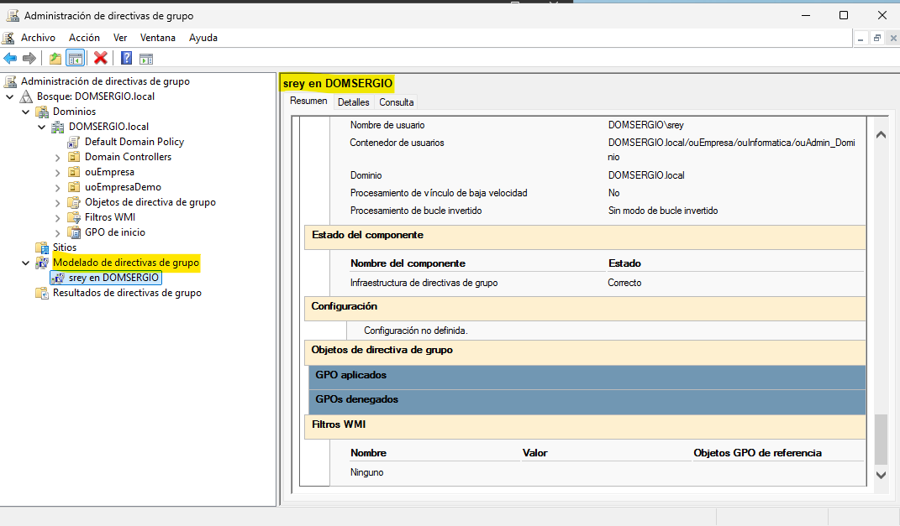

## Herramientas de diagnóstico y resolución de problemas

Una vez configuradas las directivas de grupo, es fundamental saber cómo verificar su aplicación y solucionar problemas cuando no funcionan como se espera.

### Comandos esenciales de GPO

#### `gpupdate` - Forzar actualización de directivas

Por defecto, las directivas se actualizan automáticamente cada 90 minutos (con variación aleatoria de ±30 minutos) en equipos cliente, y cada 5 minutos en controladores de dominio. Para aplicar cambios inmediatamente:

**Sintaxis básica:**

```cmd
gpupdate [/target:{computer|user}] [/force] [/wait:segundos] [/logoff] [/boot]
```

**Parámetros más utilizados:**

| Parámetro | Descripción |
|-----------|-------------|
| `/target:computer` | Solo actualiza directivas de equipo |
| `/target:user` | Solo actualiza directivas de usuario |
| `/force` | Vuelve a aplicar todas las directivas (incluso las no modificadas) |
| `/wait:valor` | Tiempo de espera en segundos (-1 = esperar indefinidamente, 0 = no esperar) |
| `/logoff` | Cierra sesión si las directivas de usuario requieren procesamiento en primer plano |
| `/boot` | Reinicia si las directivas de equipo requieren procesamiento en primer plano |

**Ejemplos de uso:**

```cmd
# Actualizar todas las directivas (usuario y equipo)
gpupdate /force

# Actualizar solo directivas de usuario
gpupdate /target:user /force

# Actualizar y cerrar sesión si es necesario
gpupdate /force /logoff

# Actualizar y reiniciar si es necesario
gpupdate /force /boot
```

<figure markdown="span" align="center">
    { width="85%" }
    <figcaption>Ventana de CMD mostrando la ejecución de `gpupdate /force` con los mensajes de progreso y finalización exitosa.</figcaption>
</figure>

!!! tip "Cuándo usar /force"
    El parámetro `/force` es útil para:
    
    * Verificar que una GPO modificada se aplica correctamente
    * Solucionar problemas cuando parece que las directivas no se aplican
    * Después de mover un equipo/usuario a otra OU


#### `gpresult` - Ver directivas aplicadas

Muestra información detallada sobre qué GPO se han aplicado a un usuario o equipo.

**Sintaxis básica:**

```cmd
gpresult [/scope:{user|computer}] [/user:nombre] [/v] [/z] [/h:archivo.html] [/r]
```

**Parámetros más utilizados:**

| Parámetro | Descripción |
|-----------|-------------|
| `/r` | Muestra resumen de datos RSoP (Conjunto resultante de directivas) |
| `/v` | Muestra información detallada (verbose) |
| `/z` | Muestra información super detallada (incluye todos los parámetros) |
| `/scope:user` | Solo muestra directivas de usuario |
| `/scope:computer` | Solo muestra directivas de equipo |
| `/h:archivo.html` | Genera informe HTML |
| `/user:dominio\usuario` | Consulta directivas de otro usuario (requiere permisos) |

**Ejemplos de uso:**

```cmd
# Resumen básico de directivas aplicadas
gpresult /r

# Información detallada de directivas de usuario
gpresult /scope:user /v

# Información super detallada en pantalla
gpresult /z

# Generar informe HTML completo
gpresult /h C:\informeGPO.html

# Ver directivas de otro usuario (como administrador)
gpresult /user:empresa\jperez /r
```

**Interpretación del resultado:**

El comando `gpresult /r` muestra:

```
INFORMACIÓN DEL EQUIPO
----------------------
    Nombre de equipo:                CLIENTE01
    Sitio de AD:                     Default-First-Site-Name
    
CONFIGURACIÓN DEL EQUIPO
------------------------
    Controlador de dominio:          DC01.empresa.local
    Directivas de grupo aplicadas:  
        Default Domain Policy
        SEC-Seguridad-Base
        CONFIG-Escritorio-Corporativo
    
    Las siguientes GPO no se aplicaron porque se filtraron:
        SOFT-Aplicaciones-Ventas
            Filtrado: No aplicado (vacío)
            
CONFIGURACIÓN DEL USUARIO
-------------------------
    Usuario:                         EMPRESA\jperez
    Directivas de grupo aplicadas:
        Default Domain Policy
        CONFIG-Usuarios-Marketing
```

!!! tip "**IMPORTANTE. Cómo ver directivas de usuario o de equipo según la forma de ejecutar `gpresult /r`**"

    - **Si el comando se ejecuta desde un usuario cualquiera** entonces el resultado de `gpresult` muestra las **directivas aplicadas a dicho usuario**. Observar que en la siguiente imagen que se ha ejecutado el comando en un terminal y muestra las directivas del usuario

    <figure markdown="span" align="center">
        { width="85%" }
        <figcaption>Ventana de CMD mostrando la ejecución de `gpupdate /force` con los mensajes de progreso y finalización exitosa.</figcaption>
    </figure>

    - **Si el comando se ejecuta con permisos de administrador**, entonces el resultado que obtenemos son las **directivas de equipo** aplicadas. Observar que en la siguiente imagen el comando se ha ejecutado en un terminal como ***Administrador*** y por lo tanto muestra directivas de equipo

    <figure markdown="span" align="center">
        { width="85%" }
        <figcaption>Ventana de CMD mostrando la ejecución de `gpupdate /force` con los mensajes de progreso y finalización exitosa.</figcaption>
    </figure>

!!! info "Interpretar GPO no aplicadas"
    Si una GPO aparece en "no se aplicaron", verifica:
    
    * **Filtrado de seguridad**: El usuario/equipo no tiene permisos
    * **Filtro WMI**: No cumple las condiciones WMI
    * **Vínculo deshabilitado**: El vínculo de la GPO está desactivado
    * **GPO vacía**: No tiene configuraciones definidas


#### Generar informes HTML detallados

Los informes HTML son ideales para documentación y análisis exhaustivo:

```cmd
# Informe completo del usuario actual
gpresult /h C:\Informes\miGPO.html

# Informe de otro usuario (requiere privilegios de administrador)
gpresult /h C:\Informes\usuario_jperez.html /user:empresa\jperez
```

El informe HTML incluye:

* Resumen de configuración
* Lista detallada de todas las GPO aplicadas
* Configuraciones específicas de cada directiva
* GPO filtradas y razones
* Configuración de seguridad aplicada
* Scripts ejecutados
* Redirección de carpetas
* **Gráficos visuales** de la herencia de directivas


### RSOP - Conjunto resultante de directivas

**RSOP (Resultant Set of Policy)** es una herramienta gráfica que muestra exactamente qué directivas se aplican y su configuración efectiva.

Para obtener las directivas que se aplican a un usuario o equipo seguir lo siguientes pasos

1. Abrir la consola de directivas. GPMC
2. Clic derecho en **"Modelado de directiva de grupo"**
3. Seleccionar **"Asistente para el modelado de directiva de grupo..."**
4. Seguir el asistente:
   * Seleccionar controlador de dominio
   * Elegir usuario y equipo a simular
   * (Opcional) Configurar escenarios: vínculo lento, sitio específico
5. Ver resultados

Este método permite **simular** qué directivas se aplicarían en diferentes escenarios **sin aplicarlas realmente**.

<figure markdown="span" align="center">
    { width="85%" }
    <figcaption>Modelado de directiva de grupos.</figcaption>
</figure>


## Solución de problemas comunes

### Problema 1: Las GPO no se aplican

**Síntomas:**
* Configuraciones esperadas no aparecen
* Scripts no se ejecutan
* Software no se instala

**Posibles causas y soluciones:**

| Causa | Verificación | Solución |
|-------|--------------|----------|
| **GPO no vinculada** | Verificar vínculos en GPMC | Vincular la GPO a la OU correcta |
| **Vínculo deshabilitado** | Verificar marca "Link Enabled" | Habilitar el vínculo |
| **Filtrado de seguridad** | Ver "Security Filtering" en GPMC | Añadir el usuario/grupo con permisos Read y Apply |
| **Filtro WMI no cumplido** | Verificar consulta WMI | Corregir la consulta WMI o eliminarla |
| **Block Inheritance** | Verificar OU con escudo | Usar Enforced o mover la GPO |
| **Orden de prioridad** | Ver "Group Policy Inheritance" | Ajustar Link Order |
| **Sección deshabilitada** | Ver "GPO Status" | Habilitar configuración de usuario/equipo |
| **No actualizada** | Ejecutar gpupdate | `gpupdate /force` en el cliente |

**Diagnóstico paso a paso:**

1. **Verificar con gpresult**: 
   ```cmd
   gpresult /r
   ```
   ¿Aparece la GPO en las aplicadas? Si no, revisar filtrado y vínculos.

2. **Verificar prioridad**:
   ```cmd
   gpresult /h informe.html
   ```
   Ver orden de aplicación y directiva ganadora.

3. **Comprobar eventos**:
   ```
   Visor de eventos → Aplicaciones y servicios → Microsoft → Windows → GroupPolicy
   ```
   Buscar errores durante la aplicación de directivas.


### Problema 2: Conflicto entre GPO

**Síntomas:**
* Una configuración no tiene el valor esperado
* Comportamiento inconsistente

**Solución:**

1. Usar **RSoP** o **gpresult /z** para ver la "directiva ganadora"
2. Revisar el orden de aplicación (LSDOU)
3. Verificar Enforced y Block Inheritance
4. Ajustar Link Order si es necesario
5. Considerar consolidar GPO para evitar conflictos

**Herramienta de precedencia:**

En GPMC, al seleccionar una OU, la pestaña **"Group Policy Inheritance"** muestra:

* Todas las GPO que afectan a esa OU
* Orden de precedencia (1 = máxima prioridad)
* Si están Enforced o bloqueadas


<figure markdown="span" align="center">
    { width="95%" }
    <figcaption>Directivas aplicadas a una Unidad Organizativa.</figcaption>
</figure>


### Problema 3: Procesamiento lento de GPO

**Síntomas:**
* Inicio de sesión muy lento
* El equipo tarda mucho en arrancar

**Causas comunes:**

* Demasiadas GPO aplicadas
* Filtros WMI complejos
* Scripts de inicio/sesión lentos
* Problemas de red/conectividad con el DC

**Soluciones:**

1. **Consolidar GPO**: Combinar varias GPO similares en una
2. **Deshabilitar secciones no usadas**: Si una GPO solo configura equipo, deshabilitar configuración de usuario
3. **Optimizar filtros WMI**: Simplificar consultas o eliminar si no son necesarias
4. **Revisar scripts**: Optimizar código, evitar esperas innecesarias
5. **Habilitar procesamiento asíncrono**:
   ```
   Configuración del equipo → Plantillas administrativas → Sistema → Inicio de sesión
   → "Ejecutar de forma asíncrona al inicio los scripts de inicio de sesión"
   ```

**Registro de rendimiento:**

Habilitar registro detallado de tiempo de procesamiento:

```
Configuración del equipo → Plantillas administrativas → Sistema → Directiva de grupo
→ "Configurar el nivel de registro de eventos de directiva de grupo" = Detallado
```

Los tiempos se registran en:
```
Visor de eventos → Aplicaciones y servicios → Microsoft → Windows → GroupPolicy → Operational
```

Buscar Event ID **5314** (inicio de procesamiento) y **5315** (fin de procesamiento).


### Problema 4: GPO no se actualiza en el cliente

**Síntomas:**
* Cambios en la GPO no se reflejan
* `gpupdate /force` no soluciona el problema

**Soluciones:**

1. **Verificar replicación entre DC**:
   ```cmd
   repadmin /showrepl
   ```
   Asegurar que la GPO se replicó correctamente entre controladores de dominio.

2. **Verificar SYSVOL**:
   ```cmd
   # Verificar que la carpeta de la GPO existe
   dir \\dominio.local\SYSVOL\dominio.local\Policies\{GUID}
   ```

3. **Forzar registro de GPO**:
   En algunos casos, el registro local puede estar corrupto:
   ```cmd
   # Ejecutar como administrador
   gpupdate /force /sync
   ```

4. **Eliminar caché local de GPO** (último recurso):
   ```cmd
   # Detener servicio
   net stop gpsvc
   
   # Eliminar caché (como administrador)
   rd /s /q "%windir%\System32\GroupPolicy"
   rd /s /q "%windir%\System32\GroupPolicyUsers"
   
   # Reiniciar servicio
   net start gpsvc
   
   # Actualizar
   gpupdate /force
   ```

!!! danger "Precaución"
    Eliminar la caché de GPO fuerza una recarga completa. Solo úsalo cuando otras soluciones fallen.


### Problema 5: Error "No se pudo acceder al recurso de red"

**Síntomas:**
* GPO que instala software falla
* Redirección de carpetas no funciona
* Scripts no se ejecutan

**Causas:**
* Ruta UNC incorrecta
* Permisos insuficientes en el recurso compartido
* Problemas de resolución DNS
* Firewall bloqueando acceso

**Soluciones:**

1. **Verificar accesibilidad del recurso**:
   ```cmd
   # Desde el equipo afectado
   dir \\servidor\compartido
   ```

2. **Verificar permisos**:
   * Compartido: "Usuarios autenticados" o "Equipos del dominio" con al menos Lectura
   * NTFS: Permisos adecuados según el recurso

3. **Verificar DNS**:
   ```cmd
   nslookup servidor.dominio.local
   ping servidor.dominio.local
   ```

4. **Revisar firewall**: Asegurar que los puertos SMB (445) estén abiertos

