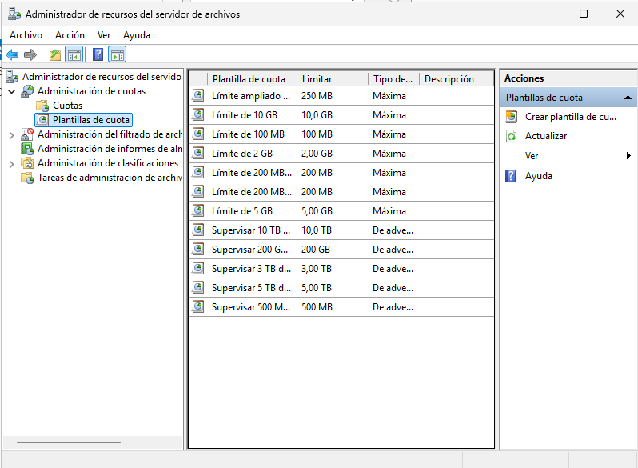

## Cuotas de Disco (Disk Quotas) 

Las cuotas de disco son una característica crucial de la gestión de almacenamiento que permite a los administradores de Windows Server **regular la cantidad de espacio en disco** que cada usuario puede consumir en un volumen específico. Esta funcionalidad se aplica exclusivamente a volúmenes formateados con el sistema de archivos **NTFS** y es esencial para prevenir que un usuario individual acapare todo el espacio de almacenamiento disponible, garantizando así la estabilidad, el rendimiento y la disponibilidad del servidor de archivos para todos los usuarios.

### Funcionamiento y Aplicación

La cuota se aplica por volumen y por usuario, no por carpeta. Una vez que la cuota está activa en un volumen, el sistema rastrea la cantidad de espacio que cada usuario consume en ese volumen, independientemente de la ubicación de los archivos.

#### Componentes Clave

* **Límite de Disco (Disk Limit):** Es la cantidad máxima de espacio permitida para el usuario.
* **Nivel de Advertencia (Warning Level):** Es un umbral de uso (generalmente un porcentaje o cantidad inferior al límite) en el que el sistema registra una notificación o evento de advertencia, alertando al usuario y al administrador antes de que se alcance el límite absoluto.

#### Tipos de Cuotas

Existen dos enfoques principales para aplicar límites, definidos por la acción que se toma al alcanzar el umbral máximo:

| Tipo de Cuota | Acción al Alcanzar el Límite | Propósito |
| :--- | :--- | :--- |
| **Cuota Rígida (Hard Quota)** | **Deniega** la escritura de nuevos datos. | Impide de forma absoluta que el usuario almacene más datos una vez superado el límite. |
| **Cuota Blanda (Soft Quota)** | **Solo registra** una entrada en el Visor de Eventos. | Permite al usuario exceder el límite, pero genera un registro para fines de monitorización y auditoría. |

### Procedimiento de Configuración en Windows Server

<figure markdown="span" align="center">
    { width="85%" }
    <figcaption>Cuotas de disco.</figcaption>
</figure>

La configuración básica de las cuotas de disco se realiza directamente en las propiedades del volumen (unidad de disco) en el **Explorador de Archivos** del servidor:

1.  **Acceso:** Abrir el Explorador de Archivos, hacer clic derecho sobre el volumen (p. ej., D:) y seleccionar **Propiedades**.
2.  **Pestaña de Cuotas:** Navegar a la pestaña **Cuotas** y hacer clic en **Mostrar configuración de cuota**.
3.  **Habilitación:** Marcar la casilla **Habilitar la administración de cuotas** (`Enable Quota Management`).
4.  **Acción Predeterminada:** Definir la acción que se tomará al exceder el límite:
    * Marcar **Denegar espacio en disco al usuario que supera el límite de cuota** para configurar una **Cuota Rígida**.
    * Dejarla desmarcada para una **Cuota Blanda**.
5.  **Valores por Defecto:**
    * Seleccionar **Limitar el espacio en disco a...**
    * Establecer el **Límite de espacio en disco** (por ejemplo, 5 GB).
    * Establecer el **Nivel de advertencia** (por ejemplo, 4 GB).
6.  **Configuración por Usuario:** Para aplicar límites distintos a usuarios específicos, hacer clic en **Valores de cuota**. En esta nueva ventana, se pueden crear reglas específicas para usuarios o grupos, que tienen prioridad sobre la configuración por defecto del volumen.

Excelente. Es crucial incluir las **Cuotas de Carpeta** gestionadas por FSRM, ya que ofrecen una granularidad de administración superior a las cuotas básicas de volumen. A continuación, integramos esta información en el punto 2, manteniendo el estilo didáctico y contextualizado.

---

## 2. Cuotas de carpetas

### Cuotas de Carpeta con el Administrador de Recursos del Servidor de Archivos (FSRM)

A diferencia de las cuotas básicas que aplican límites por usuario a todo el volumen NTFS, la administración moderna del almacenamiento a menudo requiere establecer límites más precisos a nivel de **carpeta compartida** o para proyectos específicos. Para lograr esta gestión granular y centralizada, se utiliza el **Administrador de recursos del servidor de archivos (FSRM)**.

Para acceder al **Administrador de recursos del servidor de archivos (FSRM)** debemos tener instalado el rol correspondiente

<figure markdown="span" align="center">
    { width="85%" }
    <figcaption>Cuotas de disco.</figcaption>
</figure>

Una vez dentro del administrador, para cada recurso, accedemos a sus cuotas:

<figure markdown="span" align="center">
    { width="75%" }
    <figcaption>Acceso al Administrador de recursos del servidor compartidos. FSRM.</figcaption>
</figure>

La consola FSRM no solo permite definir cuotas detalladas, sino también administrar el **filtrado de archivos** (impidiendo que ciertos tipos de archivos se almacenen) y generar **informes de almacenamiento**.

<figure markdown="span" align="center">
    { width="75%" }
    <figcaption>Consola FSRM.</figcaption>
</figure>

#### Gestión de Plantillas de Cuota

* **Eficiencia:** El enfoque recomendado para definir cuotas es mediante el uso de **plantillas de cuota**. Esto permite crear rápidamente cuotas similares con límites y umbrales consistentes.
* **Administración Centralizada:** Una ventaja clave es que cualquier modificación realizada en una plantilla se aplica automáticamente a todas las cuotas que se derivaron de ella, simplificando la administración a largo plazo.

#### Creación de una Nueva Cuota

Para crear una nueva cuota a aplicar en una carpeta, se debe acceder a la herramienta FSRM, seleccionar **Cuotas** y, en el menú **Acción**, elegir **Crear cuota**. Los parámetros clave para su definición son:

* **Ruta de Cuota:** Define la carpeta específica o el volumen donde se aplicará la restricción.
* **Ámbito de Aplicación:** Se indica si la cuota aplica solo a la carpeta raíz seleccionada o si se debe aplicar también a todas las subcarpetas dentro de esa ruta.
* **Fuente de Propiedades:** Se elige si la cuota se **Deriva de una plantilla de cuota existente** (lo habitual) o si se **Definen propiedades de cuota personalizadas** para una única aplicación.

<figure markdown="span" align="center">
    { width="75%" }
    <figcaption>Creación de cuota personalizada.</figcaption>
</figure>

#### Creación y Configuración de Plantillas

Las plantillas son el esqueleto de la cuota, definiendo los límites y las notificaciones. Se accede a su gestión desde la sección **Plantillas de Cuota** en FSRM.

* **Definición de Límite:** Se establece el **Nombre de la plantilla** y el **Límite de espacio**.
* **Tipo de Cuota:** Se define la acción del límite:
    * **Cuota Máxima (Rígida):** Impide la escritura una vez alcanzado el límite.
    * **Cuota de Advertencia (Blanda):** Permite exceder el límite, pero genera notificaciones.
* **Umbrales de Notificación:** Permiten configurar múltiples niveles de advertencia (por ejemplo, 85%, 95%, 100%) para activar acciones automáticas:
    * **Notificación por Correo:** Envío de un *e-mail* al usuario y/o a los administradores.
    * **Evento de Registro:** Anotación de una entrada en el Visor de Eventos.
    * **Ejecución de Comando:** Posibilidad de ejecutar un script o un comando.
    * **Generación de Informe:** Creación de un informe de almacenamiento detallado.

