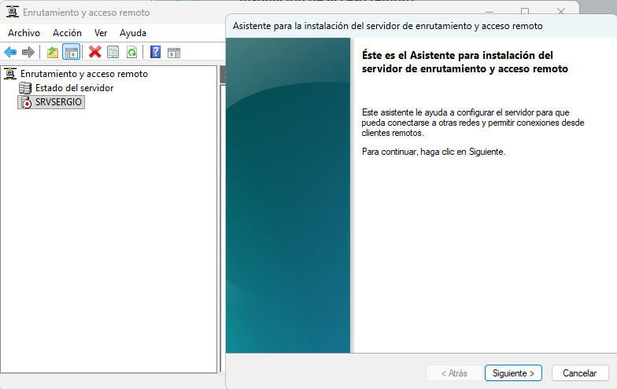
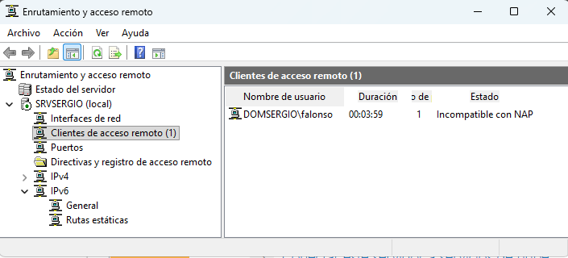

Una Red Privada Virtual (VPN) establece una conexión segura y cifrada, denominada **túnel**, a través de una red pública, generalmente Internet. Su objetivo principal es permitir que los usuarios remotos accedan a los recursos de la red corporativa como si estuvieran conectados localmente, manteniendo la privacidad e integridad de los datos transmitidos mediante el cifrado.

## Implementación en Windows Server

Para habilitar la funcionalidad de VPN en Windows Server, se requiere la instalación de un rol específico encargado de gestionar y administrar estas conexiones de acceso remoto.

* **Rol de Servidor:** Se debe instalar el rol **Acceso Remoto (Remote Access)**. Dentro de este rol, el servicio clave que gestiona las conexiones VPN y las políticas de acceso es **Enrutamiento y Acceso Remoto (RRAS - Routing and Remote Access Service)**.
* **Función:** RRAS se encarga de crear y gestionar los puertos virtuales que aceptan las conexiones entrantes, así como de aplicar las políticas de autenticación y red para los usuarios remotos.

## Protocolos de Túnel

Los protocolos de túnel son esenciales, ya que definen el método de encapsulación y cifrado de los datos. La elección del protocolo es crucial para garantizar la seguridad y la compatibilidad con diferentes *firewalls*.

* **SSTP (Secure Socket Tunneling Protocol):** Es un protocolo moderno muy recomendado. Utiliza **SSL/TLS** y opera sobre el puerto **TCP 443** (el mismo que HTTPS), lo que le permite atravesar con éxito la mayoría de los *firewalls* que a menudo restringen otros puertos.
* **IKEv2/IPsec:** Es considerado uno de los protocolos más seguros y robustos actualmente. Es altamente estable y soporta la característica de **VPN Reconnect**, siendo ideal para usuarios con movilidad o dispositivos que experimentan caídas temporales de red.
* **L2TP/IPsec:** Un protocolo seguro que depende de la suite **IPsec** para el cifrado y la autenticación. Es ampliamente compatible, pero requiere que los puertos **UDP 500 y 4500** estén abiertos.
* **PPTP (Point-to-Point Tunneling Protocol):** Es un protocolo heredado, cuyo uso está **desaconsejado** en entornos de producción debido a sus debilidades de seguridad conocidas.

## Seguridad y Control de Acceso

La seguridad de la VPN no depende solo del cifrado del túnel, sino también de una autenticación estricta:

* **Integración con Active Directory:** El servidor VPN valida las credenciales del usuario directamente contra la base de datos de Active Directory.
* **Servidor de Políticas de Red (NPS - Network Policy Server):** A menudo se utiliza conjuntamente con RRAS para establecer reglas y políticas detalladas que controlan el acceso: qué usuarios pueden conectarse, cuánto tiempo y qué recursos de la red interna tienen permitido alcanzar.

## Pasos para la implementación de una VPN en Window Server

Los pasos para activar el servicio de VPN en Windows server son los siguientes.

En primer lugar debe estar instalado el rol de Acceso Remoto, por lo menos las opciones de VPN (y enrutamiento si queremos compartir internet)

Una vez instalado, debemos acceder a la consola de **Enrutamiento y acceso remoto** y desde ahí en el servidor, iniciar el **Asistente para la instalación del servidor de enrutamiento y acceso remoto**

<figure markdown="span" align="center">
    { width="90%" }
    <figcaption>Enrutamiento y acceso remoto.</figcaption>
</figure>

En las opciones de **configuración**, seleccionamos la **Configuración personalizada** que nos permitirá elegir las opciones que deseamos

<figure markdown="span" align="center">
    { width="90%" }
    <figcaption>Enrutamiento y acceso remoto. Opciones</figcaption>
</figure>

Entre las opciones seleccinamos:

- **NAT** y **Enrutamiento LAN**: que nos permitirán realizar el enrutamiento del tráfico de internet, o sea, compartir internet.
- **Acceso a VPN**: obviamente, permite añadir el servicio de VPN en el Servidor

<figure markdown="span" align="center">
    { width="90%" }
    <figcaption>Enrutamiento y acceso remoto. Opciones</figcaption>
</figure>

Llegados a este punto, el servidor esta preparado para permitir el acceso mediente VPN, sin embargo es aconsejable dentro de el apartado de **Puertos** verificar que los puertos que permiten la conexión de VPN están abiertos y *se escuchan*, para ello pulsamos **propiedades** al hacer click con el botón derecho del ratón.

<figure markdown="span" align="center">
    { width="90%" }
    <figcaption>Enrutamiento y acceso remoto. Puerto</figcaption>
</figure>

En este puntos nos debemos asegurar que los puerto **L2PT** y **PPTP** están abiertos a recibir conexiones

<figure markdown="span" align="center">
    { width="90%" }
    <figcaption>Enrutamiento y acceso remoto. Puertos</figcaption>
</figure>

y la parte del servidor esta configurada, salvo que debemos habilitar los usuarios que se pueden autentificar mediante la VPN, para ello, entramos en el perfil del usuario que deseamos habilitar y en la opción para permitir la conexión por acceso remoto.

<figure markdown="span" align="center">
    { width="70%" }
    <figcaption>Perfil de usuario. Habilitado marcado acceso remoto</figcaption>
</figure>

Ahora ya tenemos completamente configurado el servidor y sólo que da ir al equipo cliente y **agregar una nueva conexión VPN** indicando pricipalmente la IP del servidor. En un entorno de prueba, indicamos la red del servidor, pero un entorno real debemos conocer la IP pública de nuestro router y redirigir el tráfico del puerto correspondiente al servidor.

<figure markdown="span" align="center">
    { width="90%" }
    <figcaption>Creación de conexión VPN.</figcaption>
</figure>

Ahora ya podemos conectar con el servidor, introduciendo usuario y contraseña si no se había incluido en la configuración de la conexión. 

Una vez conectados, lo podemos verificar en la propia conexión.

<figure markdown="span" align="center">
    { width="90%" }
    <figcaption>Conexión de VPN funcionando. Verificación en el cliente</figcaption>
</figure>

y en el servidor, también podemos ver en **Clientes de acceso remoto** que el cliente se ha conectado mediante VPN.

<figure markdown="span" align="center">
    { width="90%" }
    <figcaption>Conexión de VPN funcionando. Verificación en el servidor</figcaption>
</figure>

En la capturas anterior se puede leer que el Estado es *Incompatible con NAP* debido a que no se han realiado todas las seguridades de autentificación que quedan fuera del alcance de esta práctica

Por último, si al configurar el acceso a VPN se desconfigura el uso compartido de internet, debemos ir a IPv4 --> NAT y crear una nueva interfaz escogiendo la tarjeta de red Externa para indicar cual es la conexión que proporciona el acceso a internet.

<figure markdown="span" align="center">
    { width="90%" }
    <figcaption>Reconfiguración de enrutamiento - NAT.</figcaption>
</figure>

