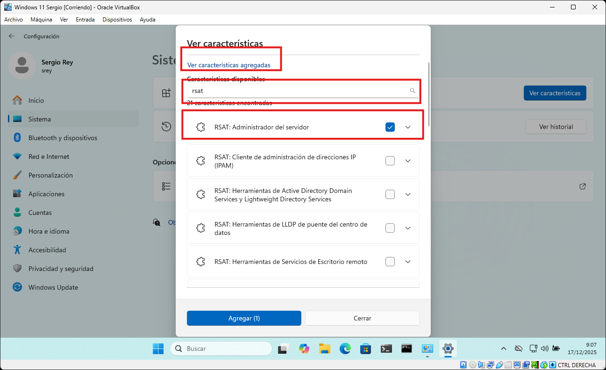
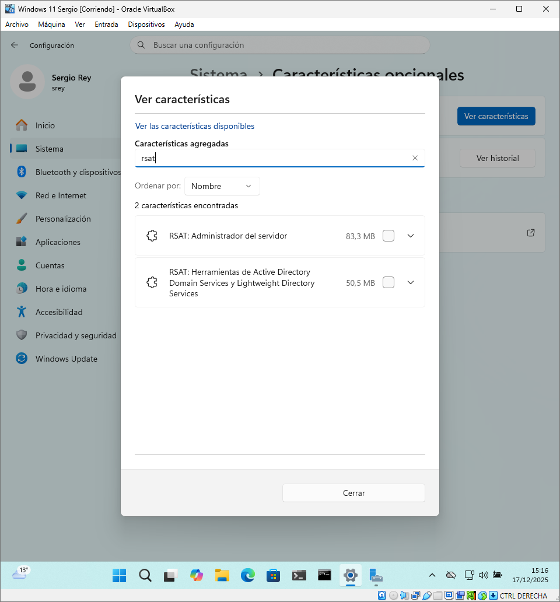

Las **Herramientas de Administración Remota del Servidor (RSAT)** son un conjunto de *snap-ins* y consolas administrativas que se instalan en un sistema operativo cliente (como Windows 10 o Windows 11), y no en el servidor mismo. Su función principal es permitir a los administradores gestionar roles y características de Windows Server (como Active Directory, DNS o DHCP) desde su estación de trabajo, lo que constituye la forma más eficiente y recomendada de realizar tareas administrativas.

### Función Principal y Ventajas

RSAT facilita la gestión de la infraestructura de Windows Server sin necesidad de iniciar una sesión de Escritorio Remoto (RDP) para cada tarea. La administración remota a través de estas herramientas es superior a la conexión directa por RDP por las siguientes razones:

* **Eficiencia Centralizada:** Permite que un administrador gestione múltiples servidores, roles y servicios simultáneamente desde una única consola ubicada en su equipo cliente, ahorrando tiempo.
* **Seguridad Mejorada:** Reduce drásticamente la frecuencia con la que se necesita iniciar sesión gráfica directamente en los Controladores de Dominio o servidores críticos. Esto minimiza el riesgo de dejar sesiones administrativas abiertas o de exponer la interfaz del servidor a posibles ataques.
* **Optimización de Recursos:** La herramienta cliente solo envía comandos de gestión a través de la red, evitando la sobrecarga de recursos que implica la transmisión constante de gráficos de una sesión RDP completa.

### Componentes de RSAT

RSAT agrupa las consolas de gestión en función de los roles de servidor que administran. Para un administrador de dominio, los componentes más esenciales incluyen:

* **Usuarios y Equipos de Active Directory (ADUC):** Herramienta principal para gestionar usuarios, grupos y Unidades Organizativas (UO).
* **Administración de Directiva de Grupo (GPMC):** Consola fundamental para configurar, aplicar y auditar las Directivas de Grupo en el dominio.
* **Consolas Específicas:** Herramientas para la gestión de roles de infraestructura como DNS, DHCP, y Servidor de Archivos.
* **Administrador del Servidor:** Permite supervisar el estado general, los roles y los eventos de múltiples servidores desde una interfaz única.

### Instalación de RSAT

RSAT se instala en el sistema operativo **cliente** (Windows 10, **Windows 11**, etc.), **no en el servidor**. En las versiones modernas de Windows, RSAT se gestiona como una **Característica opcional** del sistema operativo.

Este es el método más común y visual, recomendado para usuarios que necesitan seleccionar herramientas específicas de forma individual.

1. Accede a Configuración
2. Navega hasta la sección **Sistema** en el menú lateral izquierdo.
3. Haz clic en **Características opcionales**.
    <figure markdown="span" align="center">
        { width="90%" }
        <figcaption>Configuración -> Sistema -> Características Avanzadas.</figcaption>
    </figure>
4. Junto a "Agregar una característica opcional", pulsa el botón Ver características.
    <figure markdown="span" align="center">
        { width="90%" }
        <figcaption>Configuración -> Sistema -> Características Avanzadas.</figcaption>
    </figure>
5. En el cuadro de búsqueda, escribe RSAT. Aparecerá una lista con todas las utilidades disponibles (AD DS, DHCP, DNS, Group Policy, etc.). Debes tener **Ver características disponibles" seleccionadas. 
    <figure markdown="span" align="center">
        { width="90%" }
        <figcaption>Configuración -> Sistema -> Características Avanzadas.</figcaption>
    </figure>
6. Marca las herramientas que necesites, haz clic en Siguiente y luego en Instalar. Una mínima prueba debe tener como mínimo:
    1. **RSAT. Administrador del servidor**: Que instala la consola del **administrador del servidor** tal y como tenemos en el Servidor
    2. **RSAT. Herramietna de Active Directory Domain Service y Lightweight Directory Services**: que instala la herramienta de **usuarios y equipos de active directory**

    <figure markdown="span" align="center">
        { width="70%" }
        <figcaption>Opciones instaladas</figcaption>
    </figure>
7. Configuración. Abrimos la consola de Administrador del Servidor y pulsamos sobre **Agregar otros servidores para administrar** y seleccinamos el equipo donde tenemos instalado el Administrador del Dominio.

    <figure markdown="span" align="center">
        { width="90%" }
        <figcaption>Configuración del Administrador del servidor</figcaption>
    </figure>

Ahora ya tenemos la herramienta preparada para trabajar como si estuviéramos en el propio servidor