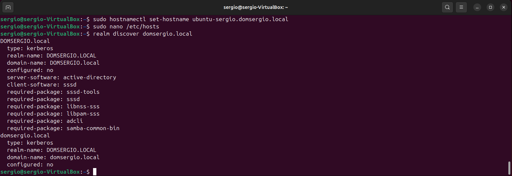

# Integración de Ubuntu 24.04 LTC en Dominio Windows Server

## Utilidad y Ventajas

La integración de equipos Ubuntu en un dominio Active Directory de Windows Server proporciona varios beneficios significativos:

- **Gestión centralizada de usuarios**: Los usuarios pueden autenticarse con las mismas credenciales del dominio en equipos Windows y Linux
- **Políticas de seguridad unificadas**: Aplicación de políticas corporativas desde un único punto de administración
- **Single Sign-On (SSO)**: Los usuarios acceden con una única cuenta a todos los recursos de la red
- **Simplificación administrativa**: Reduce la carga de trabajo al gestionar usuarios desde Active Directory
- **Auditoría centralizada**: Seguimiento de accesos y eventos de seguridad desde el controlador de dominio
- **Integración con recursos compartidos**: Acceso transparente a carpetas compartidas en servidores Windows

## Requisitos Previos

Antes de comenzar, asegúrate de tener:

- Ubuntu 24.04 LTS instalado y actualizado
- Conectividad de red con el controlador de dominio
- Nombre de dominio DNS configurado correctamente
- Credenciales de administrador del dominio
- Resolución DNS funcional hacia el controlador de dominio

## Proceso de Integración

### 1. Actualización del Sistema

Primero actualizamos el sistema para asegurar que todos los paquetes estén en su versión más reciente:

```bash
sudo apt update
sudo apt upgrade -y
```

### 2. Instalación de Paquetes Necesarios

Instalamos los paquetes requeridos para la integración con Active Directory:

```bash
sudo apt install realmd sssd sssd-tools libnss-sss libpam-sss adcli samba-common-bin oddjob oddjob-mkhomedir packagekit -y
```

**Descripción de paquetes clave:**

- **realmd**: Herramienta de alto nivel para configurar la integración con dominios
- **sssd**: System Security Services Daemon, gestiona la autenticación y caché de usuarios
- **adcli**: Utilidad para realizar operaciones en Active Directory
- **oddjob-mkhomedir**: Crea automáticamente directorios home para usuarios del dominio

### 3. Configuración de DNS

Es fundamental que el equipo pueda resolver correctamente el dominio. Edita el archivo de configuración de red:

```bash
sudo nano /etc/netplan/01-network-manager-all.yaml 
```

Añade o modifica la configuración DNS (ajusta según tu red):

```yaml
network:
  version: 2
  renderer: networkd
  ethernets:
    enp0s3:                   # Adaptador de red. Verificar que es correcto
      dhcp4: no
      addresses:
        - 192.168.0.100/24    # IP y máscara
      routes:
        - to: default
          via: 192.168.0.1    # Gateway
      nameservers:
        addresses:
          - 192.168.0.1       # IP del controlador de dominio. DNS
          - 8.8.8.8           # DNS secundario
        search:
          - midominio.local   # Nombre del domino.
```

Aplica los cambios:

```bash
sudo netplan apply
```
!!! tip "Para verificar la configuración"

    ```bash
    # Comprobar la ip asignada
    ip -br a

    # Comprobar la puerta de enlace
    ip route show

    # Comprobar DNS
    resolvectl status

    # Probar resolución del dominio
    nslookup domsergio.local
    ```

### 4. Configuración del Hostname

Establece un nombre de host FQDN (Fully Qualified Domain Name):

```bash
sudo hostnamectl set-hostname ubuntu-client.midominio.local
```

Edita también el archivo hosts:

```bash
sudo nano /etc/hosts
```

Cambia as dos primeras líneas por algo similar a:

```
127.0.0.1       localhost
192.168.100.99  ubuntu-client.midominio.local ubuntu-client  
```

### 5. Verificación de Conectividad con el Dominio

Comprueba que puedes descubrir el dominio:

```bash
realm discover midominio.local
```

Deberías ver información del dominio, incluyendo el nombre del servidor y las capacidades soportadas.

<figure markdown="span" align="center">
  { width="90%"}
  <figcaption>Descubriendo los servicios del dominio.</figcaption>
</figure>


### 6. Unión al Dominio

Únete al dominio usando las credenciales de un administrador:

```bash
sudo realm join --user=Administrador midominio.local
```

Se te pedirá la contraseña del administrador del dominio. Si todo va bien, el equipo quedará registrado en Active Directory.

Para verificar que estás en el dominio:

```bash
realm list
```

<figure markdown="span" align="center">
  { width="90%"}
  <figcaption>Equipo unido al dominio.</figcaption>
</figure>

### 7. Configuración de SSSD

**SSSD** son las siglas de *System Security Services Daemon* (Demonio de Servicios de Seguridad del Sistema). Es un servicio del sistema en Linux que proporciona acceso a diferentes mecanismos de autenticación e identidad remota.

El SSSD actúa como un intermediario inteligente entre tu sistema Linux local y fuentes de identidad remotas como:

- Active Directory (AD) de Windows
- LDAP (Lightweight Directory Access Protocol)
- Kerberos
- FreeIPA
- Otros servicios de directorio

El archivo de configuración principal de SSSD se encuentra en `/etc/sssd/sssd.conf`. Editamos para optimizar la configuración:

```bash
sudo nano /etc/sssd/sssd.conf
```

Configuración recomendada:

```ini
[sssd]
domains = midominio.local
config_file_version = 2
services = nss, pam

[domain/midominio.local]
ad_domain = midominio.local
krb5_realm = MIDOMINIO.LOCAL
realmd_tags = manages-system joined-with-adcli
cache_credentials = True
id_provider = ad
krb5_store_password_if_offline = True
default_shell = /bin/bash
ldap_id_mapping = True
use_fully_qualified_names = False
fallback_homedir = /home/%u
access_provider = ad
```

**Parámetros importantes:**

- `use_fully_qualified_names = False`: Permite login sin especificar el dominio (usuario en vez de usuario@dominio)
- `cache_credentials = True`: Permite login offline con credenciales en caché
- `fallback_homedir = /home/%u`: Define la ubicación de los directorios home

Ajusta permisos del archivo:

```bash
sudo chmod 600 /etc/sssd/sssd.conf
```

Reinicia el servicio SSSD:

```bash
sudo systemctl restart sssd
sudo systemctl enable sssd
```

### 8. Configuración de PAM para Creación Automática de Directorios Home

Edita el archivo de sesión PAM:

```bash
sudo nano /etc/pam.d/common-session
```

Añade al final:

```
session required pam_mkhomedir.so skel=/etc/skel/ umask=0077
```

Esto creará automáticamente el directorio home cuando un usuario del dominio inicie sesión por primera vez.

### 9. Configuración de Sudoers (Opcional)

Para permitir que ciertos grupos del dominio tengan privilegios sudo:

```bash
sudo visudo
```

Añade líneas como:

```
%administradores_dominio@midominio.local ALL=(ALL:ALL) ALL
%grupo_ti@midominio.local ALL=(ALL:ALL) ALL
```

O si configuraste `use_fully_qualified_names = False`:

```
%administradores_dominio ALL=(ALL:ALL) ALL
```

### 10. Verificación de la Integración

Comprueba que puedes obtener información de usuarios del dominio:

```bash
id usuario_dominio
getent passwd usuario_dominio
```

Prueba el login con un usuario del dominio:

```bash
su - usuario_dominio
```

## Perfiles Móviles y Carpetas Personales

### Perfiles Móviles

**Limitación importante**: Los perfiles móviles de Windows (Roaming Profiles) **no son completamente compatibles con Linux/Ubuntu**. Esto se debe a diferencias fundamentales en:

- Estructura del sistema de archivos y rutas
- Configuraciones específicas de aplicaciones
- Formato del registro de Windows vs archivos de configuración Linux
- Permisos y atributos de archivos diferentes

**Alternativa recomendada**: En lugar de perfiles móviles tradicionales, se puede implementar sincronización de datos específicos mediante:

- Scripts de login/logout que sincronicen carpetas específicas
- Uso de servicios como Nextcloud o similares
- Montaje de directorios home desde un servidor NFS o CIFS

### Carpetas Personales Enlazadas (Folder Redirection)

**Sí es posible** implementar redirección de carpetas personales a ubicaciones de red. Existen dos enfoques principales:

#### Opción 1: Montaje Automático de Carpetas de Red (Recomendado)

Configura el montaje automático de carpetas compartidas SMB al iniciar sesión. Edita o crea `/etc/security/pam_mount.conf.xml`:

```xml
<?xml version="1.0" encoding="utf-8" ?>
<pam_mount>
    <volume 
        user="*" 
        fstype="cifs" 
        server="servidor-archivos.midominio.local" 
        path="usuarios/%(USER)" 
        mountpoint="/home/%(USER)/Documentos" 
        options="sec=krb5,cruid=%(USERUID),dir_mode=0700,file_mode=0600,uid=%(USERUID),gid=%(USERGID)" 
    />
    <volume 
        user="*" 
        fstype="cifs" 
        server="servidor-archivos.midominio.local" 
        path="perfiles/%(USER)/Escritorio" 
        mountpoint="/home/%(USER)/Escritorio" 
        options="sec=krb5,cruid=%(USERUID),dir_mode=0700,file_mode=0600,uid=%(USERUID),gid=%(USERGID)" 
    />
    <mkmountpoint enable="1" remove="true" />
</pam_mount>
```

Instala el paquete necesario:

```bash
sudo apt install libpam-mount cifs-utils -y
```

#### Opción 2: Enlaces Simbólicos Personalizados

Crea un script que se ejecute al login para crear enlaces simbólicos:

```bash
sudo nano /etc/profile.d/enlazar_carpetas.sh
```

Contenido del script:

```bash
#!/bin/bash

# Servidor de archivos
SERVIDOR="//servidor-archivos.midominio.local"
USUARIO=$(whoami)

# Montar carpeta personal si no está montada
if [ ! -d "/mnt/datos_usuario" ]; then
    sudo mkdir -p /mnt/datos_usuario
fi

if ! mountpoint -q "/mnt/datos_usuario"; then
    sudo mount -t cifs "${SERVIDOR}/usuarios/${USUARIO}" /mnt/datos_usuario \
        -o username=${USUARIO},domain=MIDOMINIO,sec=krb5,uid=$(id -u),gid=$(id -g)
fi

# Crear enlaces simbólicos si no existen
[ ! -L "$HOME/Documentos" ] && ln -sf /mnt/datos_usuario/Documentos "$HOME/Documentos"
[ ! -L "$HOME/Descargas" ] && ln -sf /mnt/datos_usuario/Descargas "$HOME/Descargas"
```

Dale permisos de ejecución:

```bash
sudo chmod +x /etc/profile.d/enlazar_carpetas.sh
```

#### Opción 3: Directorios Home Centralizados (Más Robusto)

Configura SSSD para montar automáticamente el directorio home completo desde un servidor de archivos. Modifica `/etc/sssd/sssd.conf`:

```ini
[domain/midominio.local]
# ... configuración existente ...
override_homedir = /home/%u
auto_private_groups = true

# Si usas un servidor de archivos centralizado
# override_homedir = /mnt/homes/%u
```

Luego configura el montaje automático mediante `/etc/fstab` o autofs:

```bash
sudo apt install autofs -y
```

Edita `/etc/auto.master`:

```
/home/usuarios /etc/auto.home --timeout=60
```

Crea `/etc/auto.home`:

```
* -fstype=cifs,credentials=/etc/samba/.smbcredentials,uid=&,gid=&,dir_mode=0700,file_mode=0600 ://servidor-archivos.midominio.local/homes/&
```

### Consideraciones de Seguridad para Carpetas de Red

- Utiliza siempre Kerberos (`sec=krb5`) para la autenticación en recursos SMB/CIFS
- Evita almacenar credenciales en texto plano
- Configura permisos restrictivos (700 para directorios, 600 para archivos)
- Implementa cuotas de disco en el servidor de archivos
- Considera la encriptación del tráfico SMB (SMB 3.0+)

## Solución de Problemas

### El equipo no se une al dominio

- Verifica la resolución DNS: `nslookup midominio.local`
- Comprueba la sincronización horaria: `timedatectl`
- Revisa logs: `sudo journalctl -u realmd -f`

### Los usuarios no pueden iniciar sesión

- Verifica SSSD: `sudo systemctl status sssd`
- Revisa logs de SSSD: `sudo tail -f /var/log/sssd/*.log`
- Prueba getent: `getent passwd usuario_dominio`

### Problemas con el directorio home

- Verifica permisos de `/home`
- Comprueba la configuración PAM en `/etc/pam.d/common-session`
- Revisa la configuración de `fallback_homedir` en sssd.conf

### Montaje de carpetas de red falla

- Verifica que el usuario tiene permisos en el servidor de archivos
- Comprueba la configuración de Kerberos: `klist`
- Prueba el montaje manual: `sudo mount -t cifs //servidor/recurso /mnt/prueba -o user=usuario`

## Mantenimiento

### Salir del dominio

Si necesitas retirar el equipo del dominio:

```bash
sudo realm leave midominio.local
```

### Actualizar caché de usuarios

Para forzar la actualización de la información de usuarios:

```bash
sudo sss_cache -E
sudo systemctl restart sssd
```

### Renovar ticket Kerberos manualmente

```bash
kinit usuario@MIDOMINIO.LOCAL
klist  # Verificar tickets activos
```

## Conclusión

La integración de Ubuntu 24.04 LTS en un dominio Windows Server es totalmente funcional y proporciona autenticación centralizada efectiva. Aunque los perfiles móviles tradicionales de Windows no son compatibles, las carpetas personales pueden redirigirse exitosamente mediante montajes SMB/CIFS automáticos, proporcionando a los usuarios acceso consistente a sus datos independientemente del equipo que utilicen.

Esta configuración es ideal para entornos heterogéneos donde coexisten sistemas Windows y Linux, permitiendo una administración unificada y mejorando la experiencia del usuario.


---
---
---
---
---
Entendido. Retomamos el procedimiento del vídeo, utilizando el método **Samba/Winbind**, y nos ceñiremos estrictamente a los pasos que has proporcionado. Incorporaré la configuración de red inicial, el usuario **`Administrador`** y el dominio **`DOMSERGIO.local`**, además de incluir la adición del DC a `/etc/hosts` para asegurar la resolución local en entornos de prueba.

-----

## 💻 Integración de Cliente Ubuntu a Active Directory (Método Winbind)

### 📌 Resumen de Parámetros

| Elemento | Valor | Descripción |
| :--- | :--- | :--- |
| **Dominio (REALM)** | `DOMSERGIO.LOCAL` | El dominio Kerberos (siempre en mayúsculas). |
| **Workgroup (NetBIOS)** | `DOMSERGIO` | El nombre NetBIOS del dominio. |
| **DC/DNS IP** | `192.168.100.1` | Dirección IP del Controlador de Dominio y Servidor DNS. |
| **Cliente Hostname** | `ud101` | Nombre de host del cliente Ubuntu. |
| **Usuario de Unión** | `Administrador` | Usuario con permisos para unir máquinas al dominio. |

-----

### Paso 1: Configuración de Red Estática, Hostname y DNS

Es vital que el cliente Ubuntu tenga una IP fija y use exclusivamente el Controlador de Dominio (DC) como servidor DNS.

#### 1.1. Configuración de Netplan

Edita el archivo de configuración de Netplan (ej. `/etc/netplan/01-network-manager-all.yaml`) para usar **NetworkManager** y definir la configuración estática.

```bash
sudo nano /etc/netplan/01-network-manager-all.yaml
```

**Contenido (Asegúrate de sustituir `[nombre_interfaz]`):**

```yaml
network:
  version: 2
  renderer: NetworkManager 
  ethernets:
    [nombre_interfaz]:
      dhcp4: no
      addresses:
        - 192.168.100.51/24
      routes:
        - to: default
          via: 192.168.100.1
      nameservers:
        addresses: [192.168.100.1] 
        search: [DOMSERGIO.local]
```

```bash
# Aplicar los cambios
sudo netplan apply
```

#### 1.2. Cambiar Hostname

Establecemos el nombre de host del cliente Ubuntu.

```bash
# Cambiar hostname a ud101
sudo hostnamectl set-hostname ud101

# Verificar
hostname -f
```

#### 1.3. Configuración de `/etc/hosts` (Crucial para entornos de prueba)

Añadir la IP y la URL del DC a `/etc/hosts` asegura que la resolución de nombres funcione sin depender completamente del servicio DNS en la fase inicial.

```bash
sudo nano /etc/hosts
```

Añade esta línea al final del archivo (asumiendo que el DC se llama `DC-SERVER`):

```conf
192.168.100.1 DC-SERVER.DOMSERGIO.local DC-SERVER
```

#### 1.4. Comprobar Conexión y Resolución

```bash
# Comprobar la resolución de nombres
ping -c2 DOMSERGIO.local
```

El ping debe ser exitoso y mostrar la IP del DC (`192.168.100.1`).

-----

### Paso 2: Sincronización Horaria (NTP)

El DC debe ser la fuente de tiempo, ya que Kerberos exige una diferencia horaria mínima.

```bash
# Instalar la utilidad ntpdate
sudo apt-get install ntpdate

# Consultar el desfase horario con el servidor (sin aplicar)
sudo ntpdate -q 192.168.100.1

# Sincronizar la hora de forma inmediata
sudo ntpdate 192.168.100.1
```

-----

### Paso 3: Instalación de Paquetes Necesarios y Kerberos

Instalamos Samba, Kerberos y Winbind.

```bash
sudo apt-get install samba krb5-config krb5-user winbind libpam-winbind libnss-winbind
```

Durante la instalación de Kerberos, asegúrate de configurar el **REALM** como **`DOMSERGIO.LOCAL`** (en mayúsculas).

#### 3.1. Comprobar Autenticación Kerberos

Intentamos obtener un *ticket* de Kerberos con el usuario Administrador del dominio.

```bash
# Obtener ticket de Kerberos
kinit Administrador@DOMSERGIO.LOCAL

# Listar tickets obtenidos
klist
```

Si el comando `kinit` no produce un error (después de ingresar la contraseña), Kerberos es funcional.

-----

### Paso 4: Configuración de Samba (`smb.conf`)

Configuramos Samba para que actúe como un miembro de dominio de Active Directory (ADS).

```bash
# Mover archivo smb.conf y crear copia de seguridad
mv /etc/samba/smb.conf /etc/samba/smb.conf.initial

# Crear archivo smb.conf vacío
sudo nano /etc/samba/smb.conf
```

**Contenido de `smb.conf`:**

```conf
[global]
workgroup = DOMSERGIO
realm = DOMSERGIO.LOCAL
netbios name = ud101
security = ADS
dns forwarder = 192.168.100.1

idmap config * : backend = tdb
idmap config *:range = 50000-1000000

template homedir = /home/%D/%U
template shell = /bin/bash
winbind use default domain = true
winbind offline logon = false
winbind nss info = rfc2307
winbind enum users = yes
winbind enum groups = yes

vfs objects = acl_xattr
map acl inherit = Yes
store dos attributes = Yes
```

#### 4.1. Reiniciar y Habilitar Servicios

```bash
# Reiniciar todos los daemons de samba
sudo systemctl restart smbd nmbd

# Habilitar los servicios de samba
sudo systemctl enable smbd nmbd
```

-----

### Paso 5: Unir Ubuntu Desktop al Dominio

Usamos `net ads join` para registrar la máquina en Active Directory.

```bash
# Unir Ubuntu Desktop a SAMBA AD DC
sudo net ads join -U Administrador
```

Introduce la contraseña del usuario `Administrador`. Si la unión es exitosa, se informará que la cuenta de equipo se creó.

-----

### Paso 6: Configurar Autenticación de Cuentas AD (NSS y Winbind)

Indicamos al sistema que use Winbind para la resolución de nombres y grupos.

#### 6.1. Editar el Archivo NSS (`/etc/nsswitch.conf`)

```bash
# Editar el archivo de configuración del conmutador de servicio de nombres (NSS)
sudo nano /etc/nsswitch.conf
```

Las líneas deben quedar así (añadiendo `winbind`):

```conf
passwd:       compat winbind
group:        compat winbind
shadow:       compat winbind
hosts:        files dns
```

#### 6.2. Reiniciar Winbind y Verificar

```bash
# Reinicar servicio winbind
sudo systemctl restart winbind

# Listar usuarios y grupos del dominio (prueba de comunicación)
wbinfo -u
wbinfo -g
```

Si se muestran usuarios y grupos de `DOMSERGIO.local`, la comunicación de Winbind es correcta.

#### 6.3. Verificar el Módulo Winbind con `getent`

Verificamos que el sistema pueda resolver la identidad del usuario administrador.

```bash
sudo getent passwd | grep Administrador
sudo getent group | grep 'Administradores del Dominio'
id Administrador
```

-----

### Paso 7: Configuración de PAM y Directorio Home

Configuramos el sistema para la autenticación de dominio y la creación automática de directorios *home*.

#### 7.1. Configurar `pam-auth-update`

```bash
sudo pam-auth-update
```

Asegúrate de seleccionar la opción: `[*] Create home directory`.

#### 7.2. Editar `common-account` para Crear Directorios

Esto garantiza que el directorio *home* se cree al iniciar sesión.

```bash
# Editar el archivo /etc/pam.d/common-account
sudo nano /etc/pam.d/common-account
```

Añade la siguiente línea al **final** del archivo:

```conf
session     required    pam_mkhomedir.so    skel=/etc/skel/    umask=0022
```

-----

### Paso 8: Pruebas Finales de Autenticación

#### 8.1. Autenticarse por Terminal

Probamos el inicio de sesión con el usuario de dominio `Administrador`.

```bash
su Administrador
```

Si el inicio de sesión es exitoso, el *prompt* cambiará a la *shell* del usuario y se creará su directorio *home*.

#### 8.2. Añadir Cuenta de Dominio a Sudoers

Para permitir que el usuario de dominio ejecute comandos con `sudo`.

```bash
# Añadir cuenta de dominio a sudoers (al grupo 'sudo' local)
sudo usermod -aG sudo Administrador

# Listar grupo sudoers para verificar la inclusión
getent group sudo
```

#### 8.3. Autenticarse con GUI

El usuario puede iniciar sesión en la interfaz gráfica usando solo su nombre de usuario de dominio (ej. `Administrador`) y su contraseña de AD.

-----

¿Te gustaría que generemos una serie de ejercicios de verificación, incluyendo el uso de `sudo` y la verificación del grupo, para que tus alumnos pongan a prueba esta configuración final?