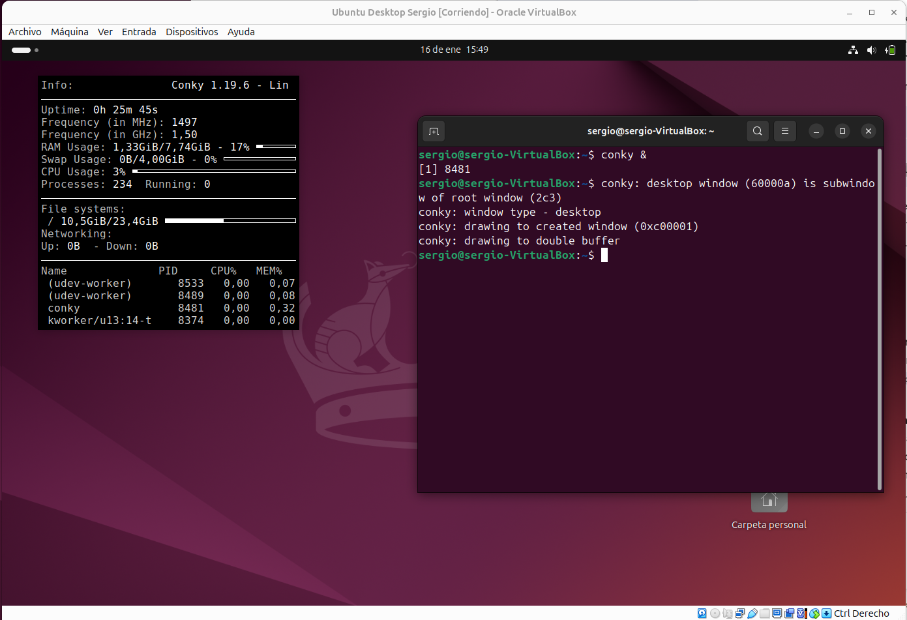

## Introducción: Ubuntu Desktop

Hasta ahora hemos trabajado exclusivamente con Windows en nuestra infraestructura ISCASOX. Hemos montado dominios, compartido recursos y aplicado directivas en un entorno completamente Microsoft. Sin embargo, cuando visitéis empresas medianas o grandes, os daréis cuenta de que es habitual encontrar usuarios trabajando con sistemas Linux en sus equipos de escritorio, especialmente en departamentos técnicos, de desarrollo o de diseño.

Ubuntu Desktop es la distribución Linux más popular para equipos de usuario final. Su éxito se debe a varios factores que la hacen ideal tanto para empresas como para entornos educativos:

**Interfaz intuitiva y moderna**: Ubuntu utiliza el entorno de escritorio GNOME, que ofrece una experiencia visual atractiva y fácil de usar. Los usuarios que vienen de Windows pueden adaptarse rápidamente sin sentirse perdidos.

**Estabilidad y seguridad**: Al estar basado en Debian, hereda décadas de desarrollo centrado en la estabilidad. Además, el modelo de seguridad de Linux hace que sea mucho menos vulnerable a virus y malware que Windows.

**Gratuito y legal**: No hay costes de licencias. Una empresa puede instalar Ubuntu en cientos de equipos sin pagar un euro, lo cual supone un ahorro considerable comparado con licencias de Windows.

**Soporte a largo plazo**: Las versiones LTS (Long Term Support) reciben actualizaciones de seguridad durante 5 años, lo que las hace adecuadas para entornos empresariales donde la estabilidad es prioritaria.

**Hardware modesto**: Ubuntu funciona perfectamente en equipos que para Windows serían demasiado lentos. Esto permite alargar la vida útil del hardware existente.

### Ubuntu Desktop en una empresa

No se trata de sustituir Windows por Linux en todos los equipos. Cada sistema tiene sus fortalezas y sus casos de uso ideales:

**Departamentos de desarrollo**: Los programadores suelen preferir Linux porque muchas herramientas de desarrollo (Docker, Kubernetes, compiladores, etc.) funcionan mejor o están diseñadas específicamente para este sistema.

**Servidores convertidos en estaciones de trabajo**: Equipos que gestionan servicios web, bases de datos o aplicaciones específicas que solo existen para Linux.

**Equipos de bajo coste**: Cuando el presupuesto es limitado, Ubuntu permite aprovechar hardware antiguo que con Windows 11 sería prácticamente inservible.

**Entornos educativos**: Muchas instituciones educativas optan por Ubuntu para enseñar informática sin depender de licencias comerciales.

**Seguridad y privacidad**: Organizaciones con requisitos estrictos de seguridad aprecian el control total que ofrece Linux sobre el sistema.

### Lo que vamos a aprender

En este apartado vamos a preparar un equipo Ubuntu Desktop completamente funcional e integrado en nuestra red ISCASOX. El objetivo es que al terminar tengáis:

Un equipo Ubuntu Desktop correctamente instalado y configurado que funcione como estación de trabajo para cualquier empleado de la empresa.

Conocimientos sobre las diferencias fundamentales entre trabajar con Windows y con Ubuntu desde el punto de vista del usuario final.

Capacidad para instalar y gestionar software en Ubuntu, tanto desde interfaz gráfica como desde terminal.

Un equipo Ubuntu completamente integrado con el dominio Active Directory de Windows Server, permitiendo que los usuarios del dominio inicien sesión con sus credenciales corporativas.

### Cómo trabajar este apartado

Este apartado está diseñado para que podáis seguirlo de forma autónoma, pero prestad atención a estos puntos:

**Haced snapshots frecuentes**: Antes de realizar cambios importantes en la máquina virtual, cread una instantánea. Si algo sale mal, podréis volver atrás sin perder el trabajo anterior.

**No os saltéis pasos**: Aunque Ubuntu Desktop es más intuitivo que Server, seguir el orden propuesto es importante para que todo funcione correctamente.

**Probad todo lo que instaléis**: No os limitéis a ejecutar comandos. Entended qué hace cada herramienta y probadla realmente.

**Comparad con Windows**: Cuando aprendáis algo nuevo, preguntaos "¿cómo haría esto en Windows?". Las analogías os ayudarán a entender mejor.

Comenzaremos instalando Ubuntu Desktop siguiendo una guía externa muy completa. Después configuraremos el sistema, instalaremos herramientas esenciales y finalmente lo integraremos con nuestro dominio Windows Server. Al final de este apartado, tendréis una comprensión sólida de cómo funciona Linux desde el punto de vista del usuario final.

---

## Instalación de Ubuntu Desktop 22.04 LTS

!!!warning "Ubuntu Desktop 22.04"

    Vamos a usar la versión 22.04 para trabajar en clase con Oracle VirtualBox, puesto que la versión 24.04 en ocasiones tiene problemas de estabilidad al ser virtualizado.

Para la instalación de Ubuntu Desktop vamos a utilizar una guía externa muy completa que explica paso a paso todo el proceso. No tiene sentido duplicar ese contenido aquí cuando ya existe documentación excelente.

**Guía de instalación**: [Instalar Ubuntu 24.04 LTS (Noble Numbat) desde cero](https://somebooks.es/instalar-ubuntu-24-04-lts-noble-numbat-desde-cero/)

### Aspectos importantes a tener en cuenta durante la instalación

Antes de comenzar la instalación, tened en cuenta estos puntos específicos para nuestro entorno ISCASOX:

**Configuración de la máquina virtual en VirtualBox**:

- Nombre: `PCXXX_Ubuntu` (donde XXX es vuestro nombre)
- Memoria RAM: 4096 MB (4 GB) - Desktop necesita más memoria que Server
- Procesadores: 1 CPUs
- Disco duro: 25 GB (reservado dinámicamente)
- Memoria Video: 128MB + aceleración 3D
- Tarjeta de red: Red interna `red_departamentos` (la misma que usan los PCs de empresa)

!!!tip "Memoria a asignar"

    La recomencacion inicial es usar 4 GB para Ubuntu Desktop, aunque funciona pefectamente con 2 GB. Una 

    Una buena táctica sería asignar 4 GB durante la instalación para que sea más rápida y después bajar a 2 GB puesto que no vamos a realizar cargas pesadas sobre el equipo, tal solo configuraciones desde el terminal.

**Durante la instalación**:

Cuando os pregunte por el tipo de instalación, elegid **Instalación normal** (incluye navegador web, reproductores multimedia y aplicaciones de oficina básicas).

Marcad la opción **Descargar actualizaciones mientras se instala Ubuntu** para tener el sistema actualizado desde el principio.

Para el nombre del equipo, usad `pcXXX-ubuntu` (en minúsculas, con vuestro nombre).

Para el nombre de usuario, usad vuestro nombre en minúsculas (por ejemplo, `sergio`). Este será vuestro usuario administrador local.

Elegid una contraseña sencilla de recordar (estamos en un entorno de laboratorio).

**Configuración de red inicial**:

Durante la instalación, la configuración de red será automática (DHCP). Esto está bien para empezar. Más adelante configuraremos una IP estática cuando integremos el equipo con Active Directory.

**Tiempo estimado**: La instalación completa suele tardar entre 15 y 30 minutos, dependiendo de la velocidad del disco duro y de la conexión a Internet.

### Después de la instalación

Una vez finalizada la instalación, el sistema se reiniciará. Iniciad sesión con vuestro usuario y contraseña.

Aparecerá un asistente de bienvenida que os guiará por las primeras configuraciones. Podéis:

- Conectar cuentas online (Google, Microsoft, etc.) - **no lo hagáis** en este entorno de laboratorio
- Activar o desactivar la telemetría - elegid lo que prefiráis
- Configurar aplicaciones - aceptad las sugerencias por defecto

Al llegar al escritorio, familiarizaos con la interfaz:

**Panel superior**: Muestra la hora, acceso a la configuración del sistema, estado de red, volumen, etc. Es similar a la barra de tareas de Windows pero más minimalista.

**Dock lateral izquierdo**: Contiene accesos directos a aplicaciones frecuentes. Es el equivalente al menú Inicio/barra de tareas de Windows.

**Actividades (esquina superior izquierda)**: Muestra todas las ventanas abiertas y permite buscar aplicaciones. Es muy potente y rápido una vez te acostumbras.

**Aplicaciones**: Click en el icono de cuadrícula del Dock para ver todas las aplicaciones instaladas.

### Verificación básica del sistema

Antes de continuar, verificad que todo funciona correctamente:

Abrid el navegador **Firefox** (viene preinstalado) y comprobad que tenéis conexión a Internet.

Abrid **Configuración** (icono de engranaje en el panel superior o en el Dock) y explorad brevemente las opciones disponibles. Es similar al Panel de Control de Windows.

Abrid una **Terminal** (podéis buscarla escribiendo "terminal" en Actividades o pulsar `Ctrl+Alt+T`). Ejecutad:

```bash
uname -a
```

Debería mostrar información del sistema confirmando que estáis usando Ubuntu 24.04.

Si todo esto funciona, estáis listos para continuar con la configuración post-instalación.

---

## Configuración post-instalación

Una vez instalado Ubuntu Desktop, hay varias configuraciones y ajustes que debemos realizar para tener un sistema completamente funcional y optimizado para trabajar en VirtualBox dentro de nuestra red ISCASOX.

### Actualización completa del sistema

Lo primero que debemos hacer después de instalar cualquier sistema operativo es actualizarlo completamente. Esto asegura que tenemos todas las correcciones de seguridad y las últimas versiones del software.

Abrimos una terminal (`Ctrl+Alt+T`) y ejecutamos:

```bash
sudo apt update
```

Este comando actualiza la lista de paquetes disponibles desde los repositorios de Ubuntu. Es como refrescar el catálogo de software disponible.

```bash
sudo apt upgrade -y
```

Este comando instala todas las actualizaciones disponibles. El parámetro `-y` responde automáticamente "sí" a las confirmaciones. La primera vez puede tardar varios minutos y descargar cientos de megabytes de actualizaciones.

Cuando termine, es recomendable reiniciar el sistema para que todos los cambios tengan efecto:

```bash
sudo reboot
```

### Instalación de VirtualBox Guest Additions

Las Guest Additions son un conjunto de controladores y aplicaciones que mejoran enormemente la experiencia de uso de una máquina virtual en VirtualBox. Sin ellas, la integración entre el sistema host y el invitado es muy limitada.

**¿Qué mejoras aportan las Guest Additions?**

**Resolución de pantalla adaptativa**: La ventana de la máquina virtual se redimensiona automáticamente al cambiar el tamaño de la ventana. Sin Guest Additions, la resolución se queda fija y veríais barras de desplazamiento.

**Portapapeles compartido**: Podéis copiar y pegar texto entre vuestro sistema host (Windows) y la máquina virtual Ubuntu. Extremadamente útil para copiar comandos de estos apuntes.

**Carpetas compartidas**: Permite acceder a carpetas del sistema host desde Ubuntu, facilitando el intercambio de archivos.

**Integración del ratón**: El ratón entra y sale de la ventana de la máquina virtual sin necesidad de pulsar ninguna tecla especial.

**Mejor rendimiento gráfico**: Aceleración 3D y mejor rendimiento general de la interfaz gráfica.

#### Proceso de instalación

Primero instalamos los paquetes previos necesarios para compilar las Guest Additions:

```bash
sudo apt install -y build-essential dkms linux-headers-$(uname -r)
```

Estos paquetes incluyen:

- `build-essential`: herramientas de compilación (gcc, make, etc.)
- `dkms`: permite que los módulos del kernel se recompilen automáticamente tras actualizaciones
- `linux-headers`: archivos de cabecera del kernel actual

Ahora, desde el menú de VirtualBox (la ventana donde se ejecuta la máquina virtual), vamos a **Dispositivos → Insertar imagen de CD de las Guest Additions**.

Esto "inserta" un CD virtual en la máquina virtual con los archivos de instalación. Ubuntu detectará automáticamente el CD y si pulsamos el simbolo del disco en el dock lateral, abrirá en el administrador de archivos el contenido del discos y podemos instalar los guest additions simplemente haciendo clic en (2) **Ejecutar programa**.

<figure markdown="span" align="center">
  { width="80%" }
  <figcaption>Inserción de de imagen CD Guest Additions</figcaption>
</figure>

También es posible ejecutar desde el terminal (3), en este caso haciendo click derecho en cualquier espacio donde están los archivos, tendremos un menú contextual con la opción de (3) **Abrir en una terminal**. Esto nos abre una terminal desde donde podemos instalar mediante el comando:

```bash
sudo ./VBoxLinuxAdditions.run 
```

<figure markdown="span" align="center">
  { width="80%" }
  <figcaption>Comando instalación Guest Additions</figcaption>
</figure>

La instalación mostrará varias líneas indicando qué componentes se están compilando e instalando. Al final debería mostrar un mensaje confirmando que todo se instaló correctamente.

Una vez terminada la instalación, reiniciamos el sistema:

```bash
sudo reboot
```

**Verificación**: Después del reinicio, probad a redimensionar la ventana de VirtualBox. La resolución de Ubuntu debería ajustarse automáticamente. También probad a copiar texto desde estos apuntes y pegarlo en la terminal de Ubuntu (`Ctrl+Shift+V` en terminal).

Si el portapapeles compartido no funciona, id a **Dispositivos → Portapapeles compartido → Bidireccional** en el menú de VirtualBox.

---

## Herramientas gráficas básicas

Ubuntu Desktop viene con un conjunto de aplicaciones preinstaladas, pero es útil conocer dónde encontrar herramientas del sistema que equivalen a las que conocéis de Windows.

### Explorador de archivos (Nautilus)

El gestor de archivos de Ubuntu se llama **Nautilus** (aunque simplemente se muestra como "Archivos"). Es el equivalente al Explorador de Windows.

Para abrirlo, hacemos clic en el icono de carpeta del Dock o buscamos "Archivos" en Actividades.

**Navegación básica**:

El panel izquierdo muestra ubicaciones rápidas: Escritorio, Documentos, Descargas, Imágenes, Vídeos, Música y ubicaciones de red.

La carpeta personal del usuario (`/home/sergio` en nuestro caso) es el equivalente a `C:\Users\sergio` en Windows. Aquí se guardan todos nuestros documentos y configuraciones personales.

Podemos crear marcadores de carpetas frecuentes arrastrándolas al panel izquierdo o usando `Ctrl+D`.

**Funciones útiles**:

- `Ctrl+H`: muestra archivos y carpetas ocultos (los que empiezan por punto `.`)
- `Ctrl+L`: muestra la barra de ubicación como texto editable (para copiar o pegar rutas)
- Clic derecho en cualquier carpeta → **Abrir en la terminal**: abre una terminal en esa ubicación

### Monitor del sistema

Ubuntu incluye un monitor del sistema similar al Administrador de tareas de Windows. Para abrirlo:

Buscamos "Monitor del sistema" en Actividades, o ejecutamos en terminal:

```bash
gnome-system-monitor &
```

El símbolo `&` al final hace que el programa se ejecute en segundo plano y nos devuelva el control de la terminal.

El Monitor del sistema muestra:

**Pestaña Procesos**: todos los procesos en ejecución, su uso de CPU, memoria, etc. Similar a la pestaña "Procesos" del Administrador de tareas de Windows.

**Pestaña Recursos**: gráficos en tiempo real de uso de CPU, memoria, red y disco. Similar a la pestaña "Rendimiento" de Windows.

**Pestaña Sistemas de archivos**: muestra las particiones montadas y su espacio disponible.

Podemos finalizar procesos que no respondan haciendo clic derecho → **Matar proceso** (equivalente a "Finalizar tarea" en Windows).

### Editor de texto

Ubuntu incluye **gedit**, un editor de texto simple pero potente. Es similar al Bloc de notas de Windows pero con más funciones (resaltado de sintaxis, numeración de líneas, etc.).

Para abrirlo buscamos "Editor de texto" o ejecutamos:

```bash
gedit &
```

También existe **nano** que ya conocemos de Ubuntu Server, disponible desde terminal. Es más básico pero útil cuando trabajamos sin interfaz gráfica.

### Configuración del sistema

La aplicación **Configuración** (Settings) es el equivalente al Panel de Control de Windows. Aquí podemos ajustar prácticamente todo el sistema:

- **Wi-Fi / Red**: configuración de red (aunque nosotros usaremos Netplan para configuración avanzada)
- **Apariencia**: tema claro/oscuro, color de acento, fondo de pantalla
- **Notificaciones**: controlar qué aplicaciones pueden mostrar notificaciones
- **Aplicaciones**: gestionar aplicaciones predeterminadas y permisos
- **Privacidad**: control de servicios de localización, compartición de uso, etc.
- **Usuarios**: gestionar cuentas de usuario del sistema (equivalente a Cuentas de usuario de Windows)

Explorad brevemente estas opciones para familiarizaros con dónde se configuran los aspectos más comunes del sistema.

### Captura de pantalla

Para tomar capturas de pantalla (muy útil para documentar vuestro trabajo):

- `Impr Pant` (Print Screen): captura toda la pantalla
- `Alt+Impr Pant`: captura solo la ventana activa
- `Shift+Impr Pant`: permite seleccionar un área manualmente

Las capturas se guardan automáticamente en la carpeta `Imágenes`.

También podemos buscar la aplicación **Capturas** (Screenshot) para más opciones.

---

## Gestión de paquetes: apt, snap y Software

Una de las diferencias más importantes entre Windows y Linux es la forma de instalar software. En Windows estamos acostumbrados a descargar archivos `.exe` o `.msi` de páginas web y ejecutarlos. En Linux, el software se gestiona principalmente a través de **gestores de paquetes**, que funcionan como una tienda de aplicaciones centralizada, segura y automatizada.

### ¿Qué es un gestor de paquetes?

Un gestor de paquetes es un sistema que:

**Descarga software** de repositorios oficiales verificados (no de páginas web aleatorias).

**Instala automáticamente todas las dependencias** necesarias. Si un programa necesita librerías o componentes adicionales, el gestor los instala automáticamente.

**Mantiene el software actualizado** de forma centralizada. Un solo comando actualiza todo el sistema y todas las aplicaciones.

**Permite desinstalar limpiamente** sin dejar archivos residuales por todo el sistema.

**Verifica la integridad y autenticidad** del software mediante firmas digitales.

Es como si Windows Update gestionara no solo el sistema operativo, sino también todas las aplicaciones instaladas (navegador, editores, reproductores, etc.) desde un único punto.

### APT: el gestor tradicional de Debian/Ubuntu

**APT** (Advanced Package Tool) es el gestor de paquetes por excelencia en Ubuntu y Debian. Gestiona paquetes en formato `.deb`.

#### Comandos fundamentales de apt

**Actualizar la lista de paquetes disponibles**:

```bash
sudo apt update
```

Esto no instala nada, solo descarga la información actualizada sobre qué paquetes existen y qué versiones están disponibles. Es como "refrescar el catálogo". Debemos ejecutarlo antes de instalar o actualizar paquetes.

**Actualizar todos los paquetes instalados**:

```bash
sudo apt upgrade
```

Instala las versiones más recientes de todos los paquetes ya instalados. Es equivalente a ejecutar Windows Update.

**Buscar un paquete**:

```bash
apt search nombre_programa
```

Busca en los repositorios paquetes que contengan ese nombre o descripción. No necesita `sudo` porque solo consulta información.

**Ver información detallada de un paquete**:

```bash
apt show nombre_paquete
```

Muestra descripción completa, versión, tamaño, dependencias, etc.

**Instalar un paquete**:

```bash
sudo apt install nombre_paquete
```

Descarga e instala el paquete junto con todas sus dependencias automáticamente.

**Desinstalar un paquete**:

```bash
sudo apt remove nombre_paquete
```

Elimina el paquete pero mantiene sus archivos de configuración.

```bash
sudo apt purge nombre_paquete
```

Elimina el paquete y también sus archivos de configuración.

**Limpiar paquetes innecesarios**:

```bash
sudo apt autoremove
```

Elimina paquetes que fueron instalados como dependencias pero ya no son necesarios.

```bash
sudo apt autoclean
```

Elimina archivos de paquetes descargados antiguos para liberar espacio.

#### Ejemplo práctico: instalar tree

`tree` es una utilidad muy útil que muestra la estructura de directorios en forma de árbol jerárquico. Es mucho más visual que `ls -R`.

```bash
sudo apt update
sudo apt install -y tree
```

Una vez instalado, podemos usarlo:

```bash
tree /home/sergio/
```

Muestra toda la estructura de carpetas y archivos dentro de Documentos en forma de árbol.

```bash
tree -L 2 /home/sergio
```

Muestra solo 2 niveles de profundidad (útil para carpetas muy grandes).

```bash
tree -d /usr
```

Muestra solo directorios, sin archivos (`-d` significa "directories only").

### Snap: paquetes universales y autocontenidos

**Snap** es un sistema de paquetes más moderno desarrollado por Canonical (la empresa detrás de Ubuntu). Los paquetes snap tienen características diferentes a los paquetes apt tradicionales:

**Autocontenidos**: incluyen todas sus dependencias dentro del propio paquete. Esto garantiza que funcionarán igual en cualquier versión de Ubuntu (incluso en otras distribuciones Linux).

**Aislados**: se ejecutan en un entorno aislado (sandbox), lo que mejora la seguridad. No pueden acceder a todo el sistema libremente.

**Actualizaciones automáticas**: los snaps se actualizan automáticamente en segundo plano sin intervención del usuario.

**Versiones múltiples**: pueden coexistir diferentes versiones del mismo snap instaladas simultáneamente.

#### Comandos básicos de snap

**Buscar un paquete**:

```bash
snap find nombre_aplicacion
```

**Instalar un snap**:

```bash
sudo snap install nombre_paquete
```

**Listar snaps instalados**:

```bash
snap list
```

**Actualizar un snap**:

```bash
sudo snap refresh nombre_paquete
```

O actualizar todos:

```bash
sudo snap refresh
```

**Desinstalar un snap**:

```bash
sudo snap remove nombre_paquete
```

#### ¿Cuándo usar apt y cuándo snap?

**Usad apt para**:

- Software tradicional de Linux (utilidades del sistema, servidores, herramientas de terminal)
- Cuando queréis máximo rendimiento y mínimo uso de espacio
- Cuando necesitáis control total sobre el software

**Usad snap para**:

- Aplicaciones modernas que se actualizan frecuentemente (navegadores, editores, herramientas de desarrollo)
- Software que no está disponible en los repositorios apt
- Cuando queréis la última versión de un programa sin esperar a que se actualice en los repositorios

En general, si un programa está disponible tanto en apt como en snap, preferid apt. Los snaps ocupan más espacio y pueden ser ligeramente más lentos al iniciarse.

### Tienda de aplicaciones gráfica (GNOME Software)

Ubuntu incluye una tienda de aplicaciones gráfica llamada **Software** o **Tienda de Ubuntu**, similar a la Microsoft Store de Windows.

Para abrirla, buscamos "Software" en Actividades o hacemos clic en el icono de maleta del Dock.

Desde aquí podemos:

- **Explorar** aplicaciones por categorías (Productividad, Juegos, Desarrollo, etc.)
- **Buscar** aplicaciones por nombre
- **Instalar y desinstalar** con un solo clic
- **Ver reseñas** y valoraciones de otros usuarios
- **Actualizar** aplicaciones instaladas

La tienda gestiona tanto paquetes apt como snaps de forma transparente. Es cómoda para usuarios que no quieren usar la terminal, pero los administradores suelen preferir la terminal porque es más rápida y permite automatización.

### Instalaciones prácticas

Vamos a instalar varias aplicaciones para familiarizarnos con los diferentes métodos.

#### GParted: editor de particiones gráfico

GParted es el equivalente a la Administración de discos de Windows. Permite crear, redimensionar, formatear y gestionar particiones de forma visual.

```bash
sudo apt install -y gparted
```

Una vez instalado, lo encontramos buscando "GParted" en Actividades. Requiere privilegios de administrador para ejecutarse, por lo que pedirá contraseña al abrirlo.

**ADVERTENCIA**: GParted es una herramienta potente. Modificar particiones incorrectamente puede causar pérdida de datos. Usadla con precaución y siempre en máquinas virtuales para practicar.

#### Conky: Información del sistema

Conky permite ver información sobre el sistema. Para su instalación

```bash
sudo apt install -y conky
```

Una vez instalado, lo ejecutamos desde terminal:

```bash
conky &
```

<figure markdown="span" align="center">
  { width="80%" }
  <figcaption>Ejecución de conky</figcaption>
</figure>


**Ejecutar Conky al inicio del sistema**:

Para que Plank se inicie automáticamente cada vez que iniciamos sesión, lo añadimos a las aplicaciones de inicio:

1. Abrimos **Configuración**
2. Vamos a **Aplicaciones**
3. Buscamos la sección **Aplicaciones al inicio** o **Inicio automático**
4. Hacemos clic en **Añadir** o el botón `+`
5. En "Nombre" escribimos: `Conky`
6. En "Comando" escribimos: `conky`
7. Opcionalmente añadimos una descripción
8. Guardamos

Ahora Plank se iniciará automáticamente en cada inicio de sesión.

Si queremos configurar cualquier programa para que se ejecute al inicio, seguimos el mismo proceso, solo necesitamos conocer el comando que lo ejecuta.

#### Instalación de otras herramientas

Instalad los siguientes programas usando el método que prefiráis (apt, snap o tienda gráfica):

**GIMP**: editor de imágenes similar a Photoshop. Buscadlo en la tienda de aplicaciones o instaladlo con:

```bash
sudo apt install -y gimp
```

**VLC**: reproductor multimedia que puede reproducir prácticamente cualquier formato de audio y vídeo.

```bash
sudo snap install vlc
```

**htop**: monitor del sistema mejorado para terminal (versión avanzada de `top`).

```bash
sudo apt install -y htop
```

Ejecutadlo con:

```bash
htop
```
