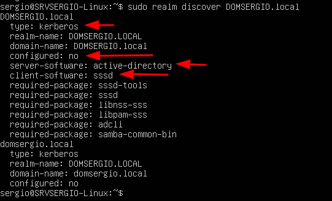
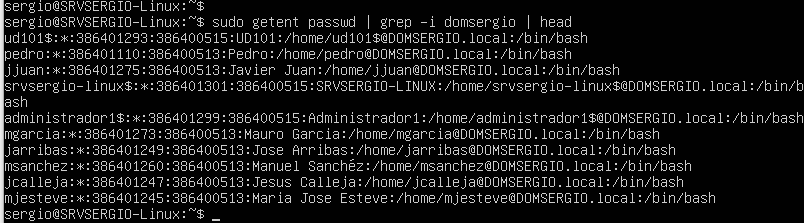
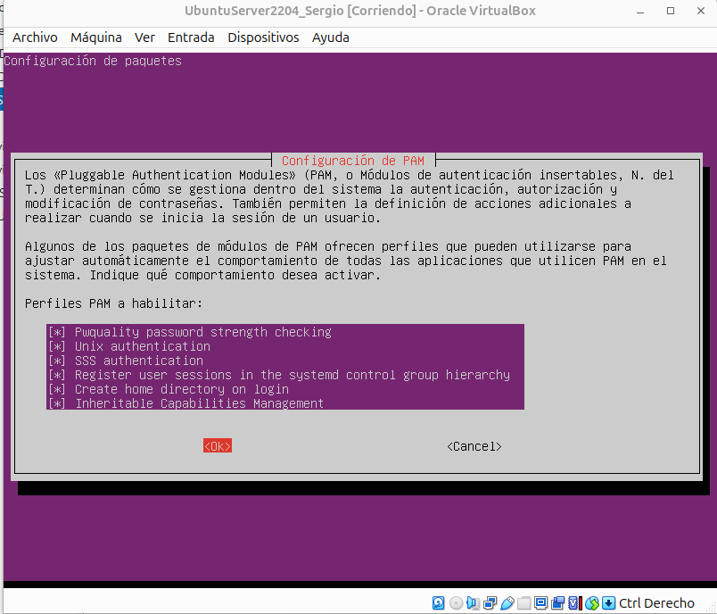

Ahora llega la parte más interesante y compleja de este tema: vamos a unir nuestro servidor Linux al dominio Active Directory de Windows Server que creamos en temas anteriores.

Una vez completada esta integración, conseguiremos que:

- Los usuarios del dominio Windows puedan autenticarse en el servidor Linux con sus credenciales del AD
- Los recursos compartidos en Linux respeten los permisos y grupos del Active Directory
- Todo funcione de forma transparente: los usuarios no notarán diferencia entre recursos Windows y Linux

Esta configuración es habitual en empresas con infraestructuras híbridas y representa una habilidad muy valorada profesionalmente.

## Requisitos previos

Antes de comenzar el proceso de integración, debemos asegurarnos de que se cumplen varios requisitos técnicos fundamentales.

### 1. Conectividad con el Windows Server

Primero verificamos que existe comunicación de red con el controlador de dominio Windows:

```bash
ping -c 4 192.168.100.1
```

Deberíamos recibir respuestas confirmando la conectividad.

### 2. Resolución DNS del dominio

Este es uno de los puntos más críticos. El servidor Linux debe poder resolver el nombre del dominio Active Directory. Para ello, **debe usar el Windows Server como servidor DNS**.

Verificamos que nuestra configuración DNS es correcta:

```bash
cat /etc/netplan/99-custom-config.yaml | grep -A 2 nameservers
```

Deberíamos ver que **solo** incluye la IP del Windows Server (`192.168.100.1`) como nameserver.

Probamos la resolución del dominio:

```bash
nslookup DOMXXX.local
```

(Sustituimos DOMXXX por el nombre real de vuestro dominio)

<figure markdown="span" align="center">
  { width="80%"}
  <figcaption>Prueba de resolución de nombres del dominio</figcaption>
</figure>


Si funciona, debería mostrar la IP del Windows Server. Si da error "server can't find...", hay un problema de DNS que debemos resolver antes de continuar.

!!!tip "Si el servidor DNS no resuelve bien la direccion del DOMXXX"

    Como tenemos un sistema muy complejo, es posible que el servidor DNS de nuestro Windows Server resuelva que la direción del DOMSERGIO.local es 10.0.2.15, que es la IP de la tarjeta de red externa, y por lo tanto inaccesible para nuestro servidor Ubuntu.

    Para solucionar esto, debemos corregir el registro en el Servidor DNS (Windows Server) e indicarle al servicio DNS que no "escuche" ni responda por las interfaces que no pertenecen a tu red de gestión (como la de NAT de VirtualBox 10.0.2.15).

    En el Windows Server, abre el Administrador de DNS:
    
    - Haz clic derecho sobre el nombre del servidor y selecciona Propiedades.
    - Ve a la pestaña Interfaces.
    - Cambia la selección a "Solo las siguientes direcciones IP".
    - Desmarca la casilla de la IP 10.0.2.15 y asegúrate de que solo la 192.168.100.1 esté marcada.
    - Aplica los cambios.

    <figure markdown="span" align="center">
      { width="80%"}
      <figcaption>Correción de la resolución de nombres DNS</figcaption>
    </figure>

    También tienes que eliminar manualmente las zonas directas de búsqueda que no sean la tarjeta de red correcta. Al final debe quedar algo similar a la siguiente imagen:

    <figure markdown="span" align="center">
      { width="80%"}
      <figcaption>Correción de la resolución de nombres DNS</figcaption>
    </figure>

    Después de todo esto, reinicia las DNS que tiene tu servidor ubuntu ejecutando

    ```bash
    sudo resolvectl flush-caches
    ```


!!!tip "nslookup no instalado"

    Si no teníamos `nslookup` instalado:

    ```bash
    sudo apt install -y dnsutils
    ```

    También podemos probar con:

    ```bash
    host DOMXXX.local
    ```

    o

    ```bash
    dig DOMXXX.local
    ```

### 3. Sincronización de hora

La autenticación Kerberos (que usa Active Directory) es extremadamente sensible a diferencias de hora. Si el reloj del servidor Linux y del Windows Server difieren en más de 5 minutos, la autenticación fallará.

Instalamos el cliente NTP para sincronización de hora:

```bash
sudo apt install -y chrony
```

Verificamos que el servicio está activo:

```bash
sudo systemctl status chronyd
```

Verificamos la sincronización:

```bash
timedatectl
```

Deberíamos ver:

<figure markdown="span" align="center">
  { width="80%"}
  <figcaption>Verificación de la sincronización de reloj</figcaption>
</figure>

La línea clave es `System clock synchronized: yes`. Si muestra `no`, esperamos un minuto y volvemos a verificar.

Opcionalmente, podemos configurar el servidor NTP para que use el Windows Server como fuente de hora, pero con chrony configurado por defecto suele ser suficiente.

### 4. Instalar paquetes necesarios

Para unir Linux a Active Directory necesitamos varios paquetes que gestionan la autenticación, la comunicación con el AD y la integración con Samba:

```bash
sudo apt install -y \
  realmd \
  sssd \
  sssd-tools \
  libnss-sss \
  libpam-sss \
  adcli \
  samba-common-bin \
  oddjob \
  oddjob-mkhomedir \
  packagekit \
  krb5-user 
```

**Explicación de los paquetes principales**:

- `realmd`: herramienta de alto nivel para descubrir y unirse a dominios
- `sssd`: System Security Services Daemon, gestiona la autenticación contra el AD
- `adcli`: herramientas de línea de comandos para Active Directory
- `samba-common-bin`: herramientas de Samba necesarias
- `oddjob-mkhomedir`: crea automáticamente carpetas personales cuando los usuarios del AD inician sesión por primera vez

La instalación tardará varios minutos. Al final indicamos que se reinicien los servicios para que tenga efecto los nuevo paquetes instalados:

<figure markdown="span" align="center">
  { width="80%"}
  <figcaption>Reinicio de servicios al final de la instalación</figcaption>
</figure>


## Unir el servidor al dominio

Con todos los requisitos cumplidos, procedemos a unir el servidor Linux al dominio Active Directory.

### Descubrir el dominio

Primero verificamos que podemos "descubrir" el dominio (es decir, que el servidor puede ver el Active Directory y obtener información sobre él):

```bash
sudo realm discover DOMXXX.local
```

(Sustituimos `DOMXXX` por el nombre de vuestro dominio)

Si todo funciona correctamente, veremos información detallada del dominio:

<figure markdown="span" align="center">
  { width="80%"}
  <figcaption>Ejecución de realm discover</figcaption>
</figure>

**Puntos clave a verificar**:

- `type: kerberos`: confirma que es un dominio Kerberos (Active Directory)
- `configured: no`: todavía no estamos unidos al dominio
- `server-software: active-directory`: confirma que es un AD de Windows
- `client-software: sssd`: usaremos SSSD para la autenticación

Si este comando falla, el problema suele ser DNS. Volvemos a verificar la resolución del dominio.

### Unir al dominio

Ahora ejecutamos el comando para unir el servidor al dominio. Necesitaremos credenciales de un usuario administrador del dominio Windows.
El dominio lo pondremos en **mayusculas** para evitar problemas con kerberos.

```bash
sudo realm join --user=Administrador DOMXXX.LOCAL
```

**Explicación**:

- `realm join`: comando para unirse al dominio
- `--user=Administrador`: usamos la cuenta de Administrador del dominio (o cualquier usuario con permisos de administrador del dominio)
- `DOMXXX.LOCAL`: nombre del dominio

El comando nos pedirá la contraseña del Administrador del dominio Windows. La escribimos (no se verá al escribir) y pulsamos `Enter`.

Si todo va bien, el comando completará sin mostrar ningún mensaje de error. El proceso puede tardar 10-30 segundos.

<figure markdown="span" align="center">
  { width="80%"}
  <figcaption>Ejecución de realm join. Unión al dominio</figcaption>
</figure>

!!!tip "Posibles errores comunes"

    **"Failed to join domain: failed to lookup DC info"**:
    - Problema de DNS. Verificar que el servidor puede resolver el nombre del dominio

    **"Couldn't authenticate to active directory: SASL(-1)"**:
    - Problema de Kerberos. Suele ser por diferencia de hora. Verificar `timedatectl`

    **"Insufficient permissions"**:
    - El usuario proporcionado no tiene permisos. Usar Administrador del dominio o un usuario con derechos adecuados

### Verificar que estamos unidos

Verificamos que la unión fue exitosa:

```bash
sudo realm list
```

Deberíamos ver información del dominio con `configured: kerberos-member`:


<figure markdown="span" align="center">
  { width="80%"}
  <figcaption>Ejecución de realm list. Verificación de la unión al dominio</figcaption>
</figure>


La línea `configured: kerberos-member` confirma que estamos correctamente unidos al dominio como miembro.

También podemos identificar que nos hemos unido al dominio mediante un 

```bash
sudo klist -k
```

### Ajuste de fichero /etc/sssd/sssd.conf

Por defecto, para iniciar sesión con un usuario del dominio debemos usar el formato completo: `usuario@domxxx.local`. Esto es incómodo. Vamos a configurar el sistema para poder usar solo el nombre de usuario.

Editamos el archivo de configuración de SSSD:

```bash
sudo nano /etc/sssd/sssd.conf
```

Buscamos la sección `[domain/DOMXXX.local]` y añadimos o modificamos estas línea:

```ini
[domain/DOMXXX.local]
use_fully_qualified_names = False  # esta se cambia True por false
fallback_homedir = /home/%d/%u     # esta también se actualiza
enumerate = True                   # esta se añade
```

Si no encontramos esa línea, la añadimos debajo del encabezado `[domain/DOMXXX.local]`.

Guardamos el archivo (`Ctrl+O`, `Enter`, `Ctrl+X`).

Como hemos que los *home* de los usuarios del domino vayan dentro de una carpeta con el nombre de domino, debemos crear esta carpeta antes de seguir:

```bash
# Crear la carpeta base para el dominio
sudo mkdir -p /home/DOMSERGIO
```

Reiniciamos SSSD para aplicar los cambios:

```bash
sudo systemctl restart sssd
```

### Verificar usuarios del dominio

Ahora verificamos que funciona:

```bash
id Administrador
id falonso
```

Deberíamos ver información del usuario (UID, GID, grupos) sin necesidad de escribir `@domxxx.local`.

<figure markdown="span" align="center">
  { width="80%"}
  <figcaption>Verificación de usuarios de dominio</figcaption>
</figure>


Podemos listar usuarios del dominio Windows desde Linux:

```bash
sudo getent passwd | grep -i DOMXXX
```

Deberíamos ver los usuarios del dominio en formato `usuario@domxxx.local` o solo `usuario` dependiendo de la configuración.

Por ejemplo:

<figure markdown="span" align="center">
  { width="80%"}
  <figcaption>Verificación de usuarios de dominio</figcaption>
</figure>

También podemos listar grupos del dominio:

```bash
sudo getent group | grep -i DOMXXX
```


### Crear carpeta personal automática

Cuando un usuario del dominio inicia sesión por primera vez en el servidor Linux, necesita una carpeta personal. Configuramos el sistema para crearla automáticamente:

```bash
sudo pam-auth-update
```

Aparecerá una interfaz en modo texto. Con las flechas navegamos a la opción:

```
[*] Create home directory on login
```

Nos aseguramos de que está marcada con un asterisco `*` (si no lo está, la marcamos con la barra espaciadora).

Navegamos hasta `<Ok>` y pulsamos `Enter`.

<figure markdown="span" align="center">
  { width="80%"}
  <figcaption>Habilitamos la creación automática del home</figcaption>
</figure>


## Configurar Samba como miembro del dominio

Ahora que el servidor está unido al dominio, necesitamos configurar Samba para que también use la autenticación del dominio.

Editamos el archivo de configuración de Samba:

```bash
sudo nano /etc/samba/smb.conf
```

Buscamos la sección `[global]` al principio del archivo. Modificamos o añadimos estas líneas:

```ini
[global]
   workgroup = DOMXXX
   security = ADS
   realm = DOMXXX.LOCAL
   vfs objects = acl_xattr
   
   # para autenticación
   idmap config * : backend = tdb
   idmap config * : range = 3000-7999
   idmap config DOMXXX : backend = rid
   idmap config DOMXXX : range = 10000-999999
   template shell = /bin/bash
   template homedir = /home/%D/%U
   
   # Evitamos conflictos: no necesitamos el servicio winbind activo
   kerberos method = system keytab   
```

**IMPORTANTE**: Sustituimos todas las ocurrencias de `DOMXXX` por el nombre real de vuestro dominio (en mayúsculas donde corresponda).

!!!note "Explicación de la configuración"

    - `workgroup = DOMXXX`: nombre NetBIOS del dominio (la parte antes del `.local`)
    - `security = ADS`: usar Active Directory Security
    - `realm = DOMXXX.LOCAL`: nombre completo del dominio en mayúsculas
    - Las líneas `idmap` configuran cómo se mapean los IDs de Windows (SIDs) a IDs de Linux (UIDs/GIDs)
    - `template shell` y `template homedir`: configuran el shell y carpeta personal para usuarios del dominio

Guardamos el archivo.


Reiniciamos todos los servicios relacionados:

```bash
sudo systemctl restart smbd nmbd
```
Comprobación de conectividad ADS

```bash
sudo net ads info
```

Deberías ver la IP del servidor Windows (192.168.100.1) y la hora del dominio sincronizada.

Si estos comandos funcionan, significa que Samba puede comunicarse correctamente con el Active Directory.

## Crear recurso compartido con autenticación del dominio

Ahora vamos a crear un recurso compartido que use autenticación del dominio y respete los grupos del AD.

Primero, eliminamos o comentamos la sección `[Prueba]` que creamos anteriormente (ya no la necesitamos):

```bash
sudo nano /etc/samba/smb.conf
```

Buscamos `[Prueba]` y comentamos todas sus líneas añadiendo `#` al principio, o directamente las borramos.

Al final del archivo, añadimos una nueva configuración:

```ini
[Empresa]
   comment = Carpeta compartida para usuarios de la empresa
   path = /srv/compartido/empresa
   browseable = yes
   read only = no
   valid users = @"DOMXXX\gEmpresa"
   write list = @"DOMXXX\gEmpresa"
   force group = "DOMXXX\gEmpresa"
   create mask = 0770
   directory mask = 0770
```

!!! note "Explicación de la configuración"

    - `valid users = @"DOMXXX\gempresa"`: solo usuarios del grupo "gEmpresa" del dominio pueden acceder
    - El `@` indica que es un grupo (no un usuario individual)
    - Las comillas son necesarias porque el nombre contiene una contrabarra
    - `write list`: quién puede escribir (en este caso, el mismo grupo)
    - `force group`: los archivos creados pertenecerán a este grupo
    - `create mask` y `directory mask`: permisos de archivos y carpetas creados (770 = rwx para propietario y grupo, nada para otros)

Guardamos el archivo.

Ahora ajustamos los permisos de la carpeta en el sistema Linux:

```bash
sudo chown -R root:"DOMXXX\\gEmpresa" /srv/compartido/empresa
sudo chmod -R 770 /srv/compartido/empresa
```

**Nota**: La doble contrabarra `\\` es necesaria en la línea de comandos para escapar el carácter.

Verificamos la configuración de Samba:

```bash
testparm
```

Si no hay errores, reiniciamos Samba:

```bash
sudo systemctl restart smbd
```

## Probar acceso desde Windows

Ahora viene la prueba final: verificar que un usuario del dominio puede acceder al recurso compartido desde Windows usando sus credenciales del AD.

Desde un cliente Windows **unido al dominio**:

1. Iniciamos sesión con un usuario del dominio (por ejemplo, `falonso` que creamos en el tema de Active Directory)
2. Abrimos el **Explorador de archivos**
3. En la barra de direcciones escribimos: `\\192.168.100.5` o `\\SRVXXX_Linux`
4. Deberíamos ver el recurso compartido **Compartido**
5. Hacemos doble clic para entrar

Si todo funciona correctamente:

- No debería pedir credenciales (usa automáticamente las del usuario actual del dominio)
- Podemos crear archivos y carpetas dentro
- Los permisos se respetan según la configuración

Si pide credenciales, introducimos: `DOMXXX\falonso` y su contraseña del dominio.

Para verificar que los permisos funcionan correctamente, podemos:

1. Crear un archivo desde Windows
2. Desde el servidor Linux, verificar el propietario:

```bash
ls -l /srv/compartido/
```

Deberíamos ver que el archivo pertenece al usuario del dominio que lo creó.

