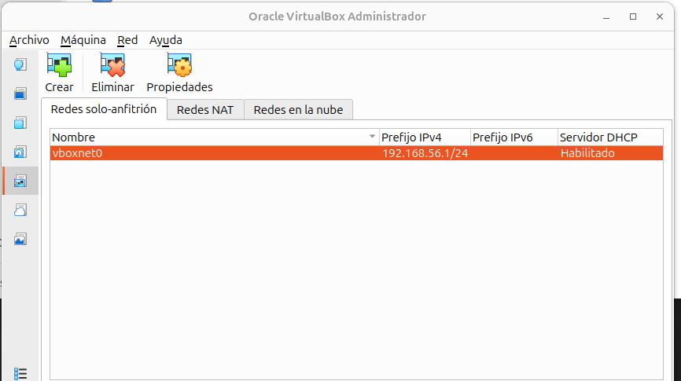

## Configuración de red estática con Netplan

### Por qué configuración estática

Cuando instalamos Ubuntu Server, la tarjeta de red se configura automáticamente mediante DHCP si hay un servidor DHCP disponible, o queda sin configurar si no lo hay.

Para un servidor, es imprescindible que la dirección IP sea **fija** (estática). No puede cambiar cada vez que se reinicia el sistema. Imaginad si cada vez que el servidor se reinicia su IP cambia: los clientes no sabrían dónde encontrarlo, las configuraciones de red fallarían y todo dejaría de funcionar.

### Netplan: el gestor de red de Ubuntu

Ubuntu Server usa **Netplan** para configurar la red. Netplan es un sistema que:

- Lee archivos de configuración en formato YAML
- Genera la configuración para el gestor de red subyacente (NetworkManager o systemd-networkd)
- Aplica los cambios de forma consistente

Los archivos de configuración de Netplan están en el directorio `/etc/netplan/`.

Veamos qué archivos hay:

```bash
ls /etc/netplan/
```

Normalmente encontraremos un archivo llamado `00-installer-config.yaml` o algo similar. Los números al principio determinan el orden de aplicación si hay varios archivos.

Veamos su contenido actual:

```bash
sudo cat /etc/netplan/00-installer-config.yaml
```

Veremos algo parecido a esto:

```yaml
network:
  ethernets:
    enp0s3:
      dhcp4: true
  version: 2
```

Esto significa que la interfaz está configurada para obtener IP automáticamente mediante DHCP.

!!!warning "Cuidado si hay más de un fichero en `/etc/netplan/`"

    Cuidado, porque si hay más de un fichero en la carpeta `/etc/netplan/` prevalece el que comienza por un número superior, y en todo caso, se mezclan todas las configuraciones. 

    Por ello, si hay más de un fichero, debemos identificar el fichero que no queremos y cambiar su nombre para que no acabe en `.yaml`.

    Por ejemplo, si tenemos un fichero como `50-cloud-init.yaml` lo podemos renombrar así:

    ```bash
    mv /etc/netplan/50-cloud-init.yaml /etc/netplan/50-cloud-init.yaml.bak
    ```


### Configurar IP estática

Vamos a modificar este archivo para configurar una IP estática en nuestra interfaz de red.

**Esquema de red a configurar**:

Según el diseño de nuestra red ISCASOX, la configuración quedará así:

**enp0s3** (única interfaz - red departamentos):

- IP: `192.168.100.10/24`
- Gateway: `192.168.100.1` (Windows Server)
- DNS: `192.168.100.1`, `8.8.8.8`

El Windows Server actuará como puerta de enlace para dar salida a Internet a nuestro servidor Linux.

!!!note "IMPORTANTE"
    El nombre de la interfaz puede variar en vuestro sistema. Usad el comando `ip addr` para verificar el nombre real y ajustad la configuración en consecuencia.

### Editar el archivo de configuración

Para editar archivos en Linux desde la terminal usamos editores de texto. Los más comunes son:

- **nano**: más sencillo e intuitivo, ideal para principiantes
- **vi** o **vim**: más potente pero con curva de aprendizaje pronunciada

Usaremos **nano** porque es más fácil de usar:

```bash
sudo nano /etc/netplan/99-installer-config.yaml
```

Nos pedirá la contraseña de sudo si han pasado más de 15 minutos desde la última vez que lo usamos.

El editor nano se abrirá mostrando el contenido actual del archivo. En la parte inferior veremos atajos de teclado (el símbolo `^` representa la tecla Ctrl).

Borramos todo el contenido actual (con Supr o Backspace) y escribimos la siguiente configuración:

```yaml
network:
  version: 2
  renderer: networkd
  ethernets:
    enp0s3:
      dhcp4: false
      dhcp6: false
      addresses:
        - 192.168.100.10/24
      routes:
        - to: default
          via: 192.168.100.1
      nameservers:
        addresses:
          - 192.168.100.1
        search:
          - domsergio.local
```

!!!tip "IMPORTANTE - Aspectos críticos de YAML"

    En YAML, la **indentación es absolutamente crítica**. El formato usa espacios para indicar jerarquía.

    Debe indentarse con **espacios**, NUNCA con tabuladores. Si usáis tabuladores, dará error.

    Cada nivel de indentación son exactamente **2 espacios**.

    Los dos puntos (`:`) después de cada clave son obligatorios.

    Las listas se indican con guiones (`-`).

    Verificad cuidadosamente que el nombre de vuestra interfaz coincide con el que mostró `ip addr`. Si en vuestro sistema la interfaz se llama `ens33`, `eth0`, etc., debéis usar ese nombre.

**Explicación de la configuración**:

- `addresses`: la IP estática que asignamos al servidor
- `routes`: definimos la ruta por defecto (gateway) hacia el Windows Server
- `nameservers`: servidores DNS que usará el sistema (primero el Windows Server, luego Google DNS como backup)

### Guardar el archivo

Para guardar los cambios en nano:

1. Pulsamos `Ctrl + O` (letra O, de "Output" o salida)
2. Nos preguntará el nombre del archivo. Como no lo cambiamos, simplemente pulsamos `Enter`
3. Para salir del editor: `Ctrl + X`

Una vez guardado la configuración es adecuado restringir el acceso a dicho fichero, por lo que reduciremos los permisos para evitar problemas futuros:

```bash
sudo chmod 600 /etc/netplan/99-installer-config.yaml 
```

### Aplicar la configuración

Antes de aplicar la configuración definitivamente, Netplan nos permite probarla de forma segura:

```bash
sudo netplan try
```

Este comando es muy inteligente. Aplica la configuración temporalmente y nos pregunta si funciona. Si no respondemos en 120 segundos, **revierte automáticamente** los cambios. Esto es una medida de seguridad fundamental para no quedarnos sin acceso al servidor.

Si todo va bien, veremos:

<figure markdown="span" align="center">
  { width="80%" }
  <figcaption>Verificación de la configuración Netplan</figcaption>
</figure>

Pulsamos Enter para aceptar definitivamente la nueva configuración.

También se podría haber aplicado directamente la configuración con un 

```bash
sudo netplan apply
```

**Si hay errores de sintaxis**, nos los mostrará. Los errores más comunes son:

- Indentación incorrecta (usar tabuladores en vez de espacios, o número incorrecto de espacios)
- Nombre de interfaz incorrecto
- Falta de dos puntos (`:`) después de las claves YAML
- Guiones (`-`) mal colocados en las listas

Si hay error, el comando no aplicará los cambios. Debemos volver a editar el archivo y corregir.

### Verificar la configuración

Una vez aplicada correctamente, verificamos que la IP se ha asignado:

```bash
ip addr show
```

Deberíamos ver nuestra interfaz con la dirección IP configurada:

<figure markdown="span" align="center">
  { width="80%" }
  <figcaption>Verificación de la configuración de red</figcaption>
</figure>


Verificamos que podemos comunicarnos con el Windows Server:

```bash
ping -c 4 192.168.10.1
```

Si el Windows Server está configurado correctamente como gateway, deberíamos tener también acceso a Internet:

```bash
ping -c 4 google.com
```

Si ambos funcionan, ¡perfecto! La red está correctamente configurada.

**Nota**: Si el ping a Internet no funciona, aseguraos de que el Windows Server tiene configurado correctamente el enrutamiento y el NAT para dar salida a Internet a las redes internas.

### Configurar el nombre del servidor (hostname)

El nombre del servidor (hostname) se configura con el comando `hostnamectl`:

```bash
sudo hostnamectl set-hostname SRVXXX_Linux
```

Para verificar que se ha cambiado correctamente:

```bash
hostnamectl
```

Veremos información detallada del sistema incluyendo el nuevo hostname.

**IMPORTANTE**: También debemos editar el archivo `/etc/hosts` para que el sistema resuelva correctamente su propio nombre:

```bash
sudo nano /etc/hosts
```

El archivo debe contener al menos estas líneas:

```
127.0.0.1 localhost
127.0.1.1 SRVXXX_Linux

# Las siguientes líneas son para IPv6
::1     ip6-localhost ip6-loopback
fe00::0 ip6-localnet
ff00::0 ip6-mcastprefix
ff02::1 ip6-allnodes
ff02::2 ip6-allrouters
```

La línea importante es `127.0.1.1 SRVXXX_Linux`. Aseguraos de que coincide con vuestro hostname.

Guardamos el archivo (`Ctrl+O`, `Enter`, `Ctrl+X`).

Para que todos los cambios se apliquen completamente, reiniciamos el servidor:

```bash
sudo reboot
```

El sistema se reiniciará. Esperamos unos 30 segundos y volvemos a hacer login. El prompt debería mostrar ya el nuevo nombre del servidor:

```
admin@SRVXXX_Linux:~$
```

## Acceso al servidor mediante `ssh`

Trabajar con la interfaz del servidor no es muy amigable y además como norma general en condiciones normales de cualquier empresa, no vamos a estar trabajando frente al servidor que se encontrará en un CPD (Centro de Proceso de Datos). Por eso, lo lógico es conectarnos a los servidores GNU/Linux mediante `ssh`.

Vamos a emular este entorno en nuestra máquina de forma que:

- Configuraremos nuestra máquina virtual para poder acceder a ella desde nuestro equipo host.
- Trabajaremos desde la terminal de nuestro host, que nos permitirá trabajar mejor y entre otras cosas podremos **copiar y pegar**.

Así pues sigamos los siguientes pasos.

1. Añadamos una nueva tarjeta de red a nuestro equipo virtual
2. Configuremos una IP para esta nueva tarjeta
3. Accedamos usando `ssh`

### 1. Configuración de nueva tarjeta de red.

Vamos a optar por una configuración de red **solo anfitrión** para poder acceder a nuestro servidor únicamente desde nuestro equipo host y no interferir con el resto de equipos de nuestra LAN del aula.

Para ello, en Oracle VirtualBox vamos a **Archivo > Herramientas > Red** y en la primera pestaña de **Redes solo-anfitrión** pulsamos sobre el botón **Crear** y automáticamente se habrá creado en nuestro equipo una interfaz virtual para comunicarnos directamente con nuestras máquinas virtuales.

Cono normal general, veremos que la red creada es una **192.168.56.1/24**

<figure markdown="span" align="center">
  { width="80%" }
  <figcaption>Redes solo-anfitrión en VirtualBox</figcaption>
</figure>

Apagamos nuestro equipo y añadimos una nueva tarjeta de red, habilitamos una segunda tarjeta de red y seleccionamos la red **solo-anfitrión** que acabamos de crear.

<figure markdown="span" align="center">
  { width="90%" }
  <figcaption>Redes solo-anfitrión en VirtualBox</figcaption>
</figure>

### 2. Configuración de nueva dirección de red.

Ahora iniciamos de nuevo el equipo y comprobamos las nuevas direcciones de red.

<figure markdown="span" align="center">
  { width="70%" }
  <figcaption>Configuración red solo anfitrión para conexión por ssh</figcaption>
</figure>

En la imagen podemos ver que tenemos una nueva tarjeta de red `enp0s8` que no esta activa. Vamos a editar de nuevo nuestro netplan y simplemente le asignaremos una dirección de red teniendo en cuenta la red que tenía el interfaz **solo-anfitrión** que acabamos de crear : `192.168.56.0/24`

Así pues, añadimos nueva configuración a nuestro `netplan`

```yaml
    enp0s8:
      dhcp4: false
      addresses:
        - 192.168.56.2/24
```

probamos y aplicamos cambios y verificamos la nueva IP de nuestro equipo

<figure markdown="span" align="center">
  { width="80%" }
  <figcaption>Configuración red solo anfitrión para conexión por ssh</figcaption>
</figure>

Ya tenemos el equipo preparado para acceder desde nuestro host.

### 3. Acceso por `ssh`

Ahora nos vamos a nuestro equipo host, abrimos un terminal y probamos las comunicaciones entre el Ubuntu Server y nuestro equipo de clase, haciendo respectivamente `ping` entre ellos:

<figure markdown="span" align="center">
  { width="95%" }
  <figcaption>Comprobar comunicaciones entre host y máquina virtual</figcaption>
</figure>

Y ahora solamente nos queda comunicarnos por `ssh` desde nuestro host mediante el siguiente comando:

```bash
ssh sergio@192.168.56.2
```

Donde:

  - `ssh` es el comando conectarnos
  - `sergio` es el nombre de tu usuario en tu Ubuntu Server
  - `192.168.56.2` es la IP de tu Ubuntu Server

Ejecutamos el comando, nos pregunta si nos queremos conectar (y nos advierte de que vamos a dejar rastro) y contestamos `yes`, y en nuestra terminal estamos trabajando en el equipo servidor.

<figure markdown="span" align="center">
  { width="85%" }
  <figcaption>Conexión ssh</figcaption>
</figure>

A partir de este momento, no tocamos el servidor, y trabajamos desde el terminal de nuestro equipo host.