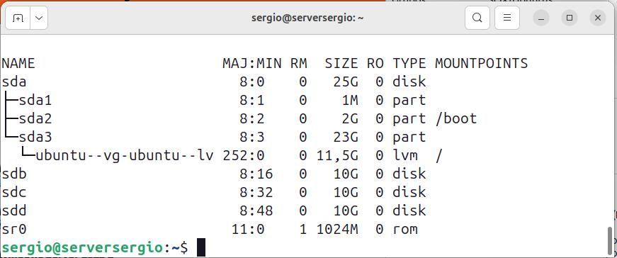
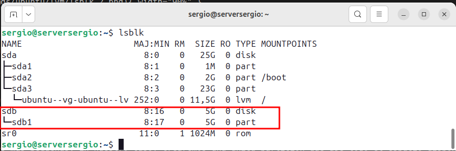

## Introducción al almacenamiento en Linux

Cuando trabajamos con servidores Linux, es fundamental comprender cómo funciona el sistema de almacenamiento. A diferencia de Windows, donde cada disco suele aparecer como una letra de unidad independiente (`C:`, `D:`, `E:`), en Linux todo el almacenamiento se integra en un único árbol de directorios que comienza en la raíz `/`.

Esta diferencia conceptual puede resultar confusa al principio, pero en realidad proporciona una flexibilidad extraordinaria. Podemos añadir discos nuevos y "conectarlos" en cualquier punto del sistema de archivos, de forma que para los usuarios y aplicaciones resulte completamente transparente dónde se encuentra físicamente cada dato.

En esta sección vamos a aprender los conceptos fundamentales del almacenamiento en Linux: cómo el sistema detecta los discos, cómo los preparamos para su uso, y cómo los integramos en el árbol de directorios mediante el proceso de montaje.

## El concepto de montaje en Linux

### Diferencias entre Windows y Linux

Para entender el montaje en Linux, primero debemos comprender cómo funciona en Windows, que probablemente nos resulte más familiar.

**En Windows**, cada disco o partición aparece como una unidad independiente con su propia letra. Si tenemos tres discos duros, podríamos tener:

```
C:\ (disco principal con Windows)
D:\ (disco de datos)
E:\ (disco de backups)
```

Cada unidad es como una "isla" separada. Para acceder a los datos del disco D:, debemos cambiar explícitamente a esa unidad. No hay conexión directa entre ellas en el sistema de archivos.

**En Linux**, en cambio, todo el almacenamiento forma parte de un único árbol jerárquico que comienza en la raíz `/`. No existen letras de unidad. Todos los discos, particiones y dispositivos se integran como carpetas dentro de este árbol único.

Por ejemplo, podríamos tener:

```
/ (raíz del sistema)
├── home (carpetas de usuarios)
├── var (datos variables del sistema)
├── srv (datos de servicios)
│   ├── empresa (montado desde un disco adicional)
│   └── backups (montado desde otro disco)
└── boot (archivos de arranque)
```

En este esquema, `/srv/empresa` y `/srv/backups` podrían estar físicamente en discos duros completamente diferentes, pero para el usuario aparecen simplemente como carpetas más dentro del sistema. Esta integración se realiza mediante el proceso de **montaje**.

Otro ejemplo:

<figure markdown="span" align="center">
  { width="90%" }
  <figcaption>Esquema de sistema con 3 díscos extra montados</figcaption>
</figure>

### Qué significa "montar" un disco

**Montar** un disco o partición significa conectar su contenido a una carpeta específica del sistema de archivos. Esa carpeta se denomina **punto de montaje**.

Pensemos en una analogía: el sistema de archivos de Linux es como un edificio de oficinas. La estructura del edificio (pasillos, salas, despachos) ya existe. Cuando montamos un disco, es como si colocáramos un archivador adicional en una de esas salas. El archivador (disco) contiene sus propios documentos, pero se accede a él desde una ubicación concreta dentro del edificio.

**Ejemplo práctico**: 

Imaginemos que añadimos un disco duro de 100GB para almacenar datos de la empresa. Podemos:

1. Crear una carpeta `/srv/empresa` (el punto de montaje, una sala vacía en nuestro edificio)
2. Montar el disco en esa carpeta
3. A partir de ese momento, todo lo que guardemos en `/srv/empresa` se almacenará físicamente en ese disco de 100GB

Para los usuarios y aplicaciones, `/srv/empresa` es simplemente otra carpeta más. No necesitan saber que está en un disco separado. Esta transparencia es una de las grandes ventajas de Linux.

### Ventajas del sistema de montaje

Este enfoque proporciona varias ventajas importantes:

**Flexibilidad total**: podemos decidir exactamente dónde queremos que aparezca cada disco. Si necesitamos más espacio para carpetas de usuarios, añadimos un disco y lo montamos en `/home`. Si necesitamos espacio para backups, lo montamos en `/srv/backups`. La estructura lógica permanece clara y ordenada.

**Transparencia**: las aplicaciones y usuarios no necesitan saber en qué disco físico están los datos. Simplemente usan rutas como `/srv/empresa/documentos/informe.pdf` y el sistema se encarga de dirigir la operación al disco correcto.

**Seguridad**: podemos montar discos con diferentes opciones de seguridad. Por ejemplo, un disco con datos sensibles podría montarse como solo lectura, o un disco externo podría montarse sin permitir la ejecución de programas desde él.

**Reorganización sencilla**: si más adelante necesitamos cambiar un disco por otro más grande, podemos copiar los datos al disco nuevo, desmontarlo del punto antiguo, montar el nuevo en el mismo punto, y todo sigue funcionando exactamente igual.

## Identificación de discos y particiones

### Nomenclatura de dispositivos en Linux

Antes de poder trabajar con un disco, necesitamos saber cómo identificarlo en el sistema. Linux asigna nombres específicos a cada dispositivo de almacenamiento.

Los discos duros tradicionales (SATA) y los virtuales (en VirtualBox) aparecen con nombres como:

```
/dev/sda    (primer disco)
/dev/sdb    (segundo disco)
/dev/sdc    (tercer disco)
...
```

Las particiones dentro de cada disco se numeran:

```
/dev/sda1   (primera partición del primer disco)
/dev/sda2   (segunda partición del primer disco)
/dev/sdb1   (primera partición del segundo disco)
...
```

**Importante**: en algunos sistemas, especialmente con discos virtuales, los nombres pueden ser `/dev/vda`, `/dev/vdb`, etc., en lugar de `sda`, `sdb`. El principio es el mismo, solo cambia la letra inicial.

Estos nombres se encuentran siempre en el directorio `/dev/` (de "devices" - dispositivos), que es donde Linux coloca los archivos especiales que representan el hardware del sistema.

### Ver los discos disponibles

Para ver todos los dispositivos de bloque (discos, particiones, etc.) conectados al sistema, usamos el comando `lsblk`:

```bash
lsblk
```

Este comando muestra un árbol con todos los dispositivos de almacenamiento. Una salida típica podría ser:

<figure markdown="span" align="center">
  { width="90%" }
  <figcaption>Ver los discos disponibles</figcaption>
</figure>

**Interpretación de cada columna**:

- `NAME`: nombre del dispositivo o partición
- `SIZE`: tamaño total
- `TYPE`: tipo (disk=disco completo, part=partición, lvm=volumen LVM)
- `MOUNTPOINTS`: dónde está montado actualmente (si está montado)

En este ejemplo vemos:

- `sda`: disco principal de 25GB con tres particiones, la tercera montada en `/` (raíz del sistema)
- `sr0`: Unidad de CD, que no tiene contenido y no esta montada

Un disco que aparece sin "MOUNTPOINTS" no está montado, lo que significa que aunque el sistema lo detecta, todavía no podemos acceder a su contenido.

## Práctica: añadir y preparar un disco nuevo

Vamos a realizar el proceso completo de añadir un disco nuevo a nuestro servidor, prepararlo y hacerlo accesible mediante montaje.

### Paso 1: Añadir un disco en VirtualBox

Con la máquina virtual completamente apagada, vamos a añadir un disco adicional.

**Apagar la máquina virtual**:

Desde la terminal del servidor ejecutamos:

```bash
sudo poweroff
```

El sistema se apagará de forma ordenada, cerrando todos los servicios correctamente.

**Añadir el disco en VirtualBox**:

Con la VM apagada, en VirtualBox:

1. Seleccionamos nuestra VM `SRVXXX_Linux`
2. Click en **Configuración**
3. Navegamos a **Almacenamiento**
4. En **Controladora: SATA**, click en el icono de disco con `+` (Añadir disco duro)
5. Click en **Crear**
6. Configuramos el nuevo disco:
   - Tipo: **VDI (VirtualBox Disk Image)**
   - Almacenamiento: **Reservado dinámicamente**
   - Tamaño: **5 GB**
7. Click en **Crear** y luego en **Aceptar**

### Paso 2: Verificar la detección del disco

Iniciamos la máquina virtual y hacemos login con nuestro usuario inicial `admin`.

Verificamos que el sistema ha detectado el nuevo disco:

```bash
lsblk
```

Deberíamos ver algo similar a:

<figure markdown="span" align="center">
  { width="90%" }
  <figcaption>Nuevo disco `sdb2` instalado</figcaption>
</figure>

El nuevo disco aparece como `sdb` de 5GB, sin particiones y sin montar. Está detectado por el sistema, pero todavía no podemos usarlo.

### Paso 3: Particionar el disco

Aunque tenemos un disco de 5GB, el sistema operativo no puede usar directamente el disco completo. Primero debemos crear al menos una partición en él.

Una **partición** es una división lógica de un disco. Podemos crear una única partición que ocupe todo el disco, o dividirlo en varias particiones más pequeñas. En nuestro caso, crearemos una única partición que use todo el espacio disponible.

Utilizaremos la herramienta `fdisk` para particionar:

```bash
sudo fdisk /dev/sdb
```

Este comando inicia un modo interactivo. Veremos un prompt `Command (m for help):` esperando nuestras órdenes.

**Secuencia de comandos a ejecutar**:

1. Escribimos `n` (new - nueva partición) y pulsamos Enter
2. Elegimos `p` (primary - partición primaria) y pulsamos Enter
3. Número de partición: pulsamos Enter para aceptar el valor por defecto (1)
4. Primer sector: pulsamos Enter para aceptar el valor por defecto
5. Último sector: pulsamos Enter para usar todo el espacio disponible
6. Escribimos `w` (write - escribir cambios) y pulsamos Enter

La herramienta guardará los cambios y saldrá.

<figure markdown="span" align="center">
  { width="90%" }
  <figcaption>Particionando nuevo disco</figcaption>
</figure>

Verificamos que la partición se ha creado:

```bash
lsblk
```

Ahora veremos:


<figure markdown="span" align="center">
  { width="90%" }
  <figcaption>Nuevo disco sdb particionado</figcaption>
</figure>

Perfecto. Tenemos `sdb1`, una partición que ocupa los 5GB completos del disco `sdb`.

### Paso 4: Crear un sistema de archivos

La partición existe, pero está "vacía" a nivel lógico. Necesita un sistema de archivos para poder almacenar datos de forma organizada.

El sistema de archivos es como el "índice" que permite al sistema operativo saber dónde está cada archivo, cómo se llama, qué permisos tiene, etc. Sin sistema de archivos, el disco sería simplemente un montón de bytes sin estructura.

En Linux, el sistema de archivos más común es **ext4** (Fourth Extended Filesystem). Es maduro, estable, eficiente y ampliamente compatible.

Creamos el sistema de archivos ext4 en nuestra partición:

```bash
sudo mkfs.ext4 /dev/sdb1
```

Este proceso formatea la partición y tarda unos segundos. Veremos una salida similar a:

<figure markdown="span" align="center">
  { width="90%" }
  <figcaption>Formateando la nueva partición</figcaption>
</figure>

La partición ahora tiene un sistema de archivos ext4 completamente funcional y listo para almacenar datos.

### Paso 5: Crear el punto de montaje

Antes de montar el disco, necesitamos decidir **dónde** queremos que aparezca en el árbol de directorios. Vamos a montarlo en `/srv/datos`, un lugar apropiado para datos de servicios del servidor.

Primero verificamos si la carpeta `/srv` existe:

```bash
ls -ld /srv
```

Si existe (lo cual es habitual), veremos:

```
drwxr-xr-x 2 root root 4096 ... /srv
```

Si no existiera, la crearíamos con `sudo mkdir /srv`.

Ahora creamos la carpeta específica donde montaremos nuestro disco:

```bash
sudo mkdir /srv/datos
```

Verificamos que se ha creado:

```bash
ls -l /srv/
```

<figure markdown="span" align="center">
  { width="90%" }
  <figcaption>Preparando carpeta para montar unidad</figcaption>
</figure>

La carpeta `/srv/datos` existe y está vacía. Este será nuestro punto de montaje.

### Paso 6: Montar el disco

Ahora conectamos la partición formateada a la carpeta que acabamos de crear:

```bash
sudo mount /dev/sdb1 /srv/datos
```

Este comando no muestra ninguna salida si todo va bien.

Verificamos que el montaje se ha realizado correctamente:

```bash
df -h
```

El comando `df` (disk free) muestra todos los sistemas de archivos montados y su espacio disponible. La opción `-h` hace que los tamaños se muestren en formato legible (GB, MB, etc.).

Al final de la lista deberíamos ver:

<figure markdown="span" align="center">
  { width="90%" }
  <figcaption>Unidad montada en la carpeta</figcaption>
</figure>


Perfecto. Nuestro disco de 5GB está montado en `/srv/datos` y tiene aproximadamente 4.9GB disponibles (el sistema de archivos usa un poco de espacio para sus estructuras internas).

También podemos verificarlo con `lsblk`:

```bash
lsblk
```

Ahora `sdb1` muestra su punto de montaje: `/srv/datos`.

### Paso 7: Probar el disco

Vamos a verificar que podemos crear y leer archivos en nuestro nuevo disco.

Creamos un archivo de prueba:

```bash
sudo touch /srv/datos/prueba.txt
```

El comando `touch` crea un archivo vacío. Verificamos que se ha creado:

```bash
ls -l /srv/datos/
```

<figure markdown="span" align="center">
  { width="90%" }
  <figcaption>Contenido de la carpeta</figcaption>
</figure>


Vemos dos elementos:

- `lost+found`: carpeta especial que ext4 crea automáticamente para recuperación de datos en caso de errores del sistema
- `prueba.txt`: nuestro archivo de prueba

Creamos también una carpeta y un archivo dentro con algo de contenido:

```bash
sudo mkdir /srv/datos/documentos
echo "Archivo de prueba en disco adicional" | sudo tee /srv/datos/documentos/info.txt
```

Verificamos el contenido:

```bash
cat /srv/datos/documentos/info.txt
```

<figure markdown="span" align="center">
  { width="90%" }
  <figcaption>Contenido de la carpeta</figcaption>
</figure>


Perfecto. El disco funciona correctamente y podemos leer y escribir datos en él.

### Paso 8: Montaje automático con /etc/fstab

Hay un problema importante: si reiniciamos el servidor ahora, el disco **no se montará automáticamente**. Después de cada reinicio, `/srv/datos` estaría vacío y tendríamos que volver a ejecutar `sudo mount /dev/sdb1 /srv/datos` manualmente.

Para que el disco se monte automáticamente cada vez que el sistema arranque, debemos añadir una entrada en el archivo `/etc/fstab`.

El archivo `/etc/fstab` (file systems table - tabla de sistemas de archivos) contiene la lista de todos los sistemas de archivos que deben montarse automáticamente al inicio. Es uno de los archivos de configuración más importantes de Linux.

**Siempre hacer backup antes de modificar fstab**:

Un error en este archivo puede impedir que el sistema arranque correctamente, así que es fundamental hacer una copia de seguridad antes de tocarlo:

```bash
sudo cp /etc/fstab /etc/fstab.backup
```

Si algo sale mal, podremos recuperar el archivo original desde esta copia.

Editamos el archivo:

```bash
sudo nano /etc/fstab
```

Veremos algo similar a esto (puede variar según la instalación):

```
# /etc/fstab: static file system information.
#
# <file system> <mount point>   <type>  <options>       <dump>  <pass>
UUID=abc-123-def... / ext4 defaults 0 1
UUID=xyz-789-ghi... /boot ext4 defaults 0 2
/swap.img none swap sw 0 0
```

Nos desplazamos hasta el final del archivo (con las flechas del teclado) y añadimos esta línea:

```
/dev/sdb1  /srv/datos  ext4  defaults  0  2
```

!!!info "**Explicación de cada campo** (separados por espacios o tabuladores):"

    1. `/dev/sdb1`: dispositivo a montar (nuestra partición)
    2. `/srv/datos`: punto de montaje (dónde queremos que aparezca)
    3. `ext4`: tipo de sistema de archivos
    4. `defaults`: opciones de montaje (usa las opciones por defecto: lectura/escritura, permitir ejecución, etc.)
    5. `0`: dump (backup automático con la herramienta dump). `0` = no hacer backup automático
    6. `2`: orden de comprobación al arrancar. `0` = no comprobar, `1` = comprobar primero (solo para `/`), `2` = comprobar después

Guardamos el archivo (`Ctrl+O`, `Enter`) y salimos del editor (`Ctrl+X`).

**Verificar que no hay errores** (paso crítico):

Antes de reiniciar, SIEMPRE debemos verificar que el archivo `/etc/fstab` es correcto. Un error tipográfico podría impedir que el sistema arranque.

```bash
sudo mount -a
```

Este comando intenta montar todos los sistemas de archivos listados en `/etc/fstab`. Si hay algún error, nos lo mostrará inmediatamente. Si no muestra ningún mensaje, significa que todo está correcto.

Verificamos que el disco sigue montado correctamente:

```bash
df -h | grep datos
```

```
/dev/sdb1       4.9G   28K  4.6G   1% /srv/datos
```

Perfecto.

**Probar con un reinicio**:

Ahora sí podemos reiniciar con confianza:

```bash
sudo reboot
```

El sistema se reiniciará. Esperamos unos 30 segundos y volvemos a conectarnos.

Tras el reinicio, lo primero que hacemos es verificar que el disco se ha montado automáticamente:

```bash
df -h | grep datos
```

Si vemos el disco montado, todo ha funcionado correctamente. El montaje automático está configurado.

Verificamos también que nuestros archivos de prueba siguen ahí:

```bash
ls -l /srv/datos/
cat /srv/datos/documentos/info.txt
```

Si vemos nuestros archivos, ¡perfecto! El disco está correctamente integrado en el sistema y persistirá tras reinicios.

## Permisos y propiedad de carpetas montadas

Cuando montamos un disco, la carpeta raíz de ese disco pertenece por defecto al usuario `root`. Esto significa que los usuarios normales no pueden crear archivos en él sin usar `sudo`.

Si queremos que un usuario específico (por ejemplo, nuestro usuario `admin`) pueda escribir libremente en `/srv/datos`, debemos cambiar la propiedad de la carpeta:

```bash
sudo chown admin:admin /srv/datos
```

Este comando cambia el propietario y el grupo de `/srv/datos` a `admin`. A partir de ahora, el usuario `admin` puede crear y modificar archivos en esa carpeta sin necesidad de `sudo`.

Verificamos el cambio:

```bash
ls -ld /srv/datos
```

```
drwxr-xr-x 4 admin admin 4096 ... /srv/datos
```

Ahora podemos crear archivos sin `sudo`:

```bash
touch /srv/datos/mi_archivo.txt
ls -l /srv/datos/
```

```
-rw-r--r-- 1 admin admin    0 ... mi_archivo.txt
```

El archivo pertenece a `admin` y lo hemos creado sin privilegios de superusuario.

## Desmontar un disco

Si en algún momento necesitamos desconectar el disco del sistema (por ejemplo, para mantenimiento o para moverlo a otro punto de montaje), usamos el comando `umount` (sin 'n'):

```bash
sudo umount /srv/datos
```

Este comando desmonta el sistema de archivos. La carpeta `/srv/datos` volverá a estar vacía (pero seguirá existiendo).

Verificamos:

```bash
df -h | grep datos
```

No deberíamos ver ninguna salida, confirmando que el disco ya no está montado.

Si intentamos listar el contenido:

```bash
ls /srv/datos/
```

La carpeta aparecerá vacía (o solo mostrará archivos que estuvieran ahí antes de montar el disco).

**Importante**: no podemos desmontar un disco que esté en uso. Si algún proceso está accediendo a archivos en ese disco, o si algún usuario tiene su directorio de trabajo en él, `umount` dará un error:

```
umount: /srv/datos: target is busy
```

En ese caso, debemos cerrar todos los procesos que estén usando ese disco antes de poder desmontarlo.

Para volver a montarlo:

```bash
sudo mount /dev/sdb1 /srv/datos
```

O simplemente:

```bash
sudo mount -a
```

Que monta todo lo que esté en `/etc/fstab`.

## Comandos útiles para gestión de almacenamiento

Aquí tenemos un resumen de los comandos más importantes que hemos visto:

**Ver discos y particiones**:
```bash
lsblk                    # Lista todos los dispositivos de bloque
sudo fdisk -l            # Lista discos y particiones con detalles
```

**Ver espacio en discos montados**:
```bash
df -h                    # Espacio de todos los sistemas de archivos montados
df -h /srv/datos         # Espacio de un punto de montaje específico
```

**Ver uso de espacio en carpetas**:
```bash
du -sh /srv/datos/*      # Tamaño de cada subcarpeta
du -sh /srv/datos        # Tamaño total de la carpeta
```

**Montar y desmontar**:
```bash
sudo mount /dev/sdb1 /srv/datos    # Montar manualmente
sudo umount /srv/datos             # Desmontar
sudo mount -a                      # Montar todo lo de /etc/fstab
```

**Verificar fstab**:
```bash
cat /etc/fstab           # Ver el contenido actual
sudo mount -a            # Probar que no hay errores
```

## Reflexión final

Hemos completado el ciclo completo de añadir un disco nuevo a un sistema Linux:

1. Añadir el disco físico (en VirtualBox)
2. Verificar que el sistema lo detecta
3. Particionarlo
4. Crear un sistema de archivos en la partición
5. Crear un punto de montaje
6. Montar el disco
7. Configurar el montaje automático
8. Verificar que todo funciona correctamente

Este proceso es fundamental en la administración de servidores Linux. Entender cómo funciona el montaje nos da el control total sobre cómo organizamos el almacenamiento de nuestro sistema, permitiéndonos adaptarlo perfectamente a las necesidades de cada situación.

Ahora que comprendemos los fundamentos del montaje y la gestión básica de discos, estamos preparados para aprender sobre LVM (Logical Volume Manager), que añade una capa de abstracción y flexibilidad extraordinaria sobre estos conceptos básicos que acabamos de dominar.