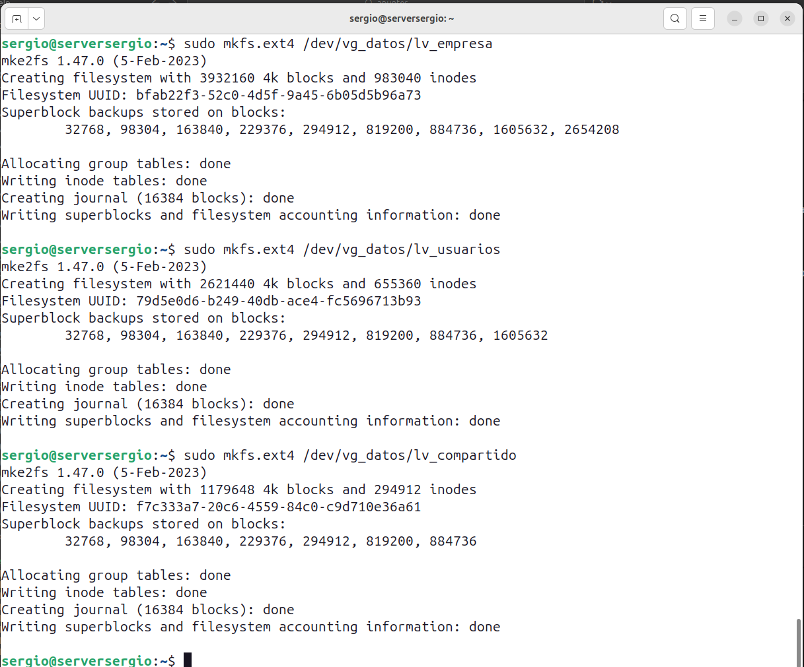
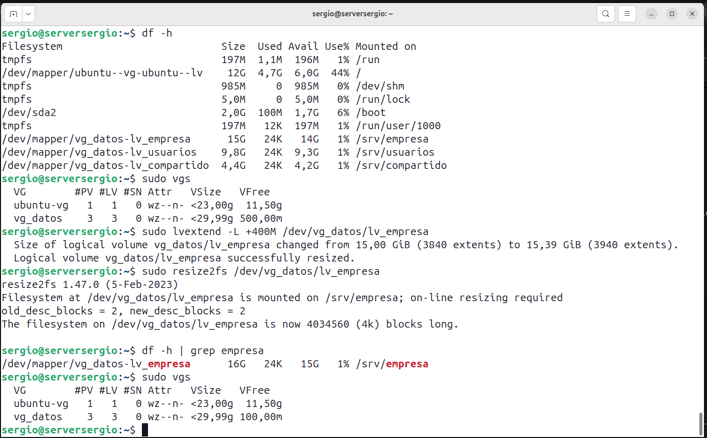
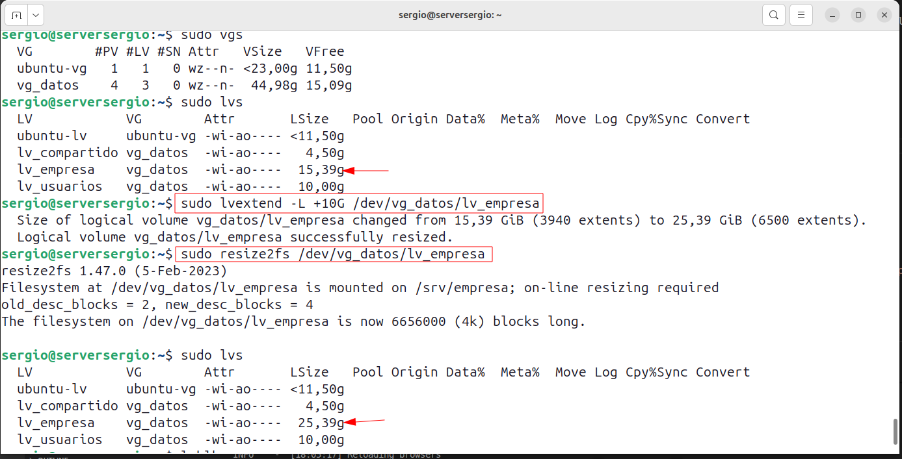

## Qué es LVM y por qué usarlo

**LVM** (Logical Volume Manager) es un sistema de gestión de almacenamiento que añade una capa de abstracción entre los discos físicos y el sistema de archivos. Esta abstracción nos proporciona una flexibilidad extraordinaria que no existe con las particiones tradicionales.

<figure markdown="span" align="center">
  { width="60%" }
</figure>


### Comparación: Particiones tradicionales vs LVM

**Con particiones tradicionales**:

Cuando creamos una partición, definimos su tamaño de forma fija en el disco. Si esa partición se queda sin espacio más adelante, ampliarla es extremadamente complicado y arriesgado. Normalmente requiere:

- Parar el sistema completamente
- Redimensionar la partición con herramientas especiales
- Rezar para que no haya corrupción de datos
- Reiniciar el sistema

No podemos "mover" espacio libre de una partición a otra fácilmente. Si tenemos 50GB libres en una partición y otra se ha quedado sin espacio, no hay forma sencilla de transferir ese espacio.

Tampoco podemos combinar varios discos físicos para formar una única partición grande. Cada disco es independiente.

**Con LVM**:

- Podemos **ampliar** volúmenes fácilmente, incluso con el sistema en funcionamiento y sin parar servicios. Los usuarios ni se enterarán.
- Podemos **reducir** volúmenes si necesitamos recuperar espacio para asignarlo a otro volumen.
- Podemos **combinar** varios discos físicos en un único espacio de almacenamiento lógico.
- Podemos crear **snapshots** (copias instantáneas) de volúmenes, ideales para backups o pruebas.
- Podemos **mover** datos entre discos sin detener el sistema ni afectar a las aplicaciones.

**Analogía práctica**: 

Las particiones tradicionales son como habitaciones de una casa con paredes de hormigón. Una vez construidas, cambiar su tamaño implica derribar paredes, lo cual es costoso y arriesgado.

LVM es como una oficina moderna con paneles modulares. Puedes mover los "tabiques" fácilmente, combinar espacios, dividirlos o reorganizarlos según las necesidades cambien, todo sin obras mayores.

En Windows Server existe algo similar llamado **Storage Spaces** o **Espacios de almacenamiento**, aunque LVM es más maduro, estable y potente al tener décadas de desarrollo.

## Conceptos fundamentales de LVM

LVM funciona con tres niveles jerárquicos que debemos entender claramente:

<figure markdown="span" align="center">
  { width="90%" }
  <figcaption>Niveles jerárquicos de LVM</figcaption>
</figure>


**1. PV (Physical Volume - Volumen Físico)**:

Es la base de todo. Un PV es un disco duro físico (o partición) que hemos "preparado" para que LVM pueda trabajar con él. Básicamente le decimos a LVM: "este disco está disponible para que lo gestiones".

!!! note "Comandos principales:"
    - `pvcreate`: convierte un disco en PV
    - `pvs` o `pvdisplay`: muestra información de los PVs

**2. VG (Volume Group - Grupo de Volúmenes)**:

Es un "contenedor" que agrupa uno o varios PVs. Pensad en el VG como una "bolsa común de espacio" donde depositamos todos nuestros discos. Este espacio conjunto luego lo repartiremos como queramos.

Por ejemplo, si tenemos tres discos de 10GB cada uno, los agrupamos en un VG y tenemos 30GB de espacio total para trabajar.

!!! note "Comandos principales:"
    - `vgcreate`: crea un nuevo grupo de volúmenes
    - `vgs` o `vgdisplay`: muestra información de los VGs

**3. LV (Logical Volume - Volumen Lógico)**:

Es el "volumen" que usaremos realmente. Los LV se crean dentro de un VG, tomando el espacio que necesitemos de la "bolsa común". Este es el que finalmente montaremos como carpeta en el sistema y donde guardaremos datos.

Por ejemplo, de nuestros 30GB totales del VG, podemos crear:
- Un LV de 15GB para datos de empresa
- Un LV de 10GB para carpetas de usuarios
- Un LV de 5GB para backups

!!! note "Comandos principales:"
    - `lvcreate`: crea un nuevo volumen lógico
    - `lvs` o `lvdisplay`: muestra información de los LVs

**Diagrama conceptual**:

Em el siguiente esquema podemos ver como unimos 3 discos de 10GB en un Grupo de Volúmenes (VG) de 60GB y posteriormente lo distribuimos en 3 volúmenes lógicos de diferentes capacidades que asignamos a diferentes ubicaciones

```
Discos físicos:  [Disco 10GB] [Disco 10GB] [Disco 10GB]
                    ↓           ↓             ↓
                    └───────── PVs ───────────┘
                                ↓
                      [VG: vg_datos - 30GB]
                                ↓
                ┌───────────────┴───────────────┐
                ↓               ↓               ↓
        [LV: lv_empresa]  [LV: lv_usuarios]  [LV: lv_backup]
            15GB              10GB              5GB
                ↓               ↓               ↓
          /srv/empresa    /srv/usuarios    /srv/backup
```

y teniendo en cuenta los comandos asociados tenemos el siguiente esquema:

<figure markdown="span" align="center">
  { width="90%" }
  <figcaption>Esquema conceptual: Comandos</figcaption>
</figure>


## Añadir discos a la máquina virtual

Antes de poder trabajar con LVM, necesitamos añadir discos adicionales a nuestra máquina virtual. Vamos a añadir tres discos de 10GB cada uno.

**Apagar la máquina virtual**:

Desde la terminal del servidor ejecutamos:

```bash
sudo poweroff
```

El sistema se apagará de forma ordenada, cerrando todos los servicios correctamente.

**Añadir 3 discos en VirtualBox**:

Con la VM completamente apagada (no pausada, apagada), en VirtualBox:

1. Seleccionamos nuestra VM `SRVXXX_Linux`
2. Click en **Configuración**
3. Navegamos a la sección **Almacenamiento**
4. En el controlador **Controladora: SATA**, hacemos click en el icono de disco con el símbolo `+` (Añadir disco duro)
5. Click en **Crear**
6. Configuramos el nuevo disco:
   - Tipo de archivo: **VDI (VirtualBox Disk Image)**
   - Almacenamiento: **Reservado dinámicamente** (solo usa espacio real cuando se escribe en él)
   - Tamaño: **10 GB**
   - Nombre: dejamos el sugerido (VirtualBox le pondrá un nombre automático)
7. Click en **Crear**
8. Repetimos todo el proceso 2 veces más para tener un total de **3 discos nuevos de 10GB**

Al finalizar, en la sección de almacenamiento de la controladora SATA deberíamos ver:

- `SRVXXX_Linux.vdi` (disco principal del sistema, 25GB)
- `SRVXXX_Linux_1.vdi` (disco adicional 1, 10GB)
- `SRVXXX_Linux_2.vdi` (disco adicional 2, 10GB)
- `SRVXXX_Linux_3.vdi` (disco adicional 3, 10GB)

Hacemos click en **Aceptar** para guardar todos los cambios.

**Iniciar la VM y verificar discos**:

Iniciamos la máquina virtual normalmente y hacemos login con nuestro usuario `admin`.

Verificamos que el sistema ha detectado los nuevos discos:

```bash
lsblk
```

Este comando lista todos los dispositivos de bloque (discos) disponibles en el sistema. Deberíamos ver algo similar a:


<figure markdown="span" align="center">
  { width="90%" }
  <figcaption>Vista de 3 nuevos discos</figcaption>
</figure>


**Interpretación de la salida**:

- `sda`: nuestro disco principal (25GB) donde ya está instalado Ubuntu. Vemos sus particiones (`sda1`, `sda2`, `sda3`)
- `sdb`, `sdc`, `sdd`: los tres discos nuevos de 10GB que acabamos de añadir. Aparecen sin particiones ni formato, completamente vírgenes.
- `sr0`: es el disco magnético: Disquete.

**Nota importante**: Los nombres de los discos (`sda`, `sdb`, etc.) pueden variar ligeramente según la configuración. En algunos sistemas pueden aparecer como `vda`, `vdb`, etc. Lo importante es identificar visualmente los tres discos de 10GB que acabamos de añadir.

## Crear la estructura LVM paso a paso

Ahora vamos a crear nuestra estructura LVM completa, nivel por nivel, de forma muy detallada.

### Paso 1: Crear Physical Volumes (PVs)

El primer paso es convertir nuestros tres discos físicos en volúmenes físicos que LVM pueda gestionar:

```bash
sudo pvcreate /dev/sdb 
sudo pvcreate /dev/sdc 
sudo pvcreate /dev/sdd 
```

Deberíamos ver una confirmación para cada disco:

```
  Physical volume "/dev/sdb" successfully created.
  Physical volume "/dev/sdc" successfully created.
  Physical volume "/dev/sdd" successfully created.
```

Verificamos que se han creado correctamente:

```bash
sudo pvs
```

La salida mostrará:


<figure markdown="span" align="center">
  { width="90%" }
  <figcaption>Vista de 3 nuevos discos como PV</figcaption>
</figure>

**Interpretación**:

- `/dev/sda3`: el PV que se creó automáticamente durante la instalación para el sistema
- `/dev/sdb`, `/dev/sdc`, `/dev/sdd`: nuestros tres PVs nuevos, todavía sin asignar a ningún VG (columna VG vacía)
- La columna `PFree` muestra que los 10GB de cada disco están completamente disponibles

### Paso 2: Crear Volume Group (VG)

Ahora agrupamos nuestros tres PVs en un único grupo llamado `vg_datos`:

```bash
sudo vgcreate vg_datos /dev/sdb /dev/sdc /dev/sdd
```

Confirmación:

```
  Volume group "vg_datos" successfully created
```

Verificamos el grupo creado:

```bash
sudo vgs
```

Salida:

<figure markdown="span" align="center">
  { width="90%" }
  <figcaption>Vista de 3 nuevos discos como un único VG</figcaption>
</figure>


**Interpretación**:

- `vg_datos`: nuestro nuevo grupo de volúmenes
- `#PV`: 3 (contiene 3 volúmenes físicos)
- `#LV`: 0 (todavía no hemos creado volúmenes lógicos dentro)
- `VSize`: ~30GB (10GB × 3 discos, menos un pequeño espacio para metadatos de LVM)
- `VFree`: ~30GB (todo el espacio está disponible)

Podemos ver más detalles con:

```bash
sudo vgdisplay vg_datos
```

Esto muestra información completa sobre el grupo, incluyendo el tamaño exacto de las unidades de asignación (PE - Physical Extents), cuántas hay libres, etc.

### Paso 3: Crear Logical Volumes (LVs)

Ahora creamos tres volúmenes lógicos dentro de `vg_datos`. Estos serán los "discos virtuales" que montaremos y usaremos realmente.

**Volumen para datos de empresa (15GB)**:

```bash
sudo lvcreate -L 15G -n lv_empresa vg_datos
```

**Explicación del comando**:

- `-L 15G`: tamaño del volumen (15 gigabytes)
- `-n lv_empresa`: nombre del volumen lógico
- `vg_datos`: grupo de volúmenes donde se crea

Confirmación:

```
  Logical volume "lv_empresa" created.
```

<figure markdown="span" align="center">
  { width="90%" }
  <figcaption>Creación de un volumen lógico de 15 GB</figcaption>
</figure>


**Volumen para carpetas de usuarios (10GB)**:

```bash
sudo lvcreate -L 10G -n lv_usuarios vg_datos
```

**Volumen para datos compartidos (5GB)**:

```bash
sudo lvcreate -L 5G -n lv_compartido vg_datos
```

Verificamos todos los volúmenes creados:

```bash
sudo lvs
```

Salida:


<figure markdown="span" align="center">
  { width="90%" }
  <figcaption>Creación de un volumen lógico de 15 GB + 10 GB + 4.5GB</figcaption>
</figure>

!!! note "Interpretación de error al crear el último Volumen Lógico"
    Si observamos el mensaje que nos da el sistema:

    `Volume group "vb_datos" has insufficient free space (1277 extends): **1280 required**`

    Nos indica que para crear un **Volumen Lógico** de 5GB nos hacen falta `1280 extends`, pero nos faltan 3 que se han perdido al crear partiiciones y guardar información de los todo el sistema LVM, por lo que el último volumen lo hemos creado de un tamaño más pequeño.

    Un **Extend** es la unidad mínima de espacio direccionable que se asigna a un volumen lógico para permitir que su tamaño crezca de forma flexible


Ahora ya tenemos nuestros tres volúmenes lógicos creados con los tamaños especificados.

Verificamos el espacio restante en el grupo de volúmenes:

```bash
sudo vgs
```

<figure markdown="span" align="center">
  { width="90%" }
  <figcaption>Espacio utilizado en los dos VG (Volumen Group)</figcaption>
</figure>

Tenemos aproximadamente 500MB libres en `vg_datos` que podremos usar más adelante para ampliar volúmenes existentes o crear nuevos.

### Paso 4: Crear sistemas de archivos

Los volúmenes lógicos están creados, pero son como "discos en blanco" sin formato. Necesitan un sistema de archivos para poder almacenar datos.

En Linux, el sistema de archivos más común y recomendado es **ext4**. Es estable, eficiente y ampliamente soportado.

Formateamos cada volumen lógico:

```bash
sudo mkfs.ext4 /dev/vg_datos/lv_empresa
```

Este comando tardará unos segundos y mostrará información sobre el sistema de archivos creado:

```
mke2fs 1.46.5 (30-Dec-2021)
Creating filesystem with 3932160 4k blocks and 983040 inodes
Filesystem UUID: abc123-def456-...
Superblock backups stored on blocks: ...
...
Allocating group tables: done
Writing inode tables: done
Creating journal (16384 blocks): done
Writing superblocks and filesystem accounting information: done
```

Repetimos para los otros dos volúmenes:

```bash
sudo mkfs.ext4 /dev/vg_datos/lv_usuarios
sudo mkfs.ext4 /dev/vg_datos/lv_compartido
```

<figure markdown="span" align="center">
  { width="90%" }
  <figcaption>Formateando los Volúmenes Lógicos creados</figcaption>
</figure>

Ahora nuestros volúmenes tienen un sistema de archivos y están listos para usarse.

### Paso 5: Crear puntos de montaje

En Linux, para acceder a un volumen debemos **montarlo** en una carpeta del sistema. Esa carpeta se llama **punto de montaje**.

Por convención, los datos de servidores suelen montarse en `/srv/` (de "service" - servicio).

Creamos las carpetas donde montaremos nuestros volúmenes:

```bash
sudo mkdir -p /srv/empresa
sudo mkdir -p /srv/usuarios
sudo mkdir -p /srv/compartido
```

El parámetro `-p` (parent) crea todas las carpetas necesarias en la ruta. Si `/srv` no existiera (aunque normalmente sí existe), también la crearía.

Verificamos que se han creado:

```bash
ls -l /srv/
```

Deberíamos ver:

```
total 12
drwxr-xr-x 2 root root 4096 ... compartido
drwxr-xr-x 2 root root 4096 ... empresa
drwxr-xr-x 2 root root 4096 ... usuarios
```

### Paso 6: Montar los volúmenes

Ahora montamos cada volumen lógico en su carpeta correspondiente:

```bash
sudo mount /dev/vg_datos/lv_empresa /srv/empresa
sudo mount /dev/vg_datos/lv_usuarios /srv/usuarios
sudo mount /dev/vg_datos/lv_compartido /srv/compartido
```

Estos comandos no muestran ninguna salida si todo va bien (en Linux, "ninguna noticia es buena noticia").

Verificamos que los volúmenes están montados correctamente:

```bash
df -h
```

El comando `df` (disk free) muestra el espacio de todos los sistemas de archivos montados. Con la opción `-h` (human-readable) muestra los tamaños en formato legible.

Al final de la lista deberíamos ver:

<figure markdown="span" align="center">
  { width="90%" }
  <figcaption>Volúmenes lógicos montados</figcaption>
</figure>

**Interpretación**:

- Los volúmenes están montados en las rutas correctas
- El espacio disponible es ligeramente menor que el tamaño asignado (normal, el sistema de archivos necesita espacio para metadatos)
- Uso actual: casi 0% (solo metadatos del sistema de archivos)

Podemos probar a crear un archivo de prueba:

```bash
sudo touch /srv/empresa/prueba.txt
ls -l /srv/empresa/
```

Deberíamos ver el archivo creado.

### Paso 7: Montaje automático con /etc/fstab

Hay un problema: si reiniciamos el servidor ahora, los volúmenes NO se montarán automáticamente. Después de cada reinicio tendríamos que montarlos manualmente.

Para que se monten automáticamente al iniciar el sistema, debemos configurar el archivo `/etc/fstab` (file systems table - tabla de sistemas de archivos).

Primero, hacemos una copia de seguridad del archivo (buena práctica antes de modificar archivos críticos):

```bash
sudo cp /etc/fstab /etc/fstab.backup
```

Editamos el archivo:

```bash
sudo nano /etc/fstab
```

Veremos líneas similares a estas (puede variar):

```
# /etc/fstab: static file system information.
UUID=abc-123... / ext4 defaults 0 1
UUID=def-456... /boot ext4 defaults 0 2
/swap.img none swap sw 0 0
```

Nos desplazamos al final del archivo y añadimos estas tres líneas:

```
/dev/vg_datos/lv_empresa    /srv/empresa     ext4  defaults  0  2
/dev/vg_datos/lv_usuarios   /srv/usuarios    ext4  defaults  0  2
/dev/vg_datos/lv_compartido /srv/compartido  ext4  defaults  0  2
```

**Explicación de cada campo**:

1. Dispositivo: `/dev/vg_datos/lv_empresa` (ruta al volumen)
2. Punto de montaje: `/srv/empresa` (dónde se monta)
3. Tipo de sistema de archivos: `ext4`
4. Opciones: `defaults` (usa opciones por defecto: lectura/escritura, etc.)
5. Dump: `0` (no hacer backup automático con dump)
6. Pass: `2` (orden de comprobación en el arranque. 0=no comprobar, 1=primero el root, 2=después los demás)

Guardamos el archivo (`Ctrl+O`, `Enter`, `Ctrl+X`).

**Verificar que no hay errores** (PASO CRÍTICO):

Antes de reiniciar, SIEMPRE debemos verificar que el archivo `/etc/fstab` no contiene errores. Un error en este archivo puede hacer que el sistema no arranque.

```bash
sudo mount -a
```

Este comando intenta montar todos los sistemas de archivos listados en `/etc/fstab`. Si hay algún error, nos lo mostrará. Si no muestra nada, significa que todo está correcto.

Verificamos de nuevo que los volúmenes siguen montados:

```bash
df -h | grep srv
```

Deberíamos ver nuestros tres volúmenes.

**Reiniciar para comprobar que funciona**:

```bash
sudo reboot
```

El sistema se reiniciará. Esperamos unos 30 segundos y volvemos a hacer login.

Tras el reinicio, verificamos inmediatamente que los volúmenes se han montado automáticamente:

```bash
df -h | grep srv
```

Si vemos los tres volúmenes montados, ¡perfecto! El montaje automático funciona correctamente.

## Ampliar un volumen lógico

Una de las grandes ventajas de LVM es la capacidad de ampliar volúmenes fácilmente, incluso con el sistema en funcionamiento. Vamos a demostrarlo ampliando `lv_empresa` en 3GB adicionales.

Este proceso se hace sin detener el servidor, sin desmontar el volumen y sin interrumpir el acceso a los datos. Es una funcionalidad extraordinaria que no existe con particiones tradicionales.

**Paso 1: Verificar espacio disponible en el VG**:

Antes de ampliar, confirmamos que tenemos espacio libre en el grupo de volúmenes:

```bash
sudo vgs
```

```
  VG        #PV #LV #SN Attr   VSize  VFree 
  vg_datos    3   3   0 wz--n- 29.99g 500M
```

Tenemos aproximadamente 500MB libres, suficiente para añadir 400MB a un volumen.

**Paso 2: Ampliar el volumen lógico**:

```bash
sudo lvextend -L +400M /dev/vg_datos/lv_empresa
```

**Explicación**:

- `lvextend`: comando para extender (ampliar) un volumen lógico
- `-L +3G`: añadir 3 gigabytes al tamaño actual (el `+` indica que es adicional, no el tamaño total)
- `/dev/vg_datos/lv_empresa`: ruta al volumen que queremos ampliar

Confirmación:

```
  Size of logical volume vg_datos/lv_empresa changed from 15.00 GiB to 18.00 GiB.
  Logical volume vg_datos/lv_empresa successfully resized.
```

**Paso 3: Ampliar el sistema de archivos**:

Hemos ampliado el volumen lógico, pero el sistema de archivos ext4 que hay dentro todavía "piensa" que tiene 15GB. Debemos indicarle que ocupe todo el nuevo espacio:

```bash
sudo resize2fs /dev/vg_datos/lv_empresa
```

Salida:

```
resize2fs 1.46.5 (30-Dec-2021)
Filesystem at /dev/vg_datos/lv_empresa is mounted on /srv/empresa; on-line resizing required
old_desc_blocks = 2, new_desc_blocks = 3
The filesystem on /dev/vg_datos/lv_empresa is now 4718592 (4k) blocks long.
```

La línea clave es `on-line resizing required` que confirma que se está redimensionando con el sistema en funcionamiento.

**Paso 4: Verificar el resultado**:

```bash
df -h | grep empresa
```

```
/dev/mapper/vg_datos-lv_empresa  18G  24K  17G   1% /srv/empresa
```

<figure markdown="span" align="center">
  { width="90%" }
  <figcaption>Resultado del cambio de tamaño del volumen</figcaption>
</figure>

¡Perfecto! El volumen ahora tiene 15.4GB en lugar de 15GB.

**Reflexión sobre lo que hemos hecho**:

Acabamos de ampliar un volumen de 15GB a 15.4GB:

- Sin detener el servidor
- Sin desmontar el volumen
- Sin interrumpir el acceso a los datos
- En menos de un minuto
- Sin riesgo de pérdida de datos

Con particiones tradicionales, esto habría requerido:

1. Hacer backup completo de los datos
2. Apagar el servidor
3. Particionar de nuevo el disco
4. Formatear
5. Restaurar los datos
6. Reiniciar y cruzar los dedos

Esta es la potencia de LVM.

## Ampliar con un nuevo disco 

Podemos pensar que hemos llegado al final, pero todavía podemos ampliar más nuestro almacenamiento a**ñadiendo nuevos discos** que vamos convertir en **Physical Volumes** (`pvcreate`) que servirá para ampliar o extender cualquiera de los **Logical Volumes** (`vgextend`) y a su vez para poder hacer más grandes nuestras **Logical Volumes** (`lvextend`) tal y como hemos hecho en el paso anterior.

Así pues, vamos a parar de nuevo nuestro servidor (ahora si), para añadir un nuevo disco, por ejemplo de 15GB.

Iniciemos de nuevo el servidor y comprobemos que el nuevo disco esta ahí:

```bash
lsblk
```

debe aparecer un nuevo disco `/dev/sde`.

Ahora creemos de nuevo ese disco en un **Physical Volume** usando `pvcreate`

```bash
sudo pvcreate /dev/sde
```

El siguiente paso será añadir mediante el comando `vgextend` este nuevo **Physical Volume** al **Volume Group** exitente `vb_datos`, ejecutando el siguiente comando:

```bash
sudo vgextend vg_datos /dev/sde
```

y ahora podremos ver que tenemos un nuevo **Physical Volume** en nuestro **Volume Group** mediante el comando `pvs`

Ejecutamos ahora el comando para ver el estado de nuestros **Volume Group**

```bash
sudo vgs
```

y nos saldrá que ahora tenemos 15GB mas de espacio disponible en `vg_datos`.

<figure markdown="span" align="center">
  { width="90%" }
  <figcaption>Resultado del cambio de tamaño del volumen</figcaption>
</figure>


y con esto, podemos volver a ampliar de nuevo uno de nuestros **Logical Volume**, por ejemplo `lv_empresa` con 10GB más:

```bash
sudo lvextend -L +10G /dev/vg_datos/lv_empresa
sudo resize2fs /dev/vg_datos/lv_empresa
```

el segundo comando, `resize2fs` permite ampliar el tamaño de la partición al tamaño nuevo de la **Logical Volume**

<figure markdown="span" align="center">
  { width="90%" }
  <figcaption>Resultado del cambio de tamaño del volumen lógico</figcaption>
</figure>

y así podemos seguir ampliando mientras tengamos capacidad física en nuestro servidor para seguir creciendo.

Por último, por curiosidad, si ejecutamos `lsblk` podremos observar que por ejemplo el **Logical Volume** `lv_empresa` realmente se encuentra repartido por 3 discos duros; `sdb`, `sdc` y `sde`.

<figure markdown="span" align="center">
  { width="90%" }
  <figcaption>Ubicación física de /srv/empresa</figcaption>
</figure>


## Comandos útiles de LVM para el día a día

**Ver información resumida**:
```bash
sudo pvs    # Resumen de volúmenes físicos
sudo vgs    # Resumen de grupos de volúmenes
sudo lvs    # Resumen de volúmenes lógicos
```

**Ver información detallada**:
```bash
sudo pvdisplay                    # Detalle de todos los PVs
sudo vgdisplay vg_datos          # Detalle de un VG específico
sudo lvdisplay /dev/vg_datos/lv_empresa  # Detalle de un LV específico
```

**Ampliar un grupo** :
```bash
sudo vgextend vg_datos /dev/sde
```

**Ampliar un volumen o un grupo** :
```bash
sudo lvextend -L +2G /dev/vg_datos/lv_usuarios
sudo resize2fs /dev/vg_datos/lv_usuarios
```

**Añadir un disco nuevo a un VG existente**:
```bash
sudo pvcreate /dev/sde          # Preparar el disco nuevo
sudo vgextend vg_datos /dev/sde # Añadirlo al grupo
```

**Ver estado del montaje**:
```bash
df -h               # Ver todos los sistemas de archivos montados
mount | grep srv    # Ver solo nuestros volúmenes
```

