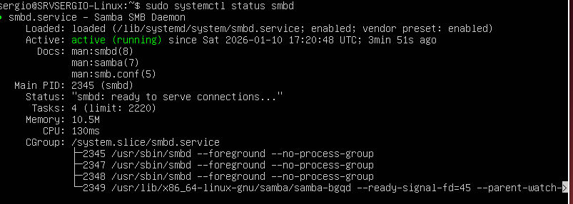
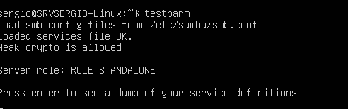
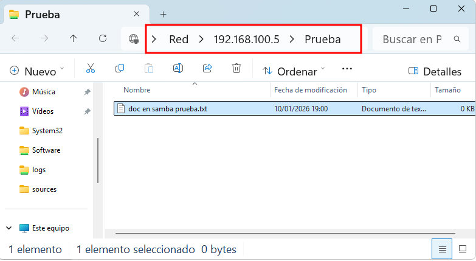

## Qué es Samba y para qué sirve

**Samba** es una suite de software que permite que sistemas Linux/Unix compartan carpetas, archivos e impresoras con sistemas Windows de forma nativa y transparente.

Samba implementa el protocolo **SMB/CIFS** (Server Message Block / Common Internet File System), que es exactamente el mismo protocolo que Windows usa para compartir recursos en red. Esto significa que desde un cliente Windows, acceder a una carpeta compartida de Linux con Samba es idéntico a acceder a una carpeta compartida de otro Windows. El usuario no nota ninguna diferencia.

**¿Por qué necesitamos Samba?**

Windows y Linux hablan "idiomas" diferentes para compartir archivos. Windows usa SMB/CIFS. Linux históricamente usaba NFS (Network File System). Sin Samba, los clientes Windows no podrían acceder a carpetas compartidas en servidores Linux.

Samba actúa como un "traductor" que hace que el servidor Linux hable SMB perfectamente, permitiendo la integración con redes Windows.

Algunos de los usos comunes de `Samba` en *GNU/Linux* son:

- **Compartir archivos**: Samba permite compartir archivos y directorios entre sistemas operativos diferentes, lo que facilita la transferencia de archivos entre ellos.
- **Compartir impresoras**: Samba también puede utilizarse para compartir impresoras en una red local.
- **Autenticación de usuarios**: Samba puede utilizarse para autenticar usuarios en una red local.
- **Controlador de dominio**: Samba puede actuar como un controlador de dominio en una red local.


## Instalar Samba

La instalación de Samba en Ubuntu Server es muy sencilla gracias al gestor de paquetes `apt`.

Primero actualizamos la lista de paquetes disponibles:

```bash
sudo apt update
```

Instalamos Samba y sus herramientas:

```bash
sudo apt install -y samba samba-common-bin
```

!!!tip "Explicación de los paquetes"
    - `samba`: el servidor Samba propiamente dicho
    - `samba-common-bin`: herramientas de línea de comandos para gestionar Samba
    - El parámetro `-y` responde automáticamente "yes" a la confirmación

La instalación tardará un par de minutos. Descargará los paquetes, los instalará y configurará los servicios automáticamente.

Una vez instalado, verificamos que el servicio de Samba está activo y funcionando:

```bash
sudo systemctl status smbd
```

Deberíamos ver algo como:

<figure markdown="span" align="center">
  { width="80%"}
  <figcaption>sudo systemctl status smbd - Resultado OK</figcaption>
</figure>

**Puntos clave a verificar**:

- `Loaded: ...enabled...`: el servicio está habilitado para iniciarse automáticamente al arrancar
- `Active: active (running)`: el servicio está ejecutándose ahora mismo

Si por alguna razón el servicio no estuviera activo, lo iniciamos y habilitamos:

```bash
sudo systemctl start smbd
sudo systemctl enable smbd
```

Verificamos también el estado del servicio de nombres NetBIOS (necesario para la resolución de nombres en redes Windows):

```bash
sudo systemctl status nmbd
```

Debe mostrar también `active (running)`.

!!!note "Información adicional"

    Para más información de instalación y configuración básica de `Samba`, aquí tienes el siguiente enlace: [Ubuntu.com: Install and Configure Samba](https://ubuntu.com/tutorials/install-and-configure-samba#1-overview).

    En siguiente enlace puedes ver la configuración básica de dos carpetas compartidas, una accesible por todos los usuarios con permisos de lectura y otra crea una carpeta por usuario conectado, solo accesible por el propio usuario. [Instalar y configurar un servidor SAMBA en Debian y Ubuntu](https://medium.com/marcsanchezg/instalar-y-configurar-un-servidor-samba-en-debian-y-ubuntu-d05bb23644a1)


## Configuración del firewall

Ubuntu Server por defecto no tiene firewall activado, pero si lo tuviéramos, necesitaríamos abrir los puertos de Samba:

```bash
sudo ufw allow samba
```

En nuestro caso, como estamos en un entorno de laboratorio y probablemente no tenemos el firewall activado, este paso es opcional. Podemos verificar el estado del firewall con:

```bash
sudo ufw status
```

Si muestra `Status: inactive`, no necesitamos hacer nada más.

## Crear una carpeta compartida simple

Antes de complicarnos con Active Directory y configuraciones avanzadas, vamos a crear una carpeta compartida simple para entender cómo funciona Samba y verificar que todo está correctamente instalado.

### Crear la carpeta y asignar permisos

Vamos a crear una carpeta de prueba en uno de nuestros volúmenes LVM:

```bash
sudo mkdir -p /srv/compartido/prueba
```

De momento, vamos a permitir que cualquiera pueda escribir en esta carpeta (solo para pruebas, en producción jamás haríamos esto):

```bash
sudo chmod 777 /srv/compartido/prueba
```

!!!tip "Explicación del permiso 777"

    - Primer 7: permisos del propietario (lectura + escritura + ejecución)
    - Segundo 7: permisos del grupo (lectura + escritura + ejecución)
    - Tercer 7: permisos de otros (lectura + escritura + ejecución)

!!!warning "RECUERDA"

    Esto es **muy inseguro** y solo lo hacemos para las pruebas iniciales. Más adelante configuraremos permisos adecuados.

### Configurar Samba

El archivo de configuración principal de Samba es `/etc/samba/smb.conf`. Este archivo controla todos los aspectos del servidor: recursos compartidos, permisos, autenticación, etc.

Antes de modificarlo, hacemos una copia de seguridad del archivo original:

```bash
sudo cp /etc/samba/smb.conf /etc/samba/smb.conf.original
```

Ahora editamos el archivo:

```bash
sudo nano /etc/samba/smb.conf
```

El archivo es bastante largo y contiene muchas opciones comentadas (líneas que empiezan con `;` o `#`). No necesitamos entender todo ahora.

Nos desplazamos al final del archivo (podemos usar `Ctrl+V` varias veces para avanzar páginas rápidamente en nano).

Al final del archivo, añadimos la configuración de nuestro recurso compartido:

```ini
[Prueba]
   comment = Carpeta de prueba
   path = /srv/compartido/prueba
   browseable = yes
   read only = no
   guest ok = yes
   create mask = 0777
   directory mask = 0777
```

!!!note "Explicación de cada parámetro"

    - `[Prueba]`: nombre del recurso compartido (es lo que verán los clientes Windows al conectarse)
    - `comment`: descripción del recurso (aparece en algunas herramientas de Windows)
    - `path`: ruta real en el sistema Linux donde están los archivos
    - `browseable = yes`: el recurso aparecerá cuando se navegue por la red (lo veremos sin tener que escribir su nombre)
    - `read only = no`: permite escritura (si fuera `yes`, solo lectura)
    - `guest ok = yes`: permite acceso sin autenticación (cualquiera puede entrar sin usuario/contraseña)
    - `create mask = 0777`: permisos que tendrán los archivos nuevos que se creen
    - `directory mask = 0777`: permisos que tendrán las carpetas nuevas que se creen

    **IMPORTANTE**: La configuración con `guest ok = yes` es insegura y solo para pruebas. Más adelante la cambiaremos.

Guardamos el archivo (`Ctrl+O`, `Enter`, `Ctrl+X`).

### Verificar la configuración

Antes de reiniciar Samba, verificamos que no hay errores de sintaxis en el archivo de configuración:

```bash
testparm
```

Este comando es muy útil. Lee el archivo `smb.conf`, detecta errores de sintaxis y muestra la configuración real que se aplicará (ignora líneas comentadas y valores por defecto).

Si hay errores, los mostrará en rojo. Si todo está bien, veremos algo como:


<figure markdown="span" align="center">
  { width="80%"}
  <figcaption>Verificando configuración smb.conf</figcaption>
</figure>

La línea `Loaded services file OK.` confirma que no hay errores de sintaxis.

Pulsamos `Enter` para ver la configuración completa o `Ctrl+C` para salir.

### Reiniciar Samba

Para que los cambios tengan efecto, reiniciamos el servicio de Samba:

```bash
sudo systemctl restart smbd
```

Verificamos que sigue activo después del reinicio:

```bash
sudo systemctl status smbd
```

Debe mostrar `active (running)`.

### Probar desde Windows

Ahora viene el momento de la verdad: probar que podemos acceder desde un cliente Windows.

Desde un equipo Windows conectado a la misma red que el servidor Linux (en nuestro caso, la red de departamentos `192.168.100.0/24`):

1. Abrimos el **Explorador de archivos**
2. En la barra de direcciones (donde aparece la ruta) escribimos: `\\192.168.100.5` (la IP de nuestro servidor Linux)
3. Pulsamos `Enter`
4. Nos preguntará los credenciales para poder entrar en el recurso.

<figure markdown="span" align="center">
  { width="70%"}
  <figcaption>Petición de credenciales para entrar en recurso samba</figcaption>
</figure>


Si no se tratara de un equipo en un dóminio, puesto que hemos puesto `guest ok = yes` deberíamos ver una ventana con el recurso compartido **Prueba** y simplemente:

- Hacemos doble clic en **Prueba** para entrar
- Intentamos crear un archivo o carpeta dentro

Si podemos crear archivos y carpetas, ¡enhorabuena! Samba está funcionando correctamente.

Sin embargo a nosotros no nos pasa esto puesto que estamos **dentro de un dominio** y **NO NOS DEJARÁ ENTRAR EN EL RECURSO COMPARTIDO**.

Para poder entrar en el sistema, necesitamos crear un usuario en samba y acceder como este usuario y no como un usuario del dominio, que de momento, es desconocido para nuestro servidor linux. Así que vamos a crear **usuarios para samba**


## Usuarios de Samba

Como hemos visto anteriormente, puesto que estamos en un dominio con las seguridades activadas siempre necesitaremos autenticación con usuarios. Samba mantiene su propia base de datos de usuarios y contraseñas, separada de los usuarios del sistema Linux.

**Para crear un usuario de Samba, primero debe existir como usuario del sistema Linux**. Luego le asignamos una contraseña específica para Samba.

Ejemplo: Vamos a **crear un usuario de prueba** que inicialmente no existe en el servidor: `samba_test`:

```bash
sudo useradd -M -s /usr/sbin/nologin samba_test
```

**Explicación**:

- `useradd`: comando para crear usuarios
- `-M`: no crear carpeta personal (no la necesita)
- `-s /usr/sbin/nologin`: no permitir login interactivo (este usuario solo existe para Samba)
- `samba_test`: nombre del usuario

Ahora le asignamos una contraseña para Samba:

```bash
sudo smbpasswd -a samba_test
```

Confirmación:

```
Added user samba_test.
```

Este usuario ahora puede autenticarse en recursos compartidos que requieran usuario/contraseña.

!!! tip "Creación de usuarios samba"

    Es importante diferenciar los dos casos posibles: 

    - Si queremos crear un usuario samba que **NO** existe en el sistema, primero lo creamos en el sistema (`useradd`), y luego lo añadimos a los usuarios samba (`smbpasswd`).
    - Si queremos crear un usuario samba que **SI** existe en el sistema, simplemente lo añadimos a los usuarios samba (`smbpasswd`).

Ahora que tenemos un usuario en samba, **probamos de nuevo** conectarnos desde nuestro equipo Windows 11 y cuando nos pida las credenciales, introducimos los datos del usuario `samba_test` que acabamos de crear. 

Ahora ya debemos pode acceder a los recursos compartidos:

<figure markdown="span" align="center">
  { width="80%"}
  <figcaption>Acceso a carpeta compartida</figcaption>
</figure>

Para listar los usuarios de Samba:

```bash
sudo pdbedit -L
```

Para eliminar un usuario de Samba (si lo necesitamos más adelante):

```bash
sudo smbpasswd -x nombre_usuario
```

## Ampliación de la información

A continuación se detalla de forma mas detallada la configuración de los recursos compartido `samba`

### El fichero `/etc/samba/smb.conf`

La configuración de SAMBA, tanto servidor como cliente, se realiza en el fichero `/etc/samba/smb.conf`. Este fichero establece las características de SAMBA y los recursos que se compartirán en la red. Aunque este fichero posee un gran número de opciones, la configuración del mismo suele ser sencilla, dado que el valor por defecto es apropiado para casi todas las opciones y casos posibles.

Como punto importante, resaltar que se consideran comentarios todas las líneas que comienzan por `#` y por `;` (punto y coma), utilizándose generalmente el símbolo `#` para los comentarios formales y el punto y coma para comentar opciones de configuración. Además, el símbolo `\` indica que la línea continúa en la línea siguiente,
por lo que debe ignorarse el retorno de carro insertado a continuación.

De forma general, podemos considerar el fichero de configuración dividido en diferentes secciones. El comienzo de cada sección se indica mediante la etiqueta ***[nombre de sección]***, siendo el final de una sección el comienzo de la siguiente. 

Por defecto, el fichero se puede dividir en dos partes, una con la sección `[global]` y otra para el resto de recursos compartidos.

Antes de nada, recordad que antes de manipular este tipo de ficheros, es aconsejable realizar una copia:

```bash
cp /etc/samba/smb.conf /etc/samba/smb_copia.conf
``` 

#### Sección `[global]`

La sección `[global]` define los parámetros de SAMBA del nivel global, así como los valores por defecto para el resto de parámetros en otras secciones si no se especifican en las mismas.

#### Configuración del tipo de servidor : `server role`

Es importante antes de nada tener en cuenta el tipo de servidor que vamos a configurar con samba: el parámetro `server role` se utiliza para especificar el papel que el servidor **Samba** desempeñará en la red. Este parámetro determina si el servidor actuará como un ***controlador de dominio***, un ***servidor autónomo*** o en algún ***otro*** rol específico.

En la siguiente tabla se muestran los diferentes opciones para este parámetro fundamental: 

| Valor                                 | Descripción                                              |
|---------------------------------------|----------------------------------------------------------|
| **`standalone server`** (predeterminado)  | Servidor independiente sin funciones de controlador de dominio.|
| **`member server`**                      | Servidor que forma parte de un dominio existente.        |
| **`classic primary domain controller`**  | Controlador de dominio principal en un entorno Samba.    |
| **`classic backup domain controller`**    | Controlador de dominio de respaldo en un entorno Samba.  |
| `active directory domain controller`  | Controlador de dominio de Active Directory.              |
| `active directory domain member`      | Miembro de dominio de Active Directory.                   |
| `active directory domain controller for the domain` | Controlador de dominio específico de un dominio en Active Directory. |
| `active directory domain controller for a new domain` | Controlador de dominio para la creación de un nuevo dominio en Active Directory. |

Estos son algunos de los valores comunes para el parámetro "`server role`". Ten en cuenta que las opciones exactas pueden variar según la versión específica de Samba que estés utilizando, y siempre es recomendable consultar la documentación oficial correspondiente a tu versión específica para obtener la información más precisa. En todo caso los más utilizados son los 4 primeros, el resto son variaciones de estos.

```
server role = standalone server
server role = member server
server role = classic primary domain controller
server role = classic backup domain controller
```

Es importante elegir el valor correcto para "`server role`" según el papel que desees que el servidor **Samba** desempeñe en tu red. 

#### Opciones de configuración principales

Las principales opciones de configuración de la sección global de SAMBA son:

| Opción | Descripción | Valor por defecto | 
| --- | --- | --- |  
| workgroup | Nombre del grupo de trabajo o dominio de SAMBA. | Ninguno.  | 
| server string | Descripción del equipo en el dominio o grupo de trabajo. | Ninguno. | 
| netbios name | Nombre del ordenador SAMBA. | Nombre DNS. | 
| interfaces | Interfaces que utilizará SAMBA. Puede ser un interface (eth0), una dirección IP, una  dirección IP/mascara o una dirección broadcast/mascara. | Todos los interfaces excepto el de loopback. | 
| security | Nivel de seguridad. | user | 
| passdb backend | Modo de almacenamiento de las contraseñas. | tdbsam
| smb passwd file | Fichero con las contraseñas almacenadas. | En el ejecutable. | 
| encrypt passwords |  Utilizar contraseñas cifradas de Windows. | yes | 
| password server | Servidores Windows para la autentificación. | Ninguno.
| null password | Permitir el acceso de usuarios con contraseña nula. | no
| map to guest | Indica cuando un acceso debe considerarse como invitado. | Never | 
| hosts allow | Permite restringir los ordenadores y/o redes que pueden acceder al servidor. | Permiso a todos los ordenadores. | 
| log file | Fichero de log | /var/log/samba/log.%m | 
| max log file | Tamaño máximo del fichero de log | 50 kBytes | 

Un sencillo ejemplo de sección [global] es el siguiente:

```
[global]
workgroup = WORKGROUP
server string = SAMBA %v en %L
server role = standalone server
netbios name = glup
security = user
passdb backend = tdbsam
smb passwd file = /var/lib/samba/private/passdb.tdb
encrypt passwords = yes
map to guest = Never
hosts allow = 192.168.13. 192.168.56.
```

Donde `%v` se sustituye por la versión de SAMBA y `%L` por el nombre del ordenador SAMBA. Mas adelante tenemos una tabla de equivalencia de estas variables.

#### Resto de secciones 

En el resto de secciones podemos diferenciar en tres tipos: 

Por una parte, la sección `[homes]` define un recurso de red para cada usuario conocido por SAMBA y lo asocia al directorio raíz de cada usuario del ordenador servidor de SAMBA. Esta sección funciona como opción por defecto, pues un servidor SAMBA intenta primero comprobar si existe un servicio con ese nombre. Si no se
encuentra, la solicitud se trata como un nombre de usuario y se busca en el fichero local de contraseñas. Si el nombre existe y la clave es correcta, se crea un servicio, cuyo nombre se cambia de [homes] al nombre local del usuario y, si no se especifica otro valor, se utiliza el directorio raíz del usuario.

Por otra parte, la sección `[printers]` define un recurso compartido para cada nombre de impresora conocida por SAMBA, que suelen ser las impresoras especificadas en el fichero `/etc/printcap` del ordenador. Su funcionamiento es similar al de la sección [homes].

Por último, cualquier otro recurso (directorio o impresora) que se quiera compartir, debe especificarse creando una sección adicional en el fichero de configuración, donde el nombre de la sección se corresponderá con el nombre con el que el recurso será conocido en la red. **Aqui es donde nosotros trabajaremos habitualmente**

Las principales opciones de configuración de estas secciones son:

| Opción | Descripción | Valor por defecto |
| --- | --- | --- |  
| **read only** | Exportación del recurso en solo lectura. | yes |  
| **writeable** | Exportación del recurso en modo escritura | no |
| **browseable** | Define si se permitirá mostrar este recurso en las listas de recursos compartidos de Windows | yes |
| **path** | Ruta absoluta al recurso | Ninguno. |
| **comment** | Descripción del servicio. | Ninguno. |
| **guest ok** | Define si se permitirá el acceso como usuario invitado. El valor puede ser Yes o No. | no |
| guest account | Usuario que identifica el acceso como invitado. | nobody |
| guest only | Todos los accesos se realizan como invitado | no |
| public | Es un equivalente de guest ok, es decir define si se permitirá el acceso como usuario invitado. El valor puede ser Yes o No. | no |
| force user | Fuerza a que el acceso al recurso se realice como el usuario especificado. | Ninguno |
| force group | Fuerza a que el acceso al recurso se realice como el grupo especificado. | Ninguno. |
| **hosts allow** | Lista de ordenadores desde el que se permite el acceso | Lista vacía (todos los ordenadores). |
| hosts deny | Lista de ordenadores a los que se les deniega el acceso. | Lista vacía (ningún ordenador). |
| printable | Indica si un dispositivo compartido es una impresora. | no |
| **valid users** | Define los usuarios o grupos, que podrán acceder al recurso compartido. Los valores pueden ser nombres de usuarios separados por comas o bien nombres de grupo antecedidos por una @. Ejemplo: fulano, mengano, @administradores | Lista vacía (todos los usuarios). |
| write list | Define los usuarios o grupos, que podrán acceder con permiso de escritura. Los valores pueden ser nombres de usuarios separados por comas o bien nombres de grupo antecedidos por una @. Ejemplo: fulano, mengano, @administradores | Lista vacía (todos los usuarios). |
| **admin users** | Define los usuarios o grupos, que podrán acceder con permisos administrativos para el recurso. Es decir, podrán acceder hacia el recurso realizando todas las operaciones como super-usuarios. | Lista vacía (ningún usuario). |
| **directory mask** | Es lo mismo que directory mode. Define qué permiso en el sistema tendrán los subdirectorios creados dentro del recurso. Ejemplos: 1777 | Definido por sistema | 
| **create mask** | Define que permiso en el sistema tendrán los nuevos archivos creados dentro del recurso. Ejemplo: 0644 | Definido por sistema | 
| follow symlinks | Permite el seguimiento de enlaces simbólicos | Yes |

`read only` y `writeable` se refieren al modo de exportación del recurso, solo que de forma inversa, así el
equivalente de `read only = yes` es `writeable = no`.

> **IMPORTANTE**: A la hora de compartir no solo debemos tener en cuenta los parámetros `read only` y `writeable` para establecer permisos, también **debemos tener en cuenta los permisos de las carpetas compartidas**, de forma similar a lo visto con **NFS**

### Ejemplos de recursos compartidos

En el siguiente ejemplo, en el cual se exportan los directorios raíz de los usuarios:
```
[homes]
comment = Directorios raiz de los usuarios
browseable = yes
writeable = yes
```

O en este otro ejemplo, en el que se exportan las impresoras conectadas al servidor de SAMBA:

```
[printers]
comment = Impresoras
path = /var/spool/samba
browseable = no
guest ok = no
writeable = no
printable = yes
```

Otro ejemplo, en el que se exporta un directorio temporal para que los usuarios puedan escribir en el mismo, es el siguiente:

```
[tmp]
comment = Espacio temporal de disco
path = /tmp
browseable = yes
read only = no
guest ok = yes
```

Otro ejemplo de carpeta compartida en el que se permite acceso total a todo el mundo.

```
[compartido]
comment = Archivos Compartidos
path = /home/compartido
guest ok = yes
browseable = yes
writeable = yes
create mask = 0777
directory mask = 0777
```

### Crear, editar o eliminar usuarios en Samba

Los usuarios que queremos que tengan acceso al servidor Samba deben estar creados como usuarios en nuestro servidor linux, podemos crear un grupo samba y agregar a ese grupo todos los usuarios que tendrán acceso al servidor samba:

Supongamos que tenemos un usuarios ya creado llamado *sergio* y que lo queremos agregar a los usuarios de Samba, para esto ejecutamos el siguiente comando:

```bash
sudo smbpasswd -a sergio
```
Además : 

```bash
smbpasswd -d nombre_usuario     # Para deshabilitar un usuario
smbpasswd -e nombre_usuario     # Para habilitar un usuario deshabilitado
smbpasswd -s nombre_usuario     # Para pregunta por el password del usuario
smbpasswd -n nombre_usuario     # Para resetear o variar el password
smbpasswd -x nombre_usuario     # Para borrar un usuario
```

### Asignar permisos a usuarios

Para darle acceso a usuario concretos a carpetas, tenemos las entradas `valid-users` donde se puede tener un listado separado por comas de usuarios que pueden acceder o de grupos (precedidos por `@`)

```
[carp-juan]
comment = Carpeta para juan;
path = /srv/compartido/carp-juan
browseable = yes
read only = no
valid users = juan
```

Recuerda que para que funcionen todo:

  - El usuario debe esta creado para samba y tener una contraseña
  - La carpeta debe existir y tener permisos de acceso adecuados
  - Una vez modificado el fichero `smb.conf` se debe testear y reiniciar el servicio `smbd`