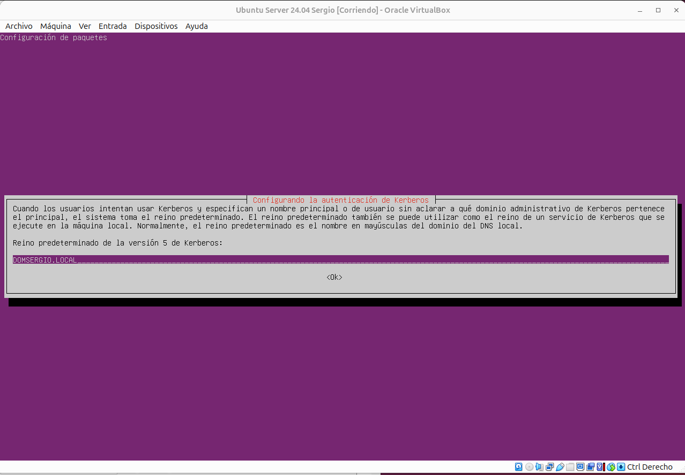
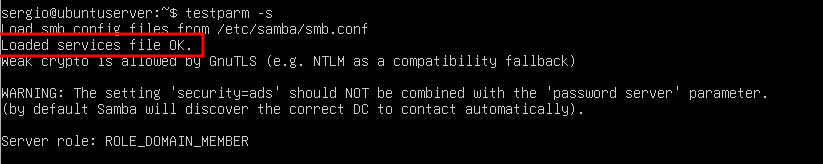
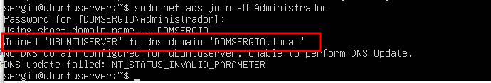
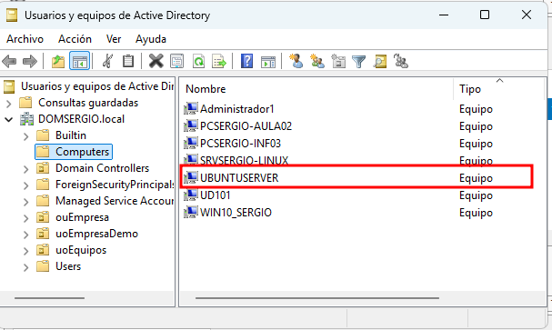

Ahora llega la parte más interesante y compleja de este tema: vamos a unir nuestro servidor Linux al dominio Active Directory de Windows Server que creamos en temas anteriores.

Una vez completada esta integración, conseguiremos que:

- Los usuarios del dominio Windows puedan autenticarse en el servidor Linux con sus credenciales del AD
- Los recursos compartidos en Linux respeten los permisos y grupos del Active Directory
- Podamos gestionar permisos desde Windows de forma nativa, usando la interfaz gráfica que ya conocemos
- Todo funcione de forma transparente: los usuarios no notarán diferencia entre recursos Windows y Linux

Esta configuración es habitual en empresas con infraestructuras híbridas y representa una habilidad muy valorada profesionalmente. A diferencia de otras soluciones como SSSD, utilizaremos **Winbind**, que ofrece una integración más profunda con Active Directory y permite una gestión más completa de ACLs de Windows.

## Preparación del entorno

Antes de comenzar el proceso de integración, debemos asegurarnos de que nuestro servidor Linux tiene correctamente configurados varios aspectos fundamentales de red e identificación.

### Configuración de red y DNS

El primer paso crítico es asegurar que nuestro servidor puede comunicarse correctamente con el controlador de dominio y, especialmente, que puede resolver nombres del dominio.

Este paso ya lo tenemos hecho, pero es fundamental que nos aseguremos de que todo esta correcto. Para ellos, editamos la configuración de red de Netplan:

```bash
sudo nano /etc/netplan/00-installer-config.yaml
```

La configuración debe apuntar al Windows Server como servidor DNS primario. Es fundamental que el DNS sea el del controlador de dominio, ya que Active Directory depende completamente de DNS para funcionar:

```yaml
network:
  version: 2
  ethernets:
    enp0s3:
      dhcp4: no
      addresses: [192.168.100.10/24]
      routes:
        - to: default
          via: 192.168.100.1
      nameservers:
        addresses: [192.168.100.1, 1.1.1.1]
        search: [DOMXXX.local]
```

Sustituimos `DOMXXX` por el nombre real de nuestro dominio. La directiva `search` permite que podamos usar nombres cortos (como `servidor`) en lugar del nombre completo (como `servidor.domxxx.local`).

Aplicamos los cambios:

```bash
sudo netplan apply
```

### Configuración del archivo hosts

Para evitar problemas de resolución de nombres, especialmente con el propio servidor, configuramos el archivo `/etc/hosts`:

```bash
sudo nano /etc/hosts
```

Añadimos o modificamos las siguientes líneas:

```text
127.0.0.1       localhost
192.168.100.10  ubuntuserver.domXXX.local  ubuntuserver
192.168.100.1   srvXXX.domXXX.local srvXXX domXXX.local
```

La última línea es especialmente importante: asegura que cuando el sistema intente resolver el nombre del dominio, encuentre directamente la IP del controlador de dominio.

<figure markdown="span" align="center">
  { width="80%"}
  <figcaption>contenido de fichero /etc/hosts</figcaption>
</figure>

No es indispensable, pero es aconsejable poner todo en **minúsculas**

### Verificación de conectividad

Antes de continuar, verificamos que todo funciona correctamente.

Comprobamos que podemos hacer ping al controlador de dominio:

```bash
ping -c 3 DOMXXX.local
```

Deberíamos recibir respuestas desde la IP del Windows Server (192.168.100.1).

Si alguna de estas pruebas falla, debemos revisar la configuración antes de continuar.


### Resolución DNS del dominio

Este es uno de los puntos más críticos. El servidor Linux debe poder resolver el nombre del dominio Active Directory. Para ello, **debe usar el Windows Server como servidor DNS**.

Probamos la resolución del dominio:

```bash
nslookup DOMXXX.local
```

(Sustituimos DOMXXX por el nombre real de vuestro dominio)

<figure markdown="span" align="center">
  { width="80%"}
  <figcaption>Prueba de resolución de nombres del dominio</figcaption>
</figure>


Si funciona, debería mostrar la IP del Windows Server. Si da error "server can't find...", hay un problema de DNS que debemos resolver antes de continuar.

!!!tip "Si el servidor DNS no resuelve bien la dirección del DOMXXX"

    Como tenemos un sistema muy complejo, es posible que el servidor DNS de nuestro Windows Server resuelva que la dirección del DOMSERGIO.local es 10.0.2.15, que es la IP de la tarjeta de red externa, y por lo tanto inaccesible para nuestro servidor Ubuntu.

    Para solucionar esto, debemos corregir el registro en el Servidor DNS (Windows Server) e indicarle al servicio DNS que no "escuche" ni responda por las interfaces que no pertenecen a tu red de gestión (como la de NAT de VirtualBox 10.0.2.15).

    En el Windows Server, abre el Administrador de DNS:
    
    - Haz clic derecho sobre el nombre del servidor y selecciona Propiedades.
    - Ve a la pestaña Interfaces.
    - Cambia la selección a "Solo las siguientes direcciones IP".
    - Desmarca la casilla de la IP 10.0.2.15 y asegúrate de que solo la 192.168.100.1 esté marcada.
    - Aplica los cambios.

    <figure markdown="span" align="center">
      { width="80%"}
      <figcaption>Corrección de la resolución de nombres DNS</figcaption>
    </figure>

    También tienes que eliminar manualmente las zonas directas de búsqueda que no sean la tarjeta de red correcta. Al final debe quedar algo similar a la siguiente imagen:

    <figure markdown="span" align="center">
      { width="80%"}
      <figcaption>Correcicón de la resolución de nombres DNS</figcaption>
    </figure>

    Después de todo esto, reinicia las DNS que tiene tu servidor ubuntu ejecutando

    ```bash
    sudo resolvectl flush-caches
    ```


!!!tip "nslookup no instalado"

    Si no teníamos `nslookup` instalado:

    ```bash
    sudo apt install -y dnsutils
    ```

    También podemos probar con:

    ```bash
    host DOMXXX.local
    ```

    o

    ```bash
    dig DOMXXX.local
    ```


### Sincronización de hora

La autenticación Kerberos (que usa Active Directory) es extremadamente sensible a diferencias de hora. Si el reloj del servidor Linux y del Windows Server difieren en más de 5 minutos, la autenticación fallará.

Instalamos el cliente NTP para sincronización de hora:

```bash
sudo apt install -y chrony
```

Verificamos que el servicio está activo:

```bash
sudo systemctl status chronyd
```

Verificamos la sincronización:

```bash
timedatectl
```

Deberíamos ver:

<figure markdown="span" align="center">
  { width="80%"}
  <figcaption>Verificación de la sincronización de reloj</figcaption>
</figure>

La línea clave es `System clock synchronized: yes`. Si muestra `no`, esperamos un minuto y volvemos a verificar.

También podemos ejecutar el estado de la sincronización mediante el comando:

```
chronyc sources -v
```

Si no tenemos completamente el reloj sincronizado, pero estamos en hora, el sistema puede funcionar perfectamente.

Opcionalmente, podemos configurar el servidor NTP para que use el Windows Server como fuente de hora añadiendo al fichero `/etc/chrony/chrony.conf` una línea con el texto server `192.168.100.1 iburst prefer trust`, pero con chrony configurado por defecto suele ser suficiente.


## Instalación de software necesario

Para unir Linux a Active Directory usando Winbind necesitamos varios paquetes que gestionan la autenticación, la comunicación con el AD y la integración con Samba.

Actualizamos la lista de paquetes e instalamos todo lo necesario:

```bash
sudo apt update
sudo apt install -y samba winbind libnss-winbind libpam-winbind krb5-config
```

Durante la instalación de `krb5-config`, el sistema nos preguntará por el "Default Realm". Es muy importante introducir el nombre del dominio **en mayúsculas**: `DOMXXX.LOCAL`.

<figure markdown="span" align="center">
  { width="80%"}
  <figcaption>Configuración del paquete krb5-config durante la instalación</figcaption>
</figure>

Para el resto de preguntas que nos hará no es necesario introducir nada.

!!!note "Explicación de los paquetes principales"

    - `samba`: proporciona los servicios de compartición de archivos compatibles con Windows
    - `winbind`: demonio que permite que Linux use usuarios y grupos de Active Directory
    - `libnss-winbind` y `libpam-winbind`: integran Winbind con el sistema de autenticación de Linux
    - `krb5-config`: configuración de Kerberos, el protocolo de autenticación que usa Active Directory

La instalación puede tardar varios minutos. Al final, el sistema puede pedir que reiniciemos servicios para aplicar cambios, lo cual aceptamos.

## Configuración del sistema de nombres

Linux necesita saber dónde buscar información sobre usuarios y grupos. Por defecto, solo busca en los archivos locales (`/etc/passwd`, `/etc/group`), pero necesitamos que también consulte a Winbind para obtener usuarios del Active Directory.

Editamos el archivo que controla este comportamiento:

```bash
sudo nano /etc/nsswitch.conf
```

Modificamos las líneas de `passwd`, `group` y `shadow` para que incluyan `winbind`:

```text
passwd:         files systemd winbind
group:          files systemd winbind
shadow:         files systemd
gshadow:        files systemd

hosts:          files dns
networks:       files
```

!!!note "Explicación del orden"

    - `files`: primero busca en archivos locales (usuarios y grupos del sistema)
    - `systemd`: después consulta usuarios dinámicos de systemd
    - `winbind`: finalmente consulta el Active Directory a través de Winbind

    Este orden es importante: asegura que los usuarios del sistema local (como `root`) siempre funcionen, incluso si hay problemas con Active Directory.

## Configuración de Samba y Winbind

Ahora viene la parte más importante: configurar Samba y Winbind para que trabajen con nuestro Active Directory. Esta configuración es completa y permite tanto la autenticación de usuarios como la gestión de permisos de Windows en carpetas Linux.

Vamos a crear el fichero de configuración de samba desde cero, por lo cual vamos a renombrar el fichero de configuración por defecto, por si en un futuro nos hiciera falta_

```
sudo mv /etc/samba/smb.conf /etc/samba/smb.conf.bak

```

y ahora editamos el archivo principal de configuración de Samba, que estará vacío:

```bash
sudo nano /etc/samba/smb.conf
```

Escribimos el siguiente contenido en el fichero. 

```ini
[global]
   workgroup = DOMXXX
   realm = DOMXXX.LOCAL
   security = ADS
   
   # Configuración de Winbind y mapeo de IDs
   idmap config * : backend = tdb
   idmap config * : range = 3000-7999
   idmap config DOMXXX : backend = rid
   idmap config DOMXXX : range = 10000-999999
   template shell = /bin/bash
   template homedir = /home/%U 

   # Configuración de Winbind y Enumeración
   winbind use default domain = yes
   winbind enum users = yes
   winbind enum groups = yes
   winbind refresh tickets = yes
   
   # Logging y Red
   log file = /var/log/samba/log.%m
   max log size = 1000
   interfaces = lo 192.168.100.0/24
   bind interfaces only = yes
   password server = 192.168.100.1

   # Soporte ACLs de Windows
   vfs objects = acl_xattr
   map acl inherit = yes
   store dos attributes = yes
```

**IMPORTANTE**: Sustituimos todas las ocurrencias de `DOMXXX` por el nombre real de nuestro dominio.

!!!note "Explicación de las secciones principales:"

    **Identificación del dominio**:

    - `workgroup`: nombre NetBIOS del dominio (la parte antes del `.local`)
    - `realm`: nombre completo del dominio en mayúsculas
    - `security = ADS`: usar Active Directory Security

    **Mapeo de identificadores**: Las líneas `idmap` son cruciales. Active Directory identifica usuarios con SIDs (Security Identifiers), mientras que Linux usa UIDs y GIDs numéricos. Esta configuración establece cómo se traducen:

    - `idmap config *`: configuración por defecto para dominios desconocidos (rango 3000-7999)
    - `idmap config DOMXXX`: configuración específica para nuestro dominio usando el método RID (rango 10000-999999)

    **Configuración de Winbind**:

    - `winbind use default domain = yes`: permite usar nombres cortos (solo `usuario` en lugar de `DOMXXX\usuario`)
    - `winbind enum users/groups = yes`: permite listar todos los usuarios y grupos del dominio (muy importante para que funcione `getent`)
    - `winbind refresh tickets = yes`: mantiene los tickets de Kerberos actualizados

    **Soporte de ACLs de Windows**: Esta parte permite que los permisos de Windows se guarden correctamente en Linux:

    - `vfs objects = acl_xattr`: habilita el almacenamiento de ACLs extendidas
    - `map acl inherit = yes`: respeta la herencia de permisos de Windows
    - `store dos attributes = yes`: guarda atributos especiales de Windows (oculto, sistema, etc.)

Finalmente, Verificamos que la configuración es correcta:

```bash
testparm -s
```

Si hay errores de sintaxis o de cualquier tipo, este comando nos lo dirá y los debemos corregir.

Cuando todo sea correctos nos dirá `Loaded services file OK.`

<figure markdown="span" align="center">
  { width="80%"}
  <figcaption>testparm. Verificando fichero smb.conf</figcaption>
</figure>

Puede darse el caso que tengamos algún `WARNING`, de hecho en la configuración planteada tenemos información redundante y tendremos un `WARNING`, pero seguiremos sin problemas. 

Si no hay errores, recargamos la configuración de Samba:

```bash
sudo smbcontrol all reload-config
```

O reiniciamos los servicios:

```bash
sudo systemctl restart smbd nmbd
```

## Unión al dominio

Con toda la configuración preparada, procedemos a unir el servidor Linux al dominio Active Directory.

Ejecutamos el comando de unión al dominio:

```bash
sudo net ads join -U Administrador
```

!!! note "Explicación del comando:"

    - `net ads join`: comando de Samba para unirse a un dominio Active Directory
    - `-U Administrador`: especifica el usuario con permisos para unir equipos al dominio

El sistema nos pedirá la contraseña del usuario Administrador del dominio Windows. La introducimos (no se mostrará mientras escribimos) y pulsamos Enter.

Si todo va bien, veremos un mensaje confirmando que nos hemos unido al dominio correctamente: `Joined 'UBUNTUSERVER' to dns domain 'DOMXXX.local'`.

<figure markdown="span" align="center">
  { width="80%"}
  <figcaption>Unión al dominio.</figcaption>
</figure>

En la captura vemos algún error de DNS, pero no es critico y podemos seguir con el proceso. 

<figure markdown="span" align="center">
  { width="80%"}
  <figcaption>Verificación de unión al dominio desde Windows Server.</figcaption>
</figure>

También podemos revisar que el equipo se ha unido al dominio mediante la consola de **Uusuarios y equipos de Active Directory** en nuestro Windows server:


Ahora necesitamos reiniciar y habilitar los servicios de Winbind y Samba para que la configuración tenga efecto:

```bash
sudo systemctl restart winbind smbd nmbd
sudo systemctl enable winbind smbd nmbd
```

El comando `enable` asegura que estos servicios se inicien automáticamente al arrancar el servidor.

## Verificación de la integración

Es fundamental verificar que la integración con Active Directory funciona correctamente antes de continuar. Vamos a realizar varias pruebas.

### Verificar la unión al dominio

Comprobamos que la unión al dominio es válida:

```bash
sudo net ads testjoin
```

Debe responder: `Join is OK`

Verificamos la comunicación con el controlador de dominio:

```bash
sudo wbinfo -t
```

Debe responder: `checking the trust secret ... succeeded`

<figure markdown="span" align="center">
  { width="80%"}
  <figcaption>Verificación de unión al dominio desde Ubuntu Server.</figcaption>
</figure>

Estos dos comandos confirman que el servidor está correctamente unido al dominio y puede comunicarse con él.


### Verificar usuarios y grupos del dominio

Ahora probamos que el sistema puede ver usuarios del Active Directory. Intentamos obtener información del usuario Administrador:

```bash
id Administrador
```

Deberíamos ver información del usuario incluyendo su UID, GID y los grupos a los que pertenece. Algo similar a:

```
uid=10500(Administrador) gid=10513(domain users) grupos=10513(domain users),10512(domain admins)
```

<figure markdown="span" align="center">
  { width="80%"}
  <figcaption>Verificación de unión al dominio. Comprobando usuarios.</figcaption>
</figure>


Listamos todos los usuarios del dominio:

```bash
getent passwd | grep -i DOMXXX
```

Deberíamos ver una lista de todos los usuarios del Active Directory. Si no aparece ninguno, es probable que la configuración de enumeración (`winbind enum users = yes`) no esté activa o que haya algún problema de comunicación.

De forma similar, listamos los grupos:

```bash
getent group | grep -i DOMXXX
```

Si estos comandos funcionan correctamente, significa que la integración básica está completa y el sistema puede consultar usuarios y grupos del dominio.

## Configuración de recursos compartidos

Una vez que tenemos la integración funcionando, podemos crear recursos compartidos que usen la autenticación del dominio y respeten los permisos de Active Directory.

### Crear el directorio para compartir

Vamos a crear una carpeta compartida para el departamento de Informática. Primero creamos el directorio:

```bash
sudo mkdir -p /srv/samba/informatica
```

Usamos `/srv/samba/` como ubicación estándar para recursos compartidos de Samba en Linux.

### Configurar permisos del sistema de archivos

Para que Samba pueda gestionar correctamente los permisos de Windows, debemos preparar el sistema de archivos Linux con una configuración específica.

Asignamos el grupo del dominio como propietario:

```bash
sudo chgrp "gInformatica" /srv/samba/informatica
```

Establecemos permisos con el bit SGID (Set Group ID):

```bash
sudo chmod 2775 /srv/samba/informatica
```

!!! note "Explicacion del comando"
    El `2` al principio activa el bit SGID, que hace que cualquier archivo o carpeta creado dentro herede automáticamente el grupo propietario (`gInformatica`). Los permisos `775` significan:

    - Propietario (root): lectura, escritura y ejecución (7)
    - Grupo (gInformatica): lectura, escritura y ejecución (7)
    - Otros: lectura y ejecución (5)

Configuramos las ACLs de POSIX para permitir que Samba gestione las ACLs de Windows. Esto no es obligatorio, pero nos permitirá **gestionar los permisos desde el servidor Windows**. Sin esta configuración los permisos los establecemos únicamente desde el servidor Ubuntu y no podremso cambiar los permisos de los diferentes archivos o carpetas que contegna. 

Primero instalaremos el paquete `acl` que nos permitirá realizar estos ajustes.

Así pues ejecutamos:

```bash
sudo apt install acl
sudo setfacl -m g:"gInformatica":rwx /srv/samba/informatica
sudo setfacl -d -m g:"gInformatica":rwx /srv/samba/informatica
```
!!! note "Explicacion de los comandos"
    El primer comando establece los permisos actuales. El segundo (`-d`) establece permisos por defecto que se aplicarán automáticamente a cualquier archivo o carpeta creado dentro.

<figure markdown="span" align="center">
  { width="80%"}
  <figcaption>Creaendo carpeta para compartir</figcaption>
</figure>


### Configurar el recurso compartido en Samba

Editamos nuevamente la configuración de Samba:

```bash
sudo nano /etc/samba/smb.conf
```

Al final del archivo, añadimos la definición del recurso compartido:

```ini
[Informatica]
   comment = Carpeta de equipo gestionada desde Active Directory
   path = /srv/samba/informatica
   browseable = yes
   read only = no
   guest ok = no
   
   # Restricción de acceso a nivel de protocolo
   valid users = @gInformatica
   
   # Herencia de permisos NTFS
   vfs objects = acl_xattr
   map acl inherit = yes
   store dos attributes = yes
   
   # Máscaras de creación para asegurar compatibilidad
   create mask = 0664
   directory mask = 0775
```

!!! note "Explicación de las directivas:"

    - `comment`: descripción que verán los usuarios al explorar recursos compartidos
    - `path`: ruta física en el sistema de archivos Linux
    - `browseable = yes`: el recurso aparecerá al explorar el servidor
    - `read only = no`: permite escritura (si no, sería de solo lectura)
    - `guest ok = no`: requiere autenticación, no permite acceso anónimo
    - `valid users = @gInformatica`: solo usuarios del grupo gInformatica pueden acceder (el `@` indica que es un grupo)
    - `vfs objects`, `map acl inherit`, `store dos attributes`: permiten la gestión completa de ACLs de Windows
    - `create mask` y `directory mask`: permisos por defecto para archivos y carpetas creados

Verificamos que la configuración es correcta:

```bash
testparm -s
```

Si no hay errores, recargamos la configuración de Samba:

```bash
sudo smbcontrol all reload-config
```

O reiniciamos los servicios:

```bash
sudo systemctl restart smbd nmbd
```

## Acceso desde Windows

Llega el momento de la verdad: probar que todo funciona desde un cliente Windows.

Desde un equipo Windows **unido al dominio**, iniciamos sesión con un usuario del dominio que pertenezca al grupo `gInformatica`.

Abrimos el Explorador de archivos y en la barra de direcciones escribimos:

```
\\192.168.100.10
```

o usando el nombre del servidor:

```
\\ubuntuserver
```

Deberíamos ver el recurso compartido **Informatica**. Hacemos doble clic para acceder.

Si todo está correctamente configurado:

- No pedirá credenciales (usa automáticamente las del usuario actual del dominio)
- Podemos crear archivos y carpetas
- Los archivos creados pertenecerán al usuario del dominio que los creó

### Gestión de permisos desde Windows

Una de las grandes ventajas de usar Winbind con esta configuración es que podemos gestionar permisos directamente desde Windows, usando la interfaz gráfica que ya conocemos.


Dentro del recurso compartido, creamos una carpeta de prueba. Hacemos clic derecho sobre ella y seleccionamos **Propiedades**. Vamos a la pestaña **Seguridad**.

<figure markdown="span" align="center">
  { width="98%"}
  <figcaption>Carpeta compartida y sus permisos</figcaption>
</figure>


Aquí veremos los permisos actuales. Podemos hacer clic en **Editar** o **Opciones avanzadas** para modificarlos.

Ahora podemos:

- Añadir usuarios específicos del Active Directory
- Asignarles permisos de lectura, escritura, control total, etc.
- Configurar herencia de permisos
- Todo tal como lo haríamos en un servidor Windows

Los cambios que hagamos aquí se guardarán como ACLs extendidas en el sistema de archivos Linux, y Samba las respetará completamente.

## Verificaciones finales desde el servidor

Para verificar que los permisos se están guardando correctamente, podemos consultar las ACLs desde el servidor Linux:

```bash
getfacl /srv/samba/informatica
```

Deberíamos ver las ACLs de POSIX que configuramos, incluyendo las entradas por defecto para el grupo gInformatica.

<figure markdown="span" align="center">
  { width="98%"}
  <figcaption>Carpeta compartida y sus permisos</figcaption>
</figure>


Si creamos archivos desde Windows y después listamos el contenido desde Linux:

```bash
ls -l /srv/samba/informatica
```

Veremos que los archivos pertenecen a los usuarios del dominio que los crearon.

También podemos verificar que el grupo del dominio está correctamente visible:

```bash
getent group gInformatica
```

Debe mostrar el GID y los miembros del grupo del Active Directory.

## Solución de problemas comunes

Si algo no funciona como esperamos, aquí hay algunas verificaciones y soluciones:

**No puedo acceder al recurso desde Windows**:

- Verificar que el firewall de Ubuntu permite conexiones Samba: `sudo ufw allow samba`
- Comprobar que los servicios están activos: `sudo systemctl status smbd nmbd winbind`
- Verificar los logs de Samba: `sudo tail -f /var/log/samba/log.smbd`

**Los comandos `getent` no muestran usuarios del dominio**:

- Verificar que `winbind enum users = yes` está en `smb.conf`
- Reiniciar Winbind: `sudo systemctl restart winbind`
- Comprobar la comunicación con el DC: `sudo wbinfo -t`

**No puedo gestionar permisos desde Windows**:

- Verificar que las ACLs están habilitadas: `sudo tune2fs -l /dev/sda1 | grep acl`
- Asegurar que los permisos del sistema de archivos son correctos (2775 con SGID)
- Revisar que `vfs objects = acl_xattr` está en la configuración del recurso

**Errores de autenticación Kerberos**:

- Verificar sincronización de hora: `timedatectl`
- Si hay diferencia de más de 5 minutos, la autenticación Kerberos fallará
- Instalar y configurar un cliente NTP: `sudo apt install chrony`

Con esta configuración completa, tenemos un servidor Linux totalmente integrado con Active Directory, capaz de autenticar usuarios del dominio y gestionar permisos de forma nativa desde Windows. Esta es una configuración profesional que encontraríamos en entornos empresariales reales con infraestructuras híbridas.